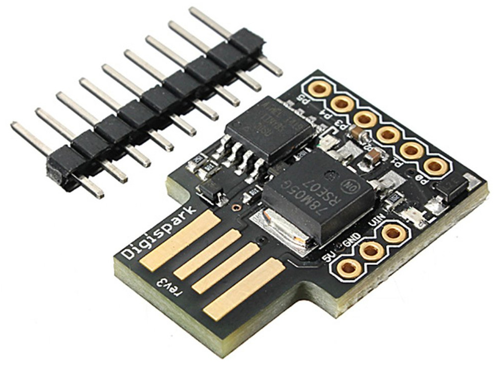

# 28 Nov 2019

I spent the last 3 nights trying out a [Digispark](http://digistump.com/products/1), which is a minimal Arduino clone in a USB-PCB-plug form factor with a built-in USB bootloader:



_NOTE: The board pictured is the same as mine and is apparently [a cheap Chinese clone](https://www.ebay.com.au/itm/Digispark-Kickstarter-Micro-General-USB-Development-Board-ATTINY85-Arduino/263984778611?epid=4011253984&hash=item3d76b80d73:g:OTgAAOSw2YZbvucc&frcectupt=true) identified by the fact that there is [no official rev3 version](https://digistump.com/wiki/digispark/tutorials/modelbi2c)._

[An article I saw was a little critical of it](https://blog.mousetech.com/why-im-not-using-digisparks-attiny85-in-almost-everything/), basically saying its dev method differs too much from normal Arduino stuff and it is poorly supported by [Digistump](http://digistump.com/), without recent OS support. There was an [update to that article](https://blog.mousetech.com/digispark-attiny85-revisited/), though, which discussed better results.

I've never actually used an Arduino before and hardly used the Arduino IDE, but I didn't have too much trouble. I followed their [setup Wiki](https://digistump.com/wiki/digispark/tutorials/connecting) on Windows 10:

1.  I already had Arduino IDE 1.8.5 installed from my STM32 experiments. I haven't upgraded it.
2.  [Downloaded the Digistump Drivers](https://github.com/digistump/DigistumpArduino/releases/download/1.6.7/Digistump.Drivers.zip), extracted them, and ran `DPInst64` (for my 64-bit platform). They seemed to go in fine. This is apparently necessary for Arduino 1.6.6+ and maybe also for Windows 8/10.
3.  Launched the Arduino IDE and went to `File` => `Preferences` and added the "Additional Boards Manager URL": `http://digistump.com/package_digistump_index.json`
4.  Went to `Tools` => `Board` => `Boards Manager`, selected `Type: Contributed`, and search for `digistump`. 
5.  "Digistump AVR Boards" is the first result that comes up. Clicking on this reveals the "Install" button.
6.  It doesn't take long after clicking "Install", but it might come up with an error about drivers. Fortunately, I think I've found this can be ignored (because of step 2 above).
7.  Went to `Tools` => `Board` => `Digispark (Default - 16.5mhz)`

NOTE: I also first tried this on my MS Surface 1 tablet running Windows 8.1. It didn't seem to work (namely, it couldn't run the toolchain executables), but I think I've sinced worked out this was because my `%PATHEXT%` system environment variable was damaged; easily fixed, but I haven't since tried running the Arduino IDE on that tablet.

With the environment now ready, I tried a test program:

1.  Start with the Digispark *un*plugged.
2.  Went to `File` => `Examples` => `Digispark_Examples` => `Start`.
3.  Clicked the "Verify" (tick) button to make sure it could compile OK.
4.  Clicked the "Upload" (right-arrow) button. After compiling it displays:
    ```
    Running Digispark Uploader...
    Plug in device now... (will timeout in 60 seconds)
    > Please plug in the device ... 
    > Press CTRL+C to terminate the program.
    ```
5.  Plugged in the Digispark into a USB port.
6.  Pretty soon after, the uploader responded:
    ```
    > Device is found!
    connecting: 16% complete
    connecting: 22% complete
    connecting: 28% complete
    connecting: 33% complete
    > Device has firmware version 1.6
    > Available space for user applications: 6012 bytes
    > Suggested sleep time between sending pages: 8ms
    > Whole page count: 94  page size: 64
    > Erase function sleep duration: 752ms
    parsing: 50% complete
    > Erasing the memory ...
    erasing: 55% complete
    erasing: 60% complete
    erasing: 65% complete
    > Starting to upload ...
    writing: 70% complete
    writing: 75% complete
    writing: 80% complete
    > Starting the user app ...
    running: 100% complete
    >> Micronucleus done. Thank you!
    ```

Shortly after this, the LED started blinking at 0.5Hz.

I then tried a virtual USB Keyboard example, via `File` => `Examples` => `DigisparkKeyboard` => `Keyboard`:

```cpp
#include "DigiKeyboard.h"

void setup() {
  // don't need to set anything up to use DigiKeyboard
}

void loop() {
  // this is generally not necessary but with some older systems it seems to
  // prevent missing the first character after a delay:
  DigiKeyboard.sendKeyStroke(0);
  
  // Type out this string letter by letter on the computer (assumes US-style
  // keyboard)
  DigiKeyboard.println("Hello Digispark!");
  
  // It's better to use DigiKeyboard.delay() over the regular Arduino delay()
  // if doing keyboard stuff because it keeps talking to the computer to make
  // sure the computer knows the keyboard is alive and connected
  DigiKeyboard.delay(5000);
}
```

This worked as expected, and so I then adapted it to do a few more things:

```cpp
#include "DigiKeyboard.h"

#define KB  DigiKeyboard

#define KEY_ESC       0x29
#define KEY_TAB       0x2b
#define KEY_CAPSLOCK  0x39
#define KEY_PRTSC     0x46  // Print Screen key.

void setup() {
  // don't need to set anything up to use DigiKeyboard
}

void loop() {
  // this is generally not necessary but with some older systems it seems to
  // prevent missing the first character after a delay:
  KB.sendKeyStroke(0);
  KB.sendKeyStroke(KEY_R, MOD_GUI_LEFT);
  KB.delay(600);
  KB.print(F("notepad"));
  KB.sendKeyStroke(KEY_ENTER);
  KB.delay(600);
  KB.println(F("Hello, World! This is a test"));
  KB.delay(500);
  int shoot = 0;
  while (1) {
    KB.delay(1000);
    KB.sendKeyStroke(KEY_CAPSLOCK);
    KB.sendKeyStroke(KEY_TAB);
    KB.sendKeyStroke(KEY_F5);
    KB.print(F(" Hello again. Shoot is: "));
    KB.println(shoot);
    switch (shoot++) {
      case 0: KB.sendKeyStroke(KEY_PRTSC, MOD_GUI_LEFT); break;
      case 1: KB.sendKeyStroke(KEY_PRTSC, MOD_ALT_LEFT); break;
      default: shoot--;
    }
  }
}
```

This does the following, with brief pauses (1 second or less) at key spots to ensure the system responds quickly enough:

1.  <kbd>WIN</kbd>+<kbd>R</kbd> to bring up Windows' "Run" dialog.
2.  Types in `notepad` and hits <kbd>ENTER</kbd>.
3.  Types `Hello, World! This is a test` into Notepad.
4.  Goes into a loop where, each second, it will:
    1.  Toggle <kbd>Caps Lock</kbd>.
    2.  Hit <kbd>TAB</kbd>.
    3.  Hit <kbd>F5</kbd> (which inserts the current date and time, in Notepad).
    4.  Types `Hello again. Shoot is: ` followed by the number of an incrementing counter.
    5.  _Either_ (based on the incrementing counter, which stops at 2), will do <kbd>WIN</kbd>+<kbd>Print Screen</kbd> or <kbd>ALT</kbd>+<kbd>Print Screen</kbd>, or do nothing.

The rest of these notes are pretty loose, and need tidying up.

Later I might also try the [Digispark Pro](http://digistump.com/category/19). I wouldn't pay US$10 for it, but instead I will try a [cheap Chinese knockoff](https://www.ebay.com.au/itm/1pcs-Digispark-Pro-ATTINY167-Kickstarter-Development-Board-for-Arduino/183429222521?hash=item2ab53bd079:g:gAQAAOSwmZJbmLdv&frcectupt=true) again.

Is using this a good way to try out various Arduino libraries and get to know what all the fuss is about? Or is it too different/limited compared to normal Arduino models/clones?

Ideas of things to try out:

*   CDC (Virtual COM port via USB)
*   USB Mouse
*   RGB LED (using PWM)
*   I2C stuff, including IO Expander
*   Simple SPI stuff, inc. reading buttons/keypads or controlling LEDs/7-seg displays using serial shift registers
*   Interfacing to other simple devices
*   Making an actual interface adapter for USB keyboard, joystick, or whatever
*   Learning more V-USB stuff
*   Shifting clock speed
*   Replacing bootloader

NOTE: ATtiny85 has 512 bytes of RAM.

Other notes:

*   https://diyodemag.com/projects/usb_rubber_ducky
*   https://digistump.com/wiki/digispark/tutorials/connecting#digispark_differences_and_using_arduinoprocessing_with_the_digispark vs. http://digistump.com/wiki/digispark/tutorials/basics
*   https://digistump.com/wiki/digispark/tricks
*   I2C is compromised by the LED on "Model B" boards??
*   https://digistump.com/wiki/digispark/quickref
*   http://digistump.com/ - for various "shields" and hence maybe ideas?
*   https://forum.arduino.cc/index.php?topic=119740.15
*   https://www.pjrc.com/teensy/td_keyboard.html -- includes info about how USB sends the keyboard state.
*   http://www.quadibloc.com/comp/scan.htm
*   https://github.com/digistump/DigisparkArduinoIntegration/blob/master/libraries/DigisparkKeyboard/DigiKeyboard.h
*   https://www.instructables.com/id/Controlling-LEDs-over-USB-with-VUSB/
*   https://codeandlife.com/2012/06/18/usb-hid-keyboard-with-v-usb/
*   https://github.com/obdev/v-usb/blob/master/examples/custom-class/commandline/set-led.c
