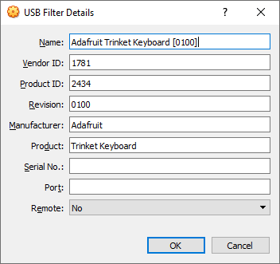

# 5 Dec 2019

## TrinketKeyboard

I zipped [TrinketKeyboard](https://github.com/adafruit/Adafruit-Trinket-USB/tree/master/TrinketKeyboard) and added it to Arduino IDE (see [yesterday](0004-2019-12-04.md) for how to add ZIP libraries).

A blank sketch with `#include <TrinketKeyboard.h>` uses this much of the Digispark:

```
Sketch uses 2952 bytes (49%) of program storage space. Maximum is 6012 bytes.
Global variables use 92 bytes of dynamic memory.
```

I wrote [01-trinket1] to try it out, with some various testing/debugging stuff. Note that it records times at `step1` and `step2`.

TrinketKeyboard is a little different from DigiKeyboard in that it lets you control specific key presses/releases. See [here](https://github.com/adafruit/Adafruit-Trinket-USB/blob/51f208bc569dd79d7357f16d548ed0c43f4927e8/TrinketKeyboard/TrinketKeyboard.h#L45), for example. It also apparently tries to [account for the CAPS LOCK state](https://github.com/adafruit/Adafruit-Trinket-USB/blob/51f208bc569dd79d7357f16d548ed0c43f4927e8/TrinketKeyboard/TrinketKeyboard.h#L70) when printing strings.

### On my Mac

I was able to get TrinketKeyboard to work, but I was getting some unexpected results:

1.  `TrinketKeyboard.isConnected()` issue:
    *   After `TrinketKeyboard.begin();` you can [supposedly](https://github.com/adafruit/Adafruit-Trinket-USB/blob/51f208bc569dd79d7357f16d548ed0c43f4927e8/TrinketKeyboard/examples/TrinketKeyboardPrank/TrinketKeyboardPrank.ino#L12) do `while (TrinketKeyboard.isConnected() == 0);` to await verification that the keyboard is connected, but I was finding it was *always* returning 0 and hence getting stuck on this line. Even after we were successfully sending keyboard keystrokes, it was still returning 0.
    *   Someone else noticed this and [supposedly worked around it](https://github.com/adafruit/Adafruit-Trinket-USB/issues/18#issuecomment-268548349) by switching to `TrinketHidCombo` and including a `.poll()` in each iteration of the wait loop, but trying this with `TrinketKeyboard` instead of `TrinketHidCombo` didn't work for me.
    *   Later I will try `TrinketHidCombo` instead, but I've seen some people say that they can't get it to get/set keyboard LEDs. I will report back on that later.
    *   Maybe this is specifically a DigiSpark issue?
2.  Initial keyboard writes, after `TrinketKeyboard.begin()`, seem to be lost. Adding a big delay (say, about 2 seconds) seems to avoid this. Supposedly this is why waiting for `isConnected()` would otherwise be a good idea.
3.  On my Mac, programming the DigiSpark with TrinketKeyboard code doesn't always lead to a successful initial start-up. I (almost?) always have to unplug and replug the DigiSpark before it will work, and even then it often doesn't work on the first try. This might be more to do with the Mac, or the DigiSpark in general (since similar issues existed with the `DigiKeyboard` library, I think).

When plugging/replugging to hopefully get the Mac to see it, this is what I got the first time it worked:

```
#1AThis is a test. Time=0..0 start=0 isConnected=0
#2AThis is a test. Time=4991..4991 start=0 isConnected=0
#3AThis is a test. Time=8219..8219 start=0 isConnected=0
#4AThis is a test. Time=11445..11445 start=0 isConnected=0
#5AThis is a test. Time=14707..14707 start=0 isConnected=0
```

I got a much longer delay on the second try that worked:

```
#1AThis is a test. Time=0..0 start=0 isConnected=0
#2AThis is a test. Time=15339..15339 start=0 isConnected=0
#3AThis is a test. Time=18599..18599 start=0 isConnected=0
#4AThis is a test. Time=21860..21860 start=0 isConnected=0
```

On the first try, the 2nd iteration started nearly 5 seconds after the first. There is only a built-in 2.3-second delay, and a certain amount of time can be pinned on how long it actually takes the write to output all characters. Maybe that's acceptable, but then the second try, the first iteration took over 15 seconds to complete! The initial `.poll()` must've been fine, given that either size of it is 0ms, but then maybe it got hung up on the first actual keystrokes (since I watched it march out each of the characters of line 1, and they happened at normal speed).

On a couple of subsequent occasions, I've had similar results: 12 seconds, for instance.

I wonder if the problem is a faulty DigiSpark, or the Mac hardware/software is just a lot more finicky?

### On my Windows 10 machine

I tried using the same program on my Windows 10 machine:

*   I didn't record how big the program was getting on my Mac (i.e. different `avr-gcc` version), but on Windows the [01-trinket1] program is this big:
    ```
    Sketch uses 4554 bytes (75%) of program storage space. Maximum is 6012 bytes.
    Global variables use 104 bytes of dynamic memory.
    ```
*   After the bootloader exits (5 seconds from power-on) and the main program runs, Windows identifies it almost immediately and calls it "Trinket Keyboard" as a USB device. Its Vendor ID (VID) is [`1781`](https://devicehunt.com/view/type/usb/vendor/1781) and its Product ID (PID) is `2434`, and VirtualBox identifies it as follows:

    

    TIP: Attach the device to a VM to stop it spewing text into Windows.
*   It starts up much more reliably on Windows than on my Mac, and gives good consistent results:
    ```
    #1AThis is a test. Time=0..0 start=0 isConnected=1
    #2AThis is a test. Time=3336..3336 start=0 isConnected=1
    #3AThis is a test. Time=6554..6554 start=0 isConnected=1
    #4AThis is a test. Time=9770..9770 start=0 isConnected=1

    #1AThis is a test. Time=0..0 start=0 isConnected=1
    #2AThis is a test. Time=3345..3345 start=0 isConnected=1
    #3AThis is a test. Time=6568..6568 start=0 isConnected=1
    #4AThis is a test. Time=9799..9799 start=0 isConnected=1
    ```
*   Note also that on Windows it reports `isConnected=1`

### Detecting keyboard LEDs

`TrinketKeyboard.getLEDstate()` can supposedly be called any time to get the keyboard LED states (using [these bits](https://github.com/adafruit/Adafruit-Trinket-USB/blob/51f208bc569dd79d7357f16d548ed0c43f4927e8/TrinketKeyboard/TrinketKeyboard.h#L76)), but it only seems to get the initial LED state when it's plugged in, and doesn't update after that. It looks like [this might've been fixed for `TrinketHidCombo`](https://github.com/adafruit/Adafruit-Trinket-USB/commit/51f208bc569dd79d7357f16d548ed0c43f4927e8#comments) but perhaps not `TrinketKeyboard` yet. I will check more into that later.

Anyway, my test code is in [02-trinket2].

## Other notes

*   `digitalWrite(1, HIGH)` for an `OUTPUT` pin means turning on its internal pull-up resistors, [apparently](https://github.com/adafruit/Adafruit-Trinket-USB/blob/51f208bc569dd79d7357f16d548ed0c43f4927e8/TrinketKeyboard/examples/TrinketKeyboardExample/TrinketKeyboardExample.ino#L17).
*   See: https://github.com/adafruit/Adafruit-Trinket-USB/issues/20 and https://digistump.com/board/index.php?topic=1530.0 and https://digistump.com/board/index.php?topic=2757.0
*   Visual Studio Code seems to have an official Microsoft extension for Arduino stuff (`@id:vsciot-vscode.vscode-arduino`).
    *   It requires that Arduino IDE is installed, but besides that it seems to work quite well.
    *   Hit <kbd>F1</kbd> and type `arduino` to see several of the common Arduino functions, including the Board Manager which picks up my existing config from the Arduino IDE (i.e. it recognises that I have `Digistump` installed).
    *   It was able to verify a sketch (try <kbd>F1</kbd> &rarr; `ardver`), with a bit of delay and figuring things out.
    *   It did *not* recognise my libraries straight away (e.g. `TrinketKeyboard`), though it was still able to verify/compile. It highlights `#include <TrinketKeyboard.h>` with an error saying that `includePath` needs to be updated. Clicking on this brings up a lightbulb icon which, when clicked, gives an `Edit includePath` option. This goes specifically to C/C++ extension settings. `Include path` already includes a couple of Arduino options, but I know otherwise that my added libraries should be found by:
        ```
        C:\Users\admin\Documents\Arduino\libraries\**
        ```
        After adding this, I restarted VSCode and then it complained about not being able to find the dependency `avr/pgmspace.h`, for which it turns out I needed:
        ```
        C:\Users\admin\AppData\Local\Arduino15\packages\arduino\tools\avr-gcc\4.8.1-arduino5\avr\include\**
        ```
        ...probably because of the outdated `4.8.1-arduino5` that is used by the Digispark board settings, by default. Alternatively, there's also `F:\Apps\Arduino\hardware\tools\avr\avr\include\`.
*   I had an issue where it was reporting this repeatedly while trying to upload my sketch:
    ```
    > Starting to upload ...
    writing: 70% complete
    writing: 75% complete
    writing: 80% complete
    > Starting the user app ...
    >> Run error -1 has occured ...
    >> Please unplug the device and restart the program. 
    ```
    ...meanwhile I could hear the Windows USB connect/disconnect sound repeatedly. I ended up just leaving it plugged in and started the `Upload` action again, which seemed to work after a short while.

## Future goals

*   Compare (inc. size and capabilities) with `TrinketHidCombo`.
*   Try getting/setting keyboard status LEDs.
*   Try various USB HID commands/modes.
*   Try [DigiCDC](https://digistump.com/wiki/digispark/tutorials/digicdc) and DigiUSB
*   DigiCDC notes:
    *   Virtual COM port; doesn't need a baud rate.
    *   Uses half of the Digispark's RAM.
    *   `SerialUSB` is the same as what otherwise would be `Serial` on an Arduino.


[01-trinket1]: code/0005-trinket-usb/01-trinket1
[02-trinket2]: code/0005-trinket-usb/02-trinket2
