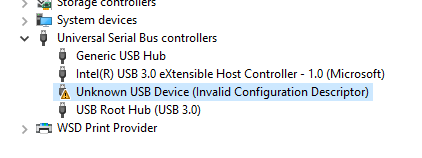

# 18 Dec 2019

## Issue with OctoPrint talking via USB to Geeetech A10

I reported yesterday that I was sometimes finding that manual control commands sent from OctoPrint would appear to stall the 3D printer, or at least stall comms with it.

So far, besides restarting things, I've found one workaround: In the OctoPrint UI, there's the "Terminal" tab. Under "Advanced options" there is a button, "Fake Acknowledgement". Clicking this seemed to bring everything back to life.

From what I can tell, OctoPrint gets stuck in a state waiting for acknowledgement of a previous command, and won't send anything else until it receives that acknowledgement. Meanwhile, the printer has already sent the acknowledgement, but it maybe got missed. Faking it means OctoPrint will assume it was received and assume it is safe to continue sending commands.

In the Terminal log, I noticed this, which might be the cause:

```
...
Recv: echo:PID settings:
Recv: echo:  M301 P25.22 I2.68 D59.39
Recv: echo:  M304 P182.46 I35.92 D231.70
Recv:  hardware version:3.90echo:Fixed parameter (6 bytes; crc 45721)
Recv: ok
Changing monitoring state from "Connecting" to "Operational"
Send: N0 M110 N0*125
Recv: echo:S_�ok
Communication timeout while idle, trying to trigger response from printer. Configure long running commands or increase communication timeout if that happens regularly on specific commands or long moves.
Send: N1 M115*39
Recv: FIRMWARE_NAME:Marlin 1.1.8 (Github) SOURCE_CODE_URL:https://github.com/MarlinFirmware/Marlin PROTOCOL_VERSION:1.0 MACHINE_TYPE:A10 EXTRUDER_COUNT:1 UUID:cede2a2f-41a2-4748-9b12-c55c62f367ff
...
```

Note in particular this bit:

```
Recv: echo:S_�ok
```

...it looks like the printer sent back `ok` (acknowledgement) but not cleanly on a new line. I'm not sure, but I think this is more likely to happen some short while after the printer has apparently finished "booting", and in the early stages of OctoPrint starting to query it.

I will have to look into this a bit more, and compare across failures to see if it's always the same thing, and whether it is always the same conditions.

## Trying out Digispark DigiCDC (USB serial) with Linux

Side-stepping for a sec: Can I make DigiCDC work on a Digispark, with a Linux VM? And what about with macOS?

Doco already says it needs a driver for Windows, so I'll forget that for now.

Here's [`DigiCDC.h`](https://github.com/digistump/DigistumpArduino/blob/master/digistump-avr/libraries/DigisparkCDC/DigiCDC.h) which we can examine for features. The main parts appear to be these methods of `SerialUSB`:
*   `begin()` -- Open comms.
*   `refresh()` -- Keep-alive.
*   `task()` -- No idea??
*   `delay()` -- Refresh-friendly delay.
*   `available()` -- Is there data that we can read?
*   `peek()` -- Look at data but don't unbuffer it.
*   `read()` -- Read (i.e. unbuffer) data.
*   `flush()` -- Not sure. Push out any buffered data, then return when no longer busy?
*   `write()` -- Write a byte.
*   Note also that it extends `Stream` which appears to include `Print::write` functionality.

Some info [here](https://groups.google.com/d/msg/androidscript/qCtNGjLRaS8/XXlwztNZBwAJ) about Digispark USB device VIDs (Vendor IDs) and PIDs (Product IDs), and that post leads to other discussions that might be useful.

Note the [functions of the pins](https://digistump.com/wiki/digispark/tutorials/connecting#digispark_differences_and_using_arduinoprocessing_with_the_digispark) of the Digispark:

*   Pins 3 and 4 are reserved for USB.
*   This leaves pins 0, 1, 2, and 5 for digital I/O.
*   Note however that pin 1 has the onboard LED, and that we might want to reserve pin 2 or 5 as an analog input.

My first test is [01-echo] which is just a ripoff of [this](https://github.com/digistump/Digispark_Cordova_CDCEcho/blob/master/ArduinoCode/Echo/Echo.ino). It just waits constantly for data to be available. When data is available, it reads one byte at a time and writes it back out.

The "Digistamp Bootloader" over USB identifies itself as `VID_16D0` and `PID_0753` (more info [here](https://usb-ids.gowdy.us/read/UD/16d0)).

A throwback to what I learned in [0005](0005-2019-12-05.md): if there is a programming error (e.g. `-1` error), then actually leave the device _plugged in_ (despite what other doco says) and it will probably go through a loop of identifying itself to Windows as `libusb-win32 devices` => `Digispark Bootloader` and then succeed the next time you go to "Upload" in Arduino IDE... i.e. do **not** unplug in between seeing this...

```
Sketch uses 794 bytes (13%) of program storage space. Maximum is 6012 bytes.
Global variables use 27 bytes of dynamic memory.
Running Digispark Uploader...
Plug in device now... (will timeout in 60 seconds)
> Please plug in the device ... 
> Press CTRL+C to terminate the program.
> Device is found!
connecting: 16% complete
connecting: 22% complete
connecting: 28% complete
connecting: 33% complete
> Device has firmware version 1.6
> Available space for user applications: 6012 bytes
> Suggested sleep time between sending pages: 8ms
> Whole page count: 94  page size: 64
> Erase function sleep duration: 752ms
parsing: 50% complete
> Erasing the memory ...
erasing: 55% complete
erasing: 60% complete
erasing: 65% complete
> Starting to upload ...
writing: 70% complete
writing: 75% complete
writing: 80% complete
> Starting the user app ...
>> Run error -1 has occured ...
>> Please unplug the device and restart the program. 
```

...and the next time you use the "Upload" function.

It took a couple of tries to program [01-echo] but it seems to have succeeded, but after that Windows didn't like it: It said the device malfunctioned, and showed this in Device Manager:



I found that DigiCDC seems to be rejected by Windows 10 because, apparently, it is considered to be "the CDC protocol over Low-speed USB" and that appears to be a [dirty hack that is losing support in modern OSs including Windows 10](http://www.recursion.jp/prose/avrcdc/). More discussion about the issue [here](https://digistump.com/board/index.php/topic,2321.msg13159.html#msg13159), and on the same page it is suggested that [low-speed CDC might work with the right driver and other hacks](https://digistump.com/board/index.php/topic,2321.msg13831.html#msg13831). There is more discussion about [LowCDC](http://digistump.com/board/index.php/topic,2416.msg13103/topicseen.html), and [this](http://digistump.com/board/index.php/topic,2416.msg13121.html#msg13121) could be interesting.

NOTE: Even the [Digipark Wiki reports this is problematic](https://digistump.com/wiki/digispark/tutorials/digiusb):

> I couldn't get the Windows device driver for the CDC Serial Library working. For me it shows up as unknown usb device (invalid configuration descriptor) and this older method \[DigiUSB\] works.


Here's what I will try next:

1.  Plug into my Linux physical machine and see what pops up in `/var/log/kern.log`
2.  If necessary, try DigiUSB and write my own drivers/client-side code to use it.

I plugged the Digispark, programmed with [01-echo], into my Linux machine, and `/var/log/kern.log` showed this:

```
# (Below we see the Digipark Bootloader for the first 5 seconds...)
Dec 18 20:40:45 octoprint kernel: [93010.572018] usb 3-2: new low-speed USB device number 2 using uhci_hcd
Dec 18 20:40:45 octoprint kernel: [93010.725034] usb 3-2: New USB device found, idVendor=16d0, idProduct=0753
Dec 18 20:40:45 octoprint kernel: [93010.725038] usb 3-2: New USB device strings: Mfr=0, Product=0, SerialNumber=0
...
Dec 18 20:40:50 octoprint kernel: [93015.528056] usb 3-2: USB disconnect, device number 2
...
# (Then we see the DigiCDC device...)
Dec 18 20:40:50 octoprint kernel: [93016.068018] usb 3-2: new low-speed USB device number 3 using uhci_hcd
Dec 18 20:40:51 octoprint kernel: [93016.228032] usb 3-2: config 1 interface 1 altsetting 0 endpoint 0x1 is Bulk; changing to Interrupt
Dec 18 20:40:51 octoprint kernel: [93016.228036] usb 3-2: config 1 interface 1 altsetting 0 endpoint 0x81 is Bulk; changing to Interrupt
Dec 18 20:40:51 octoprint kernel: [93016.250030] usb 3-2: New USB device found, idVendor=16d0, idProduct=087e
Dec 18 20:40:51 octoprint kernel: [93016.250034] usb 3-2: New USB device strings: Mfr=1, Product=2, SerialNumber=0
Dec 18 20:40:51 octoprint kernel: [93016.250037] usb 3-2: Product: Digispark Serial
Dec 18 20:40:51 octoprint kernel: [93016.250039] usb 3-2: Manufacturer: digistump.com
Dec 18 20:40:51 octoprint kernel: [93016.287895] cdc_acm 3-2:1.0: ttyACM0: USB ACM device
Dec 18 20:40:51 octoprint kernel: [93016.291116] usbcore: registered new interface driver cdc_acm
Dec 18 20:40:51 octoprint kernel: [93016.291118] cdc_acm: USB Abstract Control Model driver for USB modems and ISDN adapters
```

...so, apparently it has VID `16D0` and PID `087E`, and its device is `/dev/ttyACM0`.

I can now run `miniterm.py -` (maybe already installed by OctoPrint?) and do this:

```
anton@octoprint:~$ miniterm.py -

--- Available ports:
---  1: /dev/ttyACM0         Digispark Serial
---  2: /dev/ttyS0           ttyS0
---  3: /dev/ttyS1           ttyS1
---  4: /dev/ttyS4           n/a
--- Enter port index or full name:
```

...and <kbd>CTRL</kbd>+<kbd>C</kbd> to abort. Then run `miniterm.py /dev/ttyACM0` -- note that the baud rate is irrelevant (given this is a USB serial device), but [as it says here](https://digistump.com/wiki/digispark/tutorials/digicdc) the device can only transfer at about 5ms per character (200cps), so it won't be doing anything all that fast anyway.

I can now type in miniterm and it echos back my keystrokes, while toggling the onboard LED for each keystroke. I found I could also paste blocks of text in and they would echo back properly without seeming to skip a beat... albeit a bit slow.

Now, I've started [02-control], for providing commands (with feedback) for switching individual pins, but it isn't finished yet.


## Other things to look into

*   There's a nice little implementation of DigiCDC offering a CLI of sorts, called [DigiOS](https://github.com/jaromaz/DigiOS).
*   I'd like to learn more about how to use the [Intel AMT / Intel Management Engine](https://www.howtogeek.com/56538/how-to-remotely-control-your-pc-even-when-it-crashes/) features of the Lenovo desktop PC I'm using for OctoPrint. Note that Linux reports the system to be: `# System: LENOVO 7483RY2 [ThinkCentre M58p]`
*   It might be possible to buy a USB PID (not VID) from [here](https://www.mcselec.com/index.php?page=shop.product_details&product_id=92&option=com_phpshop) for &euro;18.99.
*   Some technical details about what CDC is, [here](http://www.recursion.jp/prose/avrcdc/driver.html#protocol).
*   Interesting thing [here](https://answers.microsoft.com/en-us/windows/forum/all/invalid-configuration-descriptor-prevents-usb/f711f8dd-23ec-4f58-86ff-c722b015a121) mentioning `usbtrace`.
*   Stuff about [Digispark with 64-bit Ubuntu](http://marcusjenkins.com/digispark-with-64-bit-ubuntu/).

[01-echo]: code/0008-digicdc/01-echo
[02-control]: code/0008-digicdc/02-control
