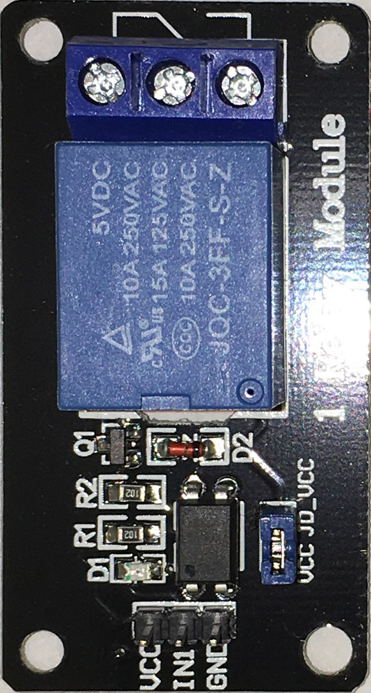

# 1 Feb 2020

Quick bash at making a shell to fit an object... back to relay boards, but this time a different size.

Here's a photo I took using my "camera box":

X axis seems about right in this image (actual board, according to my digital vernier calipers, is 28.3mm &times; 53.1mm). Y axis is a little skewed, I think... maybe 99.43% of what it should be. In this image, it appears the X axis is 20.6dpmm (523.24dpi) and the Y axis is 20.48dpmm (520.28dpi).

Before taking actual measurements, I ended up scaling it to 53.1mm on the Y axis. I then made sure my Photoshop units were set to mm and took measurements using the "Info" window (<kbd>F8</kbd> key) and drawing rectangular selections from the top-left corner.

