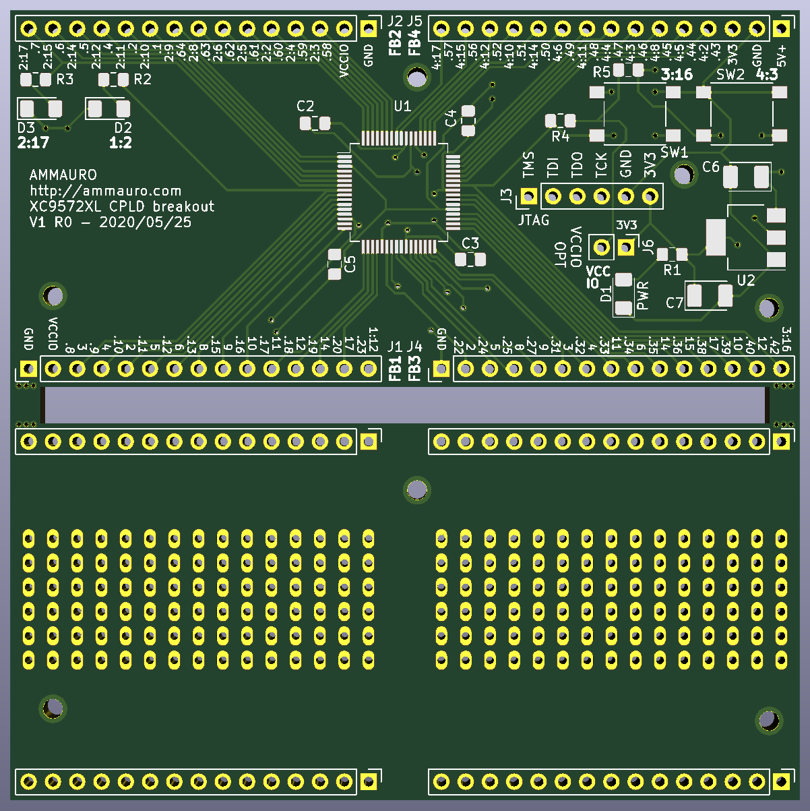

# 26 May 2020

## CPLD board

I designed a breakout board for the [XC9572XL-10VQ64](https://www.ebay.com.au/itm/2PCS-XC9572XL-10VQG/153107227490?ssPageName=STRK%3AMEBIDX%3AIT&_trksid=p2057872.m2749.l2649) ICs that I have. Ref: https://github.com/algofoogle/sandpit/tree/master/pcb/kicad/XC9572XL-breakout

I did the following:

*   Used KiCAD.
*   Learned about drag/shove routing (using <kbd>D</kbd> key in PCB layout editor): Great way to get tight and neat designs. Some other great [official doco here](https://docs.kicad-pcb.org/5.0.2/en/pcbnew/pcbnew.html).
*   Included the "bridge" board breakaway part (seen in the bottom half of the image above). I tried to make it a bit like a prototyping/veroboard too, by including 0.1&Prime; holes.
*   Added mounting holes: The idea is that the main board and bridge board could be joined together at the top, and then I could use right-angle SIL header pins on either board (facing outward) to create something that can be plugged into a breadboard vertically. Otherwise, the main board can have vertical header pins pointing down, and straddle two breadboards.
*   Designed for some parts I know I already have: 0.1&Prime; headers; AMS1117-3.3 LDO; XC9572XL-10VG64 (if my China order from eBay can be trusted); 6mm SMD pushbuttons.
*   Separated the XC9572XL "Function Blocks" (FB1..4) into different headers, and silkscreen-labelled their pins both with the chip pin number and chip pin function.
*   Guessed sizes for other passive SMD parts, picking ones that sounded easy enough to solder.
*   Ordered some parts from [Element14](https://au.element14.com); I probably already have several C, R, and LEDs I could already use, but they're cheap so I figured I would get some while ordering other stuff, too. Parts in the order were all SMD: various LED colours; ceramic caps (nF range); tantalum caps (&micro;F range); some 7x5mm XOs (crystal oscillators) of various frequences in the range 20MHz..50MHz; and a couple of spare XC9572XL-7VQG64C and XC9536XL-10VQ44C (handy maybe someday for 5V level shifting logic).
*   Learned that "in stock" doesn't necessarily mean it will actually be in stock and ready for shipping. There's some variability in this with Element14 at least.
*   Ordered the boards via JLC.
    *   They charged an extra engineering fee of US$4, then emailed later to say I would be charged another US$4 because I had 2 designs. Apparently that is determined by having the layouts obviously separated (electrically).
    *   I took the initiative to email them after I'd paid the extra, because it looked like the order was stalled until I did that. I used their support@jlcpcb.com address (even though they didn't specifically show that this was necessary), but they got back to me promptly and confirmed that the order was now in progress.
    *   Total cost ended up being about AU$45 for 5 boards. Actual material cost is AU$15.70, and shipping is AU$28.64.
    *   The order is in production now.
    *   I used their [new instructions for exporting Gerbers from KiCAD](https://support.jlcpcb.com/article/44-how-to-export-kicad-pcb-to-gerber-files); no mucking around with renaming files, now.

NOTE:

*   XC9572XL has a 3.3V core, but has 5V-tolerant pins. Its IOs can sink and source 8mA each.
*   `5V+` is the input voltage; 5V nominal, but maybe up to 12V is OK? It goes directly into the AMS1117-3.3 LDO voltage regulator.
*   `J6` / `VCCIO OPT` can be jumpered to connect the CPLD's VCCIO supply directly to the main 3.3V supply. Otherwise, supply a different VCCIO voltage via the `VCCIO` pin on `J6`.
*   `3V3` is the core supply voltage, regulated by the LDO, or otherwise just driven directly by an external supply.
*   There is a power LED, 2 logic LEDs (IO2-17 and IO1-2; active high as described [here](http://dangerousprototypes.com/docs/XC9500XL_CPLD_breakout_board#Button_and_LEDs)), and 2 pushbuttons (IO3-16 and IO4-3; pulled high when open and grounded when pressed).

Changes I would make if I did it again:

*   Make the board a bit smaller.
*   Put the main IC's decoupling caps closer; easier now that I know how to do drag/shove routing.
*   Maybe use smaller parts overall, based on parts researched first from Element14 or whatever.
*   Maybe include footprints for USB and coax power sockets?
*   Avoid JLCPCB extra charges: Either be more clever, or just don't worry about the bridge board.
*   Read [JLC panelization info](https://support.jlcpcb.com/article/49-pcb-panelization). Also [read this](https://www.eevblog.com/forum/manufacture/is-it-my-fault-or-is-jlcpcb-overly-pedantic-when-they-say-these-are-two-designs/). Also read about all the [instructions for ordering](https://support.jlcpcb.com/article/68-instructions-for-ordering?_ga=2.22423995.1240052623.1590408650-1419869817.1590408650&_gac=1.217384610.1590411562.EAIaIQobChMIjP6V3YjP6QIVB1dgCh0krAUzEAAYAiAAEgLeGfD_BwE).
*   I might try PCBWay instead of JLCPCB.
*   Bigger power traces, and bigger heat pad for LDO.
*   Be more careful about where the XO is so the CLK line induces less noise.
*   Use ground pour to handle ground lines, instead of doing vias first.
*   Maybe put in footprints for more interfaces to stuff, e.g. 7-seg displays.

## Getting ISE Webpack from Xilinx

*   Version: 14.7, released as a Linux VM, released in Feb 2020, intended to be used via VirtualBox in Windows 10.
*   Release notes: https://www.xilinx.com/support/documentation/sw_manuals/xilinx14_7/ug1227-ise-vm-windows10.pdf -- It also explains how it now supports all devices, not just Spartan-6. There is a copy of the guide [here](files/0021/ug1227-ise-vm-windows10.pdf), in case it goes missing.
*   Download from [here](https://www.xilinx.com/support/download/index.html/content/xilinx/en/downloadNav/vivado-design-tools/archive-ise.html#collapse-14-7-Windows-10) under "14.7 Windows 10". Note that it's a 15.5GB (!) VM.
*   This brings up a [login page](i/0021-xilinx-auth.png). I had to reset my password, as per their notification.
*   Not sure if these are needed, but there are [BSDL models available for download](https://www.xilinx.com/support/download/index.html/content/xilinx/en/downloadNav/device-models/bsdl-models/cplds.html) including for the XC9500XL. I've attached copies, in case they go missing: for [CoolRunner-II](files/0021/xc2c-2014.zip) and [XC9500XL](files/0021/xc9500xl.zip).
*   Info if there are errors when trying to use ISE Webpack: https://www.xilinx.com/support/answers/68433.html
*   This might be helpful for later figuring out how to program the XC9572XL: https://www.xilinx.com/support/answers/7585.html

## Other stuff to buy from Element14

*   Flux
*   Solder
*   SMD resistor networks?
*   Good tweezers
*   Level shifter packages

## Some other FPGA/CPLD stuff of interest

*   https://www.aliexpress.com/item/1000006622145.html
*   https://www.seeedstudio.com/catalogsearch/result/?q=fpga
*   https://www.scarabhardware.com/minispartan6/
*   https://www.seeedstudio.com/Sipeed-TANG-PriMER-FPGA-Development-Board-p-2881.html
*   https://www.seeedstudio.com/Sipeed-Tang-Nano-FPGA-board-powered-by-GW1N-1-FPGA-p-4304.html

## Other boards to design

*   STM32 shield?
*   ESP8266 or ESP32 boards
*   Breakouts for various weird connectors/components that I have
*   Learn how to make a USB-Blaster
