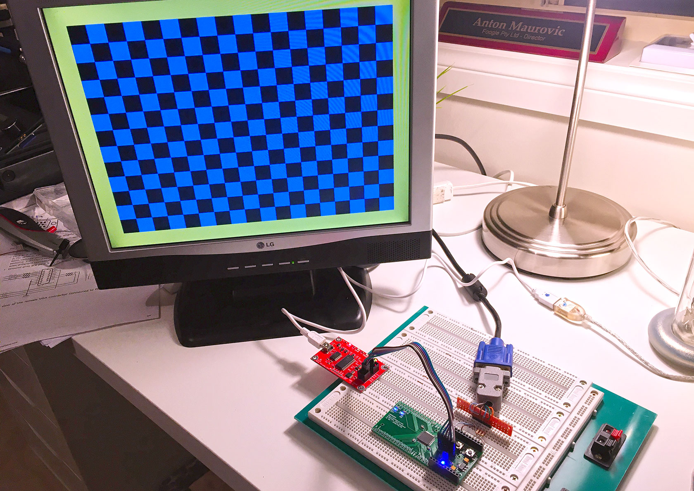
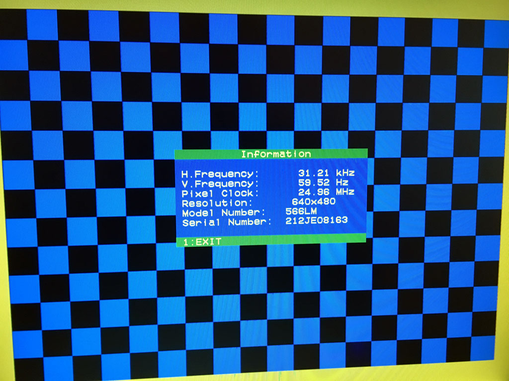

# 22 Jun 2020

## `test07b`

[`test07b`](https://github.com/algofoogle/sandpit/tree/master/fpga/XC9572XL/test07/t07b) shows the results of the below work.

The result is a core which generates something close enough to 640x480 60Hz VGA output, made up of a yellow border and blue checkerboard, and reacting to the two pushbuttons:

| Buttons | Result |
|-|-|
| None | Blue/black checkerboard (black in top-left corner) |
| Right | Inverted checkboard (blue in top-left corner) |
| Left | Checkerboard replaced with blue fill |
| Both | Checkerboard replaced with black fill |

VGA generator hardware:

VGA sync information that the monitor can detect and display for us:

### Implementing a simple VGA video generator

I'm going to try working out VGA signal generation myself, looking just the timing information, and not anyone else's code.

Timing info:
*   https://en.wikipedia.org/wiki/Video_Graphics_Array#Signal_timings
*   http://tinyvga.com/vga-timing/640x480@60Hz
*   http://martin.hinner.info/vga/timing.html

Note, official industry-standard frame rate for 640x480 VGA is actually 59.94Hz.

Base time unit:
*   Official VGA standard 640x480 at 60Hz uses a 25.175MHz "pixel clock", i.e. the time it takes to draw one pixel, and hence the time for which the signal of a single pixel should be asserted, is 39.723nS.
*   All other timing is derived from a multiple of "pixel" durations.
*   Apparently, most monitors will tolerate timing based on a 25MHz clock instead (i.e. 40nS per pixel).
*   Alternatively, we can perfectly get 800x600 at 72Hz from a 50MHz clock.

So, working out VGA timing using base time units with a 25MHz clock, our signal generation would be like this for horizontal:
1.  Lines are based on HSYNC.
2.  One line starts with a front porch (16px high).
3.  Then HSYNC goes low for 96px.
4.  Then it goes high again.
5.  The back porch, at this time, is 48px.
6.  After that, the active video can be piped in for the line: 640px.
7.  This all adds up to 800px.

And for vertical:
1.  Frames are made up of lines, hence just multiples/repeats of the timing above for 800px.
2.  Frames are based on VSYNC.
3.  From the top of the screen, we start a frame with VSYNC high for a front porch (11 lines).
4.  Then VSYNC goes low for 2 lines.
5.  Then it goes high again for 31 lines.
6.  After that, we have 480 lines of active video.
7.  This all adds up to 524 lines.
8.  NOTE: I think during steps 3, 4, and 5, I *think* HSYNC continues to fire on its regular timing...? See [this](http://web.mit.edu/6.111/www/labkit/vga.shtml) and [this](https://nathandumont.com/blog/vga-primer).

Now, something must be wrong in the numbers I've seen:
*   59.94 Hz &times; 524 lines &times; 800px => 25,126,848Hz.
*   I've seen other places (including further down on [this](http://martin.hinner.info/vga/timing.html) page) describe *525* lines rather than 524; i.e. 25,174,800Hz.
*   525 lines can be made up of 9 (front), 2 (sync), 30 (back) and 484 (active).
*   [This page](http://tinyvga.com/vga-timing/640x480@60Hz) suggests:
    *   Front porch: 10 lines
    *   VSYNC: 2 lines
    *   Back porch: 33 lines
    *   Active video: 480 lines
    *   Total: 525 lines

So to summarise, we'll be using this:

**640x480 60Hz**

| Measurement       | Value     |
|-|-|
| Dot clock         | 25MHz     |
| Line front porch  | 16 dots   |
| Line HSYNC (low)  | 96 dots   |
| Line back porch   | 48 dots   |
| Line active video | 640 dots  |
| (Line total)      | 800 dots  |
| Frame front porch | 10 lines  |
| Frame VSYNC (low) | 2 lines   |
| Frame back porch  | 33 lines  |
| Frame active video| 480 lines |
| (Frame total)     | 525 lines |

