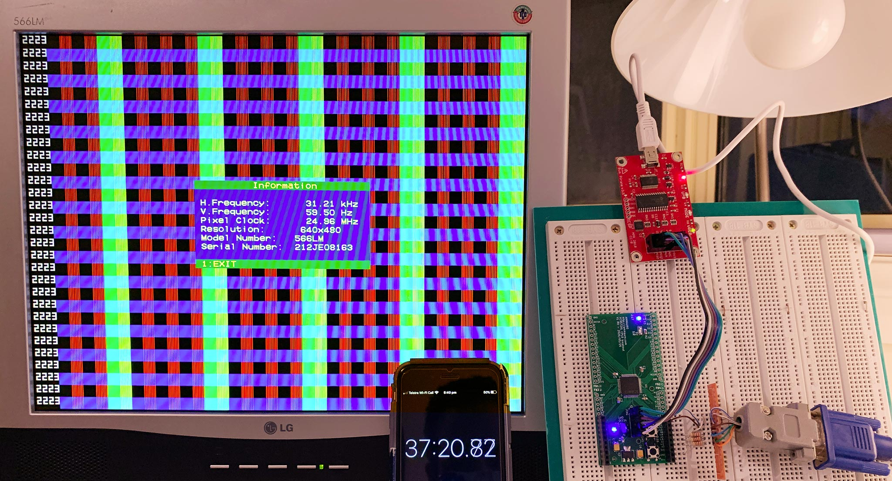

# 28 Jun 2020

## Numerals and counting with simple CPLD VGA generator

[`test07d`](https://github.com/algofoogle/sandpit/tree/master/fpga/XC9572XL/test07/t07d) now implements:
*   A simple [ROM-like module for storing numeral images](https://github.com/algofoogle/sandpit/blob/master/fpga/XC9572XL/test07/t07d/test07d.v#L113) as 3&times;5 pixel patterns for the digits 0..9.
*   A [4-digit demical counter using BCD](https://github.com/algofoogle/sandpit/blob/master/fpga/XC9572XL/test07/t07d/test07d.v#L49-L59).
*   [Internal frame counter](https://github.com/algofoogle/sandpit/blob/master/fpga/XC9572XL/test07/t07d/test07d.v#L44-L47) that increments the BCD counter when each 60 frames ticks over, *or* increments it on every frame if the right button is pressed.
*   [Reset when the left button is pressed](https://github.com/algofoogle/sandpit/blob/master/fpga/XC9572XL/test07/t07d/test07d.v#L35-L41).

Some specific details:

*   The left LED toggles every 60 frames.
*   The right LED is illuminated while VBLANK is asserted. This works out to be 45&div;525 or 8.6% of the time. Hence it is dim.
*   Pressing the left button will reset all the counters.
*   While the right button is held, the frame counter is ignored and the BCD counter updates on every VBLANK (i.e. on every frame).
*   One frame lasts 420,000 clock cycles (800&times;525), which at 25MHz is 59.5238Hz. However, we can see that the monitor believes the frame rate is 59.50Hz, or 99.96%.
*   My phone has counted about 2240.8 seconds, while the VGA generator has counted 2223&times;60 frames. So, 2223&times;60&div;59.5238 = 2240.78, which is pretty much spot on for a 25MHz clock. Nice one.
*   It's likely we could update the BCD counter using an actual divide-by-50-million counter, if we wanted to, and then have a separate buffer/latch for the value of the digits that latches on VBLANK, to display an exact number of seconds.
*   I wonder if we could count 521 lines instead of 525? That would be a frame rate of 59.9808Hz.
*   We can't get exactly 60Hz out of 25Mhz, because that would be 416,666.666 "pixels". However, to get close to 416,667:
    *   &div;792 = 526.095, or 526&times;792 = 416,592 => 60.011Hz (100.01792%), or 1 second gained every 2 hours.
    *   &div;801 = 520.184, or 520&times;801 = 416,520 => 60.021Hz (100.03521%), or 1 second gained every hour.
    *   &div;806 = 516.957, or 517&times;806 = 416,702 => 59.995Hz (99.99152%), or 1 second lost every 3 hours.
    *   Alternatively, 800&times;520+667=416,667 but I don't know if a monitor would like that, and it would mean HSYNC doesn't align perfectly...?
*   With this design, I was hitting some fitter issues:
    *   Sometimes the design wouldn't fit at all, from memory, but there were easy optimisations for that I think.
    *   Sometimes one or more related signals wouldn't fit into the same FB, and this lead to some crazy sync issues on the screen.
    *   Often, [changing a single pixel](https://github.com/algofoogle/sandpit/commit/250f125cdadc5b399913f6e59ea9478524027e08#diff-7307beb0360fe4fd25084eea94cf06e0) in the character "ROM" would make or break the fitting, and this is probably because of how it was able to optimise for similar bit patterns.
    *   I also had some sucess by:
        1.  Changing the Synthesis "Optimization Effort" from "Normal" to "High", while leaving it on "Speed".
        2.  Changing the Fitter to "Optimize Density", optionally with "Exhaustive" mode (though I don't think it was ever actually used).
*   To help example this in future I decided to start adding `.rpt` files to the repo, so we can track how resources get used differently with each change.
*   I also had an issue at one point where it was counting erratically. I was trying to do this on the edge of `vblank` but it was not working as I expected. I *think* I solved this by putting all of the counter logic into an `if..else` chain within the one `always @(posedge vblank)` block. I assume the problem was that sometimes, due to propagation delays, the current state of the frame counter was not consistent when being sampled by the BCD counter logic.

Other possible improvements:

*   Digits are currently made up of 2&times;2-size pixels, i.e. double-size. Why not try quad-size, too?
*   Why not more digits, to see how far we can go?
*   Can we fit hex digit images into the ROM? Maybe split it across two FBs somehow? Or odd/even lines?
*   Can the ROM also be improved by using on 3 pixels wide (and generating the separating 4th pixel using some other logic)? Also, could we just use one big combo `case` and ignore the unused rows?
*   Could we have two BCD counters, one for frames, and another for &div;25,000 (to yield a counter in actual seconds and milliseconds)?
