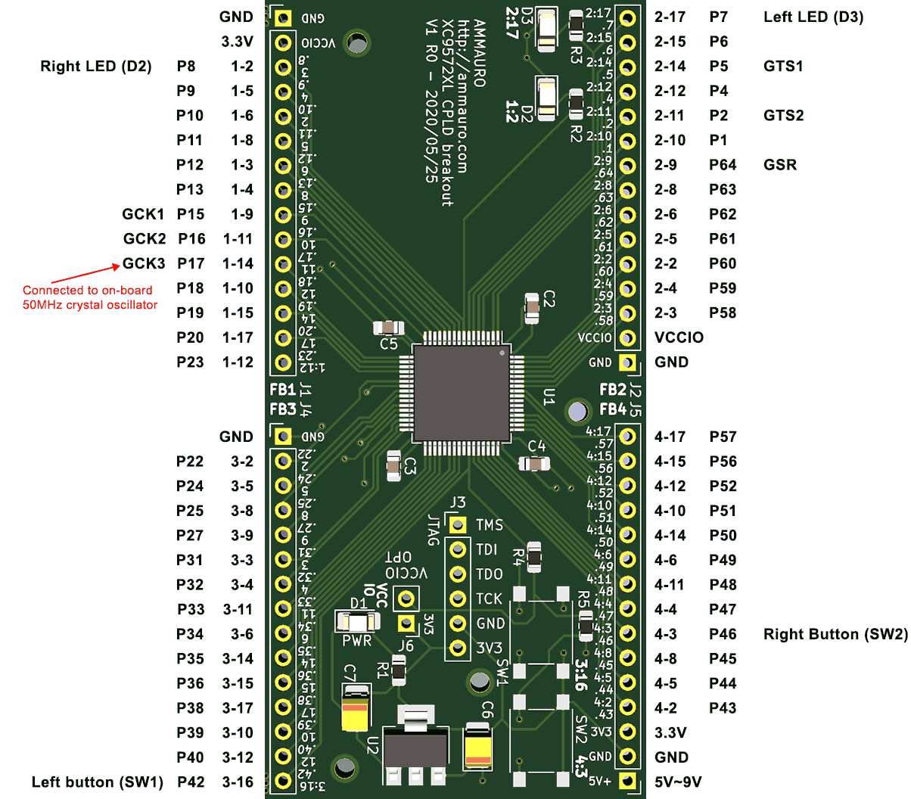

# 22 Jul 2020

I'm gearing up to try using my XC9572XL board with other components; especially an external ROM and RAM. See [`t09a`](https://github.com/algofoogle/sandpit/blob/6a654648bef9ded7e5a8ed575240eef6dd2941a2/fpga/XC9572XL/test09/t09a/test09a.v).

To this end, I've soldered in some more of the header pins for FB1 and FB2.

Note that there's an error in the silkscreen of the V1 R0 board, for FB1: The pin numbers (i.e. "dotted" numbers) are correct, but the other labels are not.

I've made a diagram to show the label and function of each pin:

