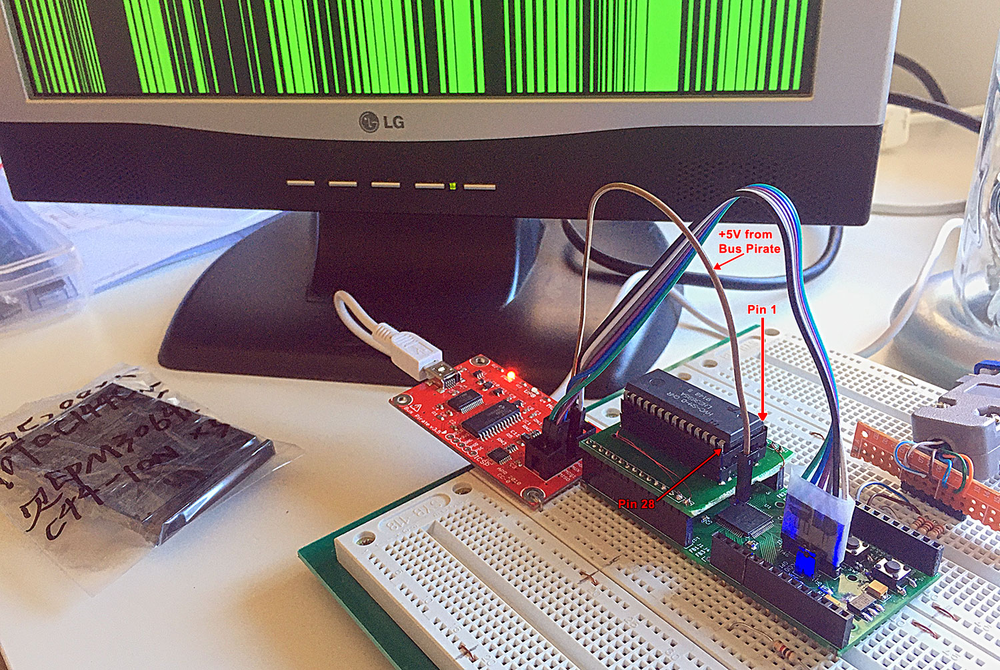
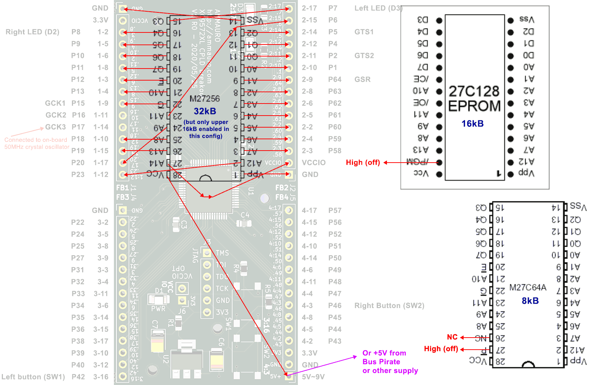
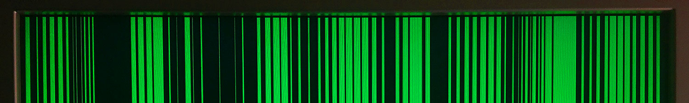
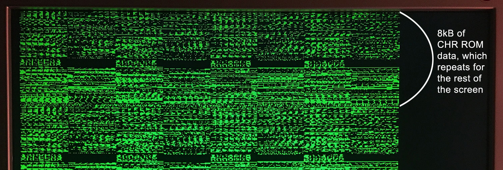
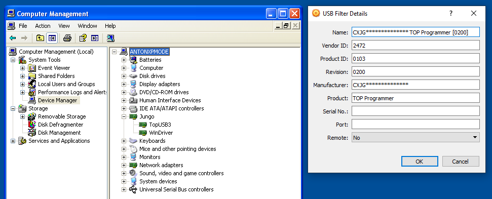
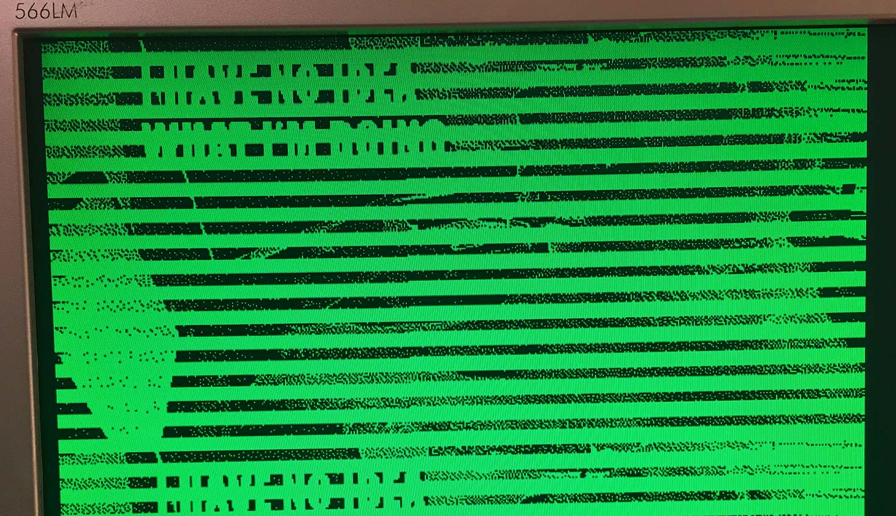
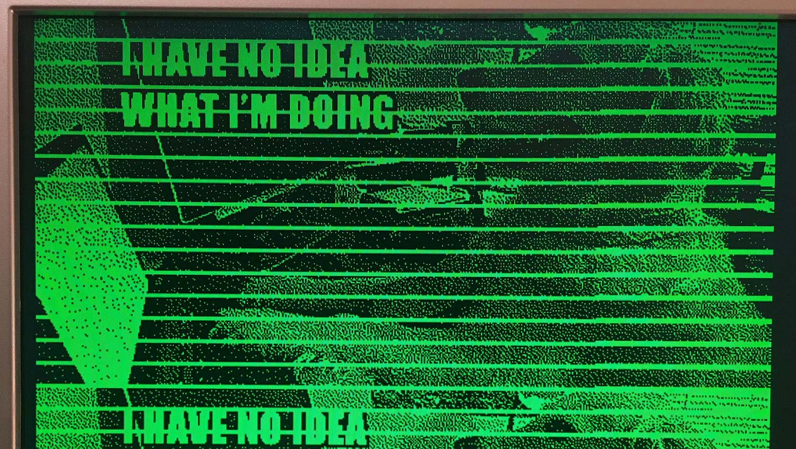
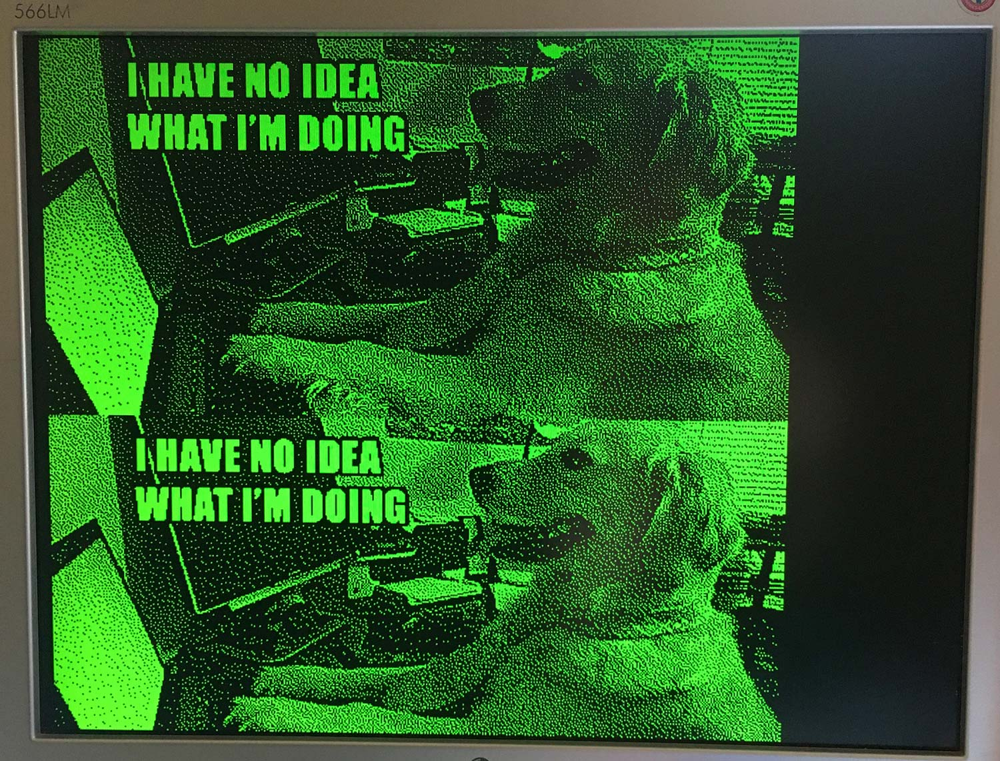

# 25 Jul 2020

| Previous journal: | Next journal: |
|-|-|
| [**0046**-2020-07-22](./0046-2020-07-22.md) | [**0048**-2020-07-29](./0048-2020-07-29.md) |

## ROM plug-in board

I made a ROM plug-in board that fits into the CPLD board, with the intent of proving that I can read an external memory and, in this case, display its contents on the VGA screen:



It's designed to work with any DIP-28 JEDEC ROM, which includes the 27C64 (8kB), 27C128 (16kB), 27C256 (32kB) and equivalent mask ROMs like chips from NES NROM-128 and NROM-256 carts. Note that A14 is pulled high on the PCB, meaning that for 32kB ROMs it will only read the top 16kB.

In the picture above, I have a `HVC-SM-0 CHR` ROM chip plugged in, which is the Super Mario Bros. Character ROM. The pattern currently displayed on the monitor is a bit pattern from bytes read from the ROM. More on that later.

### Wiring

The wiring of the plug-in board is as follows:



Note that:
*   Pin 27 is pulled high (to VCCIO), which means that A14 is pulled high always from 32kB ROMs. For smaller ROMs, it is `/PGM` in a deactivated state.
*   Pin 1 is VPP for most DIP-28 ROMs, so we pull that low.
*   We can actually also use a 27C512 in this, because it too is a DIP-28. In that case, pin 1 is A15, which is pulled low here.
*   Adapting this to work with a DIP-24 (2708..2732) requires selecting the A13 line between the CPLD IO pin and the 5V supply.

## Commits to `t09a`

These are my recent commits to [`t09a`](https://github.com/algofoogle/sandpit/tree/master/fpga/XC9572XL/test09/t09a):

### [`288d0bd`](https://github.com/algofoogle/sandpit/commit/288d0bdc61e97abbe1d24a5ff2f07af84ba4df0f#diff-781ac0af63b12d0aaad826f58c10d831)

VGA scanner runs at 50MHz; each clock cycle is "half" a pixel, so [16 clocks counted by `h`](https://github.com/algofoogle/sandpit/blob/288d0bdc61e97abbe1d24a5ff2f07af84ba4df0f/fpga/XC9572XL/test09/t09a/t09a.v#L57-L58) is 8 horizontal pixels, read as one byte from the ROM.

Left button shows the state of the lower 8 bits of the ROM address in all lines of the screen.

Right button shows a test pattern in all rows of the screen.

With no buttons pressed, it show the first 80 bytes of the ROM, in all rows of the screen.




### [`f3afddd`](https://github.com/algofoogle/sandpit/commit/f3afddd90cd9665301fc8b262485466529dba075#diff-781ac0af63b12d0aaad826f58c10d831)

Now it only show 512 pixels (i.e. 64 bytes) per line, allowing us now to fit a 512x256 bitmap image in 16kB of ROM. For that, it now [displays sequential lines](https://github.com/algofoogle/sandpit/commit/f3afddd90cd9665301fc8b262485466529dba075#diff-e234b40013ad49c2b863e58e82c6974eR68) of 64 bytes (512 pixels) from the ROM:



NOTE: The left 8 pixels are black. This is because we are not loading the first byte before the very start of the line. We'd have to do that in (say) HBLANK. I'll fix that later.

Holding both buttons now also fills the screen completely, which is to help get the monitor to auto-adjust.

Note: There was also a commit before this one ([`e19a0ad`](https://github.com/algofoogle/sandpit/commit/e19a0ad09c022092e5bb571420edcd04f245340c#diff-781ac0af63b12d0aaad826f58c10d831)) which was just to adjust the timing of the ROM read sequence.

### [`907317c`](https://github.com/algofoogle/sandpit/commit/907317c853300f5e57b7f8895f7c22b3ed5f9a9c#diff-781ac0af63b12d0aaad826f58c10d831)

I added [`pbm2rom.rb`](https://github.com/algofoogle/sandpit/blob/master/fpga/XC9572XL/test09/t09a/data/pbm2rom.rb). Photoshop can save a bitmap image file as a `.pbm` which is [basically raw binary image data](http://netpbm.sourceforge.net/doc/pbm.html). It's easy to convert to a ROM image that can be displayed using this system I've been making; just note that it represents *black* pixels with a binary *1* instead of 0.

`pbm2rom` expects 1 command-line argument: The PBM file to convert. It will spit out the same filename with `.bin` appended. For now it works only on "`P4`"-format files that are 512x256 pixels, but could be adapted for other dimensions. The resulting file is 16kB exactly (64 bytes per line, 256 lines).

## Burning a ROM

A suitable EEPROM I have for use in this project is the [W27E257-12](http://pdf.datasheetcatalog.com/datasheet/WinbondElectronics/mXyzrstw.pdf) (32k &times; 8, 120nS access time).

I expect I will ble able to use my TOP853 programmer. It's a piece of junk, but it has worked OK in the past. The only trick is that I've only been able to get the software to work in Windows XP before.

For that I'm using a Windows XP VM. I've got one obtained from Microsoft for testing IE, but it has an expiry date. My "Windows XP Mode" VM has a snapshot called "Topwin works" taken 2019-04-04 at 23:11. I've restored to that snapshot, and [this method](https://superuser.com/a/539881) should allow me to run it with a clock in the past so that it won't expire.

First, I'll try booting from a fresh snapshot of the VM, called "Snapshot 3".

It boots to a login screen. There is no password for `Administrator`. It stops us at this point, though: It says activation is required, and it won't let us log in without doing that. Activation doesn't work: It can't get internet access, or at least can't access the Microsoft servers.

I restored back to "Snapshot 3", then ran this:

```
VBoxManage setextradata "Windows XP Mode" "VBoxInternal/Devices/VMMDev/0/Config/GetHostTimeDisabled" 1
```

After staring the VM, it still complained about needing activation, so I did this to configure the clock to be 478 days behind my actual system clock (noting that I ran both commands, because after restoring "Snapshot 3" again I wanted to make sure no settings had been discarded):

```
VBoxManage setextradata "Windows XP Mode" "VBoxInternal/Devices/VMMDev/0/Config/GetHostTimeDisabled" 1
VBoxManage modifyvm "Windows XP Mode" --biossystemtimeoffset -41299200000
```

This seems to have worked: Windows in the VM thinks it is 2019-04-04 22:36, which is close enough.

To create a suitable raw BIN to burn to my 32kB EEPROM, knowing that the hardware only displays the upper 16kB, I doubled up the file:

```bash
cat no-idea-dog.pbm.bin no-idea-dog.pbm.bin > no-idea-dog-32k.bin
```

I plugged in the TOP853 to my host machine. It didn't immediately pass through to the XP VM, so I re-plugged it, and then VirtualBox shows it is properly passed through to the XP VM:



Then I followed these steps:

1.  Pop in a W27E257-12.
2.  Launch Topwin6.
3.  Go to `Run` => `Select chip`.
4.  Choose `EEPROM` from the device options list, then selected `WINBOND`, and select `W27E257`. Hit `OK`.
5.  Go to `Run` => `Read`. For some reason that took ages, but it did return what appears to be a blank chip, i.e. all 0xFF. Running `Blank` is much faster, and verifies this.
6.  Go to `File` => `Open` and choose the `no-idea-dog-32k.bin` file.
7.  Burn with: `Run` => `Programe`. It's pretty slow! It took about a minute.
8.  I tried a `Verify`, but it failed. Indeed, there are incorrect bytes and big chunks of data that were clearly not written (leaving large runs of 0xFF).

After one write cycle, big chunks of the chip (totalling about half of it, in stripes) were not written successfully.



I tried to repeatedly write the data, which gradually made more progress, but never did the job properly.



It turns out the TOP853 is junk and might not always work so well will chips that require higher programming voltages (i.e. this W27E257 requires 14V for erase and 12V for programming). People had suggested using the "Delay" feature in the "Config" tab of the main screen, but there is no such feature available for this chip. I also tried using alternative EPROM and EEPROM modes to program this chip (some of which did include "Delay" options) but it didn't make any noticeable difference.

In the end, I used an [SST27SF256](http://pdf.datasheetcatalog.com/datasheet/SiliconStorageTechnology/mXrrwrx.pdf) instead. The chip I popped in was used, scuffed, and still had firmware from a printer or cash register (it seems) on it, but it erased, programmed, and verified within 8 seconds, then worked perfectly in my device:




Here's some info about troubleshooting the TOP853, but also supporting that it is junk:
*   http://www.primrosebank.net/computers/maint/tools/top853.htm
*   https://stardot.org.uk/forums/viewtopic.php?t=9632
*   https://www.lemon64.com/forum/viewtopic.php?t=41539&sid=fb46decb50787ef93adb381c12e7e3f1
*   https://connect.gocollect.com/discussion/128000/help-with-top853-programmer

Note also that [this page advertising it](http://www.51c51.com/ENWEB/parts/top853.htm) suggests it only supports 5V devices.

Info on alternative programmers or building a custom device:
*   [MiniPro TL866](https://www.eevblog.com/forum/blog/eevblog-411-minipro-tl866-universal-programmer-review/msg182431/#msg182431)
*   [GQ-4X options](https://www.amazon.com.au/s?k=GQ-4X&s=price-asc-rank&qid=1595723936&ref=sr_st_price-asc-rank) including adapters for SOP/SOIC, JTAG...?
*   https://www.eevblog.com/forum/beginners/5v-12v-and-14v-eeprom-programming/

## Other improvement ideas for the CPLD PCB

*   Maybe use 10-pin 0.1&Prime; headers, with one space between each row, so they're easier to solder adjacent each other, but still breadboard compatible?
*   Maybe make headers DIL instead of SIL, so we get *pairs* of sockets, making it easier to do double-up wiring.
*   More DIP rows in the "riser" board; current version is not wide enough to fit DIP-600. I had to "wedge" my chip socket into this board at a bad angle.
*   Thicker traces on the riser, at least near the edge headers, optionally with exposed pads, so it's possible to solder to them after cutting the trace.
*   Optional resistor arrays: Pull up, down, or just in-series.
*   Holes or notches to help with inserting/removing from breadboard. Holes could be used with a hook tool, or could even have "posts" permanently screwed in that are easier to grab.
*   Move JTAG headers so they don't occlude the riser being used as a daughterboard.
*   Better/dual placement of LEDs and buttons.
*   Some cool plug-in boards.
*   "Edge"-mount connection: card-edge style, but also with the option to just solder a socket or DIL header pins on directly instead.
