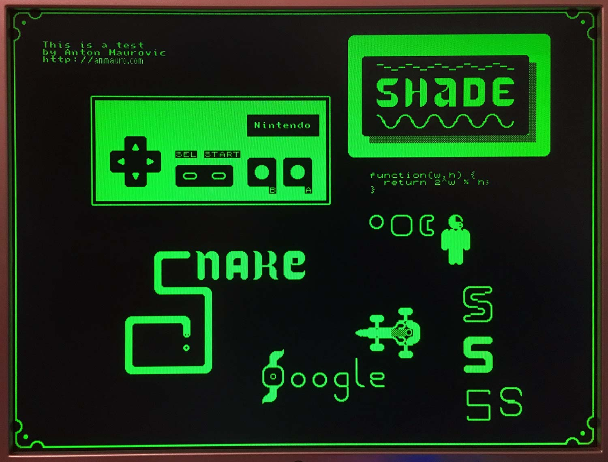

# 2 Aug 2020

## ROM-based tile map VGA renderer

Over the last few days I ditched `t09c` and instead started [`t09d`](https://github.com/algofoogle/sandpit/tree/master/fpga/XC9572XL/test09/t09d).

`t09d` successfully displays an image from ROM composed of a tilemap out of 256 8x8 pixel tiles (also in the ROM).



Specifically, `t09d` does the following:
*   Generates VGA sync signals: HSYNC pulse starts off each line (i.e. `h` counter = 0..95). VSYNC pulse is at the end of each frame (i.e. `v` counter = 524..525). In turn this means the visible area is `144<=h<784` and `32<=v<512`.
*   Keeps `/OE` and `/CE` of the ROM tied low (asserted) at all times. This means less logic required, and we instead just let the chip respond to our changing address lines in its own good time.
*   Deconstructs the 640x480 screen into 80x60 tiles that are 8x8 pixels each.
*   Uses a 70nS ROM, but allows 80nS for data to be ready. There is still ample room to support a 120nS ROM, too. Supporting up to a 160nS memory *might* be possible but anyting slower than 120nS would require some changes to the logic.
*   Each tile in the 80x60 map is read from ROM, and that tile index is then used to retrieve each byte of bitmap data from the ROM, too, as required.

NOTE: The first fit that `g.sh` found was using the following settings with 54 inputs and 11 pterms:

```
~~~ opt_level:           1
~~~ opt_mode:            speed
~~~ optimize (cpldfit):  density
~~~ ignoretspec:         1
~~~ pld_xp:              NO
~~~ pld_mp:              NO
~~~ mux_extract:         Yes
~~~ resource_sharing:    YES
~~~ fsm_encoding:        Compact
~~~ pld_ce:              NO
~~~ keep_hierarchy:      No
~~~ loc:                 on
```

i.e. Speed/Normal+Density, ignoretspec, 11/54.

This whole design basically works by preparing for what will happen at the next pixel, next tile, next line, whatever. It uses a [row base counter](https://github.com/algofoogle/sandpit/blob/ebeb42e8d4861aa91350fc8b0186fdaec989603f/fpga/XC9572XL/test09/t09d/t09d.v#L75) (increments by 5, but multiplied later by 16 to mean "80 chars per line"), with a [column counter](https://github.com/algofoogle/sandpit/blob/ebeb42e8d4861aa91350fc8b0186fdaec989603f/fpga/XC9572XL/test09/t09d/t09d.v#L83) that gets [added on](https://github.com/algofoogle/sandpit/blob/ebeb42e8d4861aa91350fc8b0186fdaec989603f/fpga/XC9572XL/test09/t09d/t09d.v#L61).

Below is the memory map of my SST27SF256 ROM. Note that I have A14 tied high:

```
$0000..$3FFF  Unused (A14 tied high).
$4000..$47FF  Character ROM (256 chars * 8 bytes = 2048)
$4800..$5FFF  Unused
$6000..$72BF  Tile map (80 * 60 characters = 4800)
```

Using my [character set](https://github.com/algofoogle/sandpit/blob/master/fpga/XC9572XL/test09/t09d/data/ASCII-06m-BW.png), I used ["Tiled" Map Editor](https://www.mapeditor.org/) to [create the tile set](https://github.com/algofoogle/sandpit/blob/master/fpga/XC9572XL/test09/t09d/data/ASCII-06m-BW.tsx) and then create the [original tile map](https://github.com/algofoogle/sandpit/blob/master/fpga/XC9572XL/test09/t09d/data/example_tile_map.tmx).

I then:
*   Converted the character ROM data to a [2048-byte ROM fragment](https://github.com/algofoogle/sandpit/blob/master/fpga/XC9572XL/test09/t09d/data/ASCII-06m-BW.pbm.bin) by saving it as a bitmap (black-and-white) `.pbm` file in Photoshop and then converting that with [`pbm2rom.rb`](https://github.com/algofoogle/sandpit/blob/master/fpga/XC9572XL/test09/t09a/data/pbm2rom.rb).
*   Converted the tile map to a [4800-byte ROM fragment](https://github.com/algofoogle/sandpit/blob/master/fpga/XC9572XL/test09/t09d/data/example_tile_map.tmx.bin) using [`tmx2bin.rb`](https://github.com/algofoogle/sandpit/blob/master/fpga/XC9572XL/test09/t09d/data/tmx2bin.rb).
*   Assembled those loose pieces into the [main 32kB ROM](https://github.com/algofoogle/sandpit/blob/master/fpga/XC9572XL/test09/t09d/data/t09drom.bin) using [`makerom.rb`](https://github.com/algofoogle/sandpit/blob/master/fpga/XC9572XL/test09/t09d/data/makerom.rb).

When using my TOP853 to burn my ROM to the SST27SF256 (which has previously worked very well), I suddenly started having problems again, surprisingly around address 0x331, as I had done [with the W27E257 chip](https://github.com/algofoogle/journal/blob/master/0047-2020-07-25.md#burning-a-rom).

**I managed to get it to burn,** and I think I worked out this procedure sort of works:
*   I made sure there was no chip in the TOP853.
*   I completely shut down the WinXP VM and unplugged the TOP853.
*   I started up WinXP again, logged in, then plugged in the TOP853 to a USB2.0 socket.
*   I launched Topwin6.
*   I made sure the correct chip was selected in Topwin6.
*   I loaded the ROM image into Topwin6.
*   I plugged the chip into the TOP853.
*   I then hit "Go" to burn it, which does the erase and everything first.

I also noticed that the "Ready" light on the TOP853 might *need* to be on before starting any process.

Early on I made a [test bench](https://github.com/algofoogle/sandpit/blob/master/fpga/XC9572XL/test09/t09d/t09dtest.v) in XISE which is designed to run for the equivalent of 64 lines of 1 frame. It worked at the time, but it's now outdated because I've since made the design dependent on the external ROM. I also had some trouble where apparently if I switched the "top design" to use `t09d.v` instead of `t09dtest.v`, it didn't seem to actually synthesize that `t09d` module.

So long as `working/t09d.prj` exists, and basically contains the following, then `g.sh` should do the job fine:
```
verilog work "../t09d.v"
```

Sorry, I haven't included the `.prj` files in the repo, typically.

## Future optimisations

Optimising might be a good exercise, and might also be useful if we plan to try out some extra functionality on this thing (including, say, scrolling)...

Some optimisations we could try:
*   Tweak [bit tests](https://github.com/algofoogle/sandpit/blob/ebeb42e8d4861aa91350fc8b0186fdaec989603f/fpga/XC9572XL/test09/t09d/t09d.v#L40-L44) for `hmax`, `vmax`, `hsync`, `vsync`, and `visible`.
*   Use [8-to-1 mux for `bitmap`](https://github.com/algofoogle/sandpit/blob/ebeb42e8d4861aa91350fc8b0186fdaec989603f/fpga/XC9572XL/test09/t09d/t09d.v#L78).
*   [Calculate `cell_index`](https://github.com/algofoogle/sandpit/blob/ebeb42e8d4861aa91350fc8b0186fdaec989603f/fpga/XC9572XL/test09/t09d/t09d.v#L61) without separate counters. Note that we might just be able to set bit A13 (`$2000`) directly.
*   Consider getting rid of [separate `hh` reg](https://github.com/algofoogle/sandpit/blob/ebeb42e8d4861aa91350fc8b0186fdaec989603f/fpga/XC9572XL/test09/t09d/t09d.v#L69-L70).
*   If we keep the `rowbase` counter, we know we can do a bit test on it that ignores the MSB [instead of testing `v==31`](https://github.com/algofoogle/sandpit/blob/ebeb42e8d4861aa91350fc8b0186fdaec989603f/fpga/XC9572XL/test09/t09d/t09d.v#L75).
*   Can we somehow use discrete bits of `h[2:0]` to drive certain register assignments, [instead of the `case`](https://github.com/algofoogle/sandpit/blob/ebeb42e8d4861aa91350fc8b0186fdaec989603f/fpga/XC9572XL/test09/t09d/t09d.v#L79)?

## Future design ideas

*   Make a tool that allows easier copying of ASCII text into a tile map.
*   Will this design fit sooner with less than 10 pterms, or less than 54 inputs?
*   "Attribute table" (i.e. extra bit per tile to invert it)
*   Try X/Y scrolling
*   Sprites
*   External RAM. Would serial RAM even be useful?
*   Enabling external RAM access using HBLANK and VBLANK. Interrupt-driven, accessed by an actual CPU.
*   Try implementing a PBM decoder core, then an RLE core (should it be bit-based or byte-based). GIF might be a bit much, unless we have external RAM

## Other notes

*   I reckon I could use a shift-right-by-one system (delaying output by 1 pixel, but relative across the board) to make calculations/divisions easier, and just roll the counter back to 1 instead of 0 each time?
*   Weirdly, I found that using a reg for `/OE` and `/CE` didn't work as expected when setting them in an `initial` block. I'm not aware of anything that should be stopping the `initial` block from working, or should be overriding the registers, but it definitely wasn't working right. One solution was to set the registers every time as required, but instead I just ended up hard-wiring them as asserted (i.e. pulled low) in the Verilog.
*   Is there a way we can extend "Tiled" [via a Python plug-in](https://discourse.mapeditor.org/t/how-to-map-graphic-tileset-to-ascii-symbols/3752/2) or something to allow us to import ASCII? Otherwise, can we just merge ASCII content into the base64 data?
*   Guts of a book called [Computer Graphics Primer](https://www.atariarchives.org/cgp/index.php) (from 1979) is available at atariarchives.org -- looks pretty interesting.
*   Cellular automata, combined with an LFSR, could be nice to experiment with, using a small number of register bits and RAM.
*   Read about [vgasim](https://github.com/ZipCPU/vgasim) for making a VGA display simulator that works with Verilog simulation runs generated by [Verilator](http://zipcpu.com/blog/2017/06/21/looking-at-verilator.html).
*   Likewise, this would be a great read: https://zipcpu.com/blog/2018/11/29/llvga.html
