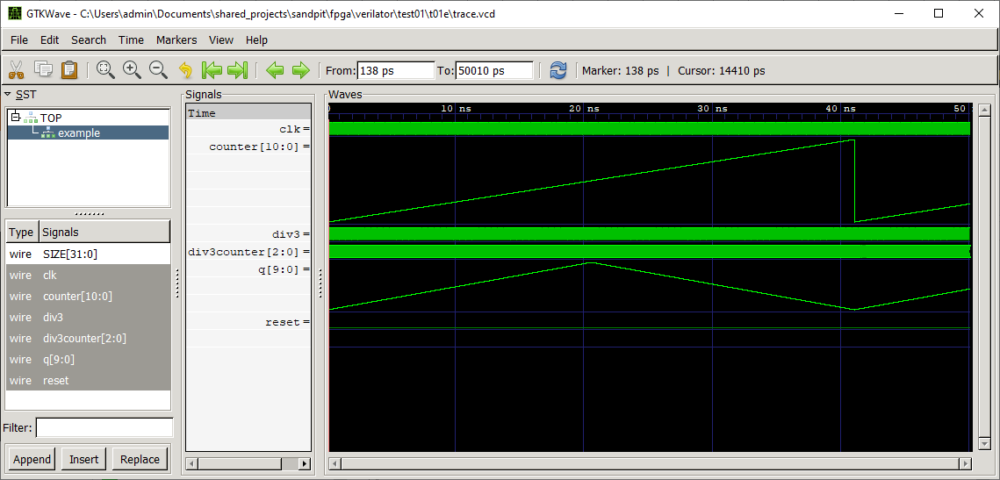
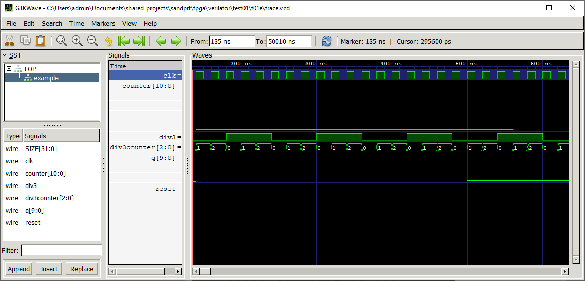
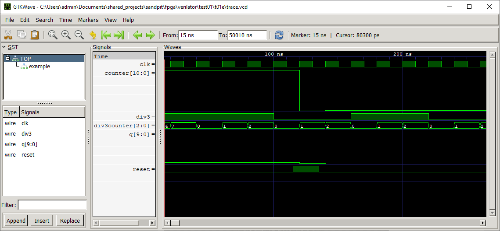

# 8 Aug 2020

I downloaded [GTKWave for Windows](https://sourceforge.net/projects/gtkwave/files/) (specifically [`gtkwave-3.3.100-bin-win32.zip`](https://sourceforge.net/projects/gtkwave/files/gtkwave-3.3.100-bin-win32/gtkwave-3.3.100-bin-win32.zip/download)) and extracted to my system. `bin/gtkwave.exe` is the program to run.

When it launches, go to `File => Open New Tab` and choose the `trace.vcd` file created by doing `make run` in `t01e`. Then expand `TOP` to select `example`, select all the signals it lists below (except for `SIZE` in my case), and click `Append`.

Then you can zoom out a bit via the toolbar until you see signals the way you like. Better for this data, however, is to:
1.  Right-click `counter` and change `Data Format` to `Analog => Step`, then also `Analog => Step => Resizing => All Data`.
2.  Right-click `counter` and select `Insert analog height extension` a few times.
3.  Repeat steps 1 and 2 for `q`.
4.  Do `Zoom Fit` from toolbar.

Note that by default GTKWave assumes the VCD is in picoseconds instead of nanoseconds. We can fix this in the code later. I don't yet see a way to change the input units in GTKWave.



I adjusted the code a little so that the clock period is actually 20nS rather than 20pS. Let's have a look at the start of the trace. Right-click-drag inside the waveform to zoom in on a specific area:



The first sample is at 135nS because: (a) we increment `m_tickcount` *before* actually doing the clocking; and (b) we start the trace only after 5 initial cycles, plus 1 extra cycle for the initial reset. That means the first time we record a sample, `m_tickcount` is 7: 7&times;20000-5000=135,000, or 135nS.

Since taking the screenshots above, I've changed the code to start the trace right at the very start (before the initial 5 cycles), and generated the trace using random initial values.

Note that I ran `make run2 SEED=991` and got weird (fixed) values in `q`:

```
$ make run2 SEED=991
Cold start...
Synchronous reset...
[000000006] Changed count direction from UP to DOWN. q=000003E2 counter=00000000 div3counter=1
Main loop...
[000001030] Changed count direction from DOWN to UP. q=000003E2 counter=00000400 div3counter=2
[000002054] Changed count direction from UP to DOWN. q=000003E2 counter=00000000 div3counter=0
Done at 2500 ticks.
```

Originally the `printf` that was displaying the value of `q` was getting it using `m_core->example->q`, but this internal signal value maybe was optimised strangely so that it never got updates. I fixed this by using `m_core->q` instead:

```
$ make run2 SEED=991
Cold start...
Synchronous reset...
[000000006] Changed count direction from UP to DOWN. q=00000000 counter=00000000 div3counter=1
Main loop...
[000001030] Changed count direction from DOWN to UP. q=000003FF counter=00000400 div3counter=2
[000002054] Changed count direction from UP to DOWN. q=00000000 counter=00000000 div3counter=0
Done at 2500 ticks.
```




NOTE: There is also a ["WaveTrace" extension](https://marketplace.visualstudio.com/items?itemName=wavetrace.wavetrace) (`wavetrace.wavetrace`) for VSCode which looks nice, to load `.vcd` files.

Using WaveTrace, I:
1.  Opened my `trace.vcd`.
2.  Clicked `Add Signals` and shift-selected all of the ones in the `example` set (except for `SIZE`), then clicked `Add Signals` again.
3.  Clicked the "middle" zoom button to show all.
4.  Changed `counter`, `div3counter`, and `q` to use a stepped analogue waveform.
5.  Used my mousewheel to zoom in to the start of the trace.
6.  It's possible to use shift+mousewheel to scroll horizontally.
7.  **There appears to be a bug** where the *value* of each signal doesn't display correctly if you are using a stepped view of that signal. Actually it looks like it might be more of a problem with HEX view. It generally looks OK if using "Unsigned".

