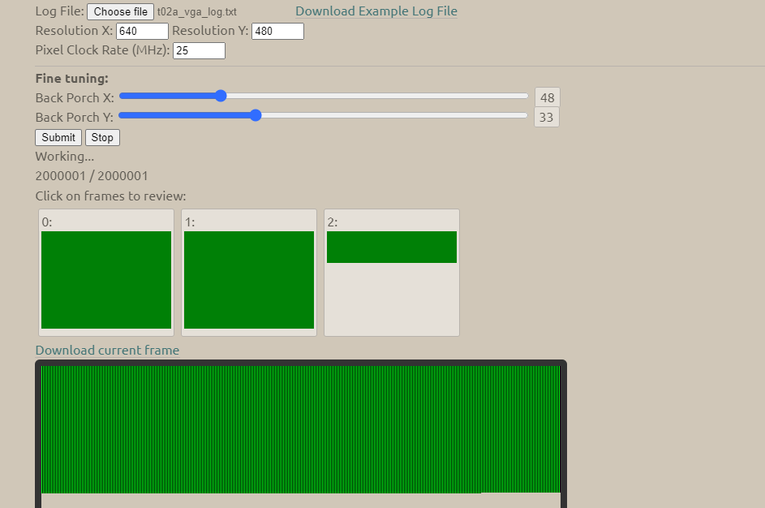
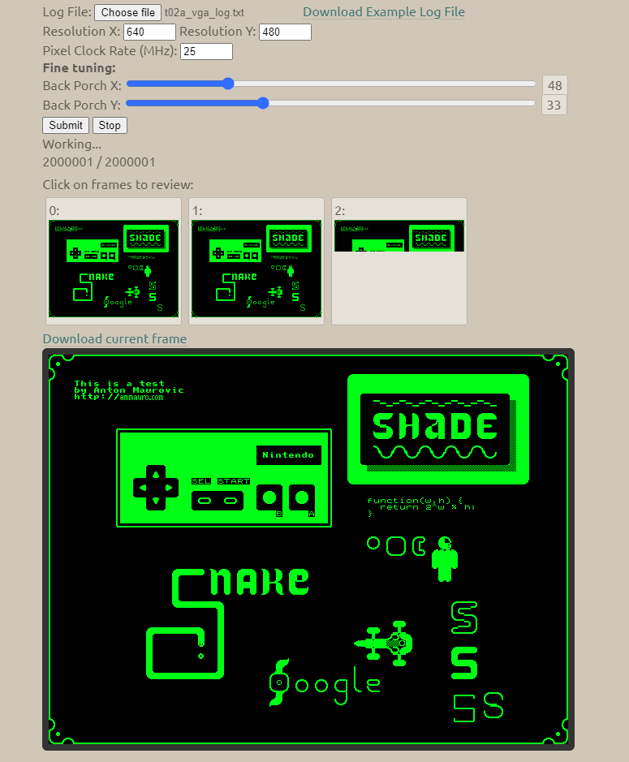

# 9 Aug 2020

## Verilator VGA signal generation

I've started adapting my code from [`XC9572XL/test09/t09d`](https://github.com/algofoogle/sandpit/tree/master/fpga/XC9572XL/test09/t09d) (VGA tile renderer) to work with Verilator, to see if I can make it output at least one frame of data to display in [Eric Eastwood's VGA Simulator](https://ericeastwood.com/lab/vga-simulator/). This is in [`t02a`](https://github.com/algofoogle/sandpit/tree/master/fpga/verilator/test02/t02a).

Requirements:
*   Probably simulate at least 2 full frames, since the first one might start with registers all over the place before it settles.
*   Generate an output text file that matches the requirements of the VGA Simulator. There is an [example `write_log.txt` file](https://ericeastwood.com/static/elab/vga_sim/write_log.txt) as well as ["Log file guidelines"](https://ericeastwood.com/lab/vga-simulator/#:~:text=Log%20file%20guidelines) explaining the format.
*   Simulate the ROM, optionally with latency.

Progress so far has the image generation working with `rom_data` just hard-wired to the value `0xAA`, and it's working:

I have since added very rough ROM simulation. It's pretty slow because I'm not buffering the file. It's also not very authentic because it's not: (a) paying attention to `OE` and `CE`; (b) not simulating a delay in the response time of the ROM.

It does give the [expected image](0049-2020-08-02.md), though:

Later I will try and use Gisselquist's own vgasim example.

I need to include `data` dir stuff (ROM generation) in the `Makefile`.

## Other notes

["Power-Up Characteristics" of the XC9500XL Data Sheet](https://www.xilinx.com/support/documentation/data_sheets/ds054.pdf#G1036999) explains that:
*   It's better to bring up `Vccint` (main supply) before `Vccio` to ensure that I/Os will start in 3-state mode with weak pull-up. Otherwise, `Vccio` coming up before or in sync with `Vccint` might lead to some I/Os briefly being asserted.
*   It evidently takes about 200&micro;S after power-up for the CPLD to be stable and ready for operation.
