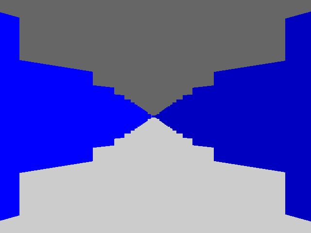
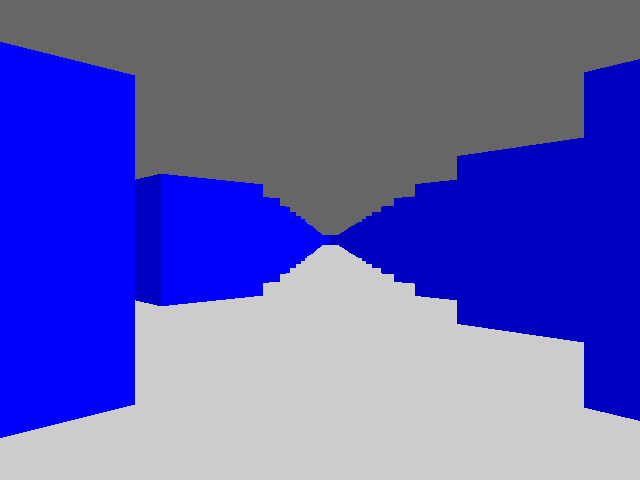
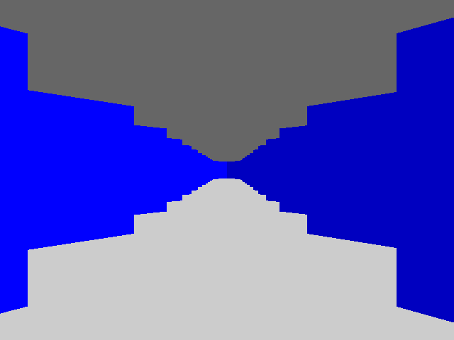

# 17 Apr 2023

# Raybox ideas

*   We're going to need a hardware multiplier, I think, but can we get away without a hardware divider?
*   How is raycasting done on very limited CPUs, e.g. 6502?
*   Precompute viewplane step size (inc. fixed-multiply by view vector) to avoid cameraX/w division.
*   Angular resolution: What's the minimum number of angles (or minimum rotation size) we need to support in order to get smooth movement?
*   Can we avoid rotation (and go with FULLY precomputed values) for camera in 1st iteration, and just prove strafing motion first, and rotation later?
*   I think I need to try and break this down into straightforward modules. Keep it neat, but don't optimise too early!

# Revised specs

*   We should be able to take up to a 50MHz clock. How can we use this to our advantage?
*   Use 6-bit RGB colour (i.e. 2 bits per channel). This gives 64 colours, and a fair bit of range. 
*   Don't worry about textures. Just use flat blue walls with 2 sides (light/dark).
*   I'd like to keep the two-tone grey ceiling and floor. I think these are important to the effect.
*   A 16x16 map is enough for a POC. It gives enough of a sense of space, and should be fast to search if we need to do a basic "test every gridline" approach. We could go for 1 bit per cell (256 bits total) but I'd like to aim to support 2 bits per cell, allowing for red, green, and blue wall variations, or (say) blue and yellow (or orange) with a sprite too (if we can store or procedurally render the image for a sprite).
*   Still try to target 640x480 resolution, needing 640x8 RAM (5120 bits). If we can't get that to run fast enough (or fit in ASIC area) we could go for 320x240, needing 320x7 RAM (2240 bits).

# Other notes

*   If we're rendering our view as full 480px height, then the ceiling (defined as `v<240`) ranges 0..239, and the floor is 240..479. Min wall height could be 0, in which case we render no pixels. A height of 1 means we render it when `239 <= v <= 240`, i.e. 2-pixel height. Realistically, all walls will be taller than this: Viewing from all the way across a 64-wide map still gives a wall height (or rather it should be called a half-height) of 3 pixels.
*   I've started reworking the base code structure.
*   I've made a separate `trace_buffer` module that represents storage of the wall heights and sides to render for each column. For now it just fakes being a memory by reading a pre-rendered set of data from `assets/traces_capture_0001.hex` (which was generated by [raybox-app](https://github.com/algofoogle/raybox-app)). Seems to work OK but has a predictable 1-clock delay because of its registered outputs.
*   Screenshots of [raybox-app](https://github.com/algofoogle/raybox-app) testing various view distances:
    *   

        Looking diagonally across a 64x64 map. Min half-height is 2px.
    *   

        Across 32x32 map, min half-height is 5px.
    *   

        Across 16x16 map, min half-height is 12px.
*   Synchronous single-port RAM in Verilog:
    *   https://www.asic-world.com/examples/verilog/ram_sp_sr_sw.html
    *   https://riptutorial.com/verilog/example/10519/single-port-synchronous-ram
    *   https://www.chipverify.com/verilog/verilog-single-port-ram
    *   Adapted from https://esrd2014.blogspot.com/p/synchronous-static-ram.html:
        ```verilog
        module syncRAM #(
            parameter ADR   = 8,
            parameter DAT   = 8,
            parameter DPTH  = 8
        )(
            input       [DAT-1:0]   dataIn,
            output reg  [DAT-1:0]   dataOut,
            input       [ADR-1:0]   Addr,
            input                   CS, WE, RD, Clk
        );

        //internal variables
        reg [DAT-1:0] SRAM [DPTH-1:0];

        always @ (posedge Clk)
        begin
         if (CS == 1'b1) begin
          if (WE == 1'b1 && RD == 1'b0) begin
           SRAM [Addr] = dataIn;
          end
          else if (RD == 1'b1 && WE == 1'b0) begin
           dataOut = SRAM [Addr]; 
          end
          else;
         end
         else;
        end
        endmodule
        ```
        ...why do some examples use `<=` and others just `=`?
