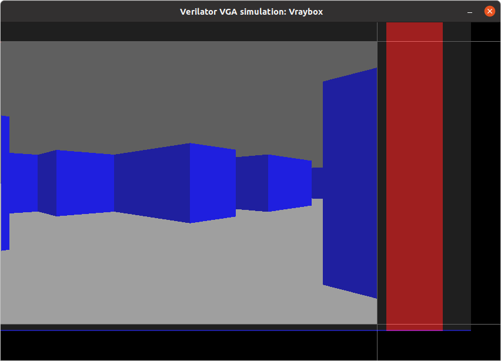

# 21 Apr 2023

# Raybox update

In [recent work](https://github.com/algofoogle/raybox/commit/138a6f11c9c9c25a5d4c855d1e9f2d345dadee60)
I've been able to **FAKE** this screenshot:

Raybox generates this by using a stubbed `trace_buffer` which just loads the column height (and side)
data from a `.hex` file. That file was earlier dumped from an actual render in `raybox-app`.

Since then, I've [implemented a stub/experiment for a `tracer`](https://github.com/algofoogle/raybox/blob/38413e06f912bd9d8e80d6df1d43a21b7139c326/src/rtl/tracer.v#L22), which so far just proves that it can do "work" during VBLANK, and do it with a variable
number of cycles, writing into the `tracer_buffer` ready for rendering the next frame.

So in that experiment, and the [overall version of the code it's in](https://github.com/algofoogle/raybox/commit/666a995d2f4ab6143b63650cc05ae4f63ae6cb07),
we have the following:

We can see a map overlay, rendering the contents of the
[map ROM](https://github.com/algofoogle/raybox/blob/38413e06f912bd9d8e80d6df1d43a21b7139c326/src/rtl/map_rom.v)
(loaded from [`map_16x16.hex`](https://github.com/algofoogle/raybox/blob/main/assets/map_16x16.hex)).

The scene itself is not yet using this `map_rom` data. The right-hand two-thirds of the screen show
the same pre-generated height data, but left-hand one third shows new height data that the `tracer`
experiment wrote into the `trace_buffer`. For each of 240 columns, it takes the fixed constant `240`
and divides it by the column number, and it does this by simply counting the number of divisor
subtractions that reduce the dividend (i.e. the 240), keeping whatever's left as the remainder.
If that remainder is 0 (i.e. the numbers evenly divide), the `side` value is 1 (i.e. bright blue),
otherwise it is 0 (dark blue).

This simply proves that the tracing can take a variable amount of time (even per column),
and it will write usable and consistent data into `trace_buffer`. So long as it completes
before the next frame starts, we should be good.

# Raybox next steps

*   Might need to consider making cocotb or Verilog TB tests for individual modules
*   Learn fixed point and implement/test
*   Implement reciprocal
*   Implement divider
*   Write the actual tracer
*   Come up with a better implementation for the trace buffer (big ring/shift memory or OpenRAM?)
*   Work out how to implement the map ROM. Internal *and* external options (controllable by GPIO)?
*   Implement input control

# Implementing the tracer

I'm going to try a top-down approach, and write the main code for the tracer first,
then try stubbing the modules that it needs (namely maths stuff), then finally try
implementing all those modules properly.

I might still need to get fixed point basics implemented first, because otherwise a lot
of these modules (even stubs) to be implemented won't be very helpful in the long run.

A proper optimised version of this will precalculate as much as possible, and use constants if we can.
For example, the rays-from-camera-horizon stuff could be worked out in advance.

# Other notes

*   Will we need to use [signed signals](https://projectf.io/posts/numbers-in-verilog/#signing-your-signals)
    when we work with fixed point, in our specific application? Maybe.
*   Interesting example of `always_comb` in "[Catching the Overflow](https://projectf.io/posts/numbers-in-verilog/#catching-the-overflow)".
    Note how there are two assignments to signal `z`, one inside an `if`. How does SystemVerilog decide which wins?
    Is it always the last, or the one that's most specific?
*   To what extent is it necessary to use actual fixed-point everywhere, given certain certain things like
    player position could be in whatever units we like, so long as we scale everything else appropriately
    throughout the map. For instance, if we assume each map cell can be painted with a 64x64 texture, then
    map cells could just be on every multiple of 64. We can then use fixed-point, when needed, for much more
    precise ray tracing and sub-pixel stuff (if that's even truly necessary).
