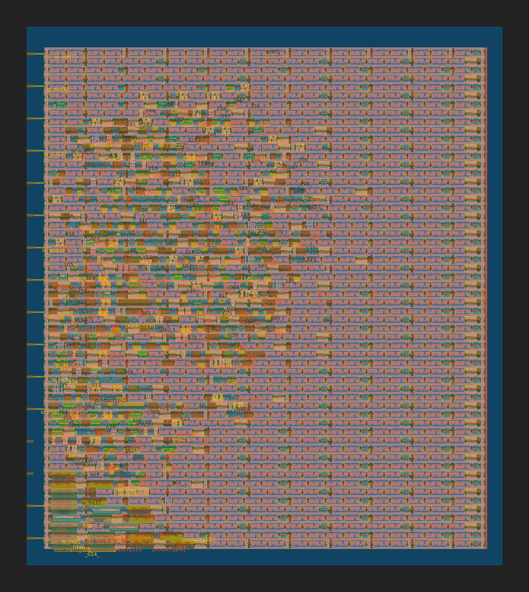
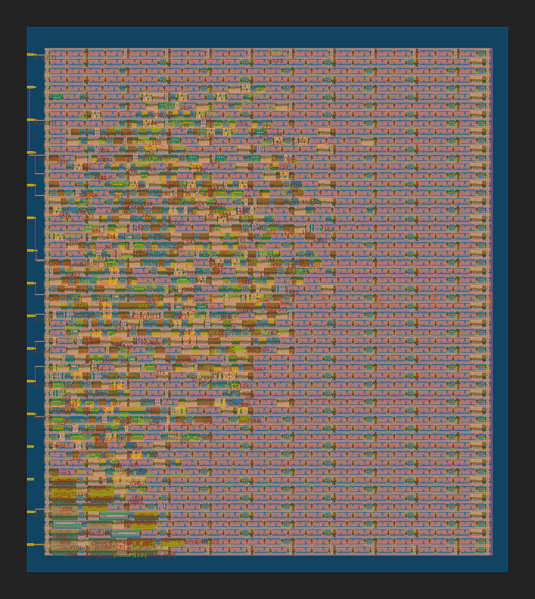

# 26 Apr 2023


# Anton's Tiny Tapeout 3 (TT03) submission

*   I successfully submitted a very simple design to Tiny Tapeout 3: [anton1-tt03](https://tinytapeout.com/runs/tt03/024/) (or [see it on GitHub](https://github.com/algofoogle/anton1-tt03))
*   GDS can be viewed in 3D here: https://algofoogle.github.io/anton1-tt03/
*   I managed to scrape in at the last minute; 3:30am my time, right on the deadline! Waiting for GitHub Action processing was nerve-wracking.
*   I paid to receive the chip on a board, and hopefully that will be somewhere in October 2023 or maybe November... assuming Efabless gets the chip completed by the estimated mid-August date (for the 2304C shuttle).
*   The design itself is not very interesting; I had very little time.
    *   I first tried an RLE encoder, but realised I needed to come up with a good spec for an RLE protocol that would not lead to a buffer overrun.
    *   I then tried a fixed-point reciprocal approximator, but after multiple attempts to cut it down I found that it was generating just too many cells to fit. Maybe it would work OK if in future I dropped it from Q6.10 to Q6.6 or something.
    *   Then I had a multiplier that takes two 16-bit inputs and gives a 32-bit product, but that was a bit too big.
    *   With very little time left I landed on a multiplier that takes two 8-bit inputs and gives a 16-bit product.
*   Since then, I've revised the design in another branch ([`config-width`](https://github.com/algofoogle/anton1-tt03/tree/config-width)) to support a configurable number of operand nibbles, and it fits given the range of 1..3, but not 4+.


# Raybox

*   NOTE: On the matter of reciprocals: for raydir reciprocals, we'll typically only be dealing with an input range of something like 0..1.414 (for 90deg FOV?). Hence we'd only need Q1.X on input, but maybe full precision on output.
*   Think more about Rational maths.


# Notes

*   [`tt-support-tools` repo](https://github.com/TinyTapeout/tt-support-tools) needs some better instructions. There's [requirements.txt](https://github.com/TinyTapeout/tt-support-tools/blob/tt03/requirements.txt) but check what the ['gds' GHA]() *actually* does and put instructions into the README.
*   Look at PDF builder and offer a better version. Still needs to use OS tools, maybe still pandoc. What about SVG support?
*   After trying to do GDS build locally, look at `.dot` graphs.
*   Do GL test with 3-nibble (24-bit product) GDS.
*   [`gds` workflow file (.github/workflows/gds.yaml)](https://github.com/algofoogle/anton1-tt03/actions/runs/4789489833/workflow) does the following:
    1.  Runs the [`gds` job](https://github.com/algofoogle/anton1-tt03/blob/0e29d619cdf7bd2d81de38bed9db1925f829e71b/.github/workflows/gds.yaml#L9) -- see [What does the `gds` job do?](#what-does-the-gds-job-do) for details.
    2.  Runs the [`gatelevel` sim job](https://github.com/algofoogle/anton1-tt03/blob/0e29d619cdf7bd2d81de38bed9db1925f829e71b/.github/workflows/gds.yaml#L98-L100)
    3.  Runs the [`viewer` job](https://github.com/algofoogle/anton1-tt03/blob/0e29d619cdf7bd2d81de38bed9db1925f829e71b/.github/workflows/gds.yaml#L159-L162) to build files for the 3D GDS viewer.
    4.  Runs the [`artifact` job](https://github.com/algofoogle/anton1-tt03/blob/0e29d619cdf7bd2d81de38bed9db1925f829e71b/.github/workflows/gds.yaml#L194-L197) which restores `src` and `runs` caches and uploads parts of them as artifacts (I think GitHub Action Artifacts?)
    5.  Runs the [`pages` job](https://github.com/algofoogle/anton1-tt03/blob/0e29d619cdf7bd2d81de38bed9db1925f829e71b/.github/workflows/gds.yaml#L225-L228)
    6.  Runs the [`preview` job](https://github.com/algofoogle/anton1-tt03/blob/0e29d619cdf7bd2d81de38bed9db1925f829e71b/.github/workflows/gds.yaml#L276-L279) to add the 3D and 2D preview to the page.

# Trying to run TT GDS builder for myself

1.  Go into MPW8 VM, then `cd ~/anton`
2.  Clone my repo: `git clone git@github.com:algofoogle/anton1-tt03` then `cd anton1-tt03`
3.  In it, then clone tt-support-tools: `git clone git@github.com:tinytapeout/tt-support-tools tt`
4.  We already have `$OPENLANE_ROOT`, `$PDK_ROOT` and `$PDK` defined.
5.  Make sure we also define these others (which don't seem to otherwise be defined by the MPW8 VM) -- Note that maybe we could use whatever our default is, instead?
    ```bash
    # This one might not be needed, but I'm setting it anyway:
    export OPENLANE_TAG=2023.02.14

    # Instead of this one, we could use the default...
    export OPENLANE_IMAGE_NAME=efabless/openlane:4cd0986b3ae550cdf7a6d0fba4e0657012f635d8-amd64
    # ...default is: efabless/openlane:cb59d1f84deb5cedbb5b0a3e3f3b4129a967c988-amd64
    ```
6.  `python3 --version` shows 3.8.10; not the same as the `3.10` required by the GHA workflow, but I'll live with what we've got for now.
7.  Install Python stuff needed by TT: `pip install -r tt/requirements.txt`
8.  `./tt/tt_tool.py --create-user-config`
    *   Outputs: `2023-04-26 06:08:07,817 - project    - INFO     - creating include file`
    *   Contents of `src/user_config.tcl`:
        ```tcl
        set ::env(DESIGN_NAME) algofoogle_product
        set ::env(VERILOG_FILES) "\
            $::env(DESIGN_DIR)/product.v"
        ```
9.  `./tt/tt_tool.py --harden`:
    1.  Pulls the specified container image.
    2.  **It fails to run**:
    ```
    OpenLane 4cd0986b3ae550cdf7a6d0fba4e0657012f635d8
    (with mounted scripts from cb59d1f84deb5cedbb5b0a3e3f3b4129a967c988)
    All rights reserved. (c) 2020-2022 Efabless Corporation and contributors.
    Available under the Apache License, version 2.0. See the LICENSE file for more details.

    [ERROR]: The version of netgen installed in the environment does not match the one required by the OpenLane flow scripts (installed: 28a29504390d53cd3748ff2636be112ef299da0b, expected: 2292ab813b54cc6d6fa41368c4e0e7492fb627c9)
    The version of klayout installed in the environment does not match the one required by the OpenLane flow scripts (installed: 44a2aa9ca17c2b1c154f9c410ded063de9ed3e12, expected: 428d0fe8c941faece4eceebc54170cc04d916c03)
    The version of openroad_app installed in the environment does not match the one required by the OpenLane flow scripts (installed: 1f720d3b442e2cd8dc6c5372535320b18a105e8d, expected: 7f00621cb612fd94e15b35790afe744c89d433a7)
    [ERROR]: Please update your environment. OpenLane will now quit.
    2023-04-26 06:10:28,954 - project    - ERROR    - harden failed
    ```
10. Let's try again, but this time using our existing (known good) OpenLane image:
    ```bash
    unset OPENLANE_TAG
    export OPENLANE_IMAGE_NAME=efabless/openlane:cb59d1f84deb5cedbb5b0a3e3f3b4129a967c988-amd64
    ./tt/tt_tool.py --harden
    ```
    ...which seems to run OK.
11. Results are in `runs/wokwi/`, with these warnings:
    ```
    [WARNING]: Current core area is too small for the power grid settings chosen. The power grid will be scaled down.
    [WARNING]: There are max fanout violations in the design at the typical corner. Please refer to '../work/runs/wokwi/reports/signoff/25-rcx_sta.slew.rpt'.
    ```
    ...the fanout is just an 11/10 on a clock buffer. Seems fine.
12. Summaries:
    *   `./tt/tt_tool.py --print-warnings`: No output
    *   `./tt/tt_tool.py --print-stats`: 18.35% utilisation (just for routing?) with wire length of 13563um.
    *   `./tt/tt_tool.py --print-cell-category`: Hard to read because it's a Markdown table with URLs, but it appears to be the same numbers as what the official build did in GHA.
    *   `./tt/tt_tool.py --create-png`

Resulting PNG, viewed with `xdg-open gds_render.png`:



Looks very similar to, but not exactly the same as, the version generated by GHA:




# What does the `gds` job do?

This is a description of what happens in the [`gds` job of the `gds.yaml` GitHub Action workflow](https://github.com/algofoogle/anton1-tt03/blob/0e29d619cdf7bd2d81de38bed9db1925f829e71b/.github/workflows/gds.yaml#L9).

1.  Sets OpenLane ENV:
    | var                     | value |
    |-------------------------|---|
    | `OPENLANE_TAG`          | `2023.02.14` |
    | `OPENLANE_IMAGE_NAME`   | `efabless/openlane:4cd0986b3ae550cdf7a6d0fba4e0657012f635d8-amd64` |
    | `OPENLANE_ROOT`         | `/home/runner/openlane` |
    | `PDK_ROOT`              | `/home/runner/pdk` |
    | `PDK`                   | `sky130A` |
2.  Clones the repo (ours, I guess) using `actions/checkout@v3` -- I assume this goes into a subdir with the same name as the repo? Or does it go into the current working dir?
3.  Clones the [tt-support-tools](https://github.com/TinyTapeout/tt-support-tools) repo to dir `tt`
4.  Installs python 3.10 and runs: `pip install -r tt/requirements.txt` -- See [requirements.txt](https://github.com/TinyTapeout/tt-support-tools/blob/tt03/requirements.txt)
5.  Runs `./tt/tt_tool.py --create-user-config` -- For Wokwi projects, it will grab that data too.
6.  Clones the OpenLane repo at the specified `OPENLANE_ROOT` path, then builds it with `make`
7.  **The crucial step:** Builds the GDS with `./tt/tt_tool.py --harden` -- See [here](https://github.com/TinyTapeout/tt-support-tools/blob/f25f3e511638abf5d9613ff211cb607db618bcc2/project.py#L173) for what this does.
    *   In particular, it runs the equivalent of:
        ```bash
        docker run                                  \
            --rm                                    \
            --volume $OPENLANE_ROOT:/openlane       \
            --volume $PDK_ROOT:$PDK_ROOT            \
            --volume $(pwd):/work                   \
            --env    PDK=$PDK                       \
            --env    PDK_ROOT=$PDK_ROOT             \
            --user   $(id -u $USER):$(id -g $USER)  \
            $OPENLANE_IMAGE_NAME                    \
            /bin/bash -c "./flow.tcl -overwrite -design /work/src -run_path /work/runs -tag wokwi"
        ```
    *   Compare this, below,with [What the MPW8 VM does to run the OpenLane docker](#what-the-mpw8-vm-does-to-run-the-openlane-docker).
    *   It doesn't look like there are any options that `tt_tool.py` supports to change where it expects the design source to come from, or where the run results will be recorded.
    *   So, the key command `./flow.tcl -overwrite -design /work/src -run_path /work/runs -tag wokwi` does this:
        *   Expects the design (and hence `config.tcl` or `config.json`) to be found in absolute path `/work/src`
            *   This `/work` path in the container is a Docker volume mapping to the current working directory, so **if we want to run this directly**, we must (I think) ensure the `tt-support-tools` repo is within our working TT03 submission repo, e.g. in `./tt`, and run it from within the base dir of our repo, hence `./tt/tt_tool.py` being the convention.
        *   Writes the run data into `/work/runs` which ends up being the `./runs/` subdirectory of the current working directory (i.e. in our repo base).
        *   Names the run `wokwi` instead of timestamp (I think).
        *   Overwrites any existing `wokwi` run.
8.  Shows resulting files: `find runs/wokwi/`
9.  Runs a bunch of other summaries:
    ```bash
    ./tt/tt_tool.py --print-warnings      >> $GITHUB_STEP_SUMMARY  # Yosys warnings
    ./tt/tt_tool.py --print-stats         >> $GITHUB_STEP_SUMMARY  # Routing stats
    ./tt/tt_tool.py --print-cell-category >> $GITHUB_STEP_SUMMARY  # Cell usage
    ```
10. "[Populates caches](https://github.com/algofoogle/anton1-tt03/blob/0e29d619cdf7bd2d81de38bed9db1925f829e71b/.github/workflows/gds.yaml#L70-L86)" -- Not sure what this does. Preserves data between jobs, maybe, or keeps it for final output?
11. Runs `./tt/tt_tool.py --create-png` to create a PNG of the GDS, then caches this too.


# What the MPW8 VM does to run the OpenLane docker

If you do `cd $OPENLANE_ROOT; make mount`, it does the equivalent of:

```bash
docker run \
    --rm                                                                       \
    --volume  /home/zerotoasic/asic_tools/openlane:/openlane                   \
    --volume  /home/zerotoasic/asic_tools/openlane/designs:/openlane/install   \
    --volume  /home/zerotoasic/asic_tools/pdk:/home/zerotoasic/asic_tools/pdk  \
    --volume  /tmp/.X11-unix:/tmp/.X11-unix                                    \
    --volume  /home/zerotoasic/.Xauthority:/.Xauthority                        \
    --env     PDK_ROOT=/home/zerotoasic/asic_tools/pdk                         \
    --env     PDK=sky130A                                                      \
    --env     DISPLAY=:0                                                       \
    --user    1000:1000                                                        \
    --network host                                                             \
    --tty                                                                      \
    --interactive                                                              \
    efabless/openlane:cb59d1f84deb5cedbb5b0a3e3f3b4129a967c988-amd64
```

