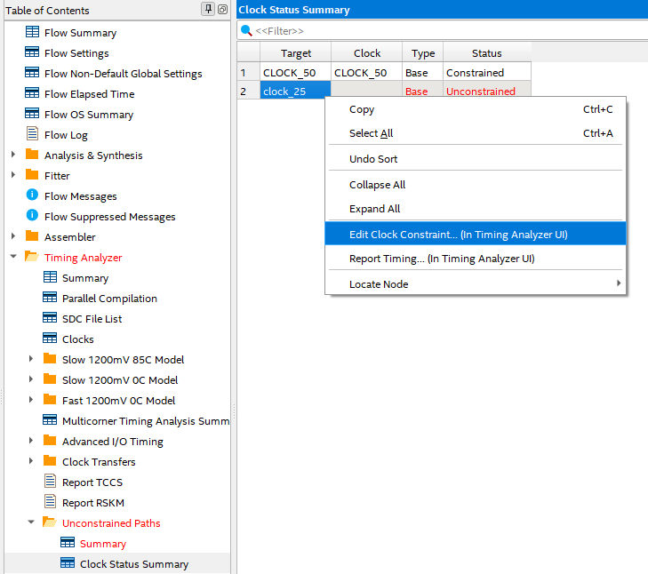
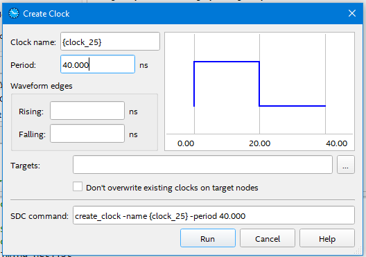
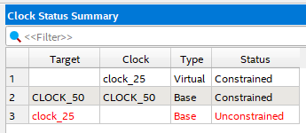

# 29 Apr 2023

| Previous journal: | Next journal: |
|-|-|
| [**0068**-2023-04-28.md](./0068-2023-04-28.md) | [**0070**-2023-04-30.md](./0070-2023-04-30.md) |


# Raybox

*   I got raybox to work on my DE0-Nano FPGA, and made some changes...
*   Changed the trace buffer to have sensible separate `height` RAM and `side` RAM.
*   Implemented motion control, with hard-coded constant speed.
*   I don't yet have a DAC for my VGA connector, so I'm using a pattern dither for anything
    less than full brightness (i.e. `11` on any channel).
*   Some columns are occasionally glitchy, individually being far too tall or short compared
    to their siblings.
*   Overall, the glitching could be either be due synthesis
    differences in Quartus, or even a timing (setup or hold violation?) problem?
*   `clock_25` is shown in red in Quartus as "Unconstrained". Could this be contributing to the glitches?
    See below re [defining this as a clock](#defining-a-new-clock-in-quartus).
*   I had to hack `lzc` and `reciprocal` because they sort of expect SystemVerilog, but
    the files are just `.v`, and Quartus doesn't like this. The hacks are not expected to
    change their function at all, but maybe there is a difference. I need to compare
    in the Verilator simulation.
*   Verilator
    [warned me about using `casez` instead of `casex`](https://verilator.org/warn/CASEX?v=4.227)
    for [`lzc`](https://github.com/algofoogle/raybox/blob/5306fea4a40909f324e145176dc12f572ad39a4a/src/rtl/lzc.v#L14), so I changed it.
*   I tried the code (which was updated for Quartus) in Verilator, and it runs the same as before
    with no glitching, so if not a Quartus synthesis difference, maybe it's a timing
    error. Perhaps the timing has something to do with the `trace_buffer` RAM? Not sure if
    the error comes from the tracer, or happens when writing to the buffer, or reading from the buffer.
*   Wow, simulation with Verilator is about **ten times faster** since I hacked `lzc` and `reciprocal`.
    On my laptop it goes from about 3FPS to 30FPS.
*   I see that glitching happens as a flicker and seems to be intermittent when standing still.
*   In the sim, I mapped the WASD keys to the motion inputs. I also made it so that the arrow keys
    will toggle a lock on movement directions, and the "Insert" key will toggle the map.
*   On tracing speed:
    *   I observed that at the normal pixel-clock speed, the tracer has exactly 36,000 clocks
        per frame (45 lines) in which to complete its tracing.
    *   I've not yet seen it go over about 10,000 clock cycles to complete tracing in my current
        16x16 map.
    *   Tracing cycles will increase with greater visual depth (i.e. larger maps, fewer walls in the
        space): Expected to be up to 3 times more for a mostly-empty 32x32 space.
    *   Cycles will also increase when the extra dead side areas of the screen are also rendered:
        Expected to add 25%.
    *   This COULD blow the budget, hitting maybe ~37,500 clocks.
    *   If that's expected to be a problem, we could chop a few extra lines from the bottom of
        the screen, adding that time to the tracer: a rendered screen height of 474 lines instead
        of the full 480 would give the tracer 6 more lines, or a total of 40,800 clocks.

# Notes

*   Try implementing dedicated inputs and outputs on the trace buffer memory, instead
    of a tri-state bus. See if that simplifies things, or fixes the FPGA glitching.
*   Try implementing the shift-register (ring memory?) trace buffer, to see if it makes things
    simpler or improves the glitching on the FPGA.
*   However: If we just keep it as a RAM, we could play with some tricks like transforming each
    X,Y pixel location (during beam racing) to do things like screen rotation: Either a full spin,
    or just a slight wobble.

# Defining a new clock in Quartus

After doing a full build, I was getting this warning:

```
Warning (332060): Node: clock_25 was determined to be a clock but was found without an associated clock assignment.
	Info (13166): Register raybox:raybox|tracer:tracer|trackYdist[14] is being clocked by clock_25
```

I went to the reports to locate what was highlighted in red. I found the offending `clock_25` and
right-clicked it, to choose "Edit Clock Constraint..."



I then defined its period as 40ns:



I then clicked "Run" which seems to run the TCL command shown in the bottom of the screenshot above.

When I went to close the Timing Analyzer, it warned that: `SDC commands made during the session are not automatically saved.  Do you want to write an SDC file now?`

I said "Yes", and then accepted the default, which created `raybox.out.sdc`.
The key information in it is:

```tcl
set_time_format -unit ns -decimal_places 3
create_clock -name {CLOCK_50} -period 20.000 -waveform { 0.000 10.000 } [get_ports {CLOCK_50}]
create_clock -name {clock_25} -period 40.000 -waveform { 0.000 20.000 } 
```

I transposed this into the existing `raybox.sdc`.

This wasn't enough to solve the problem, though. The same warning comes up, and now we see this:


