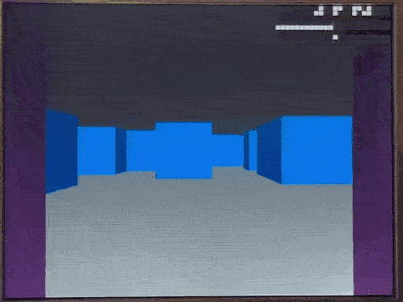

# 4 May 2023

# Raybox notes

## Accomplishments

*   Sim: Now renders `gOvers` guide as well as fixed-point equivalent direct from design.
*   I fixed the viewplane stepper, which means rotations (driven by sim at this stage) are now looking good.
    Instead of incrementing each column using a truncated value, it now increments using the full vplane vector, then
    truncates just when building the ray. This makes it far more accurate and stable, but also actually frees up a couple of regs.
*   I fixed the issue with the design not working on my FPGA. See "[Fixing Quartus FPGA build](#fixing-quartus-fpga-build)" below.



This crappy animated GIF doesn't do it justice. Running on the FPGA, it is super smooth and clean.

## Next

*   There's still occasionally a glitch (even with Q16.16) where I think rays that are very closely (or perfectly) aligned to
    axes (i.e. X or Y grid lines) lead to incorrect distance calculations; either single-column overflows or under-sized values.
*   Rework the FSM to give it more stages/time for combo calculations to settle,
    then more time to write/cascade, but also more opportunity to test
    (i.e. inspect registers or use on-chip LA).
    *   NOTE: Extra FSM stages could allow us to reuse a single reciprocal, instead of needing 3.
        Having 3 gives minimal performance gains because (I think) it is only used
        at the beginning and end of each ray, not at each step.
*   Work out what to do with branches: Ultimately try to go for a git-flow-style approach,
    so we can have known-good (`main`), in-progress (`develop`),
    experiments (features) and small improvements (hotfixes).
*   FPGA debugging of different modules, using OSD pixel display OR output signals, OR on-chip LA?


## Fixing Quartus FPGA build

*   Switched back to commit `9f90eaa` to see if it still works on the FPGA.
    *   Stats for building this in Quartus:
        *   Flow Summary:
            *   2633 LEs, 175 regs, 5760 memory bits, 44 multipliers.
        *   Timing:
            *   Slow 85C: Fmax 11.48 MHz; slack -47.075; TNS -321.031
            *   Slow 0C: Fmax 12.81 MHz; slack -38.076; TNS -145.929
            *   Fast: Slack -9.902; TNS -9.902
    *   **Yep, it seems to work fine.**
*   I then tried the next commit, `5d41dbd`:
    *   Stats:
        *   Flow Summary:
            *   2588 LEs, 175 regs, 5760 memory bits, 42 multipliers.
        *   Timing:
            *   Slow 85C: Fmax 12.12 MHz; slack -42.511; TNS -284.010
            *   slow 0C: Fmax 13.55 MHz; slack -33.777; TNS -113.518
            *   Fast: Slack -7.444; TNS -7.444
    *   **It shows very similar problems to much more recent builds.**
*   Comparing [changes between `9f90eaa` and `5d41dbd`](https://github.com/algofoogle/raybox/commit/5d41dbdbe08f9240dc3de1a6f7759fe515564add?diff=split):
    *   `lzc.v` goes from fixed `casez` to if-else-if chain and changes its default bit index range (from `[15:-16]` to `[WIDTH-1:0]`) and goes from 6-bit output to 7-bit output.
    *   `Qm` and `Qn` are repurposed (were unused in `9f90eaa`?); they go from 6 and 10 to 16 and 16.
    *   `fixed_point_params.v` is changed to be fully based on `Qm` and `Qn` instead of hardcoded numbers, but these **should** still be the same.
    *   `raybox.v`: `localparam`s adopt actual bit ranges (e.g. `` `F ``) instead of just `integer`, etc. These *shouldn't* be causing a problem because we've seen in much later versions that they appear to load OK into facing/vplane at reset.
    *   `reciprocal`: 1.466 and 1.0012 have been converted to calculated values.
        *   **It turns out these were causign the problem.**
*   So, in `reciprocal` was this line:
    ```verilog
    initial begin
        $display("reciprocal params re M.N = %0d.%0d:  n1466=%X, n10012=%X, nSat=%X", M, N, n1466, n10012, nSat);
    end
    ```
    ...which at compile-time revealed that `n1466` and `n10012` were not being calcualted properly (though `nSat` was):
    ```
    Info (10648): Verilog HDL Display System Task info at reciprocal.v(41): reciprocal params re M.N = 16.16:  n1466=00000000, n10012=00000000, nSat=7fffffff
    ```
*   It seems to me there is a bug with how Quartus evaluates some expressions using both powers and multiplication.
    I reported this bug: https://community.intel.com/t5/Intel-Quartus-Prime-Software/BUG-Verilog-1-0-2-0-N-const-expression-evaluates-to-0-if-N-is-a/td-p/1483047
*   I worked around these problems by changing some of the code a little bit, mostly using shifts and typecasts when I could,
    and `` `define ``s otherwise. This fixed it; there are still timing errors, but it seems to run fine on my FPGA now.


# Other notes

*   WARNING: Yosys doesn't support SystemVerilog without a commercial upgrade. Hence OpenLane doesn't support it.
*   What does "[onehot](https://stackoverflow.com/questions/42080391/one-hot-encoding-in-verilog)" mean in Verilog?
*   What is Quartus [Qsys](https://www.intel.com/content/www/us/en/support/programmable/support-resources/design-examples/quartus/qsys.html)? See screenshot [here](https://i.stack.imgur.com/I3Nv6.png) or [in context here](https://stackoverflow.com/questions/37726900/access-violation-while-compiling-synthesis-step-in-quartus-ii-with-qsys-system#:~:text=And%20here%20is%20a%20screenshot%20of%20the%20Qsys%20system).
*   SystemVerilog `$rose` vs. `$fell`, and [showing time](https://verificationacademy.com/forums/systemverilog/display-time-using-display-system-verilog/uvm).