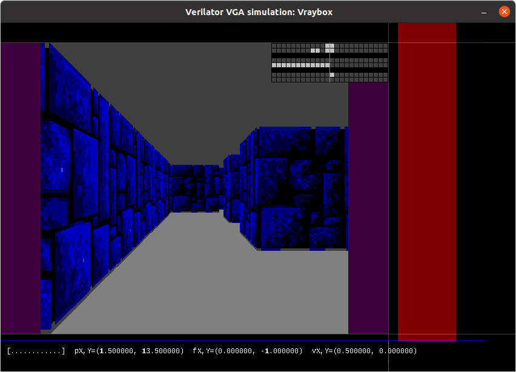
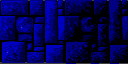

# 10 May 2023

| Previous journal: | Next journal: |
|-|-|
| [**0077**-2023-05-09.md](./0077-2023-05-09.md) | [**0079**-2023-05-12.md](./0079-2023-05-12.md) |

# Raybox

## Accomplishments

*   Textures work in sim, but need proper maths logic.
*   Textures can be loaded from PNG in sim.
    *   Source texture file is just one wall design (128x64, light and dark sides),
        ripped from Wolf3D for now, converted to 2 bits per channel (RGB222),
        but still saved as a 24-bit PNG:

        
    *   Texture gets loaded by the sim [directly injecting its RGB222 data into the design via Verilator](https://github.com/algofoogle/raybox/blob/6fa212bc6fa44e73facd38f9f0b3247929ef2235/sim/sim_main.cpp#L528-L529).

## What to do today?

*   Try storing trace distance in buffer instead of height.
*   `raybox` module should do reciprocal to get column height, and be reworked to avoid division.
*   Try for scaling up to 511 either side of mid-line (i.e. max full column height is 1022, or 2.13x VGA height).
*   See if we can store the basic wall texture as ROM, and get it running on the FPGA.

## If there's time...

*   Turn map into RAM, and make it load from binary logic on reset.
*   Increase RGB bit depth. 3-3-3 or 4-4-4 is good. 3-3-2 fits in an 8-bit-wide memory.
*   Add support for different wall types.
*   Design hardware to be made by JLC from LCSC parts.

## Next steps

*   Support for 128x128 textures might be in order when doing 640x480 resolution. There's a [thread about this](https://forum.zdoom.org/viewtopic.php?t=48769&start=90).
*   Need to work on fixing height calculation and support a height of at least 511 (9-bit, or 10 inc. sign).
*   Change logic to get rid of false divide in `raybox`.
*   Think about how to make RAM access fast enough.
    *   Back in the day, VGA RAM chip access speed was 200ns (5MHz), made faster by having 4 banks
        (i.e. 4 RAM chips in parallel) to speed access up to 20MHz, and this was sufficient to meet 320x200 needs.
    *   We want to go for at least 25MHz, but 90s RAM chips were probably a bit faster. Evidently it was common for
        a 486 mobo to have 15~20ns L2 cache SRAM chips. Theoretically that should be good to 50MHz, or at least
        25MHz?
    *   We could consider [L1](https://dosdays.co.uk/topics/cache.php#L1) cache too, of a small amount,
        directly on the ASIC.
    *   Just note that the system (pixel) clock of 25MHz could lead to the RAM not appearing to be fast enough.
        That could possibly be solved by registering, a faster internal clock for extra setup time, 
        or maybe 2 RAM banks.
    *   Non-obsolete SRAM you can buy now:
        *   [IS61C256AL-12JLI-TR 32xk8 12ns 5V](https://www.digikey.com.au/en/products/detail/issi-integrated-silicon-solution-inc/IS61C256AL-12JLI-TR/1557113)
        *   [IS61LV256AL-10TLI 32kx8 10ns 3.3V](https://www.digikey.com.au/en/products/detail/issi-integrated-silicon-solution-inc/IS61LV256AL-10TLI/1555410)
        *   [CY7C1010DV33-10VXIT 256kx8 10ns 3.3V](https://www.digikey.com.au/en/products/detail/infineon-technologies/CY7C1010DV33-10VXIT/1999598)
        *   [CY7C1329H-133AXC 64kx32 133MHz 3.3V](https://www.digikey.com.au/en/products/detail/infineon-technologies/CY7C1329H-133AXC/1839383)
        *   [IS61WV25616BLL-10TLI 256kx16 10ns 3.3V](https://www.lcsc.com/product-detail/span-style-background-color-ff0-SRAM-span_ISSI-Integrated-Silicon-Solution-IS61WV25616BLL-10TLI_C53825.html)
*   What memory requirements do we have?
    *   Other people's experiments have shown that up to 22KiB RAM should be theoretically possible to fit in Caravel.
    *   Compare this with Zero to ASIC MPWs, where about 1KiB of OpenRAM takes up a fairly small area; that tracks to at least 20KiB too.
    *   If we devote half of the Caravel area to Raybox, that leaves maybe in the order of 8~10KiB of usable area for RAM.
    *   Trace buffer:
        *   Need to store trace visual distance, which for a 64x64 map I'd estimate would range from 1/512 (2^-9) to about
            64*sqrt(2), i.e. 91 (always positive) so if we assume it needs up to 9 fractional bits, and up to 7 integer bits,
            then it's a 16-bit fixed-point number (without sign). Note that 0 would mean an error.
            This is **double** what we're currently storing.
            *   Given the logarithmic nature of the distance (i.e. things that are close need lots of precision,
                while distant things do not because the wall heights and hence textures basically all flatten out)
                we could get away with maybe using some floating-point-like value. For instance, we know the
                column height range is 1..511, but the closer we are to 1, the exponentially bigger our
                distance value is getting.
        *   Side is 1 bit.
        *   Texture column number is either 6 or 7 bits, depending on whether we want a 64x64 or 128x128 texture.
            Latter would be better for 640x480 VGA.
        *   Wall texture ID should be at least 4-bit (16 different wall textures).
        *   Add this all up and we get: 16+1+7+4 = 28 bits per trace.
        *   Multiply by 640 and that's 17,920 bits (approx. 2.3KiB).
        *   NOTE: If it's more efficient, inc. for something like OpenRAM, this could be implemented as a FIFO/ring/shift memory
            instead of RAM.
    *   Map data:
        *   Bare minimum is 16x16 and 1-bit: 256-bit.
        *   Ideal is 64x64 with at least 5 bits per cell (16 possible walls, 15 possible items, plus "empty").
            That's 20,480 bits (approx. 2.6KiB).
    *   Wall textures:
        *   RGB:
            *   Minimum of 6 bits per pixel (RGB222).
            *   Minimum of two 64x64 wall textures: 128x64x6 = 49,152 bits = 6.2KiB. **This pretty much takes up all available RAM space.**
            *   As a ROM, it could be smaller.
        *   Indexed palette:
            *   Minimum of 3 bits per pixel (8-colour, with a palette).
            *   1 palette would be 8x6(222) or even 8x9(333) bits: 48 or 72 bits.
            *   NOTE: We could get good mileage from 8 colours by letting each wall define its own palette (up to 72 bits etra per wall), or by letting it choose from
                one of 
            *   128x64x3 = 3.1KiB.
            *   NOTE: We could just "dim" dark side walls at RGB output, meaning we'd end up with 2 different wall textures.
            *   NOTE: A well-chosen palette of 16 colours works pretty well for blue and grey stone walls, with some red and gold too.
    *   Sprites:
        *   ??
*   NOTE: Trace buffer COULD be an external (Q)SPI RAM, except that it needs to be able to READ very fast. Four chips in quad mode MIGHT be enough...?

## Notes

*   When doing tracing, see if it's possible to also keep track of the coincident ray-hit
    X or Y position, so we can use it to get the wallX position without needing an extra
    multiply.
*   [Read about OpenRAM on Hackaday](https://hackaday.com/2023/04/05/opening-up-asic-design/).
*   https://www.glensstuff.com/vgavideocards/vgavideocards.htm
*   Rendering lines shouldn't be too hard when using fixed point.
