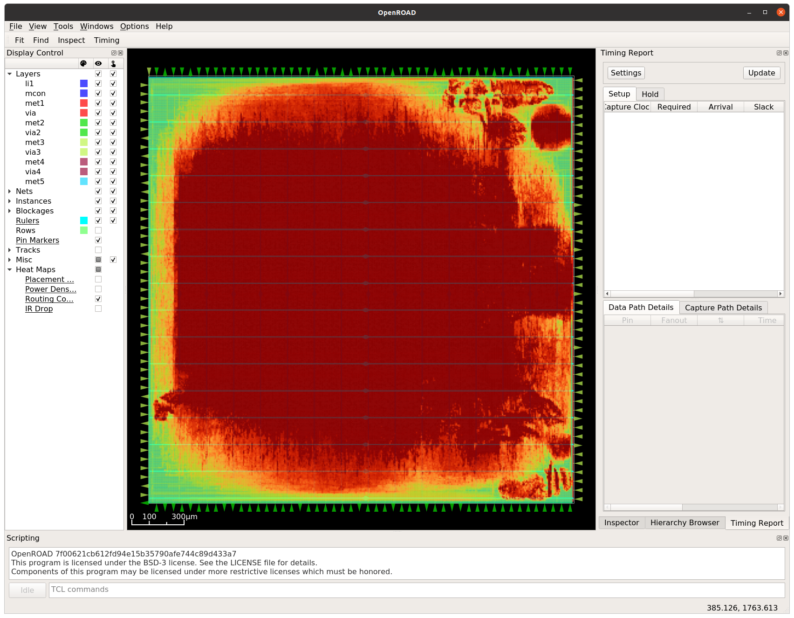

# 23 May 2023

# Raybox

## Achievements

*   Just tidied up to support different config for multiple targets (now `openlane` as well as the original `de0-nano` and `sim`).
    A `raybox_target_defs.v` file for each target is the key.
*   Made a first (unsuccessful) attempt at hardening with OpenLane.


## OpenLane

I'm making a first naive attempt to see if OpenLane can synthesise my design (so far, from the `sprites` branch).

I've not attempted to optimise much yet, and this synthesis will probably include embedding the ROM data
(map, wall textures, and sprite) which is surely not optimal...? It also has way too many IOs in the top
design (~200).

I tried running like this:
1.  Clone repo into `$OPENLANE_ROOT/designs/raybox`
2.  Created simple `config.json`:
    ```json
    {
        "DESIGN_NAME": "raybox",
        "VERILOG_FILES": "dir::src/rtl/*.v",
        "CLOCK_PORT": "clk",
        "CLOCK_NET": "clk",
        "DESIGN_IS_CORE": true,
        "pdk::sky130*": {
            "SYNTH_MAX_FANOUT": 8,
            "FP_CORE_UTIL": 20,
            "PL_TARGET_DENSITY": 0.25,
            "CLOCK_PERIOD": 40.0
        }
    }
    ```
3.  Started OpenLane container: `cd $OPENLANE_ROOT && make mount`
4.  Tried doing the build: `time ./flow.tcl -design raybox -verbose 1`
    *   Failed with this predictable error:
        ```
        /openlane/designs/raybox/src/rtl/texture_rom.v:0: ERROR: Can not open file `../assets/texture-xrgb-2222.hex` for \$readmemh.
        ```
5.  I reworked the Verilog project structure just a little bit to have a `raybox_target_defs.v` file per each target
    (`de0-nano`, `sim`, and now also `openlane`), which has little extra `` `define ``s to sort out things like paths
    and Verilog features that are not consistent between targets. Actually selecting the right file involves:
    *   In Quartus: Adding the file to the project as an Include file and assuming the HEX files are relative to the project itself
        (i.e. `../assets/...`).
    *   For Verilator (sim): Adding its `raybox_target_defs.v` file to the `Makefile` as an input for `verilator` and also adding
        a `-I` include path. It then refers to the HEX files as relative to the root dir (i.e. `assets/...`).
    *   For OpenLane: Adding `raybox_target_defs.v` to `config.json:VERILOG_FILES` but also adding the `openlane` dir to
        `config.json:VERILOG_INCLUDE_DIRS`. The HEX files are then relative to `src/rtl` (i.e. `../../assets/...`).
6.  I had to mask out references to `$error `in `lzc_b` for OpenLane (actually for Yosys, I guess), and then I got further
    with the build... after ~3 hours (on my desktop PC) it failed on step 12 due to routing congestion:
    ```
    [STEP 12]
    [INFO]: Running Global Routing Resizer Timing Optimizations (log: designs/raybox/runs/RUN_2023.05.23_08.23.22/logs/routing/12-resizer.log)...
    [INFO]: Executing openroad with Tcl script 'scripts/openroad/resizer_routing_timing.tcl'...
    [ERROR]: during executing openroad script /openlane/scripts/openroad/resizer_routing_timing.tcl
    [ERROR]: Log: designs/raybox/runs/RUN_2023.05.23_08.23.22/logs/routing/12-resizer.log
    [ERROR]: Last 10 lines:
    [INFO GRT-0101] Running extra iterations to remove overflow.
    [INFO GRT-0103] Extra Run for hard benchmark.
    [INFO GRT-0197] Via related to pin nodes: 586103
    [INFO GRT-0198] Via related Steiner nodes: 33427
    [INFO GRT-0199] Via filling finished.
    [INFO GRT-0111] Final number of vias: 1108957
    [INFO GRT-0112] Final usage 3D: 6376032
    [ERROR GRT-0118] Routing congestion too high. Check the congestion heatmap in the GUI.
    Error: resizer_routing_timing.tcl, 39 GRT-0118
    child process exited abnormally
    ```
7.  NOTE: Initial floor planning came up with a core area of `width 2414.54 and height 2412.64` which, if we assume is
    micrometers, is still smaller than the
    [available 2920&micro;m &times; 3520&micro;m](https://caravel-harness.readthedocs.io/en/latest/getting-started.html#user-project-area)
    so maybe we could explicitly set a larger core area (maybe something like 2700x3200, still leaving enough for pad routing)
    or just set a lower density target (to spread itself out). We should also reduce the number of IOs the top `raybox` design
    needs because it needs to be much closer to ~30 instead of what is currently ~200.

I've now made these changes to the OpenLane config:

```json
"FP_SIZING": "absolute",
"DIE_AREA": "0 0 2700 3200",
"PL_TARGET_DENSITY": 0.17,
```

...i.e. not using `FP_CORE_UTIL` but rather specifying a larger die area directly, and then lowering the placement target
density a little. I've got this running on my faster PC, and I've given the VM ~23GB RAM instead of 16, to see if this helps.

Meanwhile, I'm going to try inspecting my above failed run with the OpenROAD GUI as follows:
1.  Follow Matt's advice to alter the OpenLane docker Makefile...
    1.  `cd $OPENLANE_ROOT`
    2.  Edit `Makefile`
    3.  Add this line below the existing `DOCKER_OPTIONS` line:
        ```
        DOCKER_OPTIONS += --privileged
        ```
2.  Run `make mount`
3.  Find the failed OpenLane run (in `designs/raybox/runs`)
4.  Run:
    ```bash
    ./flow.tcl -design raybox -tag RUN_2023.05.23_08.23.22 -gui
    ```

Turn on the "Heatmap" option you're interested in at the bottom of the left-hand list:




## Thoughts

*   Screen tint (red, yellow) like Wolf3D does.
*   Can we use the Caravel Management SoC as our game controller default, but with optional override
    from an external controller too?
*   We could substantially reduce number of column traces required by finding the ANGLE of the trace to the wall
    (which should be very easy) at each hit, and use that to work out the shape of the top/bottom and then from
    there have a precalculated set of texture scalers? This is sort of how the
    [Sega Master System Wolf3D](https://under4mhz.itch.io/wolfenstein-maze-3d) concept works, I assume.
    *   Wall corners and texture changes would need finer-grained traces, but that's not too bad. Is it easy to
        detect?
*   How might a 50MHz base clock help us, instead of 25MHz? That's a 20ns period, which is close to the intended
    RAM speed limit (unless we use
    [10ns RAM](https://www.digikey.com.au/en/products/detail/issi-integrated-silicon-solution-inc/IS61LV5128AL-10TLI/1555411)).
*   Need to define what will be required to formalise this into a Caravel submission. Some items include:
    *   Documentation
    *   Slotting it into Caravel's `src/rtl`
    *   Writing some tests
    *   Experiment with sby
    *   Timing constraints?
    *   Get it ready to work with real-world interfaces inc. async reads/writes,
        and doing so via registres rather than a huge bus, i.e. tune it to use only ~30 GPIOs!
    *   Design memory interface instead of texture_rom, etc.
    *   Create proper TB for external stuff.
    *   OpenRAM or other memory layout
    *   Think about debugging, esp. use of WB and LA.
    *   Will it become necessary to make it so certain modules can be isolated and tested?
    *   Get rid of debug overlay logic, or just make it conditional
    *   License/SPDX stuff, and get rid of copyrighted images
