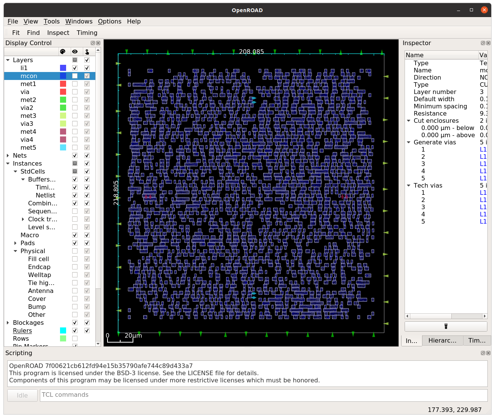

# 27 May 2023

| Previous journal: | Next journal: |
|-|-|
| [**0086**-2023-05-26.md](./0086-2023-05-26.md) | [**0088**-2023-05-28.md](./0088-2023-05-28.md) |


*   I created the [raybox_reciprocal repo](https://github.com/algofoogle/raybox_reciprocal)
    to try and optimise the reciprocal approximator in isolation. 
*   I've worked out that the `reciprocal` design (including `lzc`) can fit in 200x200&micro;m
    as-is. I'm trying to optimise this as much as possible before I start trying to see if I
    can share it by reworking the Raybox design so it doesn't need so many parallel instances.
*   Currently, the max. speed it can run at is about 40MHz (25ns propagation delay).
    This might be too close for comfort **but note** that we can tolerate waiting for it when
    it is in the tracer... just not so much when used realtime for column/sprite rendering.
    In that case, if we really can't make it fast enough, we could try just calculating the
    reciprocal in the tracer and storing it in a bigger buffer (which might end up taking up
    less area).
*   One area we might be able to optimise is `lzc`. I think the usual approach here is to have
    each bit of the LZC result calculated by testing a group of bits.
*   I think the rest of the delay comes from multipliers and what I've observed to be a pretty
    long chain when looking at the `.dot` file out of Yosys.
*   Depending on how big it ends up being, and how deep, should we try sky130 HS cells?
    Might be worth it to meet timing requirements.
*   NOTE: Some reciprocals are known to only need to work with inputs that are *typically*
    &le; 1.0, e.g. `1/rayDir`.
*   Can some reciprocals work fine with Q6.10, or even have Q6.10 input and Q10.6 output?
*   How much silicon space will we save by making memories (except trace buffer) external?
    I don't think we can make the trace buffer external because it would need to be separate
    from texture/sprite memory, and hence would require too many IOs.
*   Per [this](https://cornell-c2s2.github.io/ece5745_sec7/#switching-over-to-openlane):
    >   Unfortunately, the OpenLANE tools are currently configured to only accept **Verilog-2005**,
    >   not SystemVerilog. For this, we can use an open-source tool called
    >   [`sv2v`](https://github.com/zachjs/sv2v) to modify our code from SystemVerilog to Verilog.
    >
    >   ```
    >   % mv Counter.v Counter.sv
    >   % sv2v -w adjacent Counter.sv
    >   % rm Counter.sv
    >   % less Counter.v
    >   ```
*   Do we need to worry about [`USE_POWER_PINS`](https://cornell-c2s2.github.io/ece5745_sec7/#switching-over-to-openlane:~:text=another%20change%20we%20have%20to%20make%20to%20our%20Verilog%20file%20is%20to%20explicitly%20tell%20the%20OpenLANE%20scripts%20what%20type%20of%20power%20we%20want%20routed%20to%20the%20cells%20in%20our%20design)?
*   OpenLane start-up re sky130 HD cells:
    ```
    [INFO]: PDK Root: /home/zerotoasic/asic_tools/pdk
    [INFO]: Process Design Kit: sky130A
    [INFO]: Setting PDKPATH to /home/zerotoasic/asic_tools/pdk/sky130A
    [INFO]: Standard Cell Library: sky130_fd_sc_hd
    [INFO]: Optimization Standard Cell Library: sky130_fd_sc_hd
    ```


# Plan for next steps

*   Write verification for `raybox_reciprocal`? Implement its own fixed-point algorithm in cocotb, and then
    also write a verification that compares it to actual reciprocal and verifies it is within a given tolerance.
*   Then try to share one instance in Raybox:
    *   2 for rayDir (only needed during trace setup for each column in tracer).
    *   2 for sprites (only needed once per each sprite in tracer).
    *   1 for wall height scaler (needed constantly when out of VBLANK/tracing).
    *   Sprite height scaler?? Need to work out when this is needed if we have more than 1 sprite.
        Probably per each sprite, but maybe this can be done during VBLANK and stored.
*   Should we use:
    ```json
    "CLOCK_TREE_SYNTH": false,
    "CLOCK_PORT": null,
    ```
*   Also look into:
    *   GRT_ALLOW_CONGESTION
    *   GRT_OVERFLOW_ITERS


# Creating `raybox_reciprocal`

*   Extracted `reciprocal` and `lzc_b` modules.
*   Added as an OpenLane design:
    ```bash
    cd $OPENLANE_ROOT
    pushd designs
    git clone git@github.com:algofoogle/raybox_reciprocal
    popd
    make mount
    ./flow.tcl -design raybox_reciprocal -init_design_config -add_to_designs
    ```
*   This created the `config.json` file which I only changed to specify that source files are
    in `src/rtl/`:
    ```json
    {
        "DESIGN_NAME": "reciprocal",
        "VERILOG_FILES": "dir::src/rtl/*.v",
        "CLOCK_PORT": "clk",
        "CLOCK_PERIOD": 10.0,
        "DESIGN_IS_CORE": true
    }

    ```
*   Tried hardening: `time ./flow.tcl -design raybox_reciprocal -verbose 1`
*   NOTE: `logs/synthesis/1-synthesis.log` has some interesting info in it like:
    ```
    1. Executing Verilog-2005 frontend: /openlane/designs/raybox_reciprocal/src/rtl/reciprocal.v
    Parsing SystemVerilog input from `/openlane/designs/raybox_reciprocal/src/rtl/reciprocal.v' to AST representation.
    Generating RTLIL representation for module `\reciprocal'.
    /openlane/designs/raybox_reciprocal/src/rtl/reciprocal.v:29: Warning: converting real value 6.004236e+03 to binary 24'000000000001011101110100.
    /openlane/designs/raybox_reciprocal/src/rtl/reciprocal.v:35: Warning: converting real value 4.100415e+03 to binary 24'000000000001000000000100.
    reciprocal params for Q12.12:  n1466=001774, n10012=001004, nSat=7FFFFF
    Successfully finished Verilog frontend.
    ```
*   Oops, got the OpenLane LVS error about unmatched pins at step 33, because I'm using negative bit vector indices
    on the inputs and outputs.
*   NOTE: `summary.py --design raybox_reciprocal --run --full-summary` still works and tells us:
    ```
                  DIEAREA_mm^2 :  0.04553003842500001
                    cell_count :                 1971
                 cells_pre_abc :                 7875
          Total_Physical_Cells :                  699
        suggested_clock_period :                23.89
     suggested_clock_frequency :    41.85851820845542
                  CLOCK_PERIOD :                 10.0
              SYNTH_MAX_FANOUT :                   10
                  FP_CORE_UTIL :                   50
             PL_TARGET_DENSITY :                 0.55
    ```
    In summary:
    *   45,530squm (approx. 214x214&micro;m, actually closer to 208x219&micro;m).
    *   Propagation delay would allow up to about 42MHz operation.
    *   It took about 7mins on my desktop PC.
*   Running `./flow.tcl -design raybox_reciprocal -tag RUN_2023.05.27_05.50.03 -gui`:

    Routing congestion:
    

    Standard cells:
    
*   I managed to get it down to 200x200&micro;m 40,000squm with:
    ```json
    {
        "DESIGN_NAME": "reciprocal",
        "VERILOG_FILES": "dir::src/rtl/*.v",
        "CLOCK_PORT": "clk",
        "CLOCK_PERIOD": 10.0,
        "DESIGN_IS_CORE": true,
        "FP_SIZING": "absolute",
        "DIE_AREA": "0 0 200 200",
        "PL_TARGET_DENSITY": 0.65,
        "GRT_OVERFLOW_ITERS": 100
    }
    ```
*   I also created a separate top module called `reciprocal_12_12` so I can avoid the negative vector bit indices,
    which allows the process to complete. Mind you, it does lead to slightly different timing for some reason...
    while previous attempts got to 41.98MHz, with this new top it gets to 40.37MHz. Maybe the pins ended up with
    different placement?
*   Lower speed of course means we have timing violations (setup violations in this case), with most paths showing
    worst slack of -14.7ns (i.e. 10ns - -14.7ns = 24.7ns, which is the recommended clock period we're getting
    for ~40MHz).
*   Routing congestion:
    

    Standard cells:
    
*   I added this config: `"FP_PIN_ORDER_CFG": "dir::pin_order.cfg"` and this is the contents of `pin_order.cfg`:
    ```
    #N
    i_.*

    #S
    o_.*

    ```
*   That gives about the same max speed (40.78MHz), but with inputs neatly and sequentially at the top,
    and outputs likewise at the bottom...

    Routing congestion:
    

    Standard cells:
    
