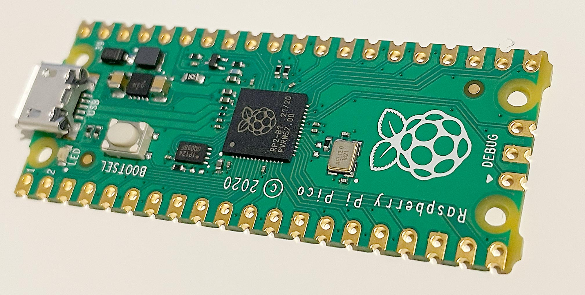

# 8 Jun 2023

*   STM32 emulators:
    *   https://github.com/nviennot/stm32-emulator
    *   https://www.youtube.com/watch?v=h_Ptwczj-oY
    *   stm32 IDE can do it?
    *   Wokwi, but maybe not all that complete?? UART doesn't seem to engage Serial Monitor?
*   STM32 USB:
    *   [STMicro appnote on USB](https://www.st.com/resource/en/application_note/an4879-introduction-to-usb-hardware-and-pcb-guidelines-using-stm32-mcus-stmicroelectronics.pdf)
    *   [Other STMicro in-depth USB stuff](https://wiki.st.com/stm32mcu/wiki/Introduction_to_USB_with_STM32)
*   Maybe Raspberry Pi Pico (RP2040) is the way to go:
    *   I have 2 of them already. I ordered them from Element14.com in July 2022, for AU$5.80ea,
        Specifically I got the [standard Raspberry Pi Pico](https://au.element14.com/raspberry-pi/raspberry-pi-pico/raspberry-pi-32bit-arm-cortex/dp/3643332), now closer to AU$6.65.
    *   Element14 also stock the [Pico W](https://au.element14.com/raspberry-pi/raspberry-pi-pico-w/raspberry-pi-board-arm-cortex/dp/3996082?MER=TARG-MER-PLP-RECO-STM71233-1) for $11.06.
    *   DigiKey stocks the [Pico W for $9.36](https://www.digikey.com.au/en/products/detail/raspberry-pi/SC0918/16608263?s=N4IgTCBcDaIE4EMDOAHARgUznAngAhQEsDCBjAezwHcQBdAXyA) but I'm having trouble telling if that's
        inc. or ex. GST.
    *   [Pico H at DigiKey](https://www.digikey.com.au/en/products/detail/raspberry-pi/SC0917/16608257): AU$7.80
    *   They seem to have (or support) a bootloader that allows for drag-drop firmware over USB?
    *   When using Arduino framework, `Serial` defaults to using USB-CDC.
    *   **NOTE:** Unlike STM32, they do **not** have 5V-tolerant pins. Not necessarily an issue
        except unless we wanted to connect with PS/2 keyboard/mouse.
    *   Can RP2040 be an OTG host for USB keyboard/mouse??
    *   [Wokwi can simulate](https://wokwi.com/projects/366926468219352065), inc. USB-CDC `Serial` out:
        *   Good for development!
        *   Not sure if the speed is real, though, because it makes no difference if I set it to 100 or 100,000,000.
*   NOTE: RP2040/Pi-Pico might be a good choice not only for FPGA/silicon debugging, but even actually just
    as a model driver/game for Raybox.


# Notes

*   What are all the different ARM Cortex-M# levels??
*   Look into different machine pin headers inc. male-to-male -- expensive from official suppliers!
*   How well can machine pin FEMALE headers be used like a breadboard, inc. proper mating for passives, dupont wires, and headers?
*   Are there also other types of thin pins or better receptacles? Could even just use a 40-pin ZIF, and that could even
    be socketed for reuse?
*   When designing DE0-Nano "wing", have an option to run both to an inline butterfly, but also with snap-off
    breadboard straddles (both DIP-centre-line, and outer edges?)
*   This [tall 40-way 0.1″ header pin row](https://www.digikey.com.au/en/products/detail/sullins-connector-solutions/PRPC040SACN-RC/2776066?utm_adgroup=&utm_source=google&utm_medium=cpc&utm_campaign=PMax%20Shopping_Products&utm_term=&utm_id=go_cmp-20001736977_adg-_ad-__dev-c_ext-_prd-2776066_sig-CjwKCAjw1YCkBhAOEiwA5aN4AcWMAhzFFJU2HChTTRSf0iAb4rV1VeZCDLiUPkIpPb_c0-9vGqD3ghoCTLMQAvD_BwE&productid=2776066&gad=1&gclid=CjwKCAjw1YCkBhAOEiwA5aN4AcWMAhzFFJU2HChTTRSf0iAb4rV1VeZCDLiUPkIpPb_c0-9vGqD3ghoCTLMQAvD_BwE) could be handy.
*   Lots of [other header types](https://www.sparkfun.com/categories/381).


# Raspberry Pi Pico Getting Started (with Arduino libs support)

<details>
<summary><a href="https://en.wikipedia.org/wiki/RP2040">RP2040</a> specs (<strong>click here to open</strong>)</summary>

*   264kB RAM
*   2MB flash -- actually I think this is not part of the chip, but included on the Pi Pico board:
    >   No internal flash or EEPROM memory (after reset, the boot-loader loads firmware from either external flash memory or USB bus into internal SRAM)
    ...so does this mean there is a mask-ROM bootloader that enables external (SPI) flash and/or USB reading??
*   133MHz 32-bit dual-core ARM Cortex-M0+; overclocking to 400MHz may be possible?
*   QSPI bus controller
*   DMA controller
*   2 PLLs for USB and core clocks
*   30 GPIOs, inc. 4 supporting analog inputs
*   2 UARTs
*   2 I2C
*   2 SPI
*   16 PWM
*   USB 1.1 controller and PHY **with host and device support**??
*   8 [PIO](https://en.wikipedia.org/wiki/Programmed_input%E2%80%93output) state machines
*   Debug port
</details>

<details>
<summary>Other notes (<strong>click here to open</strong>)</summary>

Pi Pico Announcement: https://www.raspberrypi.com/news/raspberry-pi-pico-w-your-6-iot-platform/

Ref: https://thepihut.com/blogs/raspberry-pi-tutorials/raspberry-pi-pico-getting-started-guide

Pinout: [detail](https://cdn.shopify.com/s/files/1/0176/3274/files/Pico-R3-A4-Pinout_f22e6644-b3e4-4997-a192-961c55fc8cae.pdf?v=1664490511) and [summary](https://thepihut.com/blogs/raspberry-pi-tutorials/raspberry-pi-pico-getting-started-guide#:~:text=Raspberry%20Pi%20Pico%20GPIO%20Pins)

Misc:
*   What is the max sink/source of GPIOs?
*   What is the GPIO speed (but probably doesn't matter much)?
*   We could just use MicroPython?
*   [UF2 files](https://learn.sparkfun.com/tutorials/rp2040-thing-plus-hookup-guide/uf2-bootloader) are
    apparently firmware that can be flashed over USB? Looks like the bootloader ROM makes sure the RP2040
    appears as a USB storage device to Windows.
*   Could use Windows, or Linux VM with USB pass-thru.
*   Getting started with the Arduino framework might be easiest just using the Arduino IDE, though perhaps VSCode has integrations
    that will do it? I assume the trick is to get a build 
*   Official C/C++ SDK guide inc. USB hello world: https://www.raspberrypi.com/documentation/microcontrollers/c_sdk.html,
    and it refers to this trivial source code: https://github.com/raspberrypi/pico-examples/blob/master/hello_world/usb/hello_usb.c

Variants:
*   RP2040 chip has silicon variants (I guess steppings): B0, B1, and maybe B2? Corresponding [bootROM versions](https://github.com/raspberrypi/pico-bootrom) (see [tags](https://github.com/raspberrypi/pico-bootrom/tags)).
*   Pico: Standard version without WiFi or pre-soldered headers?
*   Pico W: [802.11n WiFi](https://en.wikipedia.org/wiki/IEEE_802.11n-2009) (WiFi 4 72Mbps+ 2008/2009 standard). MAYBE supports Bluetooth??
*   Pico H: pre-soldered headers.

Hardware needs:
*   Board
*   Micro USB
*   Header pins or similar
</details>

## Steps

Lots of great info [in this circuitstate tutorial](https://www.circuitstate.com/tutorials/getting-started-with-raspberry-pi-pico-rp2040-microcontroller-board-pinout-schematic-and-programming-tutorial/)
inc. use of RP2040 C/C++ SDK in VSCode, and ADF (Arduino Development Framework).

1.  I'm using a standard Raspberry Pi Pico (not W). Silicon revision B1 ("RP2-B1"):

    
2.  Plug in Pi Pico to Window PC and see what happens...
3.  First USB cord was faulty, so nothing happened. Go figure.
    Next caused Windows to play USB connection tones and say it was setting up the RP2 device which took
    about 5~10 seconds. Meanwhile, `RPI-RP2` drive appeared:
    ```
    H:\>dir /a
    Volume in drive H is RPI-RP2
    Volume Serial Number is 0003-70E2

    Directory of H:\

    05/09/2008  04:20 PM               241 INDEX.HTM
    05/09/2008  04:20 PM                62 INFO_UF2.TXT
    08/06/2023  08:37 PM    <DIR>          System Volume Information
                2 File(s)            303 bytes
                1 Dir(s)     134,045,696 bytes free
    ```
    ...127MB device, but that would be fake, for (I guess) streaming data and selectively writing UF2 to flash.
4.  Contents of `INFO_UF2.TXT`:
    ```
    UF2 Bootloader v2.0
    Model: Raspberry Pi RP2
    Board-ID: RPI-RP2
    ```
5.  `INDEX.HTML` just redirects to: https://www.raspberrypi.com/documentation/microcontrollers/?version=E0C912952D54
6.  NOTE: No visible activity on the Pico itself, i.e. no LED lit up.
7.  Unplugging and replugging has it come back online immediately now.
8.  NOTE: Plugging in while BOOTSEL button is held has exactly the same effect but probably this is the default mode anyway
    while no firmware is written to the external flash.
9.  I went [here](https://www.raspberrypi.com/documentation/microcontrollers/c_sdk.html) then grabbed the
    [Blink UF2 for Pico](https://datasheets.raspberrypi.com/soft/blink.uf2).
    NOTE: [Pico W version](https://github.com/raspberrypi/pico-examples/blob/master/pico_w/wifi/blink/picow_blink.c) seems more complicated; maybe it has to go via the WiFi chip, or maybe this version intentionally uses a different LED to make a point? Oh here we go:
    >   The LED is connected to GP25 on the board’s Raspberry Pi RP2040 for Pico, and WL_GPIO0 on the Infineon 43439 wireless chip for Pico W.
10. Dragged the UF2 into the RPI-RP2 drive. As soon as it finishes (within a second) it reboots the device, disconnects the USB drive, and starts blinking the LED.
    Replugging the device goes immediately into Blink now without USB drive connection.
11. Downloaded [Hello World UF2](https://datasheets.raspberrypi.com/soft/hello_world.uf2), unplugged Pico,
    held BOOTSEL, plugged in (to bring up USB drive again), dragged in the UF2, and when it rebooted Windows
    said it was setting up a new device "Pico".
12. It seems to have appeared as COM3:

    

    ...USB ID [`2e8a:000a`](https://linux-hardware.org/?id=usb:2e8a-000a).
13. Connected to COM3 at 9600 baud with PuTTY. Every second it prints "`Hello, world!`". NOTE: With virtual COM (USB-CDC) I think baud rate is irrelevant. It works the same with baud set to 9600, 115200, or 1234500. [The code for this](https://github.com/raspberrypi/pico-examples/blob/master/hello_world/usb/hello_usb.c) is trivial.
14. Try USB pass-thru to Linux VM...
15. Bring up a terminal watching kernel messages: `dmesg -dTw`
16. In running Linux VM VirtualBox window, right-click USB status bar icon, and select `Raspberry Pi Pico [0100]` to tell VirtualBox to hand it over to the VM.
17. dmesg reveals:
    ```
    usb 1-1: new full-speed USB device number 2 using ohci-pci
    usb 1-1: New USB device found, idVendor=2e8a, idProduct=000a, bcdDevice= 1.00
    usb 1-1: New USB device strings: Mfr=1, Product=2, SerialNumber=3
    usb 1-1: Product: Pico
    usb 1-1: Manufacturer: Raspberry Pi
    usb 1-1: SerialNumber: 000000000000
    cdc_acm 1-1:1.0: ttyACM0: USB ACM device
    usbcore: registered new interface driver cdc_acm
    cdc_acm: USB Abstract Control Model driver for USB modems and ISDN adapters
    ```
18. Install minicom: `sudo apt install minicom`
19. Tried connecting with minicom:
    ```bash
    minicom -b 115200 -o -D /dev/ttyACM0
    ```
    ...but it just pauses for 2 seconds and then returns with nothing. Maybe this is
    because the Pico needs to be reset after the VM hand-over? No errors in kernel log.
20. Oh wait, I had to run it with `sudo`, and then it worked (plus, don't need baud?):
    ```bash
    sudo minicom -o -D /dev/ttyACM0
    ```
    <kbd>CTRL-A</kbd> then <kbd>X</kbd> to exit minicom.
21. I disconnected Pico from the VM and it returned to Windows again as COM3.


## Other stuff to try next...

*   Go thru the rest of the official [Pico C/C++ SDK guide](https://www.raspberrypi.com/documentation/microcontrollers/c_sdk.html).
*   Go thru the [circuitstate tutorial](https://www.circuitstate.com/tutorials/getting-started-with-raspberry-pi-pico-rp2040-microcontroller-board-pinout-schematic-and-programming-tutorial/).
*   Try this maybe: https://www.hackster.io/fhdm-dev/use-arduino-libraries-with-the-rasperry-pi-pico-c-c-sdk-eff55c
*   [This](https://datasheets.raspberrypi.com/pico/getting-started-with-pico.pdf) is perhaps closer to getting started with bare-metal C/C++.
*   [Arduino-pico](https://github.com/earlephilhower/arduino-pico) and [doco](https://arduino-pico.readthedocs.io/en/latest/libraries.html), plus [Arduino Pico compatibility layer](https://www.hackster.io/fhdm-dev/use-arduino-libraries-with-the-rasperry-pi-pico-c-c-sdk-eff55c) ([github](https://github.com/fhdm-dev/pico-arduino-compat)).
*   [Arduino CLI](https://arduino.github.io/arduino-cli/0.33/)
