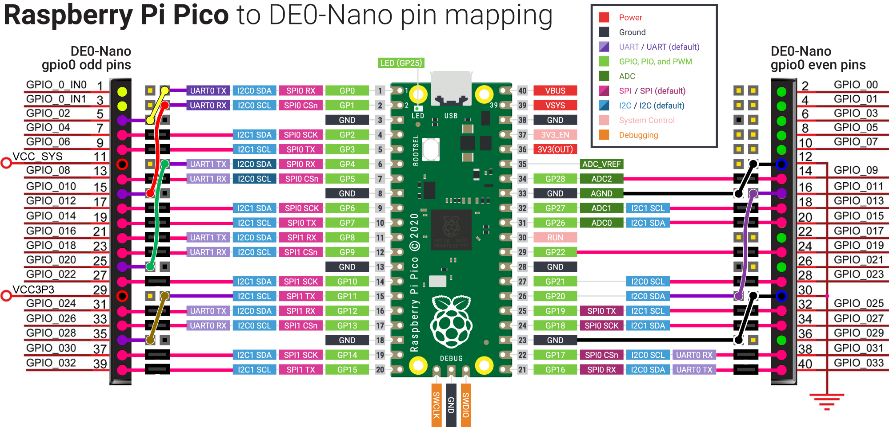

# 12 Jun 2023

| Previous journal: | Next journal: |
|-|-|
| [**0093**-2023-06-09.md](./0093-2023-06-09.md) | [**0095**-2023-06-14.md](./0095-2023-06-14.md) |

# Raspberry Pi Pico to DE0-Nano adapter

*   I'll use this as a test driver and general test platform for FPGA designs.
*   Pico's USB interface will be sent commands from host PC to control the state of GPIOs, and optionally later read them,
    eventually aiming to control them to reflect different data to be sent to the FPGA and possibly other stuff
    like handling IRQs from the designs running on the FPGA.
*   Uses regular Pi Pico with RP2040-B1.
*   Plugs in to DE0-Nano's `GPIO0` 40-pin header.
*   Maps Pico's GPIO pins to nearest DE0-Nano GPIOs.
*   Uses only 2 of the Pico's GNDs pins (one of them AGND), because that's how many are immediately available on the DE0-Nano header.
*   Should've also tried to break out TP6 from back of board: BOOTSEL; pulling it low forces USB boot as BOOTSEL button does. Might need
    to try drilling a hole in the bridge PCB to access the underside of the Pi Pico.
    ([Schematic here](https://datasheets.raspberrypi.com/pico/pico-datasheet.pdf#page=25&zoom=100,153,108) or [here](https://www.circuitstate.com/tutorials/getting-started-with-raspberry-pi-pico-rp2040-microcontroller-board-pinout-schematic-and-programming-tutorial/#!fancybox/9b5773b1/Raspberry-Pi-RP2040-Microcontroller-Pico-Board-Schematic-1.png)).

# Pin mapping

NOTE: [Pi Pico pinout is here](https://datasheets.raspberrypi.com/pico/Pico-R3-A4-Pinout.pdf) and [DE0-Nano pinouts are here](https://www.ti.com/lit/ug/tidu737/tidu737.pdf#page=18).

## Pin mapping chart

Click <strong>here</strong> to reveal

| Pico pin | Pico f'n   | DE0 f'n   | DE0 pin   |
|----------|------------|-----------|-----------|
| 1        | `GP0`      | `io0.2`   | 5         |
| 2        | `GP1`      | `io0.10`  | 15        |
| 3        | ***`GND`***| *NC*      | -         |
| 4        | `GP2`      | `io0.4`   | 7         |
| 5        | `GP3`      | `io0.6`   | 9         |
| 6        | `GP4`      | `io0.20`  | 25        |
| 7        | `GP5`      | `io0.8`   | 13        |
| 8        | ***`GND`***| *NC*      | -         |
| 9        | `GP6`      | `io0.12`  | 17        |
| 10       | `GP7`      | `io0.14`  | 19        |
| 11       | `GP8`      | `io0.16`  | 21        |
| 12       | `GP9`      | `io0.18`  | 23        |
| 13       | ***`GND`***| *NC*      | -         |
| 14       | `GP10`     | `io0.22`  | 27        |
| 15       | `GP11`     | `io0.28`  | 35        |
| 16       | `GP12`     | `io0.24`  | 31        |
| 17       | `GP13`     | `io0.26`  | 33        |
| 18       | ***`GND`***| *NC*      | -         |
| 19       | `GP14`     | `io0.30`  | 37        |
| 20       | `GP15`     | `io0.32`  | 39        |
| 21       | `GP16`     | `io0.33`  | 40        |
| 22       | `GP17`     | `io0.31`  | 38        |
| 23       | ***`GND`***|***`GND`***| 30        |
| 24       | `GP18`     | `io0.27`  | 34        |
| 25       | `GP19`     | `io0.25`  | 32        |
| 26       | `GP20`     | `io0.11`  | 16        |
| 27       | `GP21`     | `io0.23`  | 28        |
| 28       | ***`GND`***| *NC*      | -         |
| 29       | `GP22`     | `io0.19`  | 24        |
| 30       | `RUN`      | *NC*      | -         |
| 31       | `GP26`     | `io0.15`  | 20        |
| 32       | `GP27`     | `io0.13`  | 18        |
| 33      | ***`AGND`***|***`GND`***| 12        |
| 34       | `GP28`     | `io0.9`   | 14        |
| 35       | `ADC_VREF` | *NC*      | -         |
| 36       | `3V3(out)` | *NC*      | -         |
| 37       | `3V3_EN`   | *NC*      | -         |
| 38       | ***`GND`***| *NC*      | -         |
| 39       | `VSYS`     | *NC*      | -         |
| 40       | `VBUS`     | *NC*      | -         |

### Unused DE0-Nano gpio0 pins:

| DE0 f'n       | DE0 pin   |
|---------------|-----------|
| `io0_in.0`    | 1         |
| `io0_in.1`    | 3         |
| `VCC_SYS`     | 11        |
| `VCC3P3`      | 29        |
| `io0.0`       | 2         |
| `io0.1`       | 4         |
| `io0.3`       | 6         |
| `io0.5`       | 8         |
| `io0.7`       | 10        |
| `io0.17`      | 22        |
| `io0.21`      | 26        |
| `io0.29`      | 36        |

# IO-tester FPGA project

The project is here: https://github.com/algofoogle/sandpit/tree/master/pi_pico/pico-de0

## Setting up the project using "DE0-Nano System Builder"

From [the manual](https://www.ti.com/lit/ug/tidu737/tidu737.pdf#page=36):

> The DE0-Nano System Builder is located in the directory: "`Tools\DE0_NANO_SystemBuilder`" on
> the DE0-Nano System CD. Users can copy the whole folder to a host computer without installing
> the utility. Launch the DE0-Nano System Builder by executing the `DE0_NANO_SystemBuilder.exe`
> on the host computer and the GUI window will appear...

Here is my project config:

## Output

The design treats all of the DE0-Nano's gpio0 as inputs, and displays the status of each pin
in a simple block representing the gpio0 (GPIO-0) header on the DE0-Nano:

This diagram shows how the pins and display status (rotated clockwise 90&deg;) match:

# Notes

*   Should we modify the `.qsf` to explicitly name all pins to match mapped Pi Pico pins instead of DE0-Nano gpio0 pins?
*   Quartus can be configured via **Tools &rarr; Options** to do tabbing via spaces instead of tabs:

    
