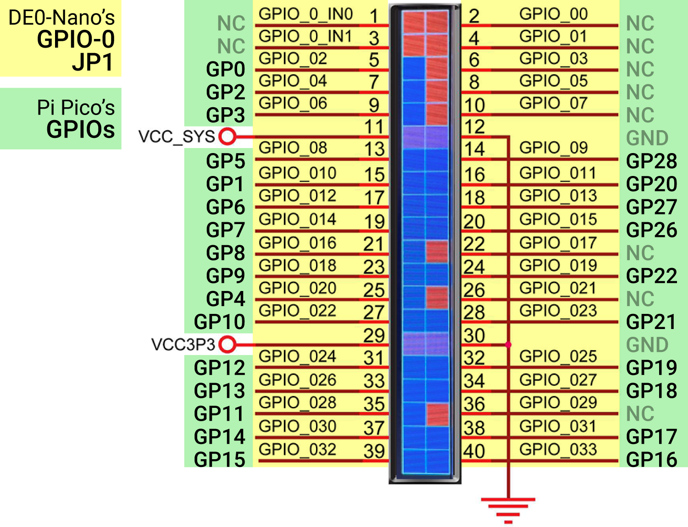

# 17 Jun 2023

| Previous journal: | Next journal: |
|-|-|
| [**0095**-2023-06-14.md](./0095-2023-06-14.md) | [**0097**-2023-06-18.md](./0097-2023-06-18.md) |

## Notes

*   I've got basic REPL working consistently now, and can read all (available) GPIOs as expected.
*   Next step is to try changing some GPIOs to outputs, and sensing this in the DE0-Nano.
*   [This PDF on Reverse Engineering](https://0xinfection.github.io/reversing/reversing-for-everyone.pdf) could
    be a really interesting read. It includes some RP2040 stuff.


## Pi Pico (RP2040) stuff

*   I learned that `gpio_init` (initialise one specific pin as GPIO) or `gpio_init_mask` (init multiple pins using bitmask)
    are important. Without these, I'm not sure what state the 30 GPIOs (0..29) start up in, but either a "nothing" state or
    their specific "alternate function" state (e.g. UART, PWM, whatever). In any case, without this I could neither read nor
    set their external state.
*   Using `malloc` requires `#include <malloc.h>` and `isspace` requires `#include <ctype.h>`. Without these, we get implicit
    definitions that still work, but are poor form.
*   In total, with the Pico, we have at least 24 usable GPIOs: 2..22 (21 in total) + 26..28 (3). If GPIO0 and 1 are not needed
    for UART, then we have 2 more, for a total of 26. Overall GPIO mapping is [below](#pico-gpio-mapping).
*   NOTE: I think Wokwi defaults to using `pico_enable_stdio_uart(pico_de0 1)` mode, because it seems to use GPIO0 and 1
    for a UART connection to the serial monitor. My actual hardware works over USB-CDC (integrated USB-serial) instead,
    so I can probably use these extra 2 pins as IOs.
*   *IF* STDOUT *can* be buffered, it is far better to do so than writing single bytes at a time, because otherwise
    each byte has a lot of overhead for USB frames... but hey, do we *actually* care if there's nothing else going on anyway?
*   ENTER key in Wokwi's Serial Monitor sends 0x0A (LF) but PuTTY (and minicom on Ubuntu 20.04) send 0x0D (CR) only instead.
*   [Comment](https://forums.raspberrypi.com/viewtopic.php?t=335862) on newline and waiting for USB handshake (inc. timeout),
    though not entirely helpful.

With the Pico-DE0 plugged in to the DE0-Nano with my test design, it reveals the below GPIOs are sensed to be low
(in blue). These make sense to me because the ones that are not connected seem to be floating high, while the rest
are connected to Pico inputs *that by default have internal pull-downs on them* so a low signal seems plausible:




## Building and flashing pico_de0

Source is here: https://github.com/algofoogle/sandpit/tree/master/pi_pico/pico-de0/pico_firmware

1.  Initial step to create the Makefile stuff:
    ```bash
    cd pi_pico/pico-deo/pico_firmware
    mkdir -p build
    cd build
    cmake ..
    ```
2.  Building the firmware:
    ```bash
    cd pi_pico/pico-deo/pico_firmware/build
    make clean
    make pico_de0
    ```
    ...should produce `pico_de0.uf2`
3.  Unplug Pico, then hold down BOOTSEL button while plugging in. Release BOOTSEL after a couple seconds.
4.  With USB passthru to Linux VM, hopefully it will show up automatically as a mounted `RPI-RP2` drive
    (run `df` to check). For me this is in `/media/zerotoasic/RPI-RP2`.
5.  Sometimes it doesn't show up automatically. Check `dmesg -T --follow`. Expect the following, and try again if necessary:
    <details>
    <summary>Click <strong>here</strong> to see an example <em>good</em> dmesg (kernel) log</summary>

    ```
    [Sat Jun 17 06:59:12 2023] usb 1-1: new full-speed USB device number 29 using ohci-pci
    [Sat Jun 17 06:59:12 2023] usb 1-1: New USB device found, idVendor=2e8a, idProduct=0003, bcdDevice= 1.00
    [Sat Jun 17 06:59:12 2023] usb 1-1: New USB device strings: Mfr=1, Product=2, SerialNumber=3
    [Sat Jun 17 06:59:12 2023] usb 1-1: Product: RP2 Boot
    [Sat Jun 17 06:59:12 2023] usb 1-1: Manufacturer: Raspberry Pi
    [Sat Jun 17 06:59:12 2023] usb 1-1: SerialNumber: E0C912952D54
    [Sat Jun 17 06:59:12 2023] usb-storage 1-1:1.0: USB Mass Storage device detected
    [Sat Jun 17 06:59:12 2023] scsi host4: usb-storage 1-1:1.0
    [Sat Jun 17 06:59:13 2023] scsi 4:0:0:0: Direct-Access     RPI      RP2              2    PQ: 0 ANSI: 2
    [Sat Jun 17 06:59:13 2023] scsi 4:0:0:0: Attached scsi generic sg2 type 0
    [Sat Jun 17 06:59:13 2023] sd 4:0:0:0: [sdc] 262144 512-byte logical blocks: (134 MB/128 MiB)
    [Sat Jun 17 06:59:13 2023] sd 4:0:0:0: [sdc] Write Protect is off
    [Sat Jun 17 06:59:13 2023] sd 4:0:0:0: [sdc] Mode Sense: 03 00 00 00
    [Sat Jun 17 06:59:13 2023] sd 4:0:0:0: [sdc] No Caching mode page found
    [Sat Jun 17 06:59:13 2023] sd 4:0:0:0: [sdc] Assuming drive cache: write through
    [Sat Jun 17 06:59:14 2023]  sdc: sdc1
    [Sat Jun 17 06:59:14 2023] sd 4:0:0:0: [sdc] Attached SCSI removable disk
    ```
    </details>
6.  Copy the firmware to the Pico:
    ```bash
    cp pico_de0.uf2 /media/zerotoasic/RPI-RP2/
    ```
7.  Pico should reset: USB storage device should disconnect, LED will blink slowly 3 times, then start
    rapid blinking indicating it is waiting for input over USB. NOTE: Sometimes it doesn't come up
    (as `/dev/ttyACM0`) which could be due to how the USB passthru works. Replugging should help.

## Using pico_de0

1.  Connect to the USB-serial interface:
    ```bash
    minicom -o -D /dev/ttyACM0  # Run with sudo if your user is not a member of the dialout group.
    ```
2.  Type the following and hit ENTER:
    ```
    e hello
    ```
    **NOTE:** Echo mode is on by default. Response should then be:
    ```
    > hello
    ```
3.  To read all GPIOs send `@` (and ENTER) and expect a reply like:
    ```
    # 3322_2222_2222_1111_1111_1100_0000_0000
    # 1098_7654_3210_9876_5432_1098_7654_3210
    > 0000_0001_0000_0000_0000_0000_0000_0000
    ```
    First 2 lines are comments to help see GPIO numbers (10s in first row, units in second row), and 3rd line is the GPIO state in binary.
4.  GPIO25 is randomly high or low depending on the current LED state. I've also noticed GPIO24 is pegged high.
    See [GPIO Function Matrix](https://www.circuitstate.com/pinouts/raspberry-pi-pico-microcontroller-board-pinout-diagrams/#GPIO_Function_Matrix),
    but according to [this page](https://peppe8o.com/raspberry-pi-pico-pinout/):
    > * GPIO29 – in ADC mode (ADC3), used to measure VSYS/3
    > * GPIO24 – VBUS sense (high if VBUS is present, else low)
    > * GPIO23 – Controls the on-board SMPS Power Save pin
5.  I strapped a 270&ohm; resistor (could've been a dead short, but I'm playing it safe) between `3V3_OUT` and `GP22`, to pull it
    high, and a new `@` read shows this:
    ```
    # 3322_2222_2222_1111_1111_1100_0000_0000
    # 1098_7654_3210_9876_5432_1098_7654_3210
    > 0000_0011_0100_0000_0000_0000_0000_0000
                 ^
    ```
    This seems to work as expected for all of the other GPIOs I bothered trying (inc. GPIO0 and 1).
6.  NOTE: Backspace doesn't work; it is actually buffered as 0x08 (BS). **If you've made an error in a command and you want to abort it, press CTRL+C** (i.e. send 0x03, aka ETX).
7.  There are "modes" you can turn on and off with the `+` and `-` commands respectively. Example: Turn off echo mode with `-echo`. Currently supported modes are:
    *   `echo` (ON by default): Echo back every character sent by the host, and insert a LF for each "ENTER".
    *   `debug` (ON by default): Prints extra `# ...` comment messages, in some cases.
    *   `hex` (OFF by default): Prints/expects values in hex, rather than bit fields.
8.  NOTE also:
    *   For now, alphabetic commands (e.g. `e`) are case insensitive.
    *   For commands that take an argument, any leading whitespace (between the command character and its first argument) is ignored.


## Pico GPIO mapping

| GPIO | Pico F'n       |
|------|----------------|
|    0 | GPIO0 or UART  |
|    1 | GPIO1 or UART  |
|    2 | GPIO2          |
|    3 | GPIO3          |
|    4 | GPIO4          |
|    5 | GPIO5          |
|    6 | GPIO6          |
|    7 | GPIO7          |
|    8 | GPIO8          |
|    9 | GPIO9          |
|   10 | GPIO10         |
|   11 | GPIO11         |
|   12 | GPIO12         |
|   13 | GPIO13         |
|   14 | GPIO14         |
|   15 | GPIO15         |
|   16 | GPIO16         |
|   17 | GPIO17         |
|   18 | GPIO18         |
|   19 | GPIO19         |
|   20 | GPIO20         |
|   21 | GPIO21         |
|   22 | GPIO22         |
|   23 | PS[^1]         |
|   24 | VBUS sense[^2] |
|   25 | LED            |
|   26 | GPIO26         |
|   27 | GPIO27         |
|   28 | GPIO28         |
|   29 | ADC VSYS measure |

[^1]: On Pico, GPIO23 is an output (?) that controls the SMPS "PS" (Power Save) input pin. See [schematic](https://datasheets.raspberrypi.com/pico/pico-datasheet.pdf#page=25&zoom=100,153,108).
[^2]: On Pico, GPIO24 is high if VBUS is present (I think that means USB-powered) else low.
