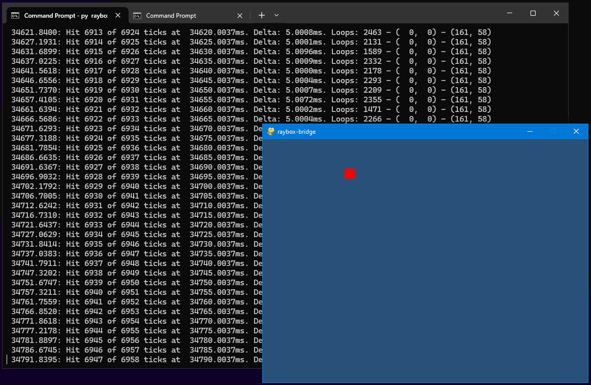

# 26 Jun 2023

| Previous journal: | Next journal: |
|-|-|
| [**0102**-2023-06-25.md](./0102-2023-06-25.md) | *Next journal TBA* |

# raybox-bridge update

[raybox-bridge](https://github.com/algofoogle/sandpit/blob/master/pi_pico/pico-de0/client/raybox-bridge.py)
now uses Pygame to display a simple "cursor" in a 640x480 window. It keeps track of the cursor from captured
mouse movements, and every 5ms it will try to send the "state" of the system (for now just cursor x/y)
to the PicoDeo's outputs.

For now it's just packing the X position (10 bits) into `GPIO[9:0]` and the Y position (9 bits)
into `GPIO[20:12]`, and simply outputting this in full, which my
[IO-tester VGA project](./0094-2023-06-12.md#io-tester-fpga-project) can now see and display
as pin states.

Run from a Windows Terminal on my i7-7700, it does occasionally miss one of these 5ms windows, but it seems
pretty rare. This overall stack could still be optimised in other ways, though.

Next step will be to make a Verilog "vga_cursor" project that just:
1.  Reads the GPIOs constantly to determine the momentary cursor position; then
2.  Upgrades this to maybe sample the GPIOs at the end of each frame... but if we
    do that then how do we ensure both proper metastability avoidance AND avoiding
    catching a changing state right on the edge? Maybe the PicoDeo needs to "clock in"
    the new position (which would likely need better PicoDeo firmware).
3.  Finally properly implements an externally-accessible register set that could
    theoretically be addressed by an 8-bit bus, e.g. either:
    *   4x 8-bit registers with a 2-bit address; a bit contrived:
        1.  Cursor X low
        2.  Cursor Y low
        3.  Cursor X/Y high
        4.  Control register -- inc. a bit we can set to signal when our data is ready
            for shifting into active internal registers for the next frame.
    *   OR, more sensibly, 3 sequential writes that, on completion of the last write,
        signal the full state has been loaded and can be shifted into active internal registers.
    *   NOTE: Should these also support reads, inc. to test the design state (and look
        for a bit to be cleared when the shift has happened)?

...then have a think about how this would be applied to Raybox's more complex data. Our
target, perhaps, is to make it work using the TT04 bus. We care most about being able to write
3&times; vectors (player position, facing direction, and vplane vector), each of which is made
up of X and Y parts, each of which will typically be up to 24 bits (but depending on our need
to optimise, might be less in future). This is 3&times;2&times;24bits = 144 bits, or the
equivalent of writing 18 bytes.

Later we might also need to:
*   Read stuff back out.
*   Update registers for other purposes (map-related, for instance?)
*   React to "IRQs" or other signals of state changes.

# Other Notes

*   Need to disable RP2040's CR/LF translation in PicoDeo firmware.
*   Need a PicoDeo command that can change pin dirs, set GPIOs, and read GPIOs all at once.
    Better yet, a gang of changes that occur at supplied delay points.
*   Include a PicoDeo option to use a leading character to suppress echo.
