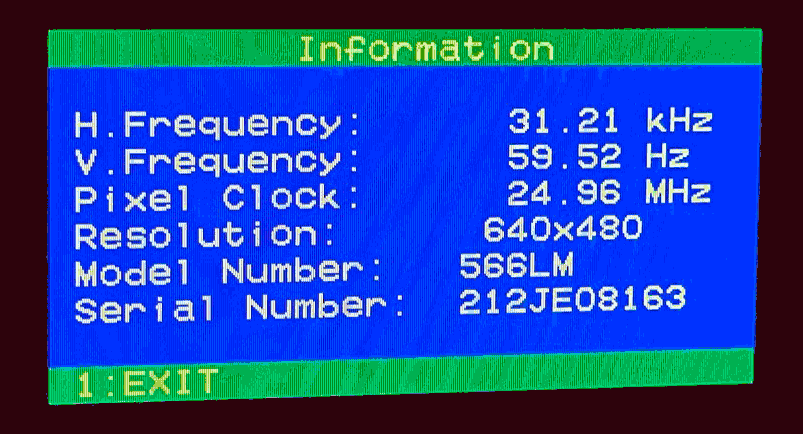

# 29 Jun 2023

| Previous journal: | Next journal: |
|-|-|
| [**0104**-2023-06-27.md](./0104-2023-06-27.md) | *Next journal TBA* |

# vga_cursor initial test findings

*   I changed vga_cursor to use a 1px blue frame (to help sync), black background, and white cursor
    to help with visibility.
*   Cursor size doesn't make much *visible* difference to glitchiness. If anything, original 16x16
    seems about right.
*   Switching vga_cursor from a register method to a comparator method makes glitches impossible to
    pick up on, so I will keep the register method so it helps spot errors and debug them more easily.
*   I increased the raybox-bridge transmit rate from once every 5ms to once every 2.5ms, and it keeps
    up with 99.8% of transmits.
*   I added to the PicoDeo firmware:
    *   `/` command starts an extended command (with a longer name as first argument).
    *   First is "circle" (i.e. `/circle`). This is dedicated to sending a constantly-updating
        cursor position that follows a circle.
    *   When in this mode, normal PicoDeo responses stop, and it goes thru a loop.
    *   It still watches for other inputs, though:
        *   <kbd>CTRL+C</kbd> (ASCII 0x03): Stop the loop and return to normal command processing.
        *   `+`: Double the current delay.
        *   `-`: Halve the current delay.
    *   Delay starts off at 16384&micro;s (i.e. about 61Hz, nearly matched to screen refresh).
    *   Reduced to about 16&micro;s (if it even is able to meet that timing spec) it becomes
        obvious that the real-time cursor reads of the vga_cursor design are seeing a
        smeared/bent cursor, and some glitching becomes evident.

# Next steps

1.  See what it looks like when we sample the GPIOs only during VBLANK.
2.  See if we can trigger any uncertainty/metastability during this sampling.
3.  Design this to work with actual externally-mastered inputs into dedicated *8-bit*
    registers, or even serially clocked in, such that it can basically never fail.

# Notes

My pixel clock is meant to be 25MHz. Divided by 800 (line width),
then divided by 525 (frame height), this is 59.52HZ, which the monitor agrees with:

This equates to a frame duration of exactly 16.8ms.

Our default "circle loop" delay is 16.384ms, so if we were to get an extra delay in there
of 0.416ms, then it would be 16.8ms. That should be pretty close to perfectly sync'd,
should we want to try how well (or badly) that cooperates with the design.

Note that there is some built-in delay, I'm sure, besides the 16.384ms target. Not sure how
much but maybe we can time this using `time_us_32()` and a known number of iterations.
