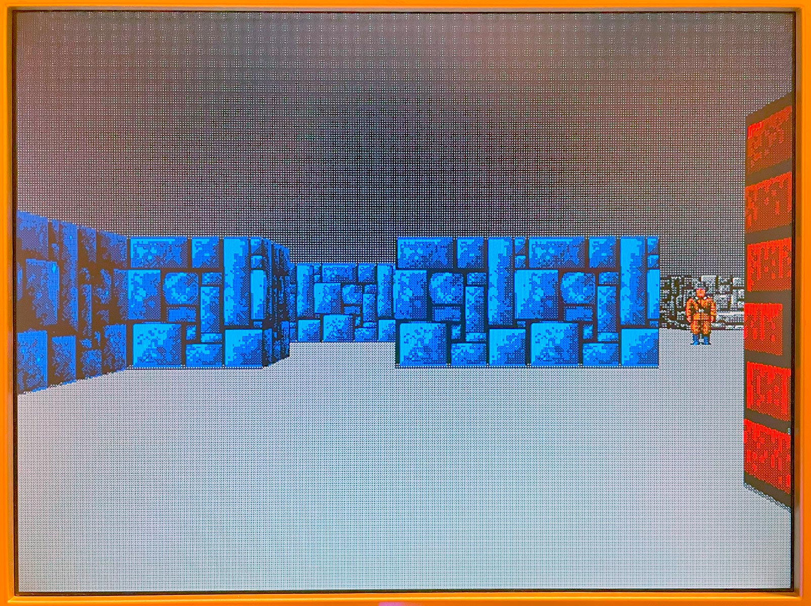

# 7 Jul 2023

| Previous journal: | Next journal: |
|-|-|
| [**0109**-2023-07-06.md](./0109-2023-07-06.md) | *Next journal TBA* |


# Building Raybox in Quartus again

By the conclusion ([0085](./0085-2023-05-25.md)) of my last round of work on this I had made a bunch
of changes both for OpenLane and other improvements in how it would work in the Sim, but I've
[just now fixed it to build in Quartus again](https://github.com/algofoogle/raybox/commit/93b1d1f63601a6198078b672501ea997b5495485)
and proven that the updated version works on the DE0-Nano:




# PicoDeo `/rbvectors` command for sending Raybox vectors via SPI

The PicoDeo firmware now implements the `/rbvectors` extended command with this format:

    /rbvectors player_x player_y facing_x facing_y vplane_x vplane_y

...where each of the arguments is a number, representing a 24-bit fixed-point value.

These are the 6 essential values (3 X/Y vectors) that tell the Raybox engine what point-of-view it's rendering.

This command responds with how long it took to transmit (its 144-bit payload) via SPI. Typically this seems
to be ~300&micro;s, but this is only counting the time spent in `spi_send_raybox_vectors`.

**NOTE:** The combined total time with the overhead of actually sending the `/rbvectors` command over USB,
interpreting, calling `spi_send_raybox_vectors`, and sending the response back over USB seems to total nearly
**2 milliseconds**, so beware! Maybe to speed this up in future we could switch into a mode that just streams
the data directly, breaking out of that mode when vplane_x/y are both 0.


# Building Raybox SIM in Windows

Hmm, I got this working on Windows 11, but I've struggled trying to repeat on Windows 10.
My existing (long-standing) dev env on this machine might mean I've had all sorts of things
in the past that have mucked this up a bit.

[0077](./0077-2023-05-09.md) notes *when* I got Raybox to build under Windows 11, but not *how*.

The actual Windows setup of `make` and the GCC build environment (using MinGW)
is documented in the [Raybox README][].

On my home desktop PC, for [MSYS2][] I installed `msys2-x86_64-20230526.exe`.

**NOTE:** I found after doing the initial `pacman` update and adding stuff to my system PATH,
that mintty seems to use incorrect newlines. I switched to then running `pacman` and subsequent
commands just directly via `cmd.exe` in Windows Terminal, which presented OK.

**NOTE:** I couldn't get Verilator to work on my Windows 10 home desktop PC.
I did this step to install Verilator 4.228 as I had done on Windows 11:

    pacman -U https://repo.msys2.org/mingw/x86_64/mingw-w64-x86_64-verilator-4.228-1-any.pkg.tar.zst

...but after that I couldn't run `verilator` or `verilator --version` in the Windows Terminal; it just
couldn't find it. Even though `verilator` is in my path, it is a shell script that relies on Perl?? Why
did this turn out better on Windows 11? There is a `verilator_bin.exe` which accepts `--version` and might
do the trick, but this is still different from what I expected. Even when I try to run `verilator` in
mintty, it either doesn't find it at all (depending on how I launched mintty), or it gives this error:

    Can't locate Pod/Usage.pm in @INC (you may need to install the Pod::Usage module) (@INC contains: /usr/lib/perl5/site_perl /usr/share/perl5/site_perl /usr/lib/perl5/vendor_perl /usr/share/perl5/vendor_perl /usr/lib/perl5/core_perl /usr/share/perl5/core_perl) at /d/Apps/msys64/mingw64/bin/verilator line 17.
    BEGIN failed--compilation aborted at /d/Apps/msys64/mingw64/bin/verilator line 17.

I also tried these steps (using cmd.exe) to install extra stuff:

```bash
pacman -S --needed base-devel mingw-w64-x86_64-toolchain git flex mingw-w64-x86_64-cmake
pacman -S git make autoconf gcc flex bison man perl
```

I found that if I used Windows Search for "MSYS2 MINGW64", then only by running it thru that shortcut
could I bring up a mintty that allowed me to successfully run `verilator --version`, but I still couldn't
run it natively in Windows' cmd.exe.

Following [this guide to build Verilator from source](https://gist.github.com/sgherbst/036456f807dc8aa84ffb2493d1536afd) might help...?

Try looking into [this fairly comprehensive guide](https://iverilog.fandom.com/wiki/Installation_using_MSYS2).

[Raybox README]: https://github.com/algofoogle/raybox#setting-up-under-windows
[MSYS2]: https://www.msys2.org/

# Notes

*   Need to find out if it's possible to integrate MSYS2/MinGW in Windows Terminal.
    *   MSYS2 typically uses `mintty.exe`, but that in turn looks like it runs its own shell (maybe bash).
    *   If we can figure out what it's doing, maybe we can get it to do the same in Windows Terminal,
        even if run manually via `cmd.exe`.
*   Possible debugging features to build into the Raybox design:
    *   A way to write directly into the trace buffer, and optionally disable texture mapping.
    *   Set "expected" reciprocal values, then run the reciprocal module at full speed and flag any errors.
    *   Expect 50MHz clock always, and then have a divider, but still plan to support 25MHz clock
        with divider disabled?
