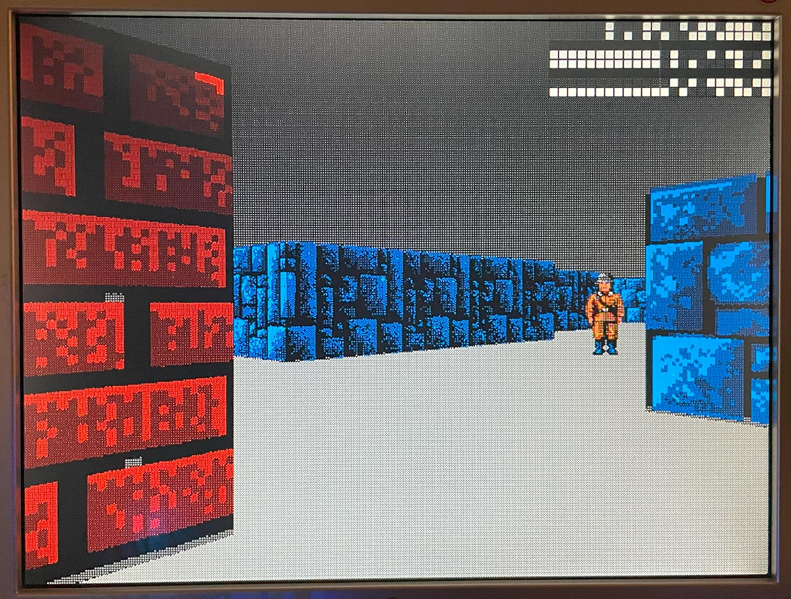

# 11 Jul 2023new_playerX

| Previous journal: | Next journal: |
|-|-|
| [**0111**-2023-07-10.md](./0111-2023-07-10.md) | [**0113**-2023-07-12.md](./0113-2023-07-12.md) |

# Accomplishments

Raybox vector updates now work via SPI, and the design is controllable from a PC via PicoDeo!

This screenshot shows a Raybox view that can only be achieved by sending vectors to the design, via SPI:

As far as I can tell, this is updating smoothly at the full ~60Hz.

## raybox-bridge

*   Mouse rotation now implemented. It works in combo with WASD keys, now.
    I disabled a bunch of other stuff left over from vga_cursor.
*   `Player` class can do conversion of vectors in fixed point, and these values now
    send in the "tick" handler via PicoDeo's `/rbvectors` command.
    SPI receiver not yet implemented in Raybox design.

## Raybox design

The key thing obviously is that I implemented the Raybox SPI receiver for `/rbvectors` data.

I put in some more `` `define ``s to mask out stuff we don't need if we're going for SPI,
and the synth stats with `ENABLE_DEBUG` still defined are as follows (as compared with
in [0110](./0110-2023-07-07.md)):

| Stat                                | Info                     |
|-------------------------------------|--------------------------|
| Family                              | Cyclone IV E             |
| Device                              | EP4CE22F17C6             |
| Timing Models                       | Final                    |
| Total logic elements                | 9,110 / 22,320 ( 41 % )  |
| Total registers                     | 164                      |
| Total pins                          | 51 / 154 ( 33 % )        |
| Total virtual pins                  | 0                        |
| Total memory bits                   | 16,000 / 608,256 ( 3 % ) |
| Embedded Multiplier 9-bit elements  | 72 / 132 ( 55 % )        |
| Total PLLs                          | 0 / 4 ( 0 % )            |

NOTE: I think a lot of the reductions here (namely in registers and multipliers) is because our vectors can no longer
be modified, so a lot of this has been optimised out. I'm sure it'll go back up when bringing in the SPI implementation.

With the SPI logic now in place and wired up to the DE0-Nano GPIOs:

| Stat                                | Info                     |
|-------------------------------------|--------------------------|
| Family                              | Cyclone IV E             |
| Device                              | EP4CE22F17C6             |
| Timing Models                       | Final                    |
| Total logic elements                | 13,597 / 22,320 ( 61 % ) |
| Total registers                     | 672                      |
| Total pins                          | 87 / 154 ( 56 % )        |
| Total virtual pins                  | 0                        |
| Total memory bits                   | 16,000 / 608,256 ( 3 % ) |
| Embedded Multiplier 9-bit elements  | 132 / 132 ( 100 % )      |
| Total PLLs                          | 0 / 4 ( 0 % )            |

Whoa! Now it's using all multipliers (I guess because we actually have real logic wired up to all of them), and
HEAPS more registers. I would expect +288, but I guess there's more going on.

# Next steps

*   Check the SPI logic to make sure it's not possible for a write to be lost (or otherwise cause a conflict)
    if it occurs exactly at the key moments (like buffer &rarr; ready transfer).
*   DON'T load from ready_buffer if an SPI load hasn't happened yet.
*   Consider keys that offer a way to "muck" with vectors, e.g. non-orthographic,
    pushing them outside their normal range. Examples:
    *   "Wobble" vplane (skew it) left and right rapidly or otherwise stretch/squash it
        to create hallucination/watery effect.
    *   Expand vplane substantially to create pull-out stretch effect.
*   Try compacting vectors; they don't need to be so big (see below).
*   Add SPI support for map button and reset.
*   Try implementing map reading and collisions in raybox-bridge?
*   See if we can correct textures so they don't mirror on certain wall sides.
*   Try SPI in RP2040 hardware instead of bit-banging.

# Notes

*   If we want to reduce the no. of bits needed for SPI (and register storage in general)
    then for each of these vectors we only need:
    *   Player: Reduce from Q12.12 to Q7.12: 6 bits for map pos 0..63, with 1 for sign.
        Sign shouldn't actually be needed, and note that while technically the map range
        is `0.0 <= x < 64.0`, in reality there should be an outer wall that confines us
        to `1.0 <= x < 63.0` (or in fact less due to clipping). Consider, though, that
        a creative designer might like to be able to do map edge overflow, but also that
        we can actually get what we want for the range because `0x3F.FFF` is *nearly*
        64.0, and when it rolls over to `0x40.000` we're basically at 0 anyway, so walking
        thru the map edge should be fine if a designer really wants that...?
    *   Facing: Reduce from Q12.12 to Q2.12. This will allow a range of `-2.0 <= x < 2.0`
        and typically we don't need values with a magnitude exceeding 1.0 anyway (unless
        there's some design reason to support it).
    *   Vplane: Reduce from Q12.12 to Q4.12. This will allow a range of `-8.0 <= x < 8.0`
        which would be an FOV of `2*atan(8.0)` or ~165.75&deg; which is extreme.
    *   HENCE, total bits to transfer, shadow, or store reduces from 144 to 98.
