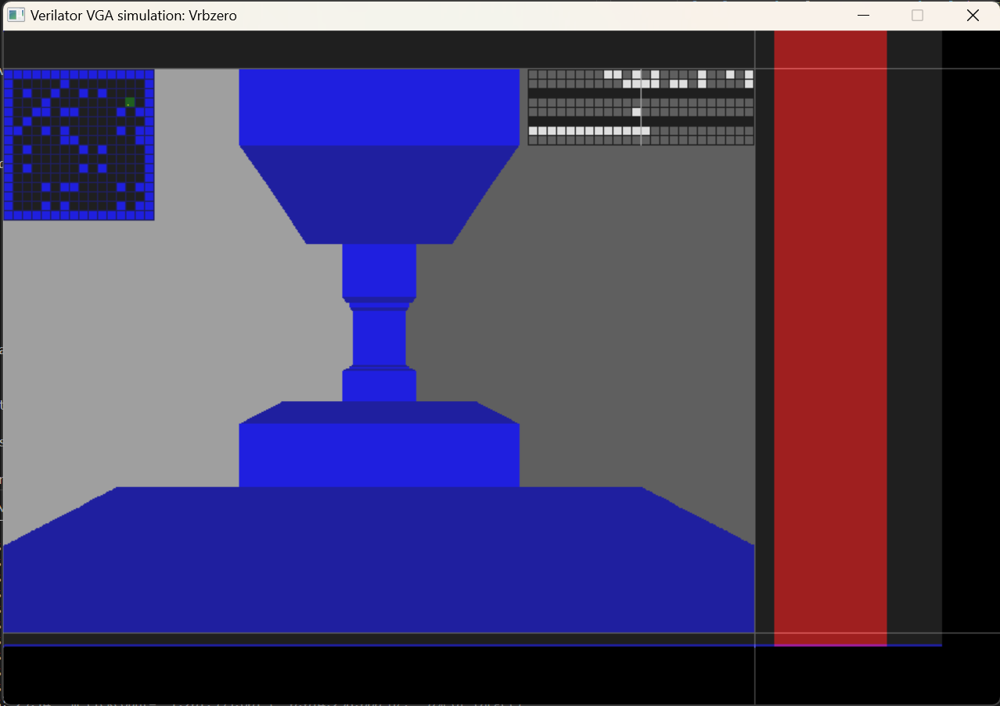

# 18 Aug 2023

| Previous journal: | Next journal: |
|-|-|
| [**0124**-2023-08-16.md](./0124-2023-08-16.md) | *Next journal TBA* |

# raybox-zero tracing works

## Accomplishments

As of https://github.com/algofoogle/raybox-zero/commit/9073f822ae4f36340257ad17ff743278d3b3e293, tracing now produces results that seem right, rendering as expected in raybox-zero.
This is a screenshot of the Verilator-based simulation rendering a given view:

It's made of the following additions today:
*   Hard-coded 16x16 [map_rom](https://github.com/algofoogle/raybox-zero/commit/9073f822ae4f36340257ad17ff743278d3b3e293#diff-fbde40805ef1861c573b98b5075f8c06c81a3592c4ea0891531f2df8431f5f42R1) implemented; just uses bitwise logic to create a map.
*   wall_tracer reads map_rom, and is now finished and works. It was nearly there anyway.
*   map_overlay reads from map_rom, but it's a hack: [2nd instance of the same thing](https://github.com/algofoogle/raybox-zero/commit/9073f822ae4f36340257ad17ff743278d3b3e293#diff-6c039f9e2e082508345b29a4737e227e8df567ebbd641a0564995fb6a4985dbeR87),
    to avoid contention during tracing.
*   pov (view vectors) [are incrementing player position](https://github.com/algofoogle/raybox-zero/commit/9073f822ae4f36340257ad17ff743278d3b3e293#diff-4ead95d35586bf218eeacf68dd8eff69c4487366e6bf247262dd9510c3d63137R23) to demonstrate motion.
*   For now, given we haven't got texture mapping, [I've got a simple reciprocal
    height scaler placed in the main rbzero module](https://github.com/algofoogle/raybox-zero/commit/9073f822ae4f36340257ad17ff743278d3b3e293#diff-6c039f9e2e082508345b29a4737e227e8df567ebbd641a0564995fb6a4985dbeR147). Note that this means the tracer is outputting the visual wall distance (as Q7.9) for now, instead of direct wall height, becauses that will ultimately be better later for texture mapping.

## Next steps

*   Try dark blue background.
*   Get it going in TT04.
*   Try on FPGA.
*   We can visualise when a line trace completes by making it output a signal
    that places a dot directly on the point of the line where it is currently
    rendering to the screen.
*   Don't try much optimisation until we've tried a TT04 fit.
*   Improve README.
*   For demo purposes, have a version that can render a view and allow basic player
    motion control from input pins, without having to depend on vectors via SPI.
*   Check how many actual iterations it takes (and hence line time) to
    complete a trace, and if there is a HUGE amount of free time then we can delay
    line trace FSM start until [after the map overlay region is exited](https://github.com/algofoogle/raybox-zero/commit/9073f822ae4f36340257ad17ff743278d3b3e293#diff-cf96bfffa2392b54c59a47ea4f10f78dd730fb7ec7632b0c4ef0e6671d9f7cecR6).
*   When doing optimisation, work on any shortcuts that can be made with the FSM, but also adding in the extra reciprocal (and maybe multiply) steps.
*   Much later, when we know TT04 fit is good and optimisations are done,
    then try texture mapping and (say) reading map data from external memory...?
