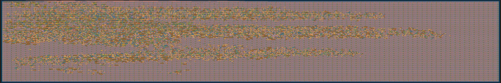
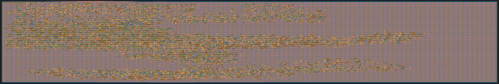

# 20 Aug 2023

| Previous journal: | Next journal: |
|-|-|
| [**0126**-2023-08-19.md](./0126-2023-08-19.md) | *Next journal TBA* |

# raybox-zero

## In progress

*   [0066](./0066-2023-04-26.md) has more detail/notes about hardening TT GDS locally, from TT03.
*   I tried hardening tt04-raybox-zero as-is using TT03p5 method (default MPW8 OpenLane image) but latest tt_tool.py scripts. It worked using 8x2 tiles, but has violations when using the 50MHz clock target that is the default in `config.tcl`:
    ```
    [WARNING]: There are max slew violations in the design at the typical corner. Please refer to '../work/runs/wokwi/reports/signoff/25-rcx_sta.slew.rpt'.
    [WARNING]: There are max fanout violations in the design at the typical corner. Please refer to '../work/runs/wokwi/reports/signoff/25-rcx_sta.slew.rpt'.
    [WARNING]: There are max capacitance violations in the design at the typical corner. Please refer to '../work/runs/wokwi/reports/signoff/25-rcx_sta.slew.rpt'.
    [INFO]: There are no hold violations in the design at the typical corner.
    [ERROR]: There are setup violations in the design at the typical corner. Please refer to '../work/runs/wokwi/reports/signoff/25-rcx_sta.max.rpt'.
    ```
    All violations are in `tt04-raybox-zero/runs/wokwi/reports/signoff/25-rcx_sta.max.rpt` and `tt04-raybox-zero/runs/wokwi/reports/signoff/25-rcx_sta.slew.rpt`. The latter (slews) are not too severe. The former (setups) I lost the report, but I can regenerate it later.
*   I modified `config.tcl` to set clock period to 40ns, slowing down the target to 25MHz, and I'm running that again using the TT03p5 method as above.
    *   The doco says ["don't modify config.tcl"](https://tinytapeout.com/hdl/important/#dont-modify-configtcl) but I would think it's reasonable to need to relax the clock speed (unless Matt and Uri are worried about slow designs otherwise compromising the whole chip, even when inactive, due to metastability issues for other designs that DO run the clock at top speed?)
    *   The 25MHz target succeeded, but it does still have slew violations (more, in fact, than the 50MHz target??)
    *   It says it uses about 20% of the 8x2 tile area (i.e. uses ~60,000squm).
    *   I wonder if a 4x2 area will lead to fewer capacitance issues, at least, because it will have to have some shorter wires...?
*   I then set the target back to 50MHz and followed the "[Hardening Tiny Tapeout Projects Locally]" guide to use the TT04 method and OpenLane image. Short version (assumes it has already been set up to run):
    ```bash
    cd ~/anton/tt04-raybox-zero
    export OPENLANE_ROOT=~/tt/openlane
    export PDK_ROOT=~/tt/pdk
    export PDK=sky130A
    export OPENLANE_TAG=2023.06.26
    export OPENLANE_IMAGE_NAME=efabless/openlane:3bc9d02d0b34ad032921553e512fbe4bebf1d833
    source ~/tt/venv/bin/activate
    ./tt/tt_tool.py --create-user-config
    ./tt/tt_tool.py --harden
    ```
    It fails with the same error as it does in the GHA...
    
    <details><summary><strong>Click to see yosys-abc error...</strong></summary>

    ```
    [INFO]: Running linter (Verilator) (log: ../work/runs/wokwi/logs/synthesis/linter.log)...
    [INFO]: 0 errors found by linter
    [WARNING]: 19 warnings found by linter
    [STEP 1]
    [INFO]: Running Synthesis (log: ../work/runs/wokwi/logs/synthesis/1-synthesis.log)...
    [ERROR]: during executing yosys script /openlane/scripts/yosys/synth.tcl
    [ERROR]: Log: ../work/runs/wokwi/logs/synthesis/1-synthesis.log
    [ERROR]: Last 10 lines:

    67. Executing ABC pass (technology mapping using ABC).

    67.1. Extracting gate netlist of module `\tt_um_algofoogle_raybox_zero' to `/tmp/yosys-abc-slUxpa/input.blif'..
    Extracted 18522 gates and 18672 wires to a netlist network with 148 inputs and 151 outputs.

    67.1.1. Executing ABC.
    sh: line 1:   143 Aborted                 (core dumped) "/build/bin/yosys-abc" -s -f /tmp/yosys-abc-slUxpa/abc.script 2>&1
    ERROR: ABC: execution of command ""/build/bin/yosys-abc" -s -f /tmp/yosys-abc-slUxpa/abc.script 2>&1" failed: return code 134.
    child process exited abnormally
    ```
    </details>
*   The yosys-abc crash doesn't seem to produce any other artefacts that would help us work out what's going on. My next step would be to try starting up the OpenLane container, and see if I can at least intercept where this crash occurs to work out what might be the cause, etc.
*   I also tried the standard OpenLane, 50MHz, with 4x2 tiles and it completed: Only 35% utilisation (i.e. it made it more efficient than 20% in 8x2?) with milder slew violations (only fanouts, mostly for clock buffers). Setup violations still exist; a slack of about -5.72ns, which should mean a max clock speed of ~38.88MHz... still actually better than I need, but let's try for the 50MHz target that is kinda mandated by TT04. NOTE: This is a bit contrived; even if I manage to optimise it a lot, the other things that will probably grow it again are SPI access to `pov` and how this will also mean fewer constant logic paths for synth to collapse.

### Reports

#### MPW8 standard OpenLane `cb59d1f` at 25MHz

GDS render of SVG created by `./tt/tt_tool.py --create-svg`:


*   <details><summary><strong>Click to show metrics.csv data</strong></summary>

    | Param                            | value                         |
    |-|-|
    | design                           | /work/src                     |
    | design_name                      | tt_um_algofoogle_raybox_zero  |
    | config                           | wokwi                         |
    | flow_status                      | flow completed                |
    | total_runtime                    | 0h20m42s0ms                   |
    | routed_runtime                   | 0h16m16s0ms                   |
    | (Cell/mm^2)/Core_Util            | 39683.4422817017              |
    | DIEAREA_mm^2                     | 0.30697941759999997           |
    | CellPer_mm^2                     | 19841.72114085085             |
    | OpenDP_Util                      | 20.16                         |
    | Peak_Memory_Usage_MB             | 994.22                        |
    | cell_count                       | 6091                          |
    | tritonRoute_violations           | 0                             |
    | Short_violations                 | 0                             |
    | MetSpc_violations                | 0                             |
    | OffGrid_violations               | 0                             |
    | MinHole_violations               | 0                             |
    | Other_violations                 | 0                             |
    | Magic_violations                 | 0                             |
    | antenna_violations               | -1                            |
    | lvs_total_errors                 | 0                             |
    | cvc_total_errors                 | -1                            |
    | klayout_violations               | -1                            |
    | wire_length                      | 418091                        |
    | vias                             | 53171                         |
    | wns                              | 0.0                           |
    | pl_wns                           | 0.0                           |
    | optimized_wns                    | 0.0                           |
    | fastroute_wns                    | 0.0                           |
    | spef_wns                         | 0.0                           |
    | tns                              | 0.0                           |
    | pl_tns                           | 0.0                           |
    | optimized_tns                    | 0.0                           |
    | fastroute_tns                    | 0.0                           |
    | spef_tns                         | 0.0                           |
    | HPWL                             | 336821133.0                   |
    | routing_layer1_pct               | 0.0                           |
    | routing_layer2_pct               | 44.12                         |
    | routing_layer3_pct               | 16.3                          |
    | routing_layer4_pct               | 31.67                         |
    | routing_layer5_pct               | 0.78                          |
    | routing_layer6_pct               | -1                            |
    | wires_count                      | 18331                         |
    | wire_bits                        | 20581                         |
    | public_wires_count               | 139                           |
    | public_wire_bits                 | 2210                          |
    | memories_count                   | 0                             |
    | memory_bits                      | 0                             |
    | processes_count                  | 0                             |
    | cells_pre_abc                    | 18418                         |
    | AND                              | 310                           |
    | DFF                              | 7                             |
    | NAND                             | 211                           |
    | NOR                              | 2896                          |
    | OR                               | 2310                          |
    | XOR                              | 3472                          |
    | XNOR                             | 1906                          |
    | MUX                              | 812                           |
    | inputs                           | 148                           |
    | outputs                          | 151                           |
    | level                            | 89                            |
    | EndCaps                          | 162                           |
    | TapCells                         | 4357                          |
    | Diodes                           | 0                             |
    | Total_Physical_Cells             | 4519                          |
    | CoreArea_um^2                    | 298366.1568                   |
    | power_slowest_internal_uW        | -1                            |
    | power_slowest_switching_uW       | -1                            |
    | power_slowest_leakage_uW         | -1                            |
    | power_typical_internal_uW        | -1                            |
    | power_typical_switching_uW       | -1                            |
    | power_typical_leakage_uW         | -1                            |
    | power_fastest_internal_uW        | -1                            |
    | power_fastest_switching_uW       | -1                            |
    | power_fastest_leakage_uW         | -1                            |
    | critical_path_ns                 | -1                            |
    | suggested_clock_period           | 40.0                          |
    | suggested_clock_frequency        | 25.0                          |
    | CLOCK_PERIOD                     | 40                            |
    | SYNTH_STRATEGY                   | AREA 0                        |
    | SYNTH_MAX_FANOUT                 | 10                            |
    | FP_CORE_UTIL                     | 50                            |
    | FP_ASPECT_RATIO                  | 1                             |
    | FP_PDN_VPITCH                    | 153.6                         |
    | FP_PDN_HPITCH                    | 153.18                        |
    | PL_TARGET_DENSITY                | 0.55                          |
    | GRT_ADJUSTMENT                   | 0.3                           |
    | STD_CELL_LIBRARY                 | sky130_fd_sc_hd               |
    | DIODE_INSERTION_STRATEGY         | 3                             |

    </details>
*   <details><summary><strong>Click to show: runs/wokwi/reports/signoff/25-rcx_sta.slew.rpt</strong></summary>

    ```
    ===========================================================================
    report_check_types -max_slew -max_cap -max_fanout -violators
    ============================================================================
    max slew

    Pin                                    Limit    Slew   Slack
    ------------------------------------------------------------
    _09930_/A                               1.50    1.74   -0.24 (VIOLATED)
    _09683_/A2                              1.50    1.74   -0.24 (VIOLATED)
    _09684_/C                               1.50    1.74   -0.24 (VIOLATED)
    _10216_/A1                              1.50    1.74   -0.24 (VIOLATED)
    _10326_/B2                              1.50    1.74   -0.24 (VIOLATED)
    _09959_/A                               1.50    1.74   -0.24 (VIOLATED)
    _09998_/A1                              1.50    1.74   -0.24 (VIOLATED)
    _11547_/A2                              1.50    1.74   -0.24 (VIOLATED)
    _10342_/B                               1.50    1.74   -0.24 (VIOLATED)
    _09681_/Y                               1.51    1.74   -0.23 (VIOLATED)
    _09347_/X                               1.50    1.62   -0.12 (VIOLATED)
    _10118_/A                               1.50    1.62   -0.12 (VIOLATED)
    _09704_/B1                              1.50    1.62   -0.12 (VIOLATED)
    _09832_/A                               1.50    1.62   -0.12 (VIOLATED)
    _10313_/A                               1.50    1.62   -0.12 (VIOLATED)
    _09686_/A                               1.50    1.62   -0.12 (VIOLATED)
    _10372_/A                               1.50    1.62   -0.12 (VIOLATED)
    _10568_/A                               1.50    1.62   -0.12 (VIOLATED)
    _09348_/A                               1.50    1.62   -0.12 (VIOLATED)
    _11051_/C                               1.50    1.62   -0.12 (VIOLATED)
    _09920_/B1                              1.50    1.52   -0.02 (VIOLATED)
    _10201_/A                               1.50    1.52   -0.02 (VIOLATED)
    _09829_/A                               1.50    1.52   -0.02 (VIOLATED)
    _09682_/A                               1.50    1.52   -0.02 (VIOLATED)
    _10569_/B1                              1.50    1.52   -0.02 (VIOLATED)
    _10982_/A                               1.50    1.51   -0.01 (VIOLATED)
    _10984_/A                               1.50    1.51   -0.01 (VIOLATED)
    _11053_/B                               1.50    1.51   -0.01 (VIOLATED)
    _09293_/Y                               1.50    1.51   -0.01 (VIOLATED)

    max fanout

    Pin                                   Limit Fanout  Slack
    ---------------------------------------------------------
    _09819_/X                                10     19     -9 (VIOLATED)
    clkbuf_4_1_0_clk/X                       10     19     -9 (VIOLATED)
    _07847_/X                                10     14     -4 (VIOLATED)
    _09534_/X                                10     14     -4 (VIOLATED)
    clkbuf_4_0_0_clk/X                       10     13     -3 (VIOLATED)
    clkbuf_4_3_0_clk/X                       10     12     -2 (VIOLATED)
    _06284_/X                                10     11        (VIOLATED)
    _08100_/X                                10     11        (VIOLATED)
    _08275_/X                                10     11        (VIOLATED)
    _08765_/X                                10     11        (VIOLATED)
    _09595_/X                                10     11        (VIOLATED)
    _09773_/X                                10     11        (VIOLATED)
    _10093_/X                                10     11        (VIOLATED)
    clkbuf_4_11_0_clk/X                      10     11        (VIOLATED)

    max capacitance

    Pin                                    Limit     Cap   Slack
    ------------------------------------------------------------
    _09681_/Y                               0.13    0.16   -0.03 (VIOLATED)
    _09347_/X                               0.22    0.24   -0.02 (VIOLATED)
    _09293_/Y                               0.21    0.22   -0.01 (VIOLATED)


    ===========================================================================
    max slew violation count 29
    max fanout violation count 14
    max cap violation count 3
    ============================================================================
    ```
    </details>
*   `./tt/tt_tool.py --print-warnings`
    ```
    # Synthesis warnings

    * Warning: Resizing cell port wall_tracer.flipY.i_abs from 32 bits to 1 bits.
    * Warning: Resizing cell port wall_tracer.flipX.i_abs from 32 bits to 1 bits.
    * Warning: Resizing cell port rbzero.vga_mux.map_en from 32 bits to 1 bits.
    * Warning: Resizing cell port rbzero.vga_mux.debug_en from 32 bits to 1 bits.
    * Warning: Resizing cell port rbzero.height_scaler.i_abs from 32 bits to 1 bits.
    ```
*   `./tt/tt_tool.py --print-stats`
    | Utilisation (%) | Wire length (um) |
    |-------------|------------------|
    | 20.16 | 418091 |
*   <details><summary><strong>Click to show output from ./tt/tt_tool.py --print-cell-category</strong></summary>

    | Category | Cells | Count |
    |---------------|----------|-------|
    |Fill | [decap](https://skywater-pdk.readthedocs.io/en/main/contents/libraries/sky130_fd_sc_hd/cells/decap) [fill](https://skywater-pdk.readthedocs.io/en/main/contents/libraries/sky130_fd_sc_hd/cells/fill) | 26165|
    |Tap | [tapvpwrvgnd](https://skywater-pdk.readthedocs.io/en/main/contents/libraries/sky130_fd_sc_hd/cells/tapvpwrvgnd) | 4357|
    |Combo Logic | [a22o](https://skywater-pdk.readthedocs.io/en/main/contents/libraries/sky130_fd_sc_hd/cells/a22o) [o22a](https://skywater-pdk.readthedocs.io/en/main/contents/libraries/sky130_fd_sc_hd/cells/o22a) [o221a](https://skywater-pdk.readthedocs.io/en/main/contents/libraries/sky130_fd_sc_hd/cells/o221a) [a211o](https://skywater-pdk.readthedocs.io/en/main/contents/libraries/sky130_fd_sc_hd/cells/a211o) [a21oi](https://skywater-pdk.readthedocs.io/en/main/contents/libraries/sky130_fd_sc_hd/cells/a21oi) [o31a](https://skywater-pdk.readthedocs.io/en/main/contents/libraries/sky130_fd_sc_hd/cells/o31a) [or3b](https://skywater-pdk.readthedocs.io/en/main/contents/libraries/sky130_fd_sc_hd/cells/or3b) [a31o](https://skywater-pdk.readthedocs.io/en/main/contents/libraries/sky130_fd_sc_hd/cells/a31o) [o21a](https://skywater-pdk.readthedocs.io/en/main/contents/libraries/sky130_fd_sc_hd/cells/o21a) [nor3b](https://skywater-pdk.readthedocs.io/en/main/contents/libraries/sky130_fd_sc_hd/cells/nor3b) [and2b](https://skywater-pdk.readthedocs.io/en/main/contents/libraries/sky130_fd_sc_hd/cells/and2b) [o21ba](https://skywater-pdk.readthedocs.io/en/main/contents/libraries/sky130_fd_sc_hd/cells/o21ba) [o21bai](https://skywater-pdk.readthedocs.io/en/main/contents/libraries/sky130_fd_sc_hd/cells/o21bai) [a311o](https://skywater-pdk.readthedocs.io/en/main/contents/libraries/sky130_fd_sc_hd/cells/a311o) [a32oi](https://skywater-pdk.readthedocs.io/en/main/contents/libraries/sky130_fd_sc_hd/cells/a32oi) [and3b](https://skywater-pdk.readthedocs.io/en/main/contents/libraries/sky130_fd_sc_hd/cells/and3b) [a311oi](https://skywater-pdk.readthedocs.io/en/main/contents/libraries/sky130_fd_sc_hd/cells/a311oi) [a32o](https://skywater-pdk.readthedocs.io/en/main/contents/libraries/sky130_fd_sc_hd/cells/a32o) [a21o](https://skywater-pdk.readthedocs.io/en/main/contents/libraries/sky130_fd_sc_hd/cells/a21o) [or4b](https://skywater-pdk.readthedocs.io/en/main/contents/libraries/sky130_fd_sc_hd/cells/or4b) [or2b](https://skywater-pdk.readthedocs.io/en/main/contents/libraries/sky130_fd_sc_hd/cells/or2b) [o211a](https://skywater-pdk.readthedocs.io/en/main/contents/libraries/sky130_fd_sc_hd/cells/o211a) [o21ai](https://skywater-pdk.readthedocs.io/en/main/contents/libraries/sky130_fd_sc_hd/cells/o21ai) [o211ai](https://skywater-pdk.readthedocs.io/en/main/contents/libraries/sky130_fd_sc_hd/cells/o211ai) [a2bb2o](https://skywater-pdk.readthedocs.io/en/main/contents/libraries/sky130_fd_sc_hd/cells/a2bb2o) [a211oi](https://skywater-pdk.readthedocs.io/en/main/contents/libraries/sky130_fd_sc_hd/cells/a211oi) [o32a](https://skywater-pdk.readthedocs.io/en/main/contents/libraries/sky130_fd_sc_hd/cells/o32a) [a41o](https://skywater-pdk.readthedocs.io/en/main/contents/libraries/sky130_fd_sc_hd/cells/a41o) [a22oi](https://skywater-pdk.readthedocs.io/en/main/contents/libraries/sky130_fd_sc_hd/cells/a22oi) [a31oi](https://skywater-pdk.readthedocs.io/en/main/contents/libraries/sky130_fd_sc_hd/cells/a31oi) [o22ai](https://skywater-pdk.readthedocs.io/en/main/contents/libraries/sky130_fd_sc_hd/cells/o22ai) [nand3b](https://skywater-pdk.readthedocs.io/en/main/contents/libraries/sky130_fd_sc_hd/cells/nand3b) [a21bo](https://skywater-pdk.readthedocs.io/en/main/contents/libraries/sky130_fd_sc_hd/cells/a21bo) [a2bb2oi](https://skywater-pdk.readthedocs.io/en/main/contents/libraries/sky130_fd_sc_hd/cells/a2bb2oi) [o2bb2a](https://skywater-pdk.readthedocs.io/en/main/contents/libraries/sky130_fd_sc_hd/cells/o2bb2a) [and4b](https://skywater-pdk.readthedocs.io/en/main/contents/libraries/sky130_fd_sc_hd/cells/and4b) [o32ai](https://skywater-pdk.readthedocs.io/en/main/contents/libraries/sky130_fd_sc_hd/cells/o32ai) [nor2b](https://skywater-pdk.readthedocs.io/en/main/contents/libraries/sky130_fd_sc_hd/cells/nor2b) [and4bb](https://skywater-pdk.readthedocs.io/en/main/contents/libraries/sky130_fd_sc_hd/cells/and4bb) [a2111oi](https://skywater-pdk.readthedocs.io/en/main/contents/libraries/sky130_fd_sc_hd/cells/a2111oi) [o31ai](https://skywater-pdk.readthedocs.io/en/main/contents/libraries/sky130_fd_sc_hd/cells/o31ai) [o2bb2ai](https://skywater-pdk.readthedocs.io/en/main/contents/libraries/sky130_fd_sc_hd/cells/o2bb2ai) [nor4b](https://skywater-pdk.readthedocs.io/en/main/contents/libraries/sky130_fd_sc_hd/cells/nor4b) [o41a](https://skywater-pdk.readthedocs.io/en/main/contents/libraries/sky130_fd_sc_hd/cells/o41a) [o311a](https://skywater-pdk.readthedocs.io/en/main/contents/libraries/sky130_fd_sc_hd/cells/o311a) [o311ai](https://skywater-pdk.readthedocs.io/en/main/contents/libraries/sky130_fd_sc_hd/cells/o311ai) [a221o](https://skywater-pdk.readthedocs.io/en/main/contents/libraries/sky130_fd_sc_hd/cells/a221o) [a221oi](https://skywater-pdk.readthedocs.io/en/main/contents/libraries/sky130_fd_sc_hd/cells/a221oi) [o41ai](https://skywater-pdk.readthedocs.io/en/main/contents/libraries/sky130_fd_sc_hd/cells/o41ai) [a2111o](https://skywater-pdk.readthedocs.io/en/main/contents/libraries/sky130_fd_sc_hd/cells/a2111o) [o2111a](https://skywater-pdk.readthedocs.io/en/main/contents/libraries/sky130_fd_sc_hd/cells/o2111a) [o2111ai](https://skywater-pdk.readthedocs.io/en/main/contents/libraries/sky130_fd_sc_hd/cells/o2111ai) [or4bb](https://skywater-pdk.readthedocs.io/en/main/contents/libraries/sky130_fd_sc_hd/cells/or4bb) [o221ai](https://skywater-pdk.readthedocs.io/en/main/contents/libraries/sky130_fd_sc_hd/cells/o221ai) | 2053|
    |NOR | [xnor2](https://skywater-pdk.readthedocs.io/en/main/contents/libraries/sky130_fd_sc_hd/cells/xnor2) [nor2](https://skywater-pdk.readthedocs.io/en/main/contents/libraries/sky130_fd_sc_hd/cells/nor2) [nor4](https://skywater-pdk.readthedocs.io/en/main/contents/libraries/sky130_fd_sc_hd/cells/nor4) [nor3](https://skywater-pdk.readthedocs.io/en/main/contents/libraries/sky130_fd_sc_hd/cells/nor3) | 1429|
    |OR | [or4](https://skywater-pdk.readthedocs.io/en/main/contents/libraries/sky130_fd_sc_hd/cells/or4) [or2](https://skywater-pdk.readthedocs.io/en/main/contents/libraries/sky130_fd_sc_hd/cells/or2) [or3](https://skywater-pdk.readthedocs.io/en/main/contents/libraries/sky130_fd_sc_hd/cells/or3) [xor2](https://skywater-pdk.readthedocs.io/en/main/contents/libraries/sky130_fd_sc_hd/cells/xor2) | 859|
    |NAND | [nand2](https://skywater-pdk.readthedocs.io/en/main/contents/libraries/sky130_fd_sc_hd/cells/nand2) [nand3](https://skywater-pdk.readthedocs.io/en/main/contents/libraries/sky130_fd_sc_hd/cells/nand3) [nand4](https://skywater-pdk.readthedocs.io/en/main/contents/libraries/sky130_fd_sc_hd/cells/nand4) [nand2b](https://skywater-pdk.readthedocs.io/en/main/contents/libraries/sky130_fd_sc_hd/cells/nand2b) | 606|
    |AND | [and3](https://skywater-pdk.readthedocs.io/en/main/contents/libraries/sky130_fd_sc_hd/cells/and3) [and4](https://skywater-pdk.readthedocs.io/en/main/contents/libraries/sky130_fd_sc_hd/cells/and4) [and2](https://skywater-pdk.readthedocs.io/en/main/contents/libraries/sky130_fd_sc_hd/cells/and2) [a21boi](https://skywater-pdk.readthedocs.io/en/main/contents/libraries/sky130_fd_sc_hd/cells/a21boi) | 481|
    |Buffer | [clkbuf](https://skywater-pdk.readthedocs.io/en/main/contents/libraries/sky130_fd_sc_hd/cells/clkbuf) [buf](https://skywater-pdk.readthedocs.io/en/main/contents/libraries/sky130_fd_sc_hd/cells/buf) | 323|
    |Flip Flops | [dfxtp](https://skywater-pdk.readthedocs.io/en/main/contents/libraries/sky130_fd_sc_hd/cells/dfxtp) | 148|
    |Inverter | [inv](https://skywater-pdk.readthedocs.io/en/main/contents/libraries/sky130_fd_sc_hd/cells/inv) | 97|
    |Multiplexer | [mux2](https://skywater-pdk.readthedocs.io/en/main/contents/libraries/sky130_fd_sc_hd/cells/mux2) [mux4](https://skywater-pdk.readthedocs.io/en/main/contents/libraries/sky130_fd_sc_hd/cells/mux4) | 89|
    |Diode | [diode](https://skywater-pdk.readthedocs.io/en/main/contents/libraries/sky130_fd_sc_hd/cells/diode) | 71|
    |Clock | [clkinv](https://skywater-pdk.readthedocs.io/en/main/contents/libraries/sky130_fd_sc_hd/cells/clkinv) | 21|
    |Misc | [dlymetal6s2s](https://skywater-pdk.readthedocs.io/en/main/contents/libraries/sky130_fd_sc_hd/cells/dlymetal6s2s) [conb](https://skywater-pdk.readthedocs.io/en/main/contents/libraries/sky130_fd_sc_hd/cells/conb) [dlygate4sd3](https://skywater-pdk.readthedocs.io/en/main/contents/libraries/sky130_fd_sc_hd/cells/dlygate4sd3) | 21|

    6198 total cells (excluding fill and tap cells)
    </details>


#### MPW8 standard OpenLane `cb59d1f` at 50MHz

GDS render of SVG created by `./tt/tt_tool.py --create-svg`:


*   <details><summary><strong>Click to show metrics.csv data</strong></summary>

    | Param                        | value                        |
    |-|-|
    | design                       | /work/src                    |
    | design_name                  | tt_um_algofoogle_raybox_zero |
    | config                       | wokwi                        |
    | flow_status                  | flow failed                  |
    | total_runtime                | 0h17m30s0ms                  |
    | routed_runtime               | 0h13m26s0ms                  |
    | (Cell/mm^2)/Core_Util        | 39683.4422817017             |
    | DIEAREA_mm^2                 | 0.30697941759999997          |
    | CellPer_mm^2                 | 19841.72114085085            |
    | OpenDP_Util                  | 20.26                        |
    | Peak_Memory_Usage_MB         | 999.57                       |
    | cell_count                   | 6091                         |
    | tritonRoute_violations       | 0                            |
    | Short_violations             | 0                            |
    | MetSpc_violations            | 0                            |
    | OffGrid_violations           | 0                            |
    | MinHole_violations           | 0                            |
    | Other_violations             | 0                            |
    | Magic_violations             | 0                            |
    | antenna_violations           | -1                           |
    | lvs_total_errors             | 0                            |
    | cvc_total_errors             | -1                           |
    | klayout_violations           | -1                           |
    | wire_length                  | 374039                       |
    | vias                         | 51681                        |
    | wns                          | -5.34                        |
    | pl_wns                       | -7.73                        |
    | optimized_wns                | -4.89                        |
    | fastroute_wns                | -4.96                        |
    | spef_wns                     | -8.33                        |
    | tns                          | -57.76                       |
    | pl_tns                       | -167.83                      |
    | optimized_tns                | -139.65                      |
    | fastroute_tns                | -141.66                      |
    | spef_tns                     | -269.17                      |
    | HPWL                         | 312894246.0                  |
    | routing_layer1_pct           | 0.0                          |
    | routing_layer2_pct           | 42.84                        |
    | routing_layer3_pct           | 12.77                        |
    | routing_layer4_pct           | 25.29                        |
    | routing_layer5_pct           | 0.05                         |
    | routing_layer6_pct           | -1                           |
    | wires_count                  | 18331                        |
    | wire_bits                    | 20581                        |
    | public_wires_count           | 139                          |
    | public_wire_bits             | 2210                         |
    | memories_count               | 0                            |
    | memory_bits                  | 0                            |
    | processes_count              | 0                            |
    | cells_pre_abc                | 18418                        |
    | AND                          | 310                          |
    | DFF                          | 7                            |
    | NAND                         | 211                          |
    | NOR                          | 2896                         |
    | OR                           | 2310                         |
    | XOR                          | 3472                         |
    | XNOR                         | 1906                         |
    | MUX                          | 812                          |
    | inputs                       | 148                          |
    | outputs                      | 151                          |
    | level                        | 89                           |
    | EndCaps                      | 162                          |
    | TapCells                     | 4357                         |
    | Diodes                       | 0                            |
    | Total_Physical_Cells         | 4519                         |
    | CoreArea_um^2                | 298366.1568                  |
    | power_slowest_internal_uW    | -1                           |
    | power_slowest_switching_uW   | -1                           |
    | power_slowest_leakage_uW     | -1                           |
    | power_typical_internal_uW    | -1                           |
    | power_typical_switching_uW   | -1                           |
    | power_typical_leakage_uW     | -1                           |
    | power_fastest_internal_uW    | -1                           |
    | power_fastest_switching_uW   | -1                           |
    | power_fastest_leakage_uW     | -1                           |
    | critical_path_ns             | -1                           |
    | suggested_clock_period       | 28.33                        |
    | suggested_clock_frequency    | 35.29827038475115            |
    | CLOCK_PERIOD                 | 20                           |
    | SYNTH_STRATEGY               | AREA 0                       |
    | SYNTH_MAX_FANOUT             | 10                           |
    | FP_CORE_UTIL                 | 50                           |
    | FP_ASPECT_RATIO              | 1                            |
    | FP_PDN_VPITCH                | 153.6                        |
    | FP_PDN_HPITCH                | 153.18                       |
    | PL_TARGET_DENSITY            | 0.55                         |
    | GRT_ADJUSTMENT               | 0.3                          |
    | STD_CELL_LIBRARY             | sky130_fd_sc_hd              |
    | DIODE_INSERTION_STRATEGY     | 3                            |

    </details>
*   <details><summary><strong>Click to see WNS (Worst Negative Slack) Setup violation from runs/wokwi/reports/signoff/25-rcx_sta.max.rpt</strong></summary>

    ```
    ===========================================================================
    report_checks -path_delay max (Setup)
    ============================================================================
    Startpoint: _11843_ (rising edge-triggered flip-flop clocked by clk)
    Endpoint: _11888_ (rising edge-triggered flip-flop clocked by clk)
    Path Group: clk
    Path Type: max

    Fanout     Cap    Slew   Delay    Time   Description
    -----------------------------------------------------------------------------
                            0.00    0.00   clock clk (rise edge)
                            0.00    0.00   clock source latency
                    0.23    0.17    0.17 ^ clk (in)
        1    0.05                           clk (net)
                    0.23    0.00    0.17 ^ clkbuf_0_clk/A (sky130_fd_sc_hd__clkbuf_16)
                    0.07    0.22    0.39 ^ clkbuf_0_clk/X (sky130_fd_sc_hd__clkbuf_16)
        2    0.05                           clknet_0_clk (net)
                    0.07    0.00    0.39 ^ clkbuf_1_1_0_clk/A (sky130_fd_sc_hd__clkbuf_8)
                    0.03    0.13    0.52 ^ clkbuf_1_1_0_clk/X (sky130_fd_sc_hd__clkbuf_8)
        1    0.01                           clknet_1_1_0_clk (net)
                    0.03    0.00    0.52 ^ clkbuf_1_1_1_clk/A (sky130_fd_sc_hd__clkbuf_8)
                    0.04    0.12    0.64 ^ clkbuf_1_1_1_clk/X (sky130_fd_sc_hd__clkbuf_8)
        2    0.01                           clknet_1_1_1_clk (net)
                    0.04    0.00    0.64 ^ clkbuf_2_2_0_clk/A (sky130_fd_sc_hd__clkbuf_8)
                    0.04    0.12    0.77 ^ clkbuf_2_2_0_clk/X (sky130_fd_sc_hd__clkbuf_8)
        2    0.01                           clknet_2_2_0_clk (net)
                    0.04    0.00    0.77 ^ clkbuf_3_5_0_clk/A (sky130_fd_sc_hd__clkbuf_8)
                    0.04    0.12    0.89 ^ clkbuf_3_5_0_clk/X (sky130_fd_sc_hd__clkbuf_8)
        2    0.01                           clknet_3_5_0_clk (net)
                    0.04    0.00    0.89 ^ clkbuf_4_10_0_clk/A (sky130_fd_sc_hd__clkbuf_8)
                    0.07    0.15    1.04 ^ clkbuf_4_10_0_clk/X (sky130_fd_sc_hd__clkbuf_8)
        6    0.03                           clknet_4_10_0_clk (net)
                    0.07    0.00    1.04 ^ _11843_/CLK (sky130_fd_sc_hd__dfxtp_2)
                    0.09    0.39    1.43 v _11843_/Q (sky130_fd_sc_hd__dfxtp_2)
        5    0.03                           rbzero.wall_tracer.flipX.i_data[-6] (net)
                    0.09    0.00    1.43 v _07724_/A (sky130_fd_sc_hd__or4_2)
                    0.19    0.84    2.28 v _07724_/X (sky130_fd_sc_hd__or4_2)
        3    0.03                           _01243_ (net)
                    0.19    0.00    2.28 v _07725_/A (sky130_fd_sc_hd__buf_6)
                    0.06    0.22    2.50 v _07725_/X (sky130_fd_sc_hd__buf_6)
        10    0.05                           _01244_ (net)
                    0.06    0.00    2.50 v _07750_/B (sky130_fd_sc_hd__or4_2)
                    0.15    0.75    3.26 v _07750_/X (sky130_fd_sc_hd__or4_2)
        4    0.02                           _01262_ (net)
                    0.15    0.00    3.26 v _07986_/A1 (sky130_fd_sc_hd__a22o_1)
                    0.08    0.30    3.55 v _07986_/X (sky130_fd_sc_hd__a22o_1)
        3    0.01                           _01482_ (net)
                    0.08    0.00    3.55 v _07999_/B1 (sky130_fd_sc_hd__a31o_1)
                    0.11    0.28    3.83 v _07999_/X (sky130_fd_sc_hd__a31o_1)
        2    0.02                           _01495_ (net)
                    0.11    0.00    3.83 v _08000_/C1 (sky130_fd_sc_hd__a211o_4)
                    0.12    0.39    4.22 v _08000_/X (sky130_fd_sc_hd__a211o_4)
        10    0.06                           _01496_ (net)
                    0.12    0.00    4.23 v _08010_/B (sky130_fd_sc_hd__or3_1)
                    0.06    0.38    4.61 v _08010_/X (sky130_fd_sc_hd__or3_1)
        1    0.00                           _01506_ (net)
                    0.06    0.00    4.61 v _08011_/A (sky130_fd_sc_hd__buf_4)
                    0.09    0.22    4.83 v _08011_/X (sky130_fd_sc_hd__buf_4)
        10    0.07                           _01507_ (net)
                    0.09    0.00    4.83 v _08015_/A (sky130_fd_sc_hd__nand2_1)
                    0.19    0.19    5.02 ^ _08015_/Y (sky130_fd_sc_hd__nand2_1)
        3    0.02                           _01511_ (net)
                    0.19    0.00    5.02 ^ _08016_/A (sky130_fd_sc_hd__clkbuf_4)
                    0.21    0.32    5.34 ^ _08016_/X (sky130_fd_sc_hd__clkbuf_4)
        10    0.07                           _01512_ (net)
                    0.21    0.00    5.35 ^ _08051_/S (sky130_fd_sc_hd__mux2_1)
                    0.10    0.42    5.77 v _08051_/X (sky130_fd_sc_hd__mux2_1)
        2    0.01                           _01547_ (net)
                    0.10    0.00    5.77 v _08052_/B1 (sky130_fd_sc_hd__a22o_2)
                    0.11    0.32    6.09 v _08052_/X (sky130_fd_sc_hd__a22o_2)
        3    0.03                           _01548_ (net)
                    0.11    0.00    6.09 v _08070_/A3 (sky130_fd_sc_hd__a41o_2)
                    0.12    0.40    6.49 v _08070_/X (sky130_fd_sc_hd__a41o_2)
        4    0.04                           _01566_ (net)
                    0.12    0.00    6.49 v _08257_/B (sky130_fd_sc_hd__xnor2_4)
                    1.02    0.85    7.34 ^ _08257_/Y (sky130_fd_sc_hd__xnor2_4)
        8    0.14                           _01753_ (net)
                    1.02    0.00    7.34 ^ _08258_/B (sky130_fd_sc_hd__nand2_1)
                    0.20    0.25    7.60 v _08258_/Y (sky130_fd_sc_hd__nand2_1)
        2    0.01                           _01754_ (net)
                    0.20    0.00    7.60 v _08262_/A (sky130_fd_sc_hd__xnor2_1)
                    0.33    0.39    7.99 ^ _08262_/Y (sky130_fd_sc_hd__xnor2_1)
        2    0.01                           _01758_ (net)
                    0.33    0.00    7.99 ^ _08264_/A (sky130_fd_sc_hd__xnor2_2)
                    0.12    0.19    8.17 v _08264_/Y (sky130_fd_sc_hd__xnor2_2)
        2    0.02                           _01760_ (net)
                    0.12    0.00    8.18 v _08265_/B (sky130_fd_sc_hd__xor2_4)
                    0.11    0.21    8.38 v _08265_/X (sky130_fd_sc_hd__xor2_4)
        2    0.02                           _01761_ (net)
                    0.11    0.00    8.38 v _08289_/A2 (sky130_fd_sc_hd__a21boi_4)
                    0.26    0.30    8.69 ^ _08289_/Y (sky130_fd_sc_hd__a21boi_4)
        2    0.03                           _01785_ (net)
                    0.26    0.00    8.69 ^ _08324_/A (sky130_fd_sc_hd__xor2_4)
                    0.25    0.29    8.98 ^ _08324_/X (sky130_fd_sc_hd__xor2_4)
        2    0.03                           _01820_ (net)
                    0.25    0.00    8.98 ^ _08337_/A (sky130_fd_sc_hd__xnor2_4)
                    0.11    0.16    9.14 v _08337_/Y (sky130_fd_sc_hd__xnor2_4)
        2    0.03                           _01833_ (net)
                    0.11    0.00    9.14 v _08338_/B (sky130_fd_sc_hd__xor2_2)
                    0.10    0.19    9.34 v _08338_/X (sky130_fd_sc_hd__xor2_2)
        2    0.01                           _01834_ (net)
                    0.10    0.00    9.34 v _08339_/B (sky130_fd_sc_hd__xnor2_2)
                    0.30    0.29    9.63 ^ _08339_/Y (sky130_fd_sc_hd__xnor2_2)
        2    0.02                           _01835_ (net)
                    0.30    0.00    9.63 ^ _08419_/B (sky130_fd_sc_hd__xor2_1)
                    0.24    0.29    9.92 ^ _08419_/X (sky130_fd_sc_hd__xor2_1)
        2    0.01                           _01915_ (net)
                    0.24    0.00    9.92 ^ _08420_/D_N (sky130_fd_sc_hd__nor4b_4)
                    0.44    0.46   10.38 ^ _08420_/Y (sky130_fd_sc_hd__nor4b_4)
        2    0.03                           _01916_ (net)
                    0.44    0.00   10.38 ^ _08421_/B (sky130_fd_sc_hd__xor2_4)
                    0.13    0.17   10.55 v _08421_/X (sky130_fd_sc_hd__xor2_4)
        2    0.02                           _01917_ (net)
                    0.13    0.00   10.55 v _08466_/A1 (sky130_fd_sc_hd__a21o_1)
                    0.09    0.25   10.80 v _08466_/X (sky130_fd_sc_hd__a21o_1)
        2    0.02                           _01962_ (net)
                    0.09    0.00   10.80 v _08537_/B1 (sky130_fd_sc_hd__a22o_1)
                    0.07    0.24   11.04 v _08537_/X (sky130_fd_sc_hd__a22o_1)
        2    0.01                           _02033_ (net)
                    0.07    0.00   11.04 v _08692_/B1 (sky130_fd_sc_hd__a32o_1)
                    0.10    0.28   11.33 v _08692_/X (sky130_fd_sc_hd__a32o_1)
        2    0.02                           _02194_ (net)
                    0.10    0.00   11.33 v _08695_/B1 (sky130_fd_sc_hd__a22o_2)
                    0.10    0.31   11.64 v _08695_/X (sky130_fd_sc_hd__a22o_2)
        3    0.03                           _02197_ (net)
                    0.10    0.00   11.64 v _08805_/A2 (sky130_fd_sc_hd__a31o_4)
                    0.21    0.41   12.05 v _08805_/X (sky130_fd_sc_hd__a31o_4)
        3    0.15                           _02318_ (net)
                    0.21    0.03   12.07 v _08812_/A2 (sky130_fd_sc_hd__a21o_1)
                    0.10    0.31   12.39 v _08812_/X (sky130_fd_sc_hd__a21o_1)
        1    0.02                           _02326_ (net)
                    0.10    0.00   12.39 v _08838_/A (sky130_fd_sc_hd__xnor2_4)
                    0.88    0.76   13.15 ^ _08838_/Y (sky130_fd_sc_hd__xnor2_4)
        4    0.12                           _02354_ (net)
                    0.88    0.01   13.16 ^ _08862_/A2 (sky130_fd_sc_hd__a21o_2)
                    0.27    0.45   13.61 ^ _08862_/X (sky130_fd_sc_hd__a21o_2)
        8    0.05                           _02380_ (net)
                    0.27    0.00   13.61 ^ _08863_/A (sky130_fd_sc_hd__buf_4)
                    0.17    0.29   13.90 ^ _08863_/X (sky130_fd_sc_hd__buf_4)
        10    0.06                           _02381_ (net)
                    0.17    0.01   13.90 ^ _08987_/A2_N (sky130_fd_sc_hd__a2bb2o_1)
                    0.16    0.44   14.34 v _08987_/X (sky130_fd_sc_hd__a2bb2o_1)
        3    0.03                           _02516_ (net)
                    0.16    0.00   14.34 v _08990_/A1 (sky130_fd_sc_hd__a21o_1)
                    0.07    0.24   14.59 v _08990_/X (sky130_fd_sc_hd__a21o_1)
        3    0.01                           _02519_ (net)
                    0.07    0.00   14.59 v _08995_/B (sky130_fd_sc_hd__and4_1)
                    0.05    0.20   14.79 v _08995_/X (sky130_fd_sc_hd__and4_1)
        1    0.01                           _02524_ (net)
                    0.05    0.00   14.79 v _08997_/A (sky130_fd_sc_hd__nor2_2)
                    0.47    0.41   15.20 ^ _08997_/Y (sky130_fd_sc_hd__nor2_2)
        2    0.04                           _02527_ (net)
                    0.47    0.01   15.20 ^ _08998_/B (sky130_fd_sc_hd__xor2_2)
                    0.24    0.28   15.49 ^ _08998_/X (sky130_fd_sc_hd__xor2_2)
        2    0.02                           _02528_ (net)
                    0.24    0.00   15.49 ^ _08999_/B (sky130_fd_sc_hd__xor2_1)
                    0.31    0.33   15.82 ^ _08999_/X (sky130_fd_sc_hd__xor2_1)
        2    0.01                           _02529_ (net)
                    0.31    0.00   15.82 ^ _09000_/B (sky130_fd_sc_hd__xnor2_1)
                    0.27    0.23   16.05 ^ _09000_/Y (sky130_fd_sc_hd__xnor2_1)
        2    0.01                           _02530_ (net)
                    0.27    0.00   16.05 ^ _09001_/B (sky130_fd_sc_hd__xnor2_1)
                    0.26    0.22   16.27 ^ _09001_/Y (sky130_fd_sc_hd__xnor2_1)
        2    0.01                           _02531_ (net)
                    0.26    0.00   16.27 ^ _09002_/B (sky130_fd_sc_hd__xor2_1)
                    0.26    0.30   16.57 ^ _09002_/X (sky130_fd_sc_hd__xor2_1)
        2    0.01                           _02532_ (net)
                    0.26    0.00   16.57 ^ _09003_/B (sky130_fd_sc_hd__xor2_1)
                    0.27    0.30   16.87 ^ _09003_/X (sky130_fd_sc_hd__xor2_1)
        2    0.01                           _02533_ (net)
                    0.27    0.00   16.87 ^ _09211_/B (sky130_fd_sc_hd__xnor2_1)
                    0.36    0.26   17.13 ^ _09211_/Y (sky130_fd_sc_hd__xnor2_1)
        3    0.02                           _02762_ (net)
                    0.36    0.00   17.13 ^ _09212_/D1 (sky130_fd_sc_hd__o2111a_2)
                    0.17    0.39   17.52 ^ _09212_/X (sky130_fd_sc_hd__o2111a_2)
        2    0.03                           _02763_ (net)
                    0.17    0.00   17.52 ^ _09217_/A1 (sky130_fd_sc_hd__a32o_2)
                    0.16    0.30   17.82 ^ _09217_/X (sky130_fd_sc_hd__a32o_2)
        2    0.03                           _02769_ (net)
                    0.16    0.00   17.82 ^ _09218_/B2 (sky130_fd_sc_hd__a32o_2)
                    0.18    0.26   18.08 ^ _09218_/X (sky130_fd_sc_hd__a32o_2)
        2    0.03                           _02770_ (net)
                    0.18    0.00   18.09 ^ _09299_/B2 (sky130_fd_sc_hd__a22o_2)
                    0.15    0.27   18.35 ^ _09299_/X (sky130_fd_sc_hd__a22o_2)
        2    0.03                           _02859_ (net)
                    0.15    0.00   18.35 ^ _09363_/B2 (sky130_fd_sc_hd__a22o_4)
                    0.16    0.24   18.59 ^ _09363_/X (sky130_fd_sc_hd__a22o_4)
        3    0.05                           _02929_ (net)
                    0.16    0.01   18.60 ^ _09497_/A1 (sky130_fd_sc_hd__a31oi_4)
                    0.12    0.15   18.75 v _09497_/Y (sky130_fd_sc_hd__a31oi_4)
        4    0.02                           _03077_ (net)
                    0.12    0.00   18.75 v _09550_/A2 (sky130_fd_sc_hd__o31a_2)
                    0.10    0.44   19.19 v _09550_/X (sky130_fd_sc_hd__o31a_2)
        4    0.02                           _03135_ (net)
                    0.10    0.00   19.19 v _09555_/B (sky130_fd_sc_hd__or3_2)
                    0.14    0.59   19.77 v _09555_/X (sky130_fd_sc_hd__or3_2)
        3    0.02                           _03140_ (net)
                    0.14    0.00   19.77 v _09560_/B (sky130_fd_sc_hd__and3_1)
                    0.08    0.26   20.03 v _09560_/X (sky130_fd_sc_hd__and3_1)
        3    0.01                           _03146_ (net)
                    0.08    0.00   20.03 v _09561_/C (sky130_fd_sc_hd__or3_4)
                    0.11    0.43   20.46 v _09561_/X (sky130_fd_sc_hd__or3_4)
        4    0.04                           _03147_ (net)
                    0.11    0.00   20.46 v _09598_/A2 (sky130_fd_sc_hd__a21oi_1)
                    0.28    0.31   20.77 ^ _09598_/Y (sky130_fd_sc_hd__a21oi_1)
        2    0.01                           _03188_ (net)
                    0.28    0.00   20.77 ^ _09599_/C (sky130_fd_sc_hd__or3_1)
                    0.06    0.18   20.95 ^ _09599_/X (sky130_fd_sc_hd__or3_1)
        1    0.01                           _03189_ (net)
                    0.06    0.00   20.95 ^ _09607_/A2 (sky130_fd_sc_hd__a31o_1)
                    0.31    0.35   21.30 ^ _09607_/X (sky130_fd_sc_hd__a31o_1)
        3    0.03                           _03198_ (net)
                    0.31    0.00   21.30 ^ _09608_/A (sky130_fd_sc_hd__buf_4)
                    0.25    0.34   21.65 ^ _09608_/X (sky130_fd_sc_hd__buf_4)
        10    0.09                           _03199_ (net)
                    0.26    0.02   21.67 ^ _09609_/A (sky130_fd_sc_hd__buf_6)
                    0.31    0.34   22.01 ^ _09609_/X (sky130_fd_sc_hd__buf_6)
        10    0.16                           _03200_ (net)
                    0.32    0.03   22.04 ^ _10452_/B2 (sky130_fd_sc_hd__a22o_1)
                    0.18    0.29   22.33 ^ _10452_/X (sky130_fd_sc_hd__a22o_1)
        3    0.02                           _04122_ (net)
                    0.18    0.00   22.33 ^ _10457_/B (sky130_fd_sc_hd__nand3_1)
                    0.18    0.19   22.52 v _10457_/Y (sky130_fd_sc_hd__nand3_1)
        2    0.01                           _04128_ (net)
                    0.18    0.00   22.52 v _10460_/A2 (sky130_fd_sc_hd__a21o_2)
                    0.12    0.36   22.88 v _10460_/X (sky130_fd_sc_hd__a21o_2)
        2    0.04                           _04131_ (net)
                    0.12    0.01   22.89 v _10462_/A2 (sky130_fd_sc_hd__a21bo_1)
                    0.08    0.27   23.17 v _10462_/X (sky130_fd_sc_hd__a21bo_1)
        3    0.01                           _04133_ (net)
                    0.08    0.00   23.17 v _10472_/A2 (sky130_fd_sc_hd__a21o_1)
                    0.14    0.30   23.47 v _10472_/X (sky130_fd_sc_hd__a21o_1)
        2    0.03                           _04144_ (net)
                    0.14    0.00   23.47 v _10475_/A1 (sky130_fd_sc_hd__a211o_1)
                    0.08    0.34   23.81 v _10475_/X (sky130_fd_sc_hd__a211o_1)
        3    0.01                           _04147_ (net)
                    0.08    0.00   23.81 v _10543_/A2 (sky130_fd_sc_hd__a21bo_1)
                    0.08    0.26   24.07 v _10543_/X (sky130_fd_sc_hd__a21bo_1)
        2    0.01                           _04221_ (net)
                    0.08    0.00   24.07 v _10586_/A (sky130_fd_sc_hd__xnor2_2)
                    0.26    0.28   24.35 ^ _10586_/Y (sky130_fd_sc_hd__xnor2_2)
        2    0.02                           _04268_ (net)
                    0.26    0.00   24.35 ^ _10587_/B (sky130_fd_sc_hd__xor2_2)
                    0.35    0.36   24.71 ^ _10587_/X (sky130_fd_sc_hd__xor2_2)
        2    0.03                           _04270_ (net)
                    0.35    0.00   24.71 ^ _10588_/B (sky130_fd_sc_hd__xor2_2)
                    0.22    0.27   24.98 ^ _10588_/X (sky130_fd_sc_hd__xor2_2)
        2    0.02                           _04271_ (net)
                    0.22    0.00   24.98 ^ _10589_/B (sky130_fd_sc_hd__xnor2_1)
                    0.24    0.20   25.19 ^ _10589_/Y (sky130_fd_sc_hd__xnor2_1)
        2    0.01                           _04272_ (net)
                    0.24    0.00   25.19 ^ _10590_/B1 (sky130_fd_sc_hd__a21o_4)
                    0.36    0.37   25.56 ^ _10590_/X (sky130_fd_sc_hd__a21o_4)
        3    0.13                           _04273_ (net)
                    0.36    0.00   25.56 ^ _10592_/A (sky130_fd_sc_hd__and2_1)
                    0.23    0.33   25.89 ^ _10592_/X (sky130_fd_sc_hd__and2_1)
        2    0.02                           _04275_ (net)
                    0.23    0.00   25.90 ^ _10593_/B (sky130_fd_sc_hd__xor2_4)
                    0.31    0.32   26.21 v _10593_/X (sky130_fd_sc_hd__xor2_4)
        3    0.12                           _04276_ (net)
                    0.31    0.01   26.22 v _10676_/A (sky130_fd_sc_hd__nor2_4)
                    0.45    0.50   26.73 ^ _10676_/Y (sky130_fd_sc_hd__nor2_4)
        3    0.07                           _04365_ (net)
                    0.45    0.00   26.73 ^ _10680_/C (sky130_fd_sc_hd__nand4bb_4)
                    0.39    0.42   27.15 v _10680_/Y (sky130_fd_sc_hd__nand4bb_4)
        4    0.08                           _04370_ (net)
                    0.39    0.01   27.15 v _11269_/A1 (sky130_fd_sc_hd__a211o_2)
                    0.16    0.57   27.72 v _11269_/X (sky130_fd_sc_hd__a211o_2)
        3    0.05                           _05010_ (net)
                    0.16    0.01   27.73 v _11401_/A1 (sky130_fd_sc_hd__a211o_1)
                    0.09    0.36   28.09 v _11401_/X (sky130_fd_sc_hd__a211o_1)
        3    0.01                           _05151_ (net)
                    0.09    0.00   28.09 v _11442_/A1 (sky130_fd_sc_hd__a21o_1)
                    0.10    0.24   28.33 v _11442_/X (sky130_fd_sc_hd__a21o_1)
        3    0.02                           _05195_ (net)
                    0.10    0.00   28.34 v _11479_/A1 (sky130_fd_sc_hd__o211a_1)
                    0.08    0.29   28.63 v _11479_/X (sky130_fd_sc_hd__o211a_1)
        1    0.01                           _05235_ (net)
                    0.08    0.00   28.63 v _11480_/B1 (sky130_fd_sc_hd__a211o_1)
                    0.05    0.29   28.92 v _11480_/X (sky130_fd_sc_hd__a211o_1)
        1    0.00                           _05236_ (net)
                    0.05    0.00   28.92 v _11481_/B1 (sky130_fd_sc_hd__o21ai_1)
                    0.15    0.10   29.02 ^ _11481_/Y (sky130_fd_sc_hd__o21ai_1)
        1    0.01                           _00052_ (net)
                    0.15    0.00   29.03 ^ _11888_/D (sky130_fd_sc_hd__dfxtp_1)
                                    29.03   data arrival time

                            20.00   20.00   clock clk (rise edge)
                            0.00   20.00   clock source latency
                    0.23    0.15   20.15 ^ clk (in)
        1    0.05                           clk (net)
                    0.23    0.00   20.15 ^ clkbuf_0_clk/A (sky130_fd_sc_hd__clkbuf_16)
                    0.07    0.20   20.35 ^ clkbuf_0_clk/X (sky130_fd_sc_hd__clkbuf_16)
        2    0.05                           clknet_0_clk (net)
                    0.07    0.00   20.35 ^ clkbuf_1_0_0_clk/A (sky130_fd_sc_hd__clkbuf_8)
                    0.04    0.12   20.47 ^ clkbuf_1_0_0_clk/X (sky130_fd_sc_hd__clkbuf_8)
        1    0.01                           clknet_1_0_0_clk (net)
                    0.04    0.00   20.47 ^ clkbuf_1_0_1_clk/A (sky130_fd_sc_hd__clkbuf_8)
                    0.05    0.12   20.59 ^ clkbuf_1_0_1_clk/X (sky130_fd_sc_hd__clkbuf_8)
        2    0.02                           clknet_1_0_1_clk (net)
                    0.05    0.00   20.59 ^ clkbuf_2_0_0_clk/A (sky130_fd_sc_hd__clkbuf_8)
                    0.04    0.12   20.71 ^ clkbuf_2_0_0_clk/X (sky130_fd_sc_hd__clkbuf_8)
        2    0.01                           clknet_2_0_0_clk (net)
                    0.04    0.00   20.71 ^ clkbuf_3_0_0_clk/A (sky130_fd_sc_hd__clkbuf_8)
                    0.04    0.11   20.82 ^ clkbuf_3_0_0_clk/X (sky130_fd_sc_hd__clkbuf_8)
        2    0.01                           clknet_3_0_0_clk (net)
                    0.04    0.00   20.82 ^ clkbuf_4_0_0_clk/A (sky130_fd_sc_hd__clkbuf_8)
                    0.10    0.16   20.98 ^ clkbuf_4_0_0_clk/X (sky130_fd_sc_hd__clkbuf_8)
        11    0.05                           clknet_4_0_0_clk (net)
                    0.10    0.00   20.98 ^ _11888_/CLK (sky130_fd_sc_hd__dfxtp_1)
                            -0.25   20.73   clock uncertainty
                            0.04   20.77   clock reconvergence pessimism
                            -0.07   20.70   library setup time
                                    20.70   data required time
    -----------------------------------------------------------------------------
                                    20.70   data required time
                                    -29.03   data arrival time
    -----------------------------------------------------------------------------
                                    -8.33   slack (VIOLATED)
    ```
    </details>
*   <details><summary><strong>Click to show: runs/wokwi/reports/signoff/25-rcx_sta.slew.rpt</strong></summary>

    ```
    ===========================================================================
    report_check_types -max_slew -max_cap -max_fanout -violators
    ============================================================================
    max slew

    Pin                                    Limit    Slew   Slack
    ------------------------------------------------------------
    _10342_/B                               1.50    1.59   -0.09 (VIOLATED)
    _11547_/A2                              1.50    1.59   -0.09 (VIOLATED)
    _09930_/A                               1.50    1.59   -0.09 (VIOLATED)
    _09959_/A                               1.50    1.59   -0.09 (VIOLATED)
    _09998_/A1                              1.50    1.59   -0.09 (VIOLATED)
    _09684_/C                               1.50    1.59   -0.09 (VIOLATED)
    _09683_/A2                              1.50    1.59   -0.09 (VIOLATED)
    _10326_/B2                              1.50    1.59   -0.09 (VIOLATED)
    _10216_/A1                              1.50    1.59   -0.09 (VIOLATED)
    _09681_/Y                               1.51    1.59   -0.09 (VIOLATED)

    max fanout

    Pin                                   Limit Fanout  Slack
    ---------------------------------------------------------
    clkbuf_4_5_0_clk/X                       10     18     -8 (VIOLATED)
    _10392_/X                                10     15     -5 (VIOLATED)
    _09665_/X                                10     14     -4 (VIOLATED)
    _10130_/X                                10     14     -4 (VIOLATED)
    clkbuf_4_4_0_clk/X                       10     13     -3 (VIOLATED)
    clkbuf_4_7_0_clk/X                       10     12     -2 (VIOLATED)
    _06113_/X                                10     11        (VIOLATED)
    _06284_/X                                10     11        (VIOLATED)
    _06758_/X                                10     11        (VIOLATED)
    _07109_/X                                10     11        (VIOLATED)
    _08533_/X                                10     11        (VIOLATED)
    _09348_/X                                10     11        (VIOLATED)
    clkbuf_4_0_0_clk/X                       10     11        (VIOLATED)
    clkbuf_4_13_0_clk/X                      10     11        (VIOLATED)

    max capacitance

    Pin                                    Limit     Cap   Slack
    ------------------------------------------------------------
    _09681_/Y                               0.13    0.15   -0.01 (VIOLATED)


    ===========================================================================
    max slew violation count 10
    max fanout violation count 14
    max cap violation count 1
    ============================================================================
    ```
    </details>
*   `./tt/tt_tool.py --print-warnings`
    ```
    # Synthesis warnings

    * Warning: Resizing cell port wall_tracer.flipY.i_abs from 32 bits to 1 bits.
    * Warning: Resizing cell port wall_tracer.flipX.i_abs from 32 bits to 1 bits.
    * Warning: Resizing cell port rbzero.vga_mux.map_en from 32 bits to 1 bits.
    * Warning: Resizing cell port rbzero.vga_mux.debug_en from 32 bits to 1 bits.
    * Warning: Resizing cell port rbzero.height_scaler.i_abs from 32 bits to 1 bits.
    ```
*   `./tt/tt_tool.py --print-stats`
    | Utilisation (%) | Wire length (um) |
    |-------------|------------------|
    | 20.26 | 374039 |
*   <details><summary><strong>Click to show output from ./tt/tt_tool.py --print-cell-category</strong></summary>

    | Category | Cells | Count |
    |---------------|----------|-------|
    |Fill | [decap](https://skywater-pdk.readthedocs.io/en/main/contents/libraries/sky130_fd_sc_hd/cells/decap) [fill](https://skywater-pdk.readthedocs.io/en/main/contents/libraries/sky130_fd_sc_hd/cells/fill) | 26158|
    |Tap | [tapvpwrvgnd](https://skywater-pdk.readthedocs.io/en/main/contents/libraries/sky130_fd_sc_hd/cells/tapvpwrvgnd) | 4357|
    |Combo Logic | [a22o](https://skywater-pdk.readthedocs.io/en/main/contents/libraries/sky130_fd_sc_hd/cells/a22o) [o22a](https://skywater-pdk.readthedocs.io/en/main/contents/libraries/sky130_fd_sc_hd/cells/o22a) [o221a](https://skywater-pdk.readthedocs.io/en/main/contents/libraries/sky130_fd_sc_hd/cells/o221a) [a211o](https://skywater-pdk.readthedocs.io/en/main/contents/libraries/sky130_fd_sc_hd/cells/a211o) [a21oi](https://skywater-pdk.readthedocs.io/en/main/contents/libraries/sky130_fd_sc_hd/cells/a21oi) [o31a](https://skywater-pdk.readthedocs.io/en/main/contents/libraries/sky130_fd_sc_hd/cells/o31a) [or3b](https://skywater-pdk.readthedocs.io/en/main/contents/libraries/sky130_fd_sc_hd/cells/or3b) [a31o](https://skywater-pdk.readthedocs.io/en/main/contents/libraries/sky130_fd_sc_hd/cells/a31o) [o21a](https://skywater-pdk.readthedocs.io/en/main/contents/libraries/sky130_fd_sc_hd/cells/o21a) [nor3b](https://skywater-pdk.readthedocs.io/en/main/contents/libraries/sky130_fd_sc_hd/cells/nor3b) [and2b](https://skywater-pdk.readthedocs.io/en/main/contents/libraries/sky130_fd_sc_hd/cells/and2b) [o21ba](https://skywater-pdk.readthedocs.io/en/main/contents/libraries/sky130_fd_sc_hd/cells/o21ba) [o21bai](https://skywater-pdk.readthedocs.io/en/main/contents/libraries/sky130_fd_sc_hd/cells/o21bai) [a311o](https://skywater-pdk.readthedocs.io/en/main/contents/libraries/sky130_fd_sc_hd/cells/a311o) [a32oi](https://skywater-pdk.readthedocs.io/en/main/contents/libraries/sky130_fd_sc_hd/cells/a32oi) [and3b](https://skywater-pdk.readthedocs.io/en/main/contents/libraries/sky130_fd_sc_hd/cells/and3b) [a311oi](https://skywater-pdk.readthedocs.io/en/main/contents/libraries/sky130_fd_sc_hd/cells/a311oi) [a32o](https://skywater-pdk.readthedocs.io/en/main/contents/libraries/sky130_fd_sc_hd/cells/a32o) [a21o](https://skywater-pdk.readthedocs.io/en/main/contents/libraries/sky130_fd_sc_hd/cells/a21o) [or4b](https://skywater-pdk.readthedocs.io/en/main/contents/libraries/sky130_fd_sc_hd/cells/or4b) [or2b](https://skywater-pdk.readthedocs.io/en/main/contents/libraries/sky130_fd_sc_hd/cells/or2b) [o211a](https://skywater-pdk.readthedocs.io/en/main/contents/libraries/sky130_fd_sc_hd/cells/o211a) [o21ai](https://skywater-pdk.readthedocs.io/en/main/contents/libraries/sky130_fd_sc_hd/cells/o21ai) [o211ai](https://skywater-pdk.readthedocs.io/en/main/contents/libraries/sky130_fd_sc_hd/cells/o211ai) [a2bb2o](https://skywater-pdk.readthedocs.io/en/main/contents/libraries/sky130_fd_sc_hd/cells/a2bb2o) [a211oi](https://skywater-pdk.readthedocs.io/en/main/contents/libraries/sky130_fd_sc_hd/cells/a211oi) [o32a](https://skywater-pdk.readthedocs.io/en/main/contents/libraries/sky130_fd_sc_hd/cells/o32a) [a41o](https://skywater-pdk.readthedocs.io/en/main/contents/libraries/sky130_fd_sc_hd/cells/a41o) [a22oi](https://skywater-pdk.readthedocs.io/en/main/contents/libraries/sky130_fd_sc_hd/cells/a22oi) [a31oi](https://skywater-pdk.readthedocs.io/en/main/contents/libraries/sky130_fd_sc_hd/cells/a31oi) [o22ai](https://skywater-pdk.readthedocs.io/en/main/contents/libraries/sky130_fd_sc_hd/cells/o22ai) [nand3b](https://skywater-pdk.readthedocs.io/en/main/contents/libraries/sky130_fd_sc_hd/cells/nand3b) [a21bo](https://skywater-pdk.readthedocs.io/en/main/contents/libraries/sky130_fd_sc_hd/cells/a21bo) [a2bb2oi](https://skywater-pdk.readthedocs.io/en/main/contents/libraries/sky130_fd_sc_hd/cells/a2bb2oi) [o2bb2a](https://skywater-pdk.readthedocs.io/en/main/contents/libraries/sky130_fd_sc_hd/cells/o2bb2a) [and4b](https://skywater-pdk.readthedocs.io/en/main/contents/libraries/sky130_fd_sc_hd/cells/and4b) [o32ai](https://skywater-pdk.readthedocs.io/en/main/contents/libraries/sky130_fd_sc_hd/cells/o32ai) [nor2b](https://skywater-pdk.readthedocs.io/en/main/contents/libraries/sky130_fd_sc_hd/cells/nor2b) [and4bb](https://skywater-pdk.readthedocs.io/en/main/contents/libraries/sky130_fd_sc_hd/cells/and4bb) [a2111oi](https://skywater-pdk.readthedocs.io/en/main/contents/libraries/sky130_fd_sc_hd/cells/a2111oi) [o31ai](https://skywater-pdk.readthedocs.io/en/main/contents/libraries/sky130_fd_sc_hd/cells/o31ai) [o2bb2ai](https://skywater-pdk.readthedocs.io/en/main/contents/libraries/sky130_fd_sc_hd/cells/o2bb2ai) [nor4b](https://skywater-pdk.readthedocs.io/en/main/contents/libraries/sky130_fd_sc_hd/cells/nor4b) [o41a](https://skywater-pdk.readthedocs.io/en/main/contents/libraries/sky130_fd_sc_hd/cells/o41a) [o311a](https://skywater-pdk.readthedocs.io/en/main/contents/libraries/sky130_fd_sc_hd/cells/o311a) [o311ai](https://skywater-pdk.readthedocs.io/en/main/contents/libraries/sky130_fd_sc_hd/cells/o311ai) [a221o](https://skywater-pdk.readthedocs.io/en/main/contents/libraries/sky130_fd_sc_hd/cells/a221o) [a221oi](https://skywater-pdk.readthedocs.io/en/main/contents/libraries/sky130_fd_sc_hd/cells/a221oi) [o41ai](https://skywater-pdk.readthedocs.io/en/main/contents/libraries/sky130_fd_sc_hd/cells/o41ai) [a2111o](https://skywater-pdk.readthedocs.io/en/main/contents/libraries/sky130_fd_sc_hd/cells/a2111o) [o2111a](https://skywater-pdk.readthedocs.io/en/main/contents/libraries/sky130_fd_sc_hd/cells/o2111a) [o2111ai](https://skywater-pdk.readthedocs.io/en/main/contents/libraries/sky130_fd_sc_hd/cells/o2111ai) [nand4bb](https://skywater-pdk.readthedocs.io/en/main/contents/libraries/sky130_fd_sc_hd/cells/nand4bb) [o221ai](https://skywater-pdk.readthedocs.io/en/main/contents/libraries/sky130_fd_sc_hd/cells/o221ai) [or4bb](https://skywater-pdk.readthedocs.io/en/main/contents/libraries/sky130_fd_sc_hd/cells/or4bb) | 2045|
    |NOR | [xnor2](https://skywater-pdk.readthedocs.io/en/main/contents/libraries/sky130_fd_sc_hd/cells/xnor2) [nor2](https://skywater-pdk.readthedocs.io/en/main/contents/libraries/sky130_fd_sc_hd/cells/nor2) [nor4](https://skywater-pdk.readthedocs.io/en/main/contents/libraries/sky130_fd_sc_hd/cells/nor4) [nor3](https://skywater-pdk.readthedocs.io/en/main/contents/libraries/sky130_fd_sc_hd/cells/nor3) | 1429|
    |OR | [or4](https://skywater-pdk.readthedocs.io/en/main/contents/libraries/sky130_fd_sc_hd/cells/or4) [or2](https://skywater-pdk.readthedocs.io/en/main/contents/libraries/sky130_fd_sc_hd/cells/or2) [or3](https://skywater-pdk.readthedocs.io/en/main/contents/libraries/sky130_fd_sc_hd/cells/or3) [xor2](https://skywater-pdk.readthedocs.io/en/main/contents/libraries/sky130_fd_sc_hd/cells/xor2) | 859|
    |NAND | [nand2](https://skywater-pdk.readthedocs.io/en/main/contents/libraries/sky130_fd_sc_hd/cells/nand2) [nand3](https://skywater-pdk.readthedocs.io/en/main/contents/libraries/sky130_fd_sc_hd/cells/nand3) [nand2b](https://skywater-pdk.readthedocs.io/en/main/contents/libraries/sky130_fd_sc_hd/cells/nand2b) [nand4](https://skywater-pdk.readthedocs.io/en/main/contents/libraries/sky130_fd_sc_hd/cells/nand4) | 614|
    |AND | [and3](https://skywater-pdk.readthedocs.io/en/main/contents/libraries/sky130_fd_sc_hd/cells/and3) [and4](https://skywater-pdk.readthedocs.io/en/main/contents/libraries/sky130_fd_sc_hd/cells/and4) [and2](https://skywater-pdk.readthedocs.io/en/main/contents/libraries/sky130_fd_sc_hd/cells/and2) [a21boi](https://skywater-pdk.readthedocs.io/en/main/contents/libraries/sky130_fd_sc_hd/cells/a21boi) | 481|
    |Buffer | [buf](https://skywater-pdk.readthedocs.io/en/main/contents/libraries/sky130_fd_sc_hd/cells/buf) [clkbuf](https://skywater-pdk.readthedocs.io/en/main/contents/libraries/sky130_fd_sc_hd/cells/clkbuf) | 341|
    |Flip Flops | [dfxtp](https://skywater-pdk.readthedocs.io/en/main/contents/libraries/sky130_fd_sc_hd/cells/dfxtp) | 148|
    |Inverter | [inv](https://skywater-pdk.readthedocs.io/en/main/contents/libraries/sky130_fd_sc_hd/cells/inv) | 95|
    |Multiplexer | [mux2](https://skywater-pdk.readthedocs.io/en/main/contents/libraries/sky130_fd_sc_hd/cells/mux2) [mux4](https://skywater-pdk.readthedocs.io/en/main/contents/libraries/sky130_fd_sc_hd/cells/mux4) | 89|
    |Diode | [diode](https://skywater-pdk.readthedocs.io/en/main/contents/libraries/sky130_fd_sc_hd/cells/diode) | 57|
    |Misc | [dlymetal6s2s](https://skywater-pdk.readthedocs.io/en/main/contents/libraries/sky130_fd_sc_hd/cells/dlymetal6s2s) [conb](https://skywater-pdk.readthedocs.io/en/main/contents/libraries/sky130_fd_sc_hd/cells/conb) [dlygate4sd1](https://skywater-pdk.readthedocs.io/en/main/contents/libraries/sky130_fd_sc_hd/cells/dlygate4sd1) [dlymetal6s4s](https://skywater-pdk.readthedocs.io/en/main/contents/libraries/sky130_fd_sc_hd/cells/dlymetal6s4s) [dlygate4sd3](https://skywater-pdk.readthedocs.io/en/main/contents/libraries/sky130_fd_sc_hd/cells/dlygate4sd3) | 56|
    |Clock | [clkinv](https://skywater-pdk.readthedocs.io/en/main/contents/libraries/sky130_fd_sc_hd/cells/clkinv) | 23|

    6237 total cells (excluding fill and tap cells)
    </details>

#### MPW8 new OpenLane `3bc9d02` at 50MHz

*   Linter warnings: These look like they might be new in this version of OpenLane, and reported by Verilator. These come from `runs/wokwi/logs/synthesis/linter.log` and we could go through them to possibly add in `verilator lint_off` statements in our source: <details><summary><strong>Click to see linter warnings</strong></summary>

    ```
    %Warning-PINMISSING: /work/src/top.v:15:10: Cell has missing pin: 'hpos'
    15 |   rbzero rbzero(
        |          ^~~~~~
                        ... For warning description see https://verilator.org/warn/PINMISSING?v=5.009
                        ... Use "/* verilator lint_off PINMISSING */" and lint_on around source to disable this message.
    %Warning-PINMISSING: /work/src/top.v:15:10: Cell has missing pin: 'vpos'
    15 |   rbzero rbzero(
        |          ^~~~~~
    %Warning-UNUSEDSIGNAL: /work/src/top.v:5:21: Signal is not used: 'ui_in'
                                            : ... In instance tt_um_algofoogle_raybox_zero
        5 |   input  wire [7:0] ui_in,     
        |                     ^~~~~
    %Warning-UNUSEDSIGNAL: /work/src/top.v:7:21: Signal is not used: 'uio_in'
                                            : ... In instance tt_um_algofoogle_raybox_zero
        7 |   input  wire [7:0] uio_in,    
        |                     ^~~~~~
    %Warning-UNUSEDSIGNAL: /work/src/top.v:10:21: Signal is not used: 'ena'
                                                : ... In instance tt_um_algofoogle_raybox_zero
    10 |   input  wire       ena,       
        |                     ^~~
    %Warning-UNUSEDSIGNAL: /work/src/raybox-zero/src/rtl/rbzero.v:32:14: Signal is not used: 'vmax'
                                                                    : ... In instance tt_um_algofoogle_raybox_zero.rbzero
    32 |   wire hmax, vmax;
        |              ^~~~
    %Warning-UNUSEDSIGNAL: /work/src/raybox-zero/src/rtl/rbzero.v:157:8: Signal is not used: 'satHeight'
                                                                    : ... In instance tt_um_algofoogle_raybox_zero.rbzero
    157 |   wire satHeight;
        |        ^~~~~~~~~
    %Warning-UNUSEDSIGNAL: /work/src/raybox-zero/src/rtl/rbzero.v:158:28: Bits of signal are not used: 'heightScale'[11:3,-9:-12]
                                                                        : ... In instance tt_um_algofoogle_raybox_zero.rbzero
    158 |   wire signed [(12-1):-12] heightScale;
        |                            ^~~~~~~~~~~
    %Warning-UNUSEDPARAM: /work/src/raybox-zero/src/rtl/map_rom.v:18:14: Parameter is not used: 'MIDCOL2'
                                                                    : ... In instance tt_um_algofoogle_raybox_zero.rbzero.map_rom
    18 |   localparam MIDCOL2 = MIDCOL1+1;
        |              ^~~~~~~
    %Warning-UNUSEDSIGNAL: /work/src/raybox-zero/src/rtl/wall_tracer.v:23:33: Signal is not used: 'reset'
                                                                            : ... In instance tt_um_algofoogle_raybox_zero.rbzero.wall_tracer
    23 |   input                         reset,   
        |                                 ^~~~~
    %Warning-UNUSEDSIGNAL: /work/src/raybox-zero/src/rtl/wall_tracer.v:88:30: Bits of signal are not used: 'rayFullHitX'[23:12,-13:-24]
                                                                            : ... In instance tt_um_algofoogle_raybox_zero.rbzero.wall_tracer
    88 |   wire signed [12*2-1:-12*2] rayFullHitX = visualWallDist*rayDirX;
        |                              ^~~~~~~~~~~
    %Warning-UNUSEDSIGNAL: /work/src/raybox-zero/src/rtl/wall_tracer.v:89:30: Bits of signal are not used: 'rayFullHitY'[23:12,-13:-24]
                                                                            : ... In instance tt_um_algofoogle_raybox_zero.rbzero.wall_tracer
    89 |   wire signed [12*2-1:-12*2] rayFullHitY = visualWallDist*rayDirY;
        |                              ^~~~~~~~~~~
    %Warning-UNUSEDSIGNAL: /work/src/raybox-zero/src/rtl/wall_tracer.v:90:28: Bits of signal are not used: 'wallPartial'[11:0,-7:-12]
                                                                            : ... In instance tt_um_algofoogle_raybox_zero.rbzero.wall_tracer
    90 |   wire signed [(12-1):-12] wallPartial = side
        |                            ^~~~~~~~~~~
    %Warning-UNUSEDSIGNAL: /work/src/raybox-zero/src/rtl/wall_tracer.v:96:14: Signal is not used: 'tex'
                                                                            : ... In instance tt_um_algofoogle_raybox_zero.rbzero.wall_tracer
    96 |   wire [5:0] tex;  
        |              ^~~
    %Warning-UNUSEDSIGNAL: /work/src/raybox-zero/src/rtl/wall_tracer.v:127:8: Signal is not used: 'satX'
                                                                            : ... In instance tt_um_algofoogle_raybox_zero.rbzero.wall_tracer
    127 |   wire satX;
        |        ^~~~
    %Warning-UNUSEDSIGNAL: /work/src/raybox-zero/src/rtl/wall_tracer.v:128:8: Signal is not used: 'satY'
                                                                            : ... In instance tt_um_algofoogle_raybox_zero.rbzero.wall_tracer
    128 |   wire satY;
        |        ^~~~
    %Warning-UNUSEDSIGNAL: /work/src/raybox-zero/src/rtl/wall_tracer.v:143:30: Bits of signal are not used: 'trackInitX'[23:12,-13:-24]
                                                                            : ... In instance tt_um_algofoogle_raybox_zero.rbzero.wall_tracer
    143 |   wire signed [12*2-1:-12*2] trackInitX = stepDistX * partialX;
        |                              ^~~~~~~~~~
    %Warning-UNUSEDSIGNAL: /work/src/raybox-zero/src/rtl/wall_tracer.v:144:30: Bits of signal are not used: 'trackInitY'[23:12,-13:-24]
                                                                            : ... In instance tt_um_algofoogle_raybox_zero.rbzero.wall_tracer
    144 |   wire signed [12*2-1:-12*2] trackInitY = stepDistY * partialY;
        |                              ^~~~~~~~~~
    %Warning-UNUSEDSIGNAL: /work/src/raybox-zero/src/rtl/lzc.v:13:37: Signal is not used: 'data'
                                                                    : ... In instance tt_um_algofoogle_raybox_zero.rbzero.wall_tracer.flipY.lzc
    13 |   function [4:0] f_lzc(input [23:0] data);
        |                                     ^~~~
    ```
    </details>
*   Synthesis warnings: These come from `runs/wokwi/logs/synthesis/1-synthesis.warnings` and again we could use some of these as a guide for tightening up the code: <details><summary><strong>Click to see synthesis warnings</strong></summary>

    ```
    /work/src/raybox-zero/src/rtl/pov.v:15: Warning: converting real value 6.144000e+03 to binary 24'000000000001100000000000.
    /work/src/raybox-zero/src/rtl/pov.v:16: Warning: converting real value 6.144000e+03 to binary 24'000000000001100000000000.
    /work/src/raybox-zero/src/rtl/pov.v:17: Warning: converting real value 0.000000e+00 to binary 24'000000000000000000000000.
    /work/src/raybox-zero/src/rtl/pov.v:18: Warning: converting real value 4.096000e+03 to binary 24'000000000001000000000000.
    /work/src/raybox-zero/src/rtl/pov.v:19: Warning: converting real value -2.048000e+03 to binary 24'111111111111100000000000.
    /work/src/raybox-zero/src/rtl/pov.v:20: Warning: converting real value 0.000000e+00 to binary 24'000000000000000000000000.
    /work/src/raybox-zero/src/rtl/reciprocal.v:27: Warning: converting real value 6.004236e+03 to binary 24'000000000001011101110100.
    /work/src/raybox-zero/src/rtl/reciprocal.v:31: Warning: converting real value 4.100415e+03 to binary 24'000000000001000000000100.
    /work/src/raybox-zero/src/rtl/reciprocal.v:27: Warning: converting real value 6.004236e+03 to binary 24'000000000001011101110100.
    /work/src/raybox-zero/src/rtl/reciprocal.v:31: Warning: converting real value 4.100415e+03 to binary 24'000000000001000000000100.
    Warning: Resizing cell port wall_tracer.flipY.i_abs from 32 bits to 1 bits.
    Warning: Resizing cell port wall_tracer.flipX.i_abs from 32 bits to 1 bits.
    Warning: Resizing cell port rbzero.vga_mux.map_en from 32 bits to 1 bits.
    Warning: Resizing cell port rbzero.vga_mux.debug_en from 32 bits to 1 bits.
    Warning: Resizing cell port rbzero.height_scaler.i_abs from 32 bits to 1 bits.
    ```
    </details>

## Rendering GDS using Anton's updated GHA method

The standard `./tt/tt_tool.py --create-png` method takes a long time for 8x2 tiles... well over 5 minutes.

1.  If not already installed: `sudo apt install librsvg2-bin pngquant`
2.  Create SVG: `./tt/tt_tool.py --create-svg`
3.  Want a PNG isntead, without messy labels? Do: `rsvg-convert --unlimited gds_render.svg -s <(echo 'text{display:none;}') -o gds_render_png24.png --no-keep-image-data`
    *   **Uh oh**, standard rsvg-convert version on Ubuntu 20.04 (MPW8) only allows up to 200,000 XML elements. Not an issue for newer versions as used by TT04.
    *   Can't view SVG directly either (e.g. with `xdg-open gds_render.svg`) for the same reason.
4.  (Optional) Compress PNG: `pngquant --quality 10-30 --speed 1 --nofs --strip --output gds_render.png gds_render_png24.png`
5.  Open for viewing: `xdg-open gds_render_png24.png`


## Going into the updated OpenLane `3bc9d02` Docker container

```bash
export OPENLANE_ROOT=~/tt/openlane
export PDK_ROOT=~/tt/pdk
export PDK=sky130A
export OPENLANE_TAG=2023.06.26
export OPENLANE_IMAGE_NAME=efabless/openlane:3bc9d02d0b34ad032921553e512fbe4bebf1d833

docker run                                      \
    --rm                                        \
    --volume    $OPENLANE_ROOT:/openlane        \
    --volume    $PDK_ROOT:$PDK_ROOT             \
    --volume    $(pwd):/work                    \
    --env       PDK=$PDK                        \
    --env       PDK_ROOT=$PDK_ROOT              \
    --user      $(id -u $USER):$(id -g $USER)   \
    --network   host                            \
    --tty                                       \
    --interactive                               \
    $OPENLANE_IMAGE_NAME
```

Running `yosys-abc -h` in this container shows that while it is still called "ABC 1.01" (like all the others), this one was built in April 2023, while the other versions I have are from 2022.


## Next steps

*   Options to conditionally exclude chunks of the design that might allow us to narrow down the yosys issue.
*   Document MPW8-from-boot OpenLane run based on TT03p5, using default OpenLane image.
*   Document how to view the GDS from a TT harden, using Matt's scripts: see how much tile area we're using.
*   Document MPW8-from-boot OpenLane run based on TT04, using new OpenLane image.
*   Document how to get the brief and full metrics.csv reports from TT hardens, using Matt's scripts.
*   Add key *summary* info to each run above, namely: Utilisation area; Worst violations; Max recommended speed...?
*   If possible, isolate yosys-abc step and turn on verbose/debug logging.
*   Optimisations/sharing and allowing extra slack (i.e. extra trace FSM steps) for reciprocal.
*   Report OpenLane bug (`issue_reproducible`).
*   Learn how to specify proper timing constraints, including for when something isn't needed straight away vs when it is.
*   Find out if it's OK to change (reduce) the actual timing target in `config.tcl`, or if this is 'golden'.
*   Recommend a way to formally override (reduce) target clock period, perhaps via `info.yaml`.
*   Find out what else `tt_tool.py` can do.
*   Make a YT video about it all; just a 'vlog' rather than specific lessons?

## Notes

*   Don't expect the TT04 GHA flow to get updated, even if we do get upstreams to fix the yosys-abc bug: It would probably be too risky for Matt running TT04 this close to the September 8th deadline. Instead, I'll probably have to tease out where the cause of the issue is, and I'm thinking it could be something to do with the negative vector bit indices, or design complexity.
*   I wonder if it would be valid to clock the tracer at half speed? It would probably still complete with plenty of time per line. Even though that would look like a second clock domain, that might be fine; some sync in and out might make it OK and hopefully then STA would find it to be good.
*   `height_scaler` reciprocal is "always on" so this will be probably one of our worst paths. It's not really meant to be done this way: It could be replaced with reciprocal sharing in FSM (for flat shading) or possibly a different way to precalc texture DDA if doing texture-mapped walls.
*   Estimated power for this design at 25MHz seems quite high:
    ```
    Group                  Internal  Switching    Leakage      Total
                            Power      Power      Power      Power (Watts)
    ----------------------------------------------------------------
    Combinational          2.50e-01   5.11e-01   5.01e-08   7.61e-01  99.0%
    ```
    Is that 0.761 watts, i.e. on the order of 231mA (assuming 3.3V) or as high as 448mA (assuming 1.7V)??
*   Compare with at 50MHz, and it's about double (1.5W)!

[Hardening Tiny Tapeout Projects Locally]: https://docs.google.com/document/d/1aUUZ1jthRpg4QURIIyzlOaPWlmQzr-jBn3wZipVUPt4/edit
