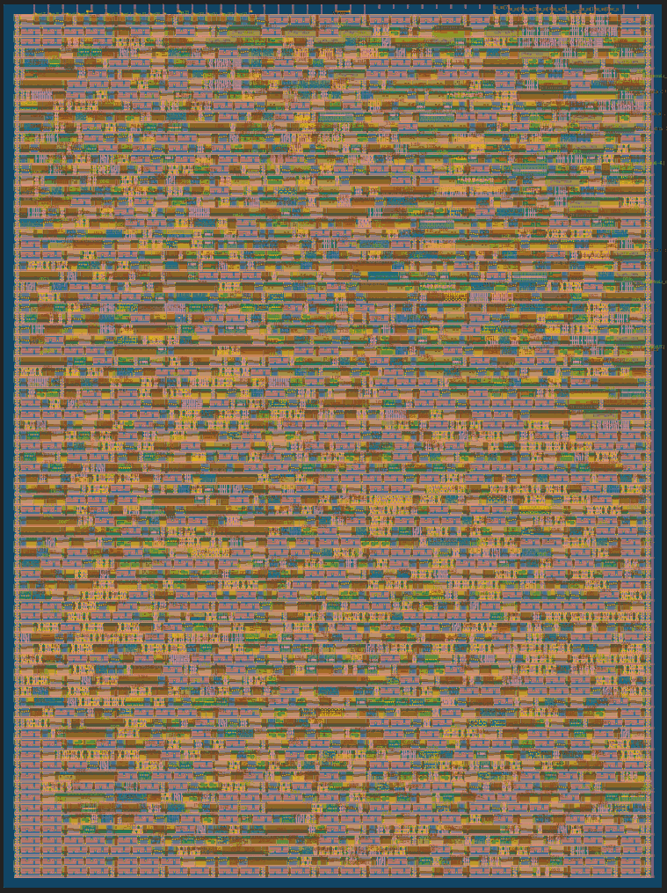

# 22 Aug 2023

| Previous journal: | Next journal: |
|-|-|
| [**0128**-2023-08-21.md](./0128-2023-08-21.md) | *Next journal TBA* |

# tt04-reciprocal

## Findings

*   TT04's newer OpenLane has 41 steps compared with older version's 35. Aside from the linter, it looks like there are extra "Single-Corner STA" steps. In fact, maybe that's all of the extra steps.
*   I [modified my design](https://github.com/algofoogle/tt04-reciprocal/commit/5fd4f20f47fc4d3517c8c61c8cad0bb800a621b6) to be a little more real with registers and it hardens successfully with only 1 clkbuf fanout violation (from what I can tell). This is using a 1x2 tile size, which it mostly fills (~58% utilisation[^1], where ~60% is configured maximum):
    
*   Importantly, the `reciprocal` is successfully hardening; i.e. no yosys-abc error. So, I need to maybe start another `tt04-` example and start building it up until it fails.
*   It hardens the GDS locally and passes in the GHA too.
*   I went back to [tt04-raybox-zero] and found I could get it to harden successfully at 25MHz by commenting out the `height_scaler` reciprocal and just wiring up `assign traced_size = traced_vdist[2:-8];`. Of course, this could be leading to other undesirable logic reduction in `wall_tracer` and its reciprocals, that could be throwing results, but it's progress at least.
*   Weirdly, before I got to commenting out `height_scaler`, I noticed changes in the cell counts (when yosys-abc crashes) after fiddling with things that shouldn't matter, such as changing `1` to `1'b1` in `wall_tracer` and later introducing `$rtoi()` in `reciprocal`. I even noticed that it surfaced warnings-as-errors without a yosys-abc crash, which leads me to wonder whether maybe it depends on how the system traverses all the Verilog...?

## Next steps

*   Get onto sharing one `reciprocal` instance in the FSM, including generating the output `trace_size` directly insted of `traced_vdist`.
*   See if we can get a fit in 2x2.

## Other things we could try

*   Start with [tt04-reciprocal] and gradually *add* stuff to it, starting with `wall_tracer` and `map_rom`.
*   For any given test design, try to prevent logic reduction by (say) using registers in and out to increase unknowns.
*   Find out if there's a way to make the OpenLane harden much more verbose and actually expose errors in yosys-abc. I don't think we can get that far: yosys-abc itself seems to lack debug output/logging?
*   A variation could be to load only the upper (or lower) 16 bits and then let the remaining 8 be direct input, and see how fast the design can actually run. Do something similar with outputs then, too. Actually, could even do it with 11 bits when sharing full bus and leaving a couple spare for control and other debug.
*   Another variation might be to make it always increment the operand's lower 18 bits on clk, internally, and then do:
    *   8 ui_in:
        *   `i_abs`
        *   `i_debug` (if asserted, change to completely different IO modes and even clocking behaviour).
        *   `i_data[23:17]` (upper 6 bits of input operand)
    *   8 uo_out:
        *   `o_data[7:0]`
    *   8 uio_out, configured as outputs only:
        *   `o_data_parts`: Depends on clk: 0=>`[14:8]` 1=>`[21:15]` 2=>`[23:22]` plus something else?
        *   `o_sat`
    *   Test whether switching lower vs upper vs middle output bits makes a difference to speed (since I assume that higher bits take longer to cascade).

[^1]: This utilisation is reported in `--print-stats` and is the same as the full-summary "OpenDP_Util" but I'm still not sure if this is logic-cells area, wire routing area, or both combined.

## Notes

*   I wrote [2308A](./tips/2308A.md) as a quick summary of local GDS hardening for TT04 and then viewing the results.
*   I also started [2308B](./tips/2308B.md) to collect links that I frequently use to help out with ASIC design stuff.
*   See [here](https://github.com/YosysHQ/yosys/issues/487) for comments on using `$rtoi()` to avoid warnings on implicit real-to-integer truncation, but also how it affects rounding (and compare with my own `ROUNDING_FIX`).
*   Matt Venn's recommended `~/.gtkwaverc` file for bigger traces/text and filled signals:
    ```
    fontname_signals Monospace 18
    fontname_waves Monospace 18
    splash_disable 1
    fill_waveform 1
    ```

[tt04-raybox-zero]: https://github.com/algofoogle/tt04-raybox-zero
[tt04-reciprocal]: https://github.com/algofoogle/tt04-reciprocal
