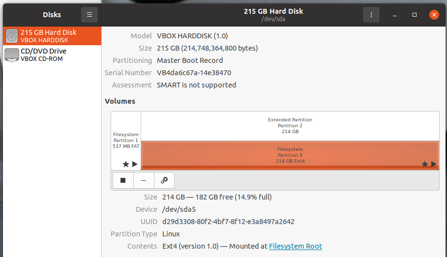

# 26 Aug 2023

| Previous journal: | Next journal: |
|-|-|
| [**0132**-2023-08-25.md](./0132-2023-08-25.md) | [**0134**-2023-08-27.md](./0134-2023-08-27.md) |

# Setting up MPW8 VM again on a new laptop

NOTE: This is a complement to [0123](./0123-2023-08-14.md) where I set up my new laptop's Windows 11 host environment. The below deals with then getting the MPW8 Linux environment working with VirtualBox.

## Import the VM

1.  I installed VirtualBox 7.0.10 on a Windows 11 Home host with 32GB RAM and Core i9 CPU.
2.  I downloaded the MPW8 VM again ([`Zero to ASIC Course MPW8.ova`](https://drive.google.com/file/d/1rxz_QN7uWsOruJFk83YJXVSSBzuuZgGk/view?usp=share_link)) per the [Zero to ASIC course instructions](https://course.zerotoasiccourse.com/mod/lesson/view.php?id=63&pageid=116).
3.  The file is about 10GB (10,467,980,288 bytes), and its md5sum is `717755d5d9ed8990a26fe7ab51b9b971`
4.  In VirtualBox: File => Import Applicance, select 'Expert' mode, select the OVA file.
5.  Assign 8 CPUs and 23,000MB RAM. Change base folder to `C:\VMs`.
6.  Below the scrollable config options set 'Machine Base Folder' also to `C:\VMs`. Keep all other settings (esp. NAT Network) as-is.
7.  Click 'Finish'. It will take a few minutes to build.

## Configure the VM

1.  Increase Video Memory to 128MB.
2.  Create a 'Shared Folder' for Windows 'Documents'. Name it `HOST_Documents` and turn on 'Auto-mount'
3.  Boot the VM for the first time.
4.  Maximise, then when ready click `zerotoasic` user and password is `12345`
5.  Suppress VirtualBox notifications that appear on RHS.
6.  Display may not auto-scale straight away (despite View => Auto-resize Guest Display being ticked on), so un-maximise and maximise again.
7.  Go to Settings (either via arrow in top-right corner, or go to applications widget in bottom-left corner and search for and select 'Settings'). Set the following:
    *   Privacy => Screen Lock: Set screen blanking to Never, turn off automatic screen lock, turn off 'Lock Screen on Suspend'.
    *   Keyboard Shortcuts: Search for 'calc' and set 'Launch calculator' to Shift+Win+C (Shift+Super+C)
    *   Universal Access: Set cursor size as you like
    *   Users: 'Unlock' and turn on 'Automatic Login'
    *   Date &amp; Time: 'Unlock' and set Time Zone to 'ACST (Adelaide, Australia)'.
8.  Shut down the VM: RightCtrl+H (VirtualBox ACPI shutdown signal), or menu in top-right corner => Power Off.

## Resize virtual disk

NOTE: It's best to do this early on, especially because use of snapshots can make this [harder to do later](https://docs.google.com/spreadsheets/d/10W6RaZFFKiEBgWBWMpl-wNXEygXAUvypYUgx8fy_Z80/edit#gid=1364343794&range=C734:D754).

1.  Back in VirtualBox, go to File => Tools => Virtual Media Manager
2.  Select the VDI and click 'Properties', then type in a size of 200GB and click Apply.
3.  Go back to the VM and boot it.
4.  In booted VM, go to applications menu (bottom-left corner) and search for 'Disks'
5.  Select the main drive and then select 'Extended Partition: Partition 2'
6.  Click the settings cog and from the menu select 'Resize...'
7.  Drag the slider all the way to the right, making the partition (hopefully) on the order of 200~214GB.
8.  Click the 'Resize' button
9.  Now 'Filesystem: Partition 5, 42 GB Ext4', and repeat the resize steps.
10. At the end it should look something like this:
    
11. Open a Terminal and run `df -h /` and it will hopefully show ~162GB free.

## Snapshot: MPW8 basic tweaks

1.  Power off the VM
2.  Take a snapshot, 'MPW8 basic tweaks', optionally linking to what was done above.

## Extra settings

1.  VM settings:
    *   General => Advanced => Drag'n'Drop, to set 'Host To Guest' because allowing the reverse can sometimes lead to problems if you drag a selection outside of the VM window.
    *   Display => Screen => Extended Features: Turn on 'Enable 3D Acceleration'.
2.  [Fix mousewheel scrolling](./0061-2023-04-16.md#fixing-mouse-wheel-in-ubuntu-20-desktop-vm) (don't worry about disabling drag-drop).
3.  Generate an SSH key (from [this](https://docs.github.com/en/authentication/connecting-to-github-with-ssh/generating-a-new-ssh-key-and-adding-it-to-the-ssh-agent)):
    ```bash
    # Generate:
    ssh-keygen -t ed25519 -C "anton@foogle.com"
    # Show pub key, so you can copy it:
    cat /home/zerotoasic/.ssh/id_ed25519.pub
    ```
4.  Register SSH key [with GitHub](https://github.com/settings/keys). I called it 'MPW8 VM on Legion 7'.
5.  Test SSH key:
    ```bash
    ssh -T git@github.com
    # Answer 'yes' when prompted.
    # Expect final output to be:
    # => Hi algofoogle! You've successfully authenticated, but GitHub does not provide shell access.
    ```
6.  Add the following to `~/.vimrc` to configure vim for indenting using 4 spaces (even though I'm a tabs guy):
    ```vimrc
    set expandtab
    set tabstop=4
    set shiftwidth=4
    ```
7.  Add the following to the end of `~/.bashrc`:
    ```bash
    # Improve prompt to include time and git branch:
    parse_git_branch() {
        git branch 2> /dev/null | sed -e '/^[^*]/d' -e 's/* \(.*\)/(\1)/'
    }
    export PS1="[\t] \u@\h \[\e[32m\]\w \[\e[91m\]\$(parse_git_branch)\[\e[00m\]$ "

    # Function to set Gnome terminal title. For more info, see:
    # https://unix.stackexchange.com/a/186167
    function set-title() {
        if [[ -z "$ORIG" ]]; then
            ORIG=$PS1
        fi
        TITLE="\[\e]2;$*\a\]"
        PS1=${ORIG}${TITLE}
    }
    ```
    Then load this with: `source ~/.bashrc` -- it adds the `set-title` function which can be called like `set-title whatever you want` (no string quoting required) to set the title of the current Gnome Terminal tab. The bit above also updates the prompt with time, colours, and git branch (if any).
8.  If using a high-resolution display (e.g. 4K) create Matt Venn's recommended `~/.gtkwaverc` file for bigger traces/text and filled signals:
    ```
    fontname_signals Monospace 18
    fontname_waves Monospace 18
    splash_disable 1
    fill_waveform 1
    ```
9.  `sudo apt update`
10. Install packages for doing GDS-to-PNG conversion:
    ```bash
    sudo apt install librsvg2-bin pngquant
    ```

## Setup for OpenLane switching and local Tiny Tapeout hardening

This is written as a variation on [Hardening Tiny Tapeout Projects Locally]...

1.  `cd ~; mkdir anton; cd anton`
1.  Create the file `~/tt04-config-openlane.sh`:
    ```bash
    #!/usr/bin/bash
    export OLENV=tt04 # Prompt helper
    export OPENLANE_ROOT=~/tt/openlane
    export PDK_ROOT=~/tt/pdk
    export PDK=sky130A
    export OPENLANE_TAG=2023.06.26
    export OPENLANE_IMAGE_NAME=efabless/openlane:3bc9d02d0b34ad032921553e512fbe4bebf1d833
    ```
    NOTE: If you want to load these environment variables in your terminal, you can do: `source ~/tt04-config-openlane.sh`
2.  Likewise, create the file `~/mpw8-config-openlane.sh`:
    ```bash
    #!/usr/bin/bash
    export OLENV=mpw8 # Prompt helper
    export OPENLANE_ROOT=~/asic_tools/openlane
    export PDK_ROOT=~/asic_tools/pdk
    export PDK=sky130A
    export OPENLANE_TAG=2022.11.19
    export OPENLANE_IMAGE_NAME=efabless/openlane:cb59d1f84deb5cedbb5b0a3e3f3b4129a967c988-amd64
    ```
3.  Add the following to `~/.bashrc`:
    ```bash
    # Helper to load various OpenLane environments and then execute the given command with it:
    #SMELL: This feels clunky. It's based on: https://stackoverflow.com/a/39463371/5633460
    alias sourcett04='source ~/tt/venv/bin/activate'
    function mpw8env() { BASH_ENV=~/mpw8-config-openlane.sh bash -c "$(printf "%q " "$@")"; }
    function tt04env() { BASH_ENV=~/tt04-config-openlane.sh bash -c "$(printf "%q " "$@")"; }
    function tt04env-bash() { tt04env bash --rcfile <(echo '. ~/.bashrc; . ~/tt04-config-openlane.sh; . ~/tt/venv/bin/activate'); }
    ```
    ...then do `source ~/.bashrc` -- after this, you can prefix commands with `tt04env` and it will temporarily load the above environment for the following command. Example: `tt04env ./tt/tt_tool.py --harden` -- Test:
    ```bash
    tt04env env | fgrep OPENLANE
    mpw8env env | fgrep OPENLANE
    ```
    NOTE: The `sourcett04` alias will be used a little later, as will `tt04env-bash`.
4.  Update the stuff around `export PS1` (i.e. prompt-setting stuff) in `~/.bashrc` to:
    ```bash
    # Improve prompt to include time and git branch:
    parse_git_branch() {
        git branch 2> /dev/null | sed -e '/^[^*]/d' -e 's/* \(.*\)/(\1)/'
    }
    # Show OLENV if set (for selected OpenLane environment config, if any):
    olenv_helper() {
        echo $OLENV | sed -re 's/^(.+)$/\(OL=\1\) /'
    }
    export PS1="[\t] \[\e[91m\]\$(olenv_helper)\[\e[00m\]\u:\[\e[32m\]\w \[\e[91m\]\$(parse_git_branch)\[\e[00m\]$ "
    ```
    This will show the detected OpenLane environment in the prompt (i.e. `OLENV` variable, as optionally defined above).
5.  Clone the [tt-support-tools@tt04] repo:
    ```bash
    cd ~/anton
    git clone -b tt04 https://github.com/TinyTapeout/tt-support-tools
    cd tt-support-tools
    ```
6.  Create the Python venv for TT: `python3 -m venv ~/tt/venv`
7.  Activate that venv with: `sourcett04`
8.  Install Python dependencies with: `pip install -r requirements.txt`
9.  Now we should able to (say) open a new tab or terminal, and do:
    *   `env | fgrep OPENLANE` -- Should see OPENLANE_ROOT=/home/zerotoasic/`asic_tools`/openlane
    *   `mpw8env env | fgrep OPENLANE` -- As above, with others
    *   `tt04env env | fgrep OPENLANE` -- As above but changed inc. OPENLANE_ROOT=/home/zerotoasic/`tt`/openlane
10. Start a specific TT04 bash shell, with: `tt04env-bash` -- and the rest of these instructions occur inside that shell:
    1.  Make sure the prompt is prefixed with `(venv)` to indicate that the Python venv is active.
    2.  Prove the TT04 OPENLANE env vars are intact with:
        ```bash
        env | fgrep OPENLANE
        # Expect to see:
        # OPENLANE_ROOT=/home/zerotoasic/tt/openlane
        # OPENLANE_TAG=2023.06.26
        # OPENLANE_IMAGE_NAME=efabless/openlane:3bc9d02d0b34ad032921553e512fbe4bebf1d833
        ```
    3.  Install OpenLane (in the TT-specific `$OPENLANE_ROOT` path of `~/tt/openlane`):
        ```bash
        git clone --depth=1 --branch $OPENLANE_TAG https://github.com/The-OpenROAD-Project/OpenLane.git $OPENLANE_ROOT
        cd $OPENLANE_ROOT
        make
        ```
    4.  Do a test harden (with this environment already loaded):
        ```bash
        cd ~/anton
        git clone https://github.com/TinyTapeout/tt04-factory-test
        cd tt04-factory-test
        git clone -b tt04 https://github.com/TinyTapeout/tt-support-tools tt
        ./tt/tt_tool.py --create-user-config
        time ./tt/tt_tool.py --harden
        ```
    5.  Exit the tt04env-bash shell: `exit`


## Snapshot: Environment Helpers

1.  Power off the VM
2.  Take a snapshot, 'Environment Helpers', optionally linking to what was done above.
3.  Power the VM back on. Note that sometimes after updates like these, the VM may go thru extra startup routines and take longer to boot than usual. Hit <kbd>ESC</kbd> to see the boot log.

## VSCode

Based on [Visual Studio Code on Linux](https://code.visualstudio.com/docs/setup/linux):

1.  Install with Snap: `sudo snap install --classic code`
2.  Launch with: `code ~/anton/tt04-factory-test`
3.  Install extensions:
    *   [GitHub Markdown Preview](https://marketplace.visualstudio.com/items?itemName=bierner.github-markdown-preview) (search ID: `bierner.github-markdown-preview`) -- For previewing files as GFM.
    *   C/C++: `ms-vscode.cpptools` -- Worry about doing the 'Get Started with C++ Development' walkthru later.
    *   C/C++ Extension Pack: `ms-vscode.cpptools-extension-pack`
    *   Tcl: `bitwisecook.tcl`
    *   Python: `ms-python.python` -- Go thru 'Get Started with Python Development' later.
    *   Verilog-HDL/SystemVerilog/Bluespec Systemverilog: `mshr-h.veriloghdl`
    *   Hex Editor: `ms-vscode.hexeditor`
    *   NOTE: These will include some extras, such as Pylance and CMake stuff.
    *   NOTE: Optional extra: Makefile Tools: `ms-vscode.makefile-tools`

## Test run

1.  `cd ~/anton`
2.  <kbd>CTRL+SHIFT+T</kbd> in Gnome Terminal to create 3 tabs. Name each of them (using `set-title`): `journal`, `raybox-zero`, `tt04-rbz`
3.  In `journal`: `git clone git@github.com:algofoogle/journal && cd journal`
4.  In `raybox-zero`: `git clone git@github.com:algofoogle/raybox-zero && cd raybox-zero`
5.  In `tt04-rbz`:
    1.  ```bash
        git clone git@github.com:algofoogle/tt04-raybox-zero --recurse-submodules
        cd tt04-raybox-zero
        tt04env-bash
    2.  ```bash
        git clone -b tt04 https://github.com/TinyTapeout/tt-support-tools tt
        ./tt/tt_tool.py --create-user-config
        time ./tt/tt_tool.py --debug --harden
        ```
        It'll probably fail with the usual yosys-abc bug.
    3.  I ran `time ./harden_test.sh` and it completed in about 48 minutes.
6.  Shut down the VM and in VM settings assign it 16 cores.
7.  When booting back up, I ran the laptop in 'performance' mode and added this to tt04-raybox-zero's `src/config.tcl`:
    ```tcl
    set ::env(ROUTING_CORES) 15
    ```
8.  Then, when running `time ./harden_test.sh` in completed in under 28 minutes.


## Snapshot: VSCode ready

1.  Power off the VM
2.  Take a snapshot, 'VSCode ready', optionally linking to what was done above.


## Notes

*   There are 2 keyboard configs on this VM: US and UK. Maybe get rid of the UK one.
    Otherwise, if you need, change to the correct one by clicking on `en2` in the top-right corner.
*   VM already has localhost:2522 forwarding for SSH to guest.

## Next steps

*   Simulation stuff, esp. Verilator and SDL. Look at READMEs for my various HDL projects.
*   Fix Docker ability to run OpenLane GUI: https://github.com/algofoogle/journal/blob/master/0083-2023-05-23.md#:~:text=Meanwhile%2C%20I%27m%20going%20to%20try%20inspecting%20my%20above%20failed%20run%20with%20the%20OpenROAD%20GUI%20as%20follows
*   Helpers for launching OpenLane docker containers, e.g. per: https://github.com/algofoogle/journal/blob/master/0127-2023-08-20.md#going-into-the-updated-openlane-3bc9d02-docker-container
*   RP2040 toolchain? https://github.com/algofoogle/journal/blob/master/0092-2023-06-08.md#raspberry-pi-pico-getting-started-with-arduino-libs-support, subsequent pages, minicom, `sudo adduser zerotoasic dialout`

## No need to worry about?

*   Software Update?
*   Check: VirtualBox => System => Processor => Extended Features => 'Enable Nested VT-x/AMD-V' option is not available. Need to enable in laptop BIOS? Will not having this slow down docker?
*   NOTE: 8 vCPUs are assigned to the VM, but the host's Core i9 has 24. Consider more? How to enable OpenLane multi-core anyway??
*   Any benefit to turning on VirtualBox 'Enable 3D Acceleration'?
*   Consider setting USB mode to 2.0 or 3.0 if we need actual USB passthrough.
*   PER PROJECT: Configure extra OpenLane cores: https://github.com/algofoogle/journal/blob/master/0086-2023-05-26.md#notes

[Hardening Tiny Tapeout Projects Locally]: https://docs.google.com/document/d/1aUUZ1jthRpg4QURIIyzlOaPWlmQzr-jBn3wZipVUPt4/edit#heading=h.wwc5ldl01nl5
[tt-support-tools@tt04]: https://github.com/tinytapeout/tt-support-tools/tree/tt04