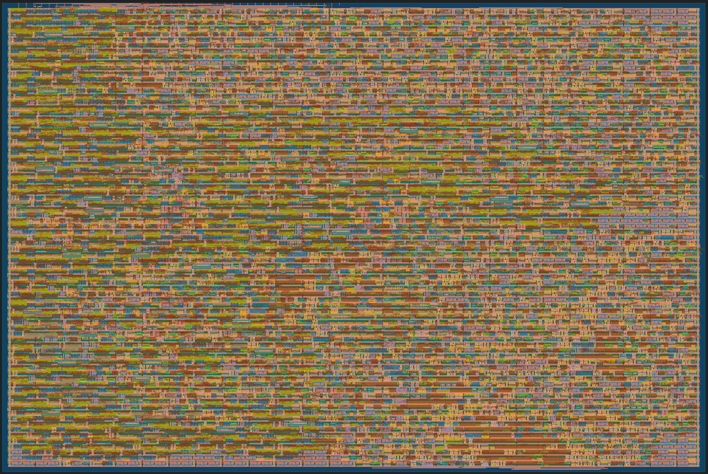
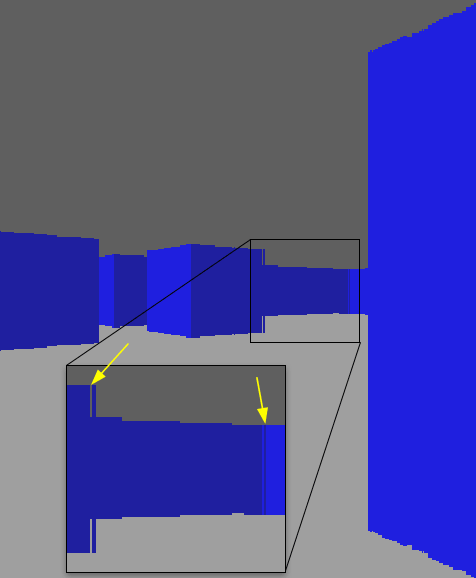

# 5 Sep 2023

| Previous journal: | Next journal: |
|-|-|
| [**0142**-2023-09-04.md](./0142-2023-09-04.md) | [**0144**-2023-09-06.md](./0144-2023-09-06.md) |

# raybox-zero

## New tests

### test009: Start changing pov outputs

The [first commit in the test009 branch](https://github.com/algofoogle/raybox-zero/commit/aae98776a56a7cf1754e42f41097dc18f817ea1d) was only run a single combo test at 4x2:5. The results were basically the same as for test005, which is to be expected since there was no functional change in the pov.v code -- just a different way to define the same logic.


### test009-2: Restrict pov output bits to Q9.9

<details><summary>Click for details...</summary>

Code:
*   tt04-raybox-zero: [`aec8784`](https://github.com/algofoogle/tt04-raybox-zero/commit/aec8784?diff=split): harden_test: Dry drun, ROUTING_CORES options
    *   Equivalent to: [`93dd1cd`](https://github.com/algofoogle/tt04-raybox-zero/commit/93dd1cd?diff=split): config.tcl default of 25MHz, using raybox-zero merged test005-shmul branch.
*   src/raybox-zero: [`68dd419`](https://github.com/algofoogle/raybox-zero/commit/68dd419?diff=split): (test009) Restricting pov output bits

Summary:
*   pov's vectors all changed from SQ12.12 to SQ9.9 range on output ports to see if it would make any difference on synth.

Options used:
```
  STARTED: 2023-09-04 23:34:54
    SIZES: 4x2 8x2 (sorted: 4x2 8x2)
   COMBOS: 5 4 1 2 3 (sorted: 1 2 3 4 5)
    STOPT: 0
  OUTFILE: stats-test009-2.md
   SELECT: :[1245]
    FORCE: 0
      TAG: test009-2: Restrict pov output bits to Q9.9
   RCORES: 7
      DRY: 0
 FINISHED: 2023-09-05 00:27:34
```

</details>

| | 4x2:1 | 8x2:1 | 4x2:2 | 8x2:2 | 4x2:3 | 8x2:3 | 4x2:4 | 8x2:4 | 4x2:5 | 8x2:5 |
|-|-:|-:|-:|-:|-:|-:|-:|-:|-:|-:|
| suggested_mhz | 25.00 | 25.00 | 50.00 | 50.00 | 0.00 | 0.00 | 47.71 | 47.78 | 25.00 | 25.00 |
| utilisation_% | 51.67 | 25.64 | 51.67 | 25.64 | 0.00 | 0.00 | 43.85 | 21.76 | 43.57 | 21.62 |
| wire_length_um | 218,026 | 221,045 | 219,926 | 222,004 | 0 | 0 | 158,234 | 164,957 | 158,501 | 158,461 |
| TotalCells | 20,634 | 35,608 | 20,663 | 35,578 | 0 | 0 | 20,105 | 35,323 | 20,002 | 35,122 |
| cells_pre_abc | 12,041 | 12,041 | 12,041 | 12,041 | 0 | 0 | 12,041 | 12,041 | 12,041 | 12,041 |
| synth_cells | 7,520 | 7,520 | 7,520 | 7,520 | 0 | 0 | 6,587 | 6,587 | 6,587 | 6,587 |
| logic_cells | 8,005 | 7,976 | 8,113 | 8,050 | 0 | 0 | 7,109 | 7,117 | 7,081 | 7,081 |
| pin_antennas | 4 | 10 | 3 | 9 | 0 | 0 | 0 | 1 | 3 | 2 |
| net_antennas | 4 | 9 | 3 | 8 | 0 | 0 | 0 | 1 | 3 | 2 |
| spef_wns | 0.00 | 0.00 | 0.00 | 0.00 | 0.00 | 0.00 | -0.96 | -0.93 | 0.00 | 0.00 |
| spef_tns | 0.00 | 0.00 | 0.00 | 0.00 | 0.00 | 0.00 | -43.33 | -43.89 | 0.00 | 0.00 |

Findings ([compared to test005](./0141-2023-09-03.md#test005-copy-of-trying-shared-multiplier-for-trackinit)):
*   **All combos now synth**.
*   **4x2:5 util reduces from 48.86% to 43.57%**
*   4x2:2 can now reach 50MHz (up from 47.62)
*   Combo 4 is now *closer* to 50MHz (up to ~47.7 from ~45.5)


### test009-3: restrict pov output bits to typical minimum (Q7.9 and Q2.9)

<details><summary>Click for details...</summary>

Code:
*   tt04-raybox-zero: [`aec8784`](https://github.com/algofoogle/tt04-raybox-zero/commit/aec8784?diff=split): harden_test: Dry drun, ROUTING_CORES options
    *   Equivalent to: [`93dd1cd`](https://github.com/algofoogle/tt04-raybox-zero/commit/93dd1cd?diff=split): config.tcl default of 25MHz, using raybox-zero merged test005-shmul branch.
*   src/raybox-zero: [`b04ac58`](https://github.com/algofoogle/raybox-zero/commit/b04ac58?diff=split): (test009) pov output is now Q7.9 for player, Q2.9 for facing and vplane

Summary:
*   Go from SQ9.9 for everything to playerX/Y using SQ7.9 and facing/vplane using SQ2.9

Options used:
```
  STARTED: 2023-09-04 23:46:06
    SIZES: 4x2 8x2 (sorted: 4x2 8x2)
   COMBOS: 5 4 1 2 3 (sorted: 1 2 3 4 5)
    STOPT: 0
  OUTFILE: stats-test009-3.md
   SELECT: :[1245]
    FORCE: 1
      TAG: test009-3: restrict pov output bits to typical minimum (Q7.9 and Q2.9)
   RCORES: 14
      DRY: 0
 FINISHED: 2023-09-05 00:28:20
```

</details>

| | 4x2:1 | 8x2:1 | 4x2:2 | 8x2:2 | 4x2:3 | 8x2:3 | 4x2:4 | 8x2:4 | 4x2:5 | 8x2:5 |
|-|-:|-:|-:|-:|-:|-:|-:|-:|-:|-:|
| suggested_mhz | 25.00 | 25.00 | 50.00 | 50.00 | 0.00 | 0.00 | 48.71 | 48.52 | 25.00 | 25.00 |
| utilisation_% | 48.45 | 24.05 | 48.45 | 24.05 | 0.00 | 0.00 | 41.40 | 20.55 | 41.35 | 20.52 |
| wire_length_um | 200,721 | 200,479 | 203,397 | 202,421 | 0 | 0 | 146,345 | 149,706 | 140,652 | 143,309 |
| TotalCells | 20,290 | 35,189 | 20,275 | 35,325 | 0 | 0 | 19,930 | 34,932 | 19,747 | 34,762 |
| cells_pre_abc | 11,838 | 11,838 | 11,838 | 11,838 | 0 | 0 | 11,838 | 11,838 | 11,838 | 11,838 |
| synth_cells | 7,042 | 7,042 | 7,042 | 7,042 | 0 | 0 | 6,242 | 6,242 | 6,242 | 6,242 |
| logic_cells | 7,469 | 7,472 | 7,588 | 7,578 | 0 | 0 | 6,721 | 6,728 | 6,674 | 6,687 |
| pin_antennas | 3 | 2 | 3 | 4 | 0 | 0 | 2 | 3 | 3 | 2 |
| net_antennas | 3 | 2 | 3 | 4 | 0 | 0 | 2 | 3 | 3 | 2 |
| spef_wns | 0.00 | 0.00 | 0.00 | 0.00 | 0.00 | 0.00 | -0.53 | -0.61 | 0.00 | 0.00 |
| spef_tns | 0.00 | 0.00 | 0.00 | 0.00 | 0.00 | 0.00 | -18.35 | -25.46 | 0.00 | 0.00 |

Findings (compared to test009-2 above):
*   **4x2:5 util reduces from 43.57% to 41.35%**
*   Combo 4 speed improvement (up to ~48.5MHz from ~47.7)


### test009-4: pov SPI takes 74b: UQ6.9 for playerX/Y, SQ2.9 for others

<details><summary>Click for details...</summary>

Code:
*   tt04-raybox-zero: [`aec8784`](https://github.com/algofoogle/tt04-raybox-zero/commit/aec8784?diff=split): harden_test: Dry drun, ROUTING_CORES options
    *   Equivalent to: [`93dd1cd`](https://github.com/algofoogle/tt04-raybox-zero/commit/93dd1cd?diff=split): config.tcl default of 25MHz, using raybox-zero merged test005-shmul branch.
*   src/raybox-zero: [`f45301a`](https://github.com/algofoogle/raybox-zero/commit/f45301a?diff=split): (test009): pov SPI takes 74b: UQ6.9 for playerX/Y, SQ2.9 for others. Sim updated to suit

Summary:
*   playerX/Y changed from SQ7.9 to UQ6.9
*   SPI input stream size changed from 144 bits to 74 bits, and internal pov registers/buffers updated accordingly

Options used:
```
  STARTED: 2023-09-05 12:14:17
    SIZES: 4x2 8x2 (sorted: 4x2 8x2)
   COMBOS: 5 4 1 2 3 (sorted: 1 2 3 4 5)
    STOPT: 0
  OUTFILE: stats-test009-4.md
   SELECT: :[1245]
    FORCE: 0
      TAG: test009-4: pov SPI takes 74b: UQ6.9 for playerX/Y, SQ2.9 for others
   RCORES: 7
      DRY: 0
 FINISHED: 2023-09-05 13:07:31
```

</details>

| | 4x2:1 | 8x2:1 | 4x2:2 | 8x2:2 | 4x2:3 | 8x2:3 | 4x2:4 | 8x2:4 | 4x2:5 | 8x2:5 |
|-|-:|-:|-:|-:|-:|-:|-:|-:|-:|-:|
| suggested_mhz | 25.00 | 25.00 | 50.00 | 50.00 | 0.00 | 0.00 | 46.99 | 46.69 | 25.00 | 25.00 |
| utilisation_% | 49.23 | 24.43 | 49.23 | 24.43 | 0.00 | 0.00 | 39.40 | 19.56 | 39.33 | 19.52 |
| wire_length_um | 225,379 | 225,137 | 227,330 | 227,253 | 0 | 0 | 140,968 | 146,688 | 135,373 | 137,823 |
| TotalCells | 20,499 | 35,418 | 20,376 | 35,510 | 0 | 0 | 19,609 | 34,615 | 19,472 | 34,516 |
| cells_pre_abc | 11,774 | 11,774 | 11,774 | 11,774 | 0 | 0 | 11,774 | 11,774 | 11,774 | 11,774 |
| synth_cells | 7,263 | 7,263 | 7,263 | 7,263 | 0 | 0 | 5,912 | 5,912 | 5,912 | 5,912 |
| logic_cells | 7,639 | 7,610 | 7,716 | 7,736 | 0 | 0 | 6,279 | 6,289 | 6,240 | 6,243 |
| pin_antennas | 5 | 3 | 0 | 0 | 0 | 0 | 2 | 3 | 2 | 0 |
| net_antennas | 5 | 3 | 0 | 0 | 0 | 0 | 2 | 3 | 2 | 0 |
| spef_wns | 0.00 | 0.00 | 0.00 | 0.00 | 0.00 | 0.00 | -1.28 | -1.42 | 0.00 | 0.00 |
| spef_tns | 0.00 | 0.00 | 0.00 | 0.00 | 0.00 | 0.00 | -65.45 | -75.88 | 0.00 | 0.00 |

Findings (compared to test009-3 above):
*   **4x2:5 util reduces from 41.35% to 39.33%**
*   Combo 4 speed is *worse* (down to ~46.7MHz from ~48.5)

### test009-4 TARGETING 2x2

I ran this command:

```bash
time ./harden_test.sh -t "test009-4 with 2x2 target" -o stats-test009-4-2x2:5.md :[1245] -p 7 -u 0.82 -s 2x2 -c 5
```

...to target a 2x2 tile size with a density of 0.82 (over the default of 0.65) and to my surprise it fit.

NOTE: I did also try combos 1..4 with a 2x2 target, but they all failed given they don't override target density, so I didn't bother including their results.


<details><summary>Click for details...</summary>

This run was otherwise the same as test009-4.

Options used:
```
  STARTED: 2023-09-05 14:22:20
    SIZES: 2x2 (sorted: 2x2)
   COMBOS: 5 4 1 2 3 (sorted: 1 2 3 4 5)
  DENSITY: 0.82
    STOPT: 0
  OUTFILE: stats-test009-4-2x2.md
   SELECT: :[1245]
    FORCE: 0
      TAG: test009-4 with 2x2 target
   RCORES: 7
      DRY: 0
 FINISHED: 2023-09-05 14:28:57
```

</details>

| | 2x2:5 |
|-|-:|
| suggested_mhz    | 25.00 |
| utilisation_%    | 79.84 |
| wire_length_um   | 137,415 |
| TotalCells       | 11,416 |
| cells_pre_abc    | 11,774 |
| synth_cells      | 5,912 |
| logic_cells      | 6,252 |
| pin_antennas     | 0 |
| net_antennas     | 0 |
| spef_wns         | 0.00 |
| spef_tns         | 0.00 |

Findings:
*   **2x2:5 SUCCEEDS at 25MHz with ~80% utilisation**



NOTE:
*   I'm not clear on whether 80% utilisation is OK for TT04. [Here](https://discord.com/channels/1009193568256135208/1009473432834035732/1143529029576695808) Uri thought 88% was OK for 1x1? [Matt just confirmed that 80% for a 2x2 is acceptable for TT04](https://discord.com/channels/1009193568256135208/1016726411400200292/1148505571549511711).
*   How much power will this consume in normal operation?
    *   `metrics.csv` suggests 0.236&micro;W for typical switching, where it is written as `uW`:
        ```
         power_typical_internal_uW :    0.172
        power_typical_switching_uW :    0.236
          power_typical_leakage_uW : 2.84e-08
        ```
    *   ...but it's confusing because it says these figures are in **watts** in `runs/wokwi/reports/signoff/31-rcx_sta.power.rpt`:
        ```
        ===========================================================================
        report_power
        ============================================================================
        ======================= Typical Corner ===================================

        Group                  Internal  Switching    Leakage      Total
                                  Power      Power      Power      Power (Watts)
        ----------------------------------------------------------------
        Sequential             6.50e-04   1.62e-04   3.72e-09   8.12e-04   0.2%
        Combinational          1.71e-01   2.35e-01   2.47e-08   4.07e-01  99.8%
        Macro                  0.00e+00   0.00e+00   0.00e+00   0.00e+00   0.0%
        Pad                    0.00e+00   0.00e+00   0.00e+00   0.00e+00   0.0%
        ----------------------------------------------------------------
        Total                  1.72e-01   2.36e-01   2.84e-08   4.08e-01 100.0%
                                  42.2%      57.8%       0.0%
        ```
    *   So which is right? 0.236&micro;W or 0.236W, because the latter could be bad, especially if the *total* is ~408mW in such a small area (~339x226um)
*   Power in normal use, however, might be nowhere near this bad... the bulk of switching might stop at the end of each line trace, which could be as little as 10% in... and in fact the heavy switching for calculating multiplication and reciprocals might be more like 1% of the time.


### test010: Fixed point internal precision changed to Q9.10 (down from Q12.12)

<details><summary>Click for details...</summary>

Code:
*   tt04-raybox-zero: [`48b07c3`](https://github.com/algofoogle/tt04-raybox-zero/commit/48b07c3?diff=split): harden_test: Fix for overriding PL_TARGET_DENSITY
    *   Equivalent to: [`9ffc209`](https://github.com/algofoogle/tt04-raybox-zero/commit/9ffc209?diff=split): Update submodule for pov UQ6.9/SQ2.9 changes, and try fit in 2x2 with 82% target density
*   src/raybox-zero: [`55753a4`](https://github.com/algofoogle/raybox-zero/commit/55753a4?diff=split): test010: Fixed point internal precision changed to Q9.10 from Q12.12

Summary:
*   Change `fixed_point_params.v` to use Q9.10 instead of usual Q12.12
*   Manually updated `lzc.v` accordingly.
*   Updated other code to make it automatically support a change in these parameters.

Options used:
```
  STARTED: 2023-09-05 18:03:22
    SIZES: 4x2 8x2 (sorted: 4x2 8x2)
   COMBOS: 5 4 1 2 3 (sorted: 1 2 3 4 5)
  DENSITY: 0.65
    STOPT: 0
  OUTFILE: stats-test010.md
   SELECT: :[1245]
    FORCE: 0
      TAG: test010: Q9.10 overall internally
   RCORES: 7
      DRY: 0
 FINISHED: 2023-09-05 18:43:15
```

</details>

| | 4x2:1 | 8x2:1 | 4x2:2 | 8x2:2 | 4x2:3 | 8x2:3 | 4x2:4 | 8x2:4 | 4x2:5 | 8x2:5 |
|-|-:|-:|-:|-:|-:|-:|-:|-:|-:|-:|
| suggested_mhz | 25.00 | 25.00 | 50.00 | 50.00 | 0.00 | 0.00 | 50.00 | 50.00 | 25.00 | 25.00 |
| utilisation_% | 37.90 | 18.81 | 37.90 | 18.81 | 0.00 | 0.00 | 31.66 | 15.71 | 31.66 | 15.71 |
| wire_length_um | 153,767 | 151,102 | 161,197 | 158,307 | 0 | 0 | 117,756 | 119,241 | 113,366 | 114,396 |
| TotalCells | 19,113 | 34,105 | 19,118 | 34,149 | 0 | 0 | 18,611 | 33,649 | 18,580 | 33,546 |
| cells_pre_abc | 8,441 | 8,441 | 8,441 | 8,441 | 0 | 0 | 8,441 | 8,441 | 8,441 | 8,441 |
| synth_cells | 5,492 | 5,492 | 5,492 | 5,492 | 0 | 0 | 4,688 | 4,688 | 4,688 | 4,688 |
| logic_cells | 5,806 | 5,823 | 5,924 | 5,958 | 0 | 0 | 5,070 | 5,087 | 5,003 | 4,993 |
| pin_antennas | 2 | 3 | 2 | 1 | 0 | 0 | 1 | 6 | 2 | 1 |
| net_antennas | 2 | 3 | 2 | 1 | 0 | 0 | 1 | 6 | 2 | 1 |
| spef_wns | 0.00 | 0.00 | 0.00 | 0.00 | 0.00 | 0.00 | 0.00 | 0.00 | 0.00 | 0.00 |
| spef_tns | 0.00 | 0.00 | 0.00 | 0.00 | 0.00 | 0.00 | 0.00 | 0.00 | 0.00 | 0.00 |

Findings (compared to [test009-4 above](#test009-4-pov-spi-takes-74b-uq69-for-playerxy-sq29-for-others)):
*   **All combos now synth and meet 50MHz timing**
*   **4x2:5 util down from 39.33% to 31.66%**
*   Combos 1 and 2 reduced substantially.
*   **NOTE**: There is a small amount of precision lost that is visually noticeable: Wall edges get a little more jagged, but not too bad (and possibly worth the util savings). If we can get textures working soon too, then this might be less or more noticeable.

### test010-2: Try Q8.10 instead of Q9.10

<details><summary>Click for details...</summary>

Code:
*   tt04-raybox-zero: [`48b07c3`](https://github.com/algofoogle/tt04-raybox-zero/commit/48b07c3?diff=split): harden_test: Fix for overriding PL_TARGET_DENSITY
    *   Equivalent to: [`9ffc209`](https://github.com/algofoogle/tt04-raybox-zero/commit/9ffc209?diff=split): Update submodule for pov UQ6.9/SQ2.9 changes, and try fit in 2x2 with 82% target density
*   src/raybox-zero: [`7ec3bf8`](https://github.com/algofoogle/raybox-zero/commit/7ec3bf8?diff=split): (test010) Try Q8.10 instead of Q9.10

Summary:
*   Small change from Q9.10 to Q8.10, since I don't think we need that extra range at all.

Options used:
```
  STARTED: 2023-09-05 18:04:20
    SIZES: 4x2 8x2 (sorted: 4x2 8x2)
   COMBOS: 5 4 1 2 3 (sorted: 1 2 3 4 5)
  DENSITY: 0.65
    STOPT: 0
  OUTFILE: stats-test009-2.md
   SELECT: :[1245]
    FORCE: 0
      TAG: test010-2: Try Q8.10 instead of Q9.10
   RCORES: 14
      DRY: 0
 FINISHED: 2023-09-05 18:40:52
```

</details>

| | 4x2:1 | 8x2:1 | 4x2:2 | 8x2:2 | 4x2:3 | 8x2:3 | 4x2:4 | 8x2:4 | 4x2:5 | 8x2:5 |
|-|-:|-:|-:|-:|-:|-:|-:|-:|-:|-:|
| suggested_mhz | 25.00 | 25.00 | 50.00 | 50.00 | 0.00 | 0.00 | 50.00 | 50.00 | 25.00 | 25.00 |
| utilisation_% | 37.07 | 18.39 | 37.07 | 18.39 | 0.00 | 0.00 | 30.60 | 15.19 | 30.60 | 15.19 |
| wire_length_um | 152,686 | 153,424 | 154,568 | 154,460 | 0 | 0 | 107,493 | 114,422 | 103,466 | 104,715 |
| TotalCells | 18,971 | 34,087 | 19,044 | 34,029 | 0 | 0 | 18,618 | 33,660 | 18,485 | 33,522 |
| cells_pre_abc | 7,910 | 7,910 | 7,910 | 7,910 | 0 | 0 | 7,910 | 7,910 | 7,910 | 7,910 |
| synth_cells | 5,393 | 5,393 | 5,393 | 5,393 | 0 | 0 | 4,590 | 4,590 | 4,590 | 4,590 |
| logic_cells | 5,742 | 5,754 | 5,813 | 5,800 | 0 | 0 | 4,993 | 4,996 | 4,907 | 4,895 |
| pin_antennas | 2 | 2 | 3 | 3 | 0 | 0 | 2 | 2 | 1 | 2 |
| net_antennas | 2 | 2 | 3 | 3 | 0 | 0 | 2 | 2 | 1 | 2 |
| spef_wns | 0.00 | 0.00 | 0.00 | 0.00 | 0.00 | 0.00 | 0.00 | 0.00 | 0.00 | 0.00 |
| spef_tns | 0.00 | 0.00 | 0.00 | 0.00 | 0.00 | 0.00 | 0.00 | 0.00 | 0.00 | 0.00 |

Findings (compared to test010 immediately above):
*   Slightly smaller util: 30.6% at 4x2:5, down from 31.66%
*   Visual appearance is no worse.


### test010-3: Try Q8.9

<details><summary>Click for details...</summary>

Code:
*   tt04-raybox-zero: [`48b07c3`](https://github.com/algofoogle/tt04-raybox-zero/commit/48b07c3?diff=split): harden_test: Fix for overriding PL_TARGET_DENSITY
    *   Equivalent to: [`9ffc209`](https://github.com/algofoogle/tt04-raybox-zero/commit/9ffc209?diff=split): Update submodule for pov UQ6.9/SQ2.9 changes, and try fit in 2x2 with 82% target density
*   src/raybox-zero: [`7ec3bf8`](https://github.com/algofoogle/raybox-zero/commit/7ec3bf8?diff=split): as above, but...
    *   **Modified** to be Q8.9 instead. Not committed.

Summary:
*   Tried out Q8.9 instead of Q8.10

Options used:
```
  STARTED: 2023-09-05 19:22:31
    SIZES: 4x2 8x2 (sorted: 4x2 8x2)
   COMBOS: 5 4 1 2 3 (sorted: 1 2 3 4 5)
  DENSITY: 0.65
    STOPT: 0
  OUTFILE: stats-test010-3.md
   SELECT: :[1245]
    FORCE: 0
      TAG: test010-3: Try Q8.9
   RCORES: 14
      DRY: 0
 FINISHED: 2023-09-05 19:54:00
```

</details>

| | 4x2:1 | 8x2:1 | 4x2:2 | 8x2:2 | 4x2:3 | 8x2:3 | 4x2:4 | 8x2:4 | 4x2:5 | 8x2:5 |
|-|-:|-:|-:|-:|-:|-:|-:|-:|-:|-:|
| suggested_mhz | 25.00 | 25.00 | 50.00 | 50.00 | 0.00 | 0.00 | 50.00 | 50.00 | 25.00 | 25.00 |
| utilisation_% | 34.06 | 16.90 | 34.06 | 16.90 | 0.00 | 0.00 | 28.32 | 14.05 | 28.32 | 14.05 |
| wire_length_um | 136,016 | 130,809 | 136,913 | 133,245 | 0 | 0 | 101,304 | 100,780 | 102,260 | 96,453 |
| TotalCells | 18,567 | 33,617 | 18,650 | 33,721 | 0 | 0 | 18,132 | 33,256 | 18,152 | 33,131 |
| cells_pre_abc | 7,274 | 7,274 | 7,274 | 7,274 | 0 | 0 | 7,274 | 7,274 | 7,274 | 7,274 |
| synth_cells | 4,903 | 4,903 | 4,903 | 4,903 | 0 | 0 | 4,178 | 4,178 | 4,178 | 4,178 |
| logic_cells | 5,226 | 5,235 | 5,319 | 5,360 | 0 | 0 | 4,553 | 4,549 | 4,525 | 4,497 |
| pin_antennas | 2 | 4 | 1 | 3 | 0 | 0 | 1 | 3 | 5 | 0 |
| net_antennas | 2 | 4 | 1 | 3 | 0 | 0 | 1 | 3 | 5 | 0 |
| spef_wns | 0.00 | 0.00 | 0.00 | 0.00 | 0.00 | 0.00 | 0.00 | 0.00 | 0.00 | 0.00 |
| spef_tns | 0.00 | 0.00 | 0.00 | 0.00 | 0.00 | 0.00 | 0.00 | 0.00 | 0.00 | 0.00 |

Findings:
*   Better again, but the walls have ragged edges now. It also surfaced a visual glitch that exists in the other test010 instances:

    
*   I've noticed this glitch now in Q9.10, though less severe, and usually only when close to a visual axis.
*   It might have something to do with [overflows](https://github.com/algofoogle/raybox-zero/blob/7ec3bf8d4d7dd5adb480040e51dc4ac15d1f4a60/src/rtl/wall_tracer.v#L127-L132) and perhaps using the [saturation signal](https://github.com/algofoogle/raybox-zero/blob/7ec3bf8d4d7dd5adb480040e51dc4ac15d1f4a60/src/rtl/wall_tracer.v#L185-L187) might be a way to stop this.


### test010-4: Try Q10.10

<details><summary>Click for details...</summary>

Code:
*   tt04-raybox-zero: [`48b07c3`](https://github.com/algofoogle/tt04-raybox-zero/commit/48b07c3?diff=split): harden_test: Fix for overriding PL_TARGET_DENSITY
    *   Equivalent to: [`9ffc209`](https://github.com/algofoogle/tt04-raybox-zero/commit/9ffc209?diff=split): Update submodule for pov UQ6.9/SQ2.9 changes, and try fit in 2x2 with 82% target density
*   src/raybox-zero: [`af9d694`](https://github.com/algofoogle/raybox-zero/commit/af9d694?diff=split): (test010): Try Q10.10

Summary:
*   Because of visual glitches seen above, I tried Q10.10 instead.

Options used:
```
  STARTED: 2023-09-05 20:43:02
    SIZES: 4x2 8x2 (sorted: 4x2 8x2)
   COMBOS: 5 4 1 2 3 (sorted: 1 2 3 4 5)
  DENSITY: 0.65
    STOPT: 0
  OUTFILE: stats-test010-4.md
   SELECT: :[1245]
    FORCE: 0
      TAG: test010: Try Q10.10
   RCORES: 7
      DRY: 0
 FINISHED: 2023-09-05 21:22:20
```

</details>

| | 4x2:1 | 8x2:1 | 4x2:2 | 8x2:2 | 4x2:3 | 8x2:3 | 4x2:4 | 8x2:4 | 4x2:5 | 8x2:5 |
|-|-:|-:|-:|-:|-:|-:|-:|-:|-:|-:|
| suggested_mhz | 25.00 | 25.00 | 50.00 | 50.00 | 0.00 | 0.00 | 50.00 | 50.00 | 25.00 | 25.00 |
| utilisation_% | 38.63 | 19.17 | 38.63 | 19.17 | 0.00 | 0.00 | 32.86 | 16.31 | 32.86 | 16.31 |
| wire_length_um | 157,046 | 151,410 | 152,844 | 158,081 | 0 | 0 | 117,648 | 122,223 | 118,080 | 113,917 |
| TotalCells | 19,188 | 34,209 | 19,236 | 34,252 | 0 | 0 | 18,855 | 33,844 | 18,728 | 33,723 |
| cells_pre_abc | 9,019 | 9,019 | 9,019 | 9,019 | 0 | 0 | 9,019 | 9,019 | 9,019 | 9,019 |
| synth_cells | 5,673 | 5,673 | 5,673 | 5,673 | 0 | 0 | 4,890 | 4,890 | 4,890 | 4,890 |
| logic_cells | 6,033 | 6,036 | 6,062 | 6,103 | 0 | 0 | 5,298 | 5,280 | 5,225 | 5,217 |
| pin_antennas | 2 | 1 | 3 | 1 | 0 | 0 | 0 | 1 | 0 | 1 |
| net_antennas | 2 | 1 | 3 | 1 | 0 | 0 | 0 | 1 | 0 | 1 |
| spef_wns | 0.00 | 0.00 | 0.00 | 0.00 | 0.00 | 0.00 | 0.00 | 0.00 | 0.00 | 0.00 |
| spef_tns | 0.00 | 0.00 | 0.00 | 0.00 | 0.00 | 0.00 | 0.00 | 0.00 | 0.00 | 0.00 |

Findings:
*   Given Q12.12 was getting 39.33% util, I'm happy with Q10.10 being 32.86%. Still a good improvement.
*   All combos still hit their target clock speeds, so I'm happy with that.
*   There are still minor visual glitches with Q10.10, especially near axes, but I think it's acceptable.


## Accomplishments

*   Reduced the range/resolution of outputs from `pov`. The module still outputs 24-bit values, but synth optimisation can benefit from the following:
    *   SPI vector update only needs 74 bits now instead of 144, so the buffers/registers are smaller.
    *   playerX/Y uses UQ6.9 (15b/ea) to cover `[0,63]` range with 1/512 resolution (which 'feels' like 3.5~5mm minimum step size).
    *   This reduces 
    *   Sim updated to suit.
*   In sim, CTRL+up/down will increase/decrease 'facing' vector scaling, in the range (0.01,1.99). This narrows/widens FOV.
*   In sim, CTRL+right/left increases/decreases 'vplane' vector scaling, in the range (0.01,1.99). This widens/narrows apparent aspect ratio.
*   Merged test009 experiment into main line via [PR#1](https://github.com/algofoogle/raybox-zero/pull/1)
*   <kbd>P</kbd> key in sim can now toggle rotation of the display by 90 degrees.
*   Tried Q9.10, Q8.10, and even Q8.9 and decided they were OK but not always good enough.
*   I've settled on Q10.10 as probably OK for all internal fixed-point stuff.
    *   There's still occasionally a visual glitch (of the kind seen in the image above) but it's pretty rare and not overly noticeable.
    *   The savings it offers in area is important to me right now, and if I find that other features added later still leave enough room, I can try pusing up to Q11.11 or whatever.
    *   I decided to merge test010 with this Q10.10 config into `main`.

## Next steps

*   See if there is some cheap effect we can do with wall/ceiling.
*   Try running on FPGA at a slower (or faster) clock.

## Notes

*   When modifying [`` `Qm `` and `` `Qn `` in `fixed_point_params.v`](https://github.com/algofoogle/raybox-zero/blob/b4dc3cb855a0aca4901be960c2d8dec7310843e7/src/rtl/fixed_point_params.v#L11-L12), it is necessary to update [`lzc.v`](https://github.com/algofoogle/raybox-zero/blob/main/src/rtl/lzc.v) to match. Ensure:
    *   The number of `casez` options matches the number of `` `Qmn `` bits, plus one (i.e. 0..n).
    *   The pattern is extended (or contracted) as required on the right-hand side of the bit constants.


## Planning TT04 submission/completion

*   Doco
*   Look for `@@@`, `SMELL`s, `TODO`s, etc.
*   Test on FPGA
*   Configurability (e.g. VGA timing alts)
*   Check antennas and other reports e.g. fanout.
