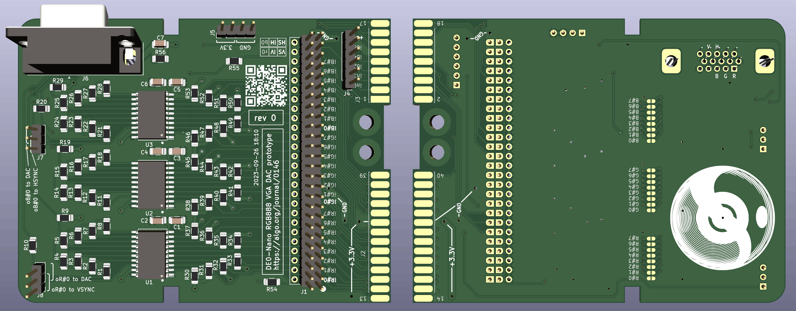
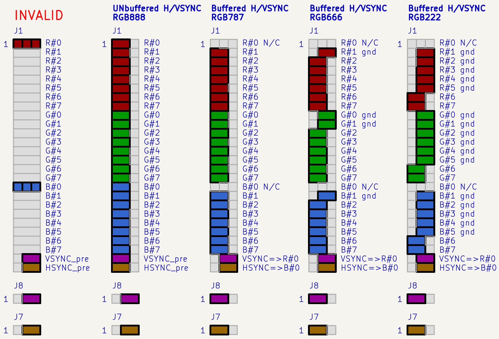
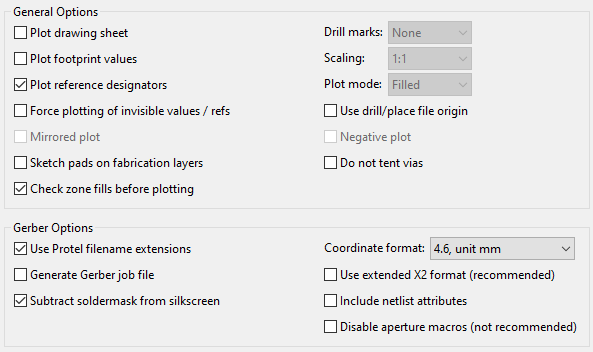
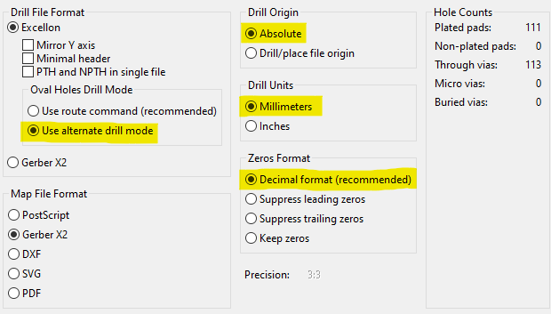

# 26 Sep 2023

| Previous journal: | Next journal: |
|-|-|
| [**0145**-2023-09-08.md](./0145-2023-09-08.md) | [**0147**-2023-09-27.md](./0147-2023-09-27.md) |

# Notes

*   It's been a blur since the TT04 submission. That was about a 6am finsh that "night".
*   Submission went thru fine, it seems: https://app.tinytapeout.com/projects/136
*   It got featured in the [Project Showcase](https://tinytapeout.com/runs/tt04/#project-showcase). Yay!
*   Since then, I've hand-made an RGB333 VGA DAC board for my DE0-Nano, and [used it as RGB222 with raybox-zero](https://github.com/algofoogle/raybox-zero/commit/b737036ce73f1fd2df42917a83dca542a71bcfc8).
*   Then I started designing a better VGA DAC board in KiCad that can support RGB888 (full 24-bit colour) but also with configuration options.
*   Read the [Digilent Pmod Interface Specification](https://digilent.com/reference/_media/reference/pmod/pmod-interface-specification-1_2_0.pdf).

# VGA DAC PCB

**NOTE:** This journal entry is accessible via the URL **https://algo.org/journal/0146** which redirects to this page, and this shorter URL is printed on the PCB and included as a QR code.

My design borrows a bit from the [Digilent PmodVGA](https://digilent.com/reference/pmod/pmodvga/start) ([schematic](https://digilent.com/reference/_media/reference/pmod/pmodvga/pmodvga_sch.pdf)); also [this](https://digilent.com/blog/where-to-plug-in-your-pmod-fpga/).

*   The design is found [here](https://github.com/algofoogle/sandpit/tree/master/fpga/VGA-DAC).
*   VGA connectors (2 options) datasheets:
    *   https://cdn.amphenol-cs.com/media/wysiwyg/files/drawing/l77hde15sd1ch4fvga.pdf
    *   http://www.assmann-wsw.com/uploads/datasheets/ASS_4897_CO.pdf
*   Instead of R2R, I calculated each binary level and ordered precision resistors (well, E48/E96 and 1% tolerance) from DigiKey. This halves the number of DAC resistors needed, which is better for hand assembly. I also used 1206 footprints; if doing this for manufacture, I would go for maybe 0603 and use R2R. I read some notes [here](https://electronics.stackexchange.com/questions/465842/8-bit-vga-dac-design-question), [here](https://electronics.stackexchange.com/questions/367797/resistor-dac-and-buffer-for-vga-output), and [here](https://electronics.stackexchange.com/questions/453377/how-to-calculate-resistor-values-for-a-vga-dac) as a bit of a guide for working out impedance, resistor values, etc.
*   3x26 pin header (J1) along with J7/J8 control what's connected to what. See diagram below.
    **Note** that pairs of J1 pins (on the 'a' side) can be solder-bridged to force those inputs on.
*   Note that many parts can be left unpopulated, depending on needs:
    *   R30..R53 are 100k pulldowns, but if an input is otherwise unused it can just be hard-wired to GND instead via J1.
    *   My main focus was RGB666 (not RGB888), in which case we can leave out R1, R2, R11, R12, R21, R22.
    *   J4 is not needed unless we want to break out the extra DE0-Nano GPIOs.
*   If we're just doing RGB666 (or less) then we can buffer HSYNC and VSYNC:
    1.  Leave `R#0` (row 1) and `B#0` (row 17) completely unjumpered (open).
    2.  Switch VSYNC (row 25, aka `iV`) and HSYNC (row 26, aka `iH`) to the 'b' side.
    3.  For both J7 and J8, jumper pins 1 and 2.
    4.  ...which uses the low bit of the red and blue chains for VSYNC and HSYNC respectively. This will lead to a very subtle inaccuracy in the DAC, but not enough that should matter.
*   **DO NOT** jumper R#0 or B#0 *at all* while VSYNC and HSYNC are switched to the 'b' side, or while J7/J8 are jumpered to pins 2 and 3, because this will be a short.
*   On the back of the board there are solder jumpers which can be used if the buffer chips are not populated, in which case the incoming signals are not buffered (and may get about ~15mA load each).
*   There are two "edge connectors" which are actually for mounting header sockets sideways.
    *   The shorter of the two (2x9) is intended to plug in to DE0-Nano's GPIO1 pin 1..18 and be compatible with my existing RGB333 hand-made board.
    *   The longer (2x14) is intended for pin 
*   **NOTE:** When using the shorter 2x19 connector, the board needs a 3.3V power supply. For this purpose, a jumper wire would be run from the DE0-Nano's GPIO1 pin 29 (VCC3P3) to J5's pin 1 or 2. When using the 2x14 connector, this pin is already included.
*   The fill on the top side of the board is typically 3.3V, while the bottom is typically GND.
*   The logo was made in Photoshop from my original vector art: convert to greyscale; use 'Sketch => Halftone Pattern' filter with black/white FG/BG colour; adjust levels; use KiCad image converter with 'negative' option and set scale to about 30mm; save as a footprint; delete reference marker afterwards.

Board render, back and front:



Schematic ([large version](./i/0146-VGA-DAC-rev0-schematic.svg)):


Jumper config options detail:



JLCPCB ordering:

1.  [Generate Gerbers in KiCad 7](https://jlcpcb.com/help/article/362-how-to-generate-gerber-and-drill-files-in-kicad-7)
    1.  Go into KiCad PCB Editor, with the design open.
    2.  File => Fabrication Outputs => Gerbers (.gbr)
    3.  Specify 'Output directory' as `Gerbers\`
    4.  Make sure these layers are selected in 'Include Layers':
        ```
        F.Cu  
        B.Cu
        F.Paste
        B.Paste
        F.Silkscreen
        B.Silkscreen
        F.Mask
        B.Mask
        Edge.Cuts

        Needed for 4/6 layer designs:
        In1.Cu, In2.Cu ...
        ```
    5.  Set 'General Options' and 'Gerber Options':

        
    6.  Click 'Run DRC...' and 'Run DRC' again. Dismiss if all OK.
    7.  Click 'Plot' -- Files will be put in `Gerbers/`
        *   NOTE: I got the below warning but not sure what it means or if it can be ignored.
            It comes from [here](https://github.com/KiCad/kicad-source-mirror/blob/37e8a008ab5afcc056293982fece3c0e5fffbf81/pcbnew/dialogs/dialog_plot.cpp#L886). It might actually be something to do with Postscript plotting, instead of Gerber.

            ```
            Warning: Width correction constrained.  The width correction value must be in the range of [0.000001 mm; 0.199999 mm] for the current design rules.
            ```
    8.  Click 'Generate Drill Files...'
        1.  Verify all of these settings (esp. yellow highlights which might otherwise be different):

            
        2.  Click 'Generate Drill File'
        3.  **(Optional, but suggested):** Click 'Generate Map File'.
    9.  Close all the drill/Gerber dialogs.
2.  Check in KiCad Gerber viewer:
    1.  In main project window, click 'Gerber Viewer'.
    2.  File => Open Gerber plot files
    3.  Select all of the `*.g*` files
    4.  File => Open Excellon drill files
    5.  Select the `*.drl` files
    6.  Use options on the left to control fills, etc.
3.  ZIP up the `Gerbers` folder. I called it `VGA-DAC-Gerbers-rev0.zip`
4.  Log in to https://jlcpcb.com and click 'Order now'
    1.  Submit Gerbers ZIP file.
    2.  Leave everything as default. Most other options either change the price, the shipping charge, or the lead time.
    3.  Don't worry about "remote area" charges -- getting to the final steps of the cart allows for selection of cheap ($2~$5) shipping at up to 16 biz days.

## Future improvements

If I were to make this board again I would probably consider the following:

*   Design for assembly by JLCPCB, ordering parts from LCSC.
*   Make it smaller:
    *   Use TSSOP instead of SOIC
    *   Use an R2R DAC with tiny resistors
    *   Populate all the pulldowns and don't worry about the big J1 selector... maybe just make SOME of the bits configurable.
*   Use a full 2x40 "stackable" header block, picking off only the pins we need (and most convenient ones at that) and label the others that can be passed thru and used for other boards.
    *   This also means doing the board so it lays flag ('wing') rather than standing veritcally.
*   Have better mounting holes.
*   Get net classes right and try bigger traces/clearances by default.
*   Try a 4-layer board?
*   Put on OSHW logo
*   Pmod support
