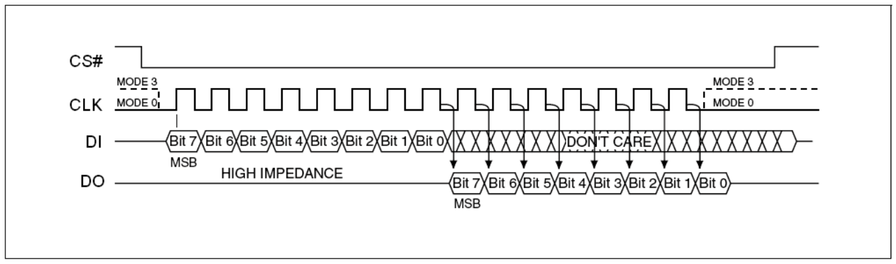

# 2 Oct 2023

| Previous journal: | Next journal: |
|-|-|
| [**0149**-2023-09-30.md](./0149-2023-09-30.md) | *Next journal TBA* |

# Reading/writing SPI flash ROM using Bus Pirate

## Initial clumsy test

I'm doing this with my Bus Pirate v3.5, firmware 6.1, and bootloader 4.4. I'm using a Berg Micro BG25Q80ASSIG as the SPI flash ROM.

0.  Disconnect everything.
1.  Plug in BP via USB. Just the PWR LED should be lit.
2.  Open serial terminal (e.g. PuTTY) and connect at 115,200 (others don't work?)
3.  Hit ENTER to get prompt (hopefully `HiZ>`) then issue `i` command. `?` command gives help.
4.  `~` command for self-test. As prompted, connect `Vpu` to `+5V` and connect `ADC` to `+3V3`, then hit spacebar. Expect MODE and VREG LEDs to be illuminated. Hit ENTER to finish; expect 0 errors.
5.  Remove jumpers from the step above.
6.  `m` lists modes. Enter `5` for SPI. It then lists speeds. I selected the fastest available (1MHz):
    ```
    (1)>5
    Set speed:
    1. 30KHz
    2. 125KHz
    3. 250KHz
    4. 1MHz
    ```
7.  For now accept defaults: `Idle low` clock polarity, `Active to idle` output clock edge, `Middle` input sample phase, `/CS` active low chip select.
8.  For output type, select `Normal (H=3.3V, L=GND)` because we're using a 3.3V part and this is easy.
9.  MODE LED should now be lit, but VREG should be off. `v` command should verify that power pins 2 and 3 are both at 0.00V, and CS is H (deasserted).
10. `<0>` (list user macros) should show they're all blank.
11. `i` should show more info now, inc. `POWER SUPPLIES OFF`, MSB first, 8-bit read/write.
12. Connect chip pins 3 (/WP) and 4 (VSS) to BP's GND. **NOTE:** Probably a good idea to use a pull-down resistor to bring /WP low, since it *can* also be an output in QSPI mode. I used a 2k2.
13. Connect chip pin 7 (NC, or sometimes /HOLD) via pull-up resistor to VCC. I used a 2k2.
13. Connect chip pin 8 (VCC) to BP's 3.3V.
14. Connect chip pin 5 (DI) to BP's MOSI.
15. Connect chip pin 2 (DO) to BP's MISO.
16. Connect chip pin 1 (/CS) to BP's CS.
17. Connect chip pin 6 (CLK) to BP's CLK.
18. Issue `W` command to turn power on.
19. Issue the following to read the MFR and DEV ID: `{0x90,0,0,0,255,255}` -- This command is made up of:
    ```
    {           Start an SPI sequence, reading (and printing) at the same time.
    0x90        SPI command 90h; read manufacturer and device ID (aka REMS).
    0,0,0       24-bit address is 000000h, meaning we want MFR first and DEV last.
    255,255     Dummy bytes. First will be accompanied by MFR ID on read, 2nd by DEV ID.
    }           Finish SPI sequence
    ```
20. I got a partly-expected, partly-strange response:
    ```
    SPI>W
    POWER SUPPLIES ON
    SPI>{0x90,0,0,0,255,255}
    /CS ENABLED
    WRITE: 0x90 READ: 0x00
    WRITE: 0x00 READ: 0x00
    WRITE: 0x00 READ: 0x00
    WRITE: 0x00 READ: 0x00
    WRITE: 0xFF READ: 0xE0
    WRITE: 0xFF READ: 0x13
    ERROR: command has no effect here
    Syntax error at char 20
    SPI>w
    POWER SUPPLIES OFF
    SPI>w
    POWER SUPPLIES OFF
    SPI>W
    POWER SUPPLIES ON
    SPI>w
    POWER SUPPLIES OFF
    SPI>v
    Pinstates:
    1.(BR)  2.(RD)  3.(OR)  4.(YW)  5.(GN)  6.(BL)  7.(PU)  8.(GR)  9.(WT)  0.(Blk)
    GND     3.3V    5.0V    ADC     VPU     AUX     CLK     MOSI    CS      MISO
    P       P       P       I       I       I       O       O       O       I
    GND     2.59V   0.00V   0.00V   2.89V   L       L       H       L       H
    SPI>
    ```
    Examination:
    *   The first 4 `0x00` reads are expected; chip's Data Out is HiZ during this time.
    *   Next 2 bytes seem normal: MFR is 0xE0, DEV ID is 0x13:
        *   `E0` is either "Eon Silicon" or Berg Micro? Officially it's ['LG Semicondutor' according to JEDEC](http://www.idhw.com/textual/chip/jedec_spd_man.html#:~:text=11011111-,LG%20Semiconductor,-11100000)! Eon's own datasheet says their MFR ID should be 0x1C (or I've seen it listed as 0x7F1C in other code). [This datasheet for the Paragon PN25F08](https://dokumen.tips/documents/pn25f08-pn25f08-can-be-programmed-1-to-256-bytes-at-a-time-using-the-page-program.html?page=15) ([cached](./files/0150/datasheet-pn25f08.pdf)) claims it returns MFR ID `E0` with [more info here](https://www.mail-archive.com/flashrom@flashrom.org/msg14225.html).
        *   `13` [appears to be a 25x80 device](https://chromium.googlesource.com/chromiumos/third_party/flashrom/+/798d2adc9527f724bc5096a646cf99efdbb6b59e/flashchips.h#266)
    *   Why is there then an `ERROR: command has no effect here` and `Syntax error at char 20`? Assuming counting from 1, char 20 is `}` -- This is supposed to be the SPI 'CS disable' command. Maybe I can try issuing each step separately and see what happens.
    *   **WEIRD:** After this error, I issue `w` (lowercase) to turn off power supplies, but the VPWR appears to remain lit. However, issuing `W` makes it slightly brigther. `v` command shows it is at 2.59V, but maybe this is feedback thru the chip itself... note in the table above that CS is still low (asserted) and MOSI/MISO are high. Perhaps by turning off the power while CS was still asserted, the chip is kinda half-on, and leaking power back thru VCC. This could even be due to the 2k2 pulls I've got on points 3 and 7.
21. I unplugged the BP, and replugged it.
22. Issuing `v`, everything looked normal again.
23. `m5` goes into SPI mode, but don't try `m5412122` -- it hits a buffer overflow. Just type each of `412122` separately with ENTER after each.
24. `W` to enable power.
25. Try each of the following in turn (and note the respective output)
    ```
    {           /CS ENABLED
    0x90        WRITE: 0x90 READ: 0x00
    0           WRITE: 0x00 READ: 0x00
    0           WRITE: 0x00 READ: 0x00
    0           WRITE: 0x00 READ: 0x00
    255         WRITE: 0xFF READ: 0xE0
    255         WRITE: 0xFF READ: 0x13
    255         WRITE: 0xFF READ: 0xE0
    255         WRITE: 0xFF READ: 0x13
    }           ERROR: command has no effect here; Syntax error at char 1
    ```
    At this point, `v` command shows /CS is still low (active) but also that VPU is now at 2.94V; not sure why because it's not connected to anything and it is configured as an input. Is this just hi-Z, or a bug?
26. `]` command does seem to work instead of `}` so I guess that will do for now. Note that there is still 2.62V sensed on the 3.3V line after issuing `w`! Going back to `m1` seems to return things to normal.

## Informed test

1.  Unplug BP from USB
2.  Connect SPI flash ROM chip as above in steps 12 to 18.
3.  Open serial terminal and connect to BP (e.g. COM3 at 115200).
4.  Hit ENTER to see `HiZ>` prompt.
5.  `m5` for SPI mode.
6.  ENTER after each of: 4 1 2 1 2 2
7.  `W` (capital) to turn on power
8.  Read MFR/DEV ID: `{0x90 0 0 0 255 255]`:
    ```
    SPI>{0x90 0 0 0 255 255]
    /CS ENABLED
    WRITE: 0x90 READ: 0x00
    WRITE: 0x00 READ: 0x00
    WRITE: 0x00 READ: 0x00
    WRITE: 0x00 READ: 0x00
    WRITE: 0xFF READ: 0xE0
    WRITE: 0xFF READ: 0x13
    /CS DISABLED
    SPI>
    ```
    MFR: 0xE0
    DEV: 0x13
9.  Read full ID: `{0x9F 0 0 0]`:
    *   Reads back `E0 40 14`
    *   0x4014 looks equivalent to [Winbond NEX W25Q80](https://review.coreboot.org/plugins/gitiles/flashrom/+/22e0532caf883b84743c80c4dce24f2ef1fcecae/flashchips.h#599)
    *   Note that the byte 0x14 is 20 dec, which looks like it infers the capacity: 1^20 is 1MByte.
10. Read lower 8 bits of Status Register: `{5 0]` -- returns 0.
11. Read upper 8 bits of SR (which not all devices support): `{0x35 0]` -- returns 0.


## Basic SPI flash ROM data reads

NOTE: I was getting weird bad data and partially repeatable results, but I think it was because I hadn't turned on the power supplies! They were partially powered by those weird other states I noted above. I was getting returned data of `00 04 04 04 04 00 00...` sometimes, but not always. After going to `m1` then `m5` again (still at 1MHz) and turning on power with `W` I got repeatable data.

NOTE: My source chip came from an ESP-01 module, so [this memory layout](https://github.com/esp8266/esp8266-wiki/wiki/Memory-Map#spi-flash-rom-layout-without-ota-upgrades) might tell us what to expect.

Read command (03h) allows for a continuous stream of reading data:
*   Assert /CS
*   Send 03h
*   Send 24-bit start address
*   Read a byte
*   Optionally read next byte, over and over, so long as /CS is asserted
*   Deassert /CS to reset

Example with BP:
1.  Make sure power is definitely ON: `W`
2.  Make sure /CS is definitely DEasserted: `]`
3.  Start read from address 0: `{3 0 0 0`
4.  Write any dummy byte to read the first byte, e.g. `0` -- responds with `0xE9` on my chip.
5.  Try reading 1000 bytes, where the `r` command sends dummy bytes equal to 0xFF: `r:1000` -- responds with `0x03 0x02 0x20 0x20 0x04 0x10 0x40 0x00 0x00 0x10...`
6.  Stop: `]`
7.  Actual data is:
    ```
    E9 03 02 20 20 04 10 40 00 00 10 40 40 07 00 00 
    00 00 00 00 00 00 00 00 00 00 00 00 00 00 00 00 
    00 00 00 00 00 00 00 00 00 00 00 00 00 00 00 00 
    00 00 00 00 00 00 00 00 00 00 00 00 00 00 00 00 
    20 83 FE 3F 1C 4B 00 40 CC 24 00 40 1C 04 12 C1 
    E0 3D 01 09 41 01 FB FF C0 00 00 02 01 00 22 A0 
    E9 27 90 04 0C 02 C6 06 00 22 A0 EA 27 90 0A 32 
    01 01 28 31 66 43 02 86 02 00 21 F1 FF 01 F2 FF 
    C0 00 00 7C F2 08 41 12 C1 20 0D F0 30 83 FE 3F 
    08 FC 10 40 12 C1 F0 C9 11 09 01 CD 02 21 FB FF 
    3D 0C 01 E9 FF C0 00 00 2D 0C 05 FA FF 26 02 1A 
    CC 92 01 F7 FF 2D 0C C0 00 00 C6 03 00 CA 22 01 
    F4 FF 22 C2 10 C0 00 00 46 00 00 0C 12 C8 11 08 
    01 12 C1 10 0D F0 00 00 30 10 00 00 00 10 00 00 
    B4 18 00 40 00 4A 00 40 4C 4A 00 40 41 FB FF 40 
    11 C0 0C 44 62 D1 10 09 56 D9 76 39 46 C9 66 3D 
    01 CD 02 40 D2 11 D2 DD 30 2D 0D 01 CE FF C0 00 
    00 42 01 00 0C 13 0C 22 72 D1 10 D9 87 40 23 83 
    32 C1 10 41 EE FF 2A 2C 40 22 11 01 C6 FF C0 00 
    00 02 D1 10 52 01 00 08 40 CC 85 0C 2D 0C 12 22 
    41 00 86 01 00 0C 1D 0C 03 32 41 00 22 C1 10 0C 
    84 3D 00 01 E3 FF C0 00 00 DA DC 2D 0D 01 E1 FF 
    C0 00 00 32 C1 10 40 2D 11 41 DC FF D2 D1 10 D8 
    8D 01 DD FF C0 00 00 3B 2C 01 DA FF C0 00 00 3D 
    01 0C 44 2D 0D C2 D1 10 C8 6C D2 D1 10 D8 7D 01 
    D6 FF C0 00 00 21 D0 FF 02 D1 10 08 50 2A 11 0D 
    F0 00 00 00 00 06 00 60 20 4E 00 00 CC 2E 00 40 
    12 C1 F0 09 01 0C 09 21 FB FF C0 20 00 92 62 C1 
    3C 88 C0 20 00 72 22 C0 80 77 20 C0 20 00 72 62 
    C0 0C 45 7C 96 C0 20 00 42 22 C0 60 44 10 50 44 
    20 C0 20 00 42 62 C0 0C 13 C0 20 00 02 22 C0 30 
    00 20 C0 20 00 02 62 C0 21 EC FF 01 EC FF C0 00 
    00 C6 FC FF 38 83 FE 3F 68 83 FE 3F 12 C1 F0 09 
    01 02 03 00 27 60 1A 42 A0 FB 40 00 10 02 43 00 
    85 EC FF 21 F8 FF 01 88 FF C0 00 00 05 F8 FF 06 
    02 00 21 F5 FF 01 84 FF C0 00 00 08 01 12 C1 10 
    0D F0 00 00 32 02 00 42 02 02 22 02 01 00 44 11 
    80 22 11 40 22 20 20 23 20 0D F0 00 00 02 00 60 
    00 20 00 00 00 80 28 00 00 00 10 00 00 00 00 01 
    00 00 80 00 00 40 00 00 0C 46 51 F8 FF C0 20 00 
    48 75 60 44 20 C0 20 00 49 75 16 62 05 26 12 59 
    26 22 5C 26 32 5F 82 C2 FC 71 F1 FF 0C 02 80 27 
    83 91 F0 FF F6 23 05 31 8D FF 86 04 00 30 61 41 
    0B 43 80 44 11 0B 66 C0 66 11 6A 44 4A 33 0B 33 
    20 83 20 90 88 20 C0 20 00 89 25 71 E7 FF C0 20 
    00 79 05 C0 20 00 68 05 8C 66 C0 20 00 A8 05 56 
    7A FF 0D F0 21 E2 FF 86 ED FF 21 DF FF 06 EC FF 
    21 E0 FF 86 EA FF 21 DF FF 06 E9 FF 00 FE EF 3F 
    0C 28 21 A8 FF 42 AE CF 12 C1 F0 09 01 32 A1 00 
    2C 07 61 FA FF C0 20 00 52 26 8A 80 55 20 C0 20 
    00 52 66 8A 02 AC FF C0 20 00 B2 22 80 00 BB 10 
    C0 20 00 B2 62 80 C0 20 00 A2 22 81 40 AA 10 70 
    AA 20 C0 20 00 A2 62 81 C0 20 00 92 22 82 40 99 
    10 70 99 20 C0 20 00 92 62 82 C0 20 00 82 22 83 
    40 88 10 70 88 20 C0 20 00 82 62 83 C0 20 00 62 
    22 84 40 66 10 70 66 20 C0 20 00 62 62 84 C0 20 
    00 52 22 8A 40 55 10 30 55 20 C0 20 00 52 62 8A 
    C0 20 00 02 22 8B 40 00 10 30 00 20 C0 20 00 02 
    62 8B 0C 43 0C 52 05 ED FF 08 01 12 C1 10 0D F0 
    80 83 FE 3F 9C 83 FE 3F CC 83 FE 3F B0 83 FE 3F 
    D4 83 FE 3F E8 83 FE 3F 08 84 FE 3F B4 84 FE 3F 
    10 80 FE 3F 00 FC 10 40 F4 84 FE 3F 08 85 FE 3F 
    BC 84 FE 3F DC 84 FE 3F
    ```
7.  First few bytes could be decoded as:
    *   `E9 03 02 20 20 04 10`
    *   0x40000010 -- Debug exception vector. Not DWORD-aligned?
    *   HOWEVER, esp8266 is little-endian.
    *   More info here: http://cholla.mmto.org/esp8266/xtensa.html

## Next steps: Dumping contents

This will use the [flashrom] utility in a mode that uses the Bus Pirate as its adapter. It also works with CH341A-based 'programmers'.

'flashrom' seems to be designed for Linux, and its documentation is all over the shop. [Windows info exists](https://wiki.flashrom.org/Windows) but is part of the retired flashrom Wiki. It seems the proper way to 'get' flashrom is either to install a Linux package, or build from source.

I'm going to go with just adding it as an Ubuntu package, because it seems current enough and supports the Bus Pirate:

```
$ sudo apt info flashrom
[sudo] password for zerotoasic: 
Package: flashrom
Version: 1.2-5
...
 Currently supported programmers include:
...
   * buspirate_spi (for SPI flash ROMs attached to a Bus Pirate)
...
   * ch341a_spi (for SPI flash ROMs attached to WCH CH341A)
```

These are the steps I followed:
1.  Install flashrom on Linux: `sudo apt install flashrom`
2.  Run `dmesg -T --follow` and hit ENTER a couple times to be ready to watch the BP USB device pass thru.
3.  Pass thru the BP USB to the VM. For me the BP shows up as `FTDI FT232R USB UART [0600]` on Windows. On Linux, it then shows up as:
    ```
    [Mon Oct  2 21:04:22 2023] usb 1-1: new full-speed USB device number 2 using ohci-pci
    [Mon Oct  2 21:04:22 2023] usb 1-1: New USB device found, idVendor=0403, idProduct=6001, bcdDevice= 6.00
    [Mon Oct  2 21:04:22 2023] usb 1-1: New USB device strings: Mfr=1, Product=2, SerialNumber=3
    [Mon Oct  2 21:04:22 2023] usb 1-1: Product: FT232R USB UART
    [Mon Oct  2 21:04:22 2023] usb 1-1: Manufacturer: FTDI
    [Mon Oct  2 21:04:22 2023] usb 1-1: SerialNumber: A5005DKE
    [Mon Oct  2 21:04:23 2023] usbcore: registered new interface driver usbserial_generic
    [Mon Oct  2 21:04:23 2023] usbserial: USB Serial support registered for generic
    [Mon Oct  2 21:04:23 2023] usbcore: registered new interface driver ftdi_sio
    [Mon Oct  2 21:04:23 2023] usbserial: USB Serial support registered for FTDI USB Serial Device
    [Mon Oct  2 21:04:23 2023] ftdi_sio 1-1:1.0: FTDI USB Serial Device converter detected
    [Mon Oct  2 21:04:23 2023] usb 1-1: Detected FT232RL
    [Mon Oct  2 21:04:23 2023] usb 1-1: FTDI USB Serial Device converter now attached to ttyUSB0
    ```
    So, the device is: `/dev/ttyUSB0`
5.  With flash ROM attached as per steps I was using above, we can now try reading flash ROM contents:
    ```bash
    sudo flashrom -p buspirate_spi:dev=/dev/ttyUSB0,spispeed=1M -r BG25Q80-ESP01.bin -V
    ```
6.  Hmm, this doesn't work. It responds with:
    ```
    flashrom v1.2 on Linux 5.15.0-84-generic (x86_64)
    flashrom is free software, get the source code at https://flashrom.org

    flashrom was built with libpci 3.6.4, GCC 9.2.1 20200304, little endian
    Command line (5 args): flashrom -p buspirate_spi:dev=/dev/ttyUSB0,spispeed=1M -r BG25Q80-ESP01.bin -V
    Using clock_gettime for delay loops (clk_id: 1, resolution: 1ns).
    Initializing buspirate_spi programmer
    Detected Bus Pirate hardware 3.5
    Detected Bus Pirate firmware 6.1
    Using SPI command set v2.
    SPI speed is 1MHz
    Bus Pirate v3 or newer detected. Set serial speed to 2M baud.
    Serial speed is 2000000 baud
    Raw bitbang mode version 1
    Raw SPI mode version 1
    The following protocols are supported: SPI.
    Probing for AMIC A25L010, 128 kB: probe_spi_rdid_generic: id1 0xe0, id2 0x4014
    ...
    ```
    It then proceeds to test for all these different devices, getting the same E0 4014 data as above. It doesn't know this E0 MFR, so it rejects all of them.
7.  List supported devices, and find '25Q' devices: `flashrom -L`
    ```
    Supported flash chips (total: 538):

    Vendor        Device                 Test  Known   Size   Type      
                                        OK    Broken  [kB]             

    (P = PROBE, R = READ, E = ERASE, W = WRITE, - = N/A)

    ...

    Eon           EN25Q128               PREW          16384  SPI       
    Eon           EN25Q16                               2048  SPI       
    Eon           EN25Q32(A/B)           PREW           4096  SPI       
    Eon           EN25Q40                                512  SPI       
    Eon           EN25Q64                PREW           8192  SPI       
    Eon           EN25Q80(A)                            1024  SPI       
    Eon           EN25QH128                            16384  SPI       
    Eon           EN25QH16               PREW           2048  SPI       
    Eon           EN25QH32               PREW           4096  SPI       
    Eon           EN25QH64               PREW           8192  SPI       
                GD25Q128B
    GigaDevice    GD25Q10                                128  SPI       
    GigaDevice    GD25Q127C/             PREW          16384  SPI       
                GD25Q128C
    GigaDevice    GD25Q16(B)             PREW           2048  SPI       
    GigaDevice    GD25Q20(B)             PREW            256  SPI       
    GigaDevice    GD25Q256D                            32768  SPI       
    GigaDevice    GD25Q32(B)             PREW           4096  SPI       
    GigaDevice    GD25Q40(B)                             512  SPI       
    GigaDevice    GD25Q512               PREW             64  SPI       
    GigaDevice    GD25Q64(B)             PREW           8192  SPI       
    GigaDevice    GD25Q80(B)             PREW           1024  SPI       
    ...
    Winbond       W25Q80.V               PREW           1024  SPI       
    Winbond       W25Q80BW               PREW           1024  SPI       
    Winbond       W25Q80EW               PREW           1024  SPI       
    ...
    ```
8.  Let's try `GD25Q80(B)`, and force it:
    ```bash
    sudo flashrom -c 'GD25Q80(B)' --force -p buspirate_spi:dev=/dev/ttyUSB0,spispeed=1M -r BG25Q80-ESP01.bin -V
    ```
    Output:
    ```
    $ sudo flashrom -c 'GD25Q80(B)' --force -p buspirate_spi:dev=/dev/ttyUSB0,spispeed=1M -r BG25Q80-ESP01.bin -V
    flashrom v1.2 on Linux 5.15.0-84-generic (x86_64)
    flashrom is free software, get the source code at https://flashrom.org

    flashrom was built with libpci 3.6.4, GCC 9.2.1 20200304, little endian
    Command line (8 args): flashrom -c GD25Q80(B) --force -p buspirate_spi:dev=/dev/ttyUSB0,spispeed=1M -r BG25Q80-ESP01.bin -V
    Using clock_gettime for delay loops (clk_id: 1, resolution: 1ns).
    Initializing buspirate_spi programmer
    Detected Bus Pirate hardware 3.5
    Detected Bus Pirate firmware 6.1
    Using SPI command set v2.
    SPI speed is 1MHz
    Bus Pirate v3 or newer detected. Set serial speed to 2M baud.
    Serial speed is 2000000 baud
    Raw bitbang mode version 1
    Raw SPI mode version 1
    The following protocols are supported: SPI.
    Probing for GigaDevice GD25Q80(B), 1024 kB: probe_spi_rdid_generic: id1 0xe0, id2 0x4014
    No EEPROM/flash device found.
    Force read (-f -r -c) requested, pretending the chip is there:
    Probing for GigaDevice GD25Q80(B), 1024 kB: Assuming GigaDevice flash chip "GD25Q80(B)" (1024 kB, SPI) on buspirate_spi.
    Please note that forced reads most likely contain garbage.
    Reading flash... 
    ```
9.  It hung, but I ended up using this command instead, which takes about 1 minute to dump 1MB:
    ```bash
    time sudo flashrom -c 'EN25Q80(A)' --force -p buspirate_spi:dev=/dev/ttyUSB0,spispeed=2M,serialspeed=250000 -r BG25Q80-ESP01-C.bin -VVV
    ```
    md5sum of the firmware is `f4025b50f5e5ca47997d5d71f514e363`
10. 250,000 is max baud I've been able to use so far. The only level above this is 2M (2,000,000). I switched to my Ubuntu 22 VM, enabling USB 2.0. Let's try that...
11. Ubuntu 22 gets flashrom version 1.2-5build1, and when the BP is plugged in we see:
    ```
    [Mon Oct  2 23:40:47 2023] usb 1-2: new full-speed USB device number 3 using ohci-pci
    [Mon Oct  2 23:40:47 2023] usb 1-2: New USB device found, idVendor=0403, idProduct=6001, bcdDevice= 6.00
    [Mon Oct  2 23:40:47 2023] usb 1-2: New USB device strings: Mfr=1, Product=2, SerialNumber=3
    [Mon Oct  2 23:40:47 2023] usb 1-2: Product: FT232R USB UART
    [Mon Oct  2 23:40:47 2023] usb 1-2: Manufacturer: FTDI
    [Mon Oct  2 23:40:47 2023] usb 1-2: SerialNumber: A5005DKE
    [Mon Oct  2 23:40:47 2023] usbcore: registered new interface driver usbserial_generic
    [Mon Oct  2 23:40:47 2023] usbserial: USB Serial support registered for generic
    [Mon Oct  2 23:40:47 2023] usbcore: registered new interface driver ftdi_sio
    [Mon Oct  2 23:40:47 2023] usbserial: USB Serial support registered for FTDI USB Serial Device
    [Mon Oct  2 23:40:47 2023] ftdi_sio 1-2:1.0: FTDI USB Serial Device converter detected
    [Mon Oct  2 23:40:47 2023] usb 1-2: Detected FT232R
    [Mon Oct  2 23:40:48 2023] usb 1-2: FTDI USB Serial Device converter now attached to ttyUSB0
    ```
12. Benchmark gets same results:
    ```bash
    time sudo flashrom -c 'EN25Q80(A)' --force -p buspirate_spi:dev=/dev/ttyUSB0,spispeed=2M,serialspeed=250000 -r BG25Q80-ESP01-D.bin -VVV
    ```
13. I tried faster, but it still failed. Got about 8K of data before dropping out.


# Notes

*   [SparkFun Bus Pirate Guide](https://learn.sparkfun.com/tutorials/bus-pirate-v36a-hookup-guide/all)
*   [More details about SPI and modes](https://www.allaboutcircuits.com/technical-articles/spi-serial-peripheral-interface/)
*   Per [datasheet](https://datasheetspdf.com/pdf-file/774876/EON/25Q80A/1) ([cached](./files/0150/datasheet-25Q80A-EON.pdf)):
    >   **Standard SPI Modes**
    >
    >   The EN25Q80A is accessed through an SPI compatible bus consisting of four signals: Serial Clock
    >   (CLK), Chip Select (CS#), Serial Data Input (DI) and Serial Data Output (DO). Both SPI bus operation
    >   Modes 0 (0,0) and 3 (1,1) are supported. The primary difference between Mode 0 and Mode 3, as
    >   shown in Figure 3, concerns the normal state of the CLK signal when the SPI bus master is in standby
    >   and data is not being transferred to the Serial Flash. For Mode 0 the CLK signal is normally low. For
    >   Mode 3 the CLK signal is normally high. **In either case data input on the DI pin is sampled on the rising
    >   edge of the CLK. Data output on the DO pin is clocked out on the falling edge of CLK.**
    >
    >   **Figure 3: SPI modes**
    >
    >   
*   [Another datasheet for a similar flash ROM device](https://j5d2v7d7.stackpathcdn.com/wp-content/uploads/2017/03/25Q80ASSIG.pdf) ([cached](./files/0150/datasheet-25Q80.pdf)).
*   Datasheets say `fC` (main clock frequency) for all instructions **except read data (03h)** is one value (e.g. 108MHz), compared with `fR` for read data instruction which is typically lower (e.g. 55MHz). Why? NOTE: fast read command (0Bh) has 1 extra dummy byte, I guess to let the device get ready.
*   To enter raw [BP binary bitbang mode](http://dangerousprototypes.com/docs/Bitbang), we must send 0x00 up to 20 times. This can be done using CTRL-SHIFT-2 (i.e. CTRL-@, aka `^@`) 20 times.
    *   It will enter the correct mode when it displays `BBIO1`.
    *   You can send 0h again and it will respond with `BBIO1` each time.
    *   To reset the BP and return to normal mode, send Fh (CTRL-O).
    *   In bitbang mode, configure ins/outs by sending a byte of the format `010aocis` where a value of 1 means input and 0 means output, and positions: a=AUX; o=MOSI; c=CLK; i=MISO; s=CS
        *   e.g. sending `01010010` (0x52, or `R`) means configure AUX and MISO as inputs and outputs are: MOSI, CLK, CS
        *   BP responds with the current *state* of the pins (not directions): `@` (0x40, or 01000000)
    *   Actually controlling pin states is a little more tricky as it requires sending high-bit values, i.e. &ge; 0x80. Bit pattern is `1wpaocis`, as above, but with extra `w` (power) and `p` (pull-up) bits.
        *   e.g. sending `11001000` (0xC8, or ALT-0200) turns on power, turns OFF pull-ups, sets CLK and CS low, and sets MOSI high. AUX and MISO remain as inputs.
        *   BP responds with the current *state* of the pins: `▒` (0xB1, or 0x10110001)
*   Table of CTRL keycodes for sending raw data via terminal: https://www.physics.udel.edu/~watson/scen103/ascii.html
*   QSPI access for raybox-zero:
    *   We MIGHT be able to do traces in enough time: In QSPI mode, we need 6 clocks to write the address, and presumably we can get away with 1 for reading 4 bits of data (15 different map cell types, plus blank). We maybe need 4 more: two CS states, read CMD, and QSPI activation?? That's 10 clocks per trace step. We have 640 pixels (clocks) in which to do tracing, so that's 64 map cells if 10 clocks per cell. If we double the clock, we could do up to 128 map cells (while our target is 91). 1280 clocks &div; 91 is a budget of 14 clocks per cell.
    *   As for reading wall texture data: If we make sure we DON'T trace during HBLANK, we have up to 800-640 (160) clocks. If we pack our 6-bit textures into 8-bit data, we need to read 64x6=384b aka 48 bytes. With QSPI continuous read, this will take: Maybe 12 clocks of overhead, and then 96 clocks to read the data. That's 108 clocks, so plenty spare.
    *   This would compete with sprites, but could work if we assume:
        *   Double clock, hence...
        *   Wall tex completes in 54 pixels.
        *   Sprites are only 4 bits per pixel (15 colours plus transparent)
        *   6 pixels to set up each sprite address/stream, and 32 bytes (64 individual clocks) per sprite column: 6+32 pixels = 38 pixels
        *   Remaining budget allows for 1 more sprite, with 30 pixels left over... but we probably also need to map the sprite 4-bit pixel values to 6-bit palette entries. That would require 12 more pixel-counts per sprite: Do 15 reads (16th is known to be 'transparent') of 6-bit palette entries: 90bits=>23clocks=>12pixels.
        *   So in total, that's 54p + 50p + 50p = 154p.
        *   NOTE: We'd need 64x6 + 2x(64x4) + 2x(15x6) = 384+512+180 = 1076 memory bits.
    *   WARNING: Quad access might still require single-bit command streaming! Need to read more about this.
    *   There are still various ways we can do packing/repeating that makes clever use of address ranges for different data stepping.
    *   What's the difference between "Quad Output Fast Read" (command 0x6B) and "Quad I/O Fast Read" (command 0xEB)? Can probably figure out the difference by comparing 'Read Data' (0x03) with 'Fast Read' (0x0B).

[flashrom]: https://www.flashrom.org/