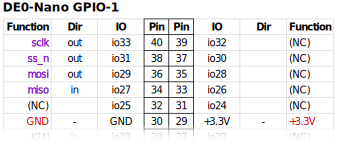
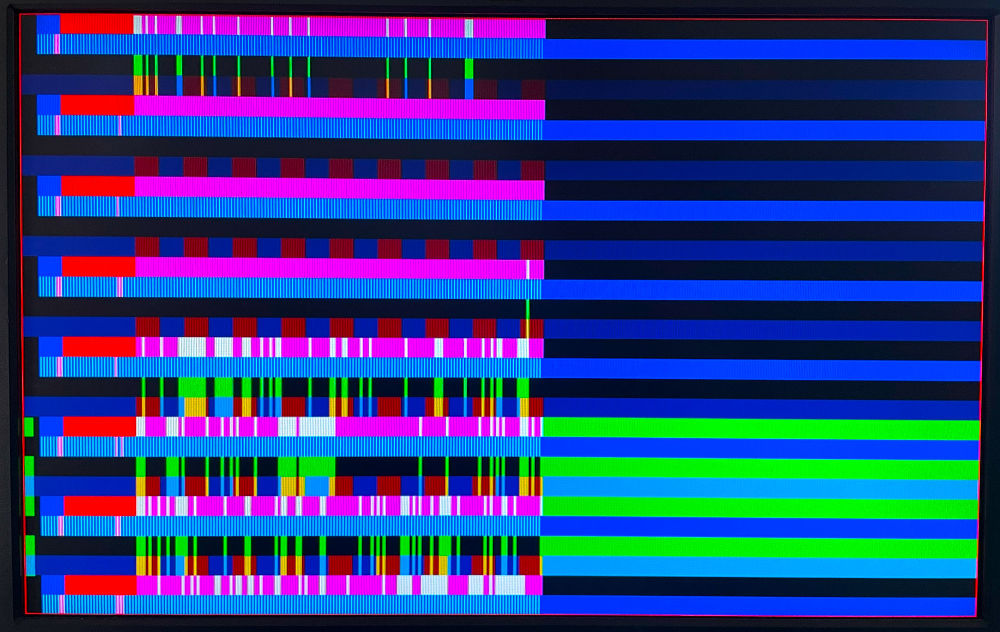
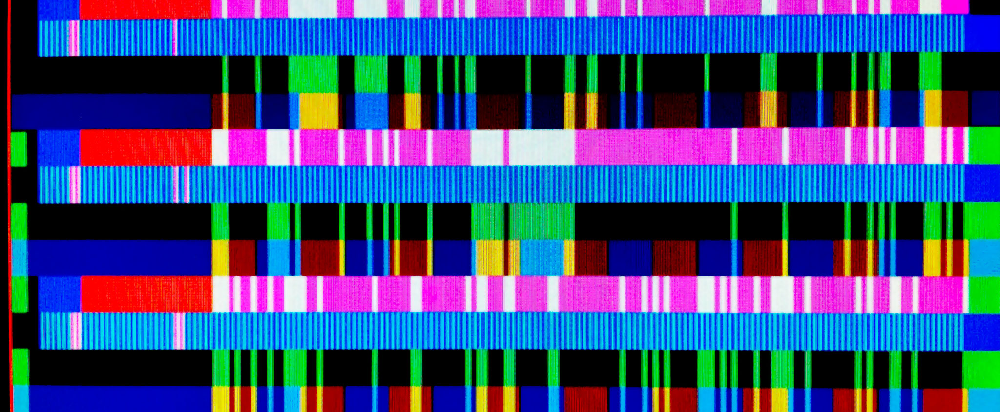

# 6 Oct 2023

| Previous journal: | Next journal: |
|-|-|
| [**0152**-2023-10-04.md](./0152-2023-10-04.md) | [**0154**-2023-10-07.md](./0154-2023-10-07.md) |

# SPI flash ROM FPGA tests

*   Before I write and run cocotb tests, I'll just wire up the chip with [my design](https://github.com/algofoogle/sandpit/blob/b416c575c53ffbe5747e69bf7cebea20fcd43642/fpga/vga_spi_rom/src/rtl/vga_spi_rom.v) and see how it goes. I'm not too worried about corrupting/damaging the chip because (a) I've physically strapped /WP (Write Protect); and (b) the design currently only sends 1 or 2 adjacent high bits, and these don't map to commands that might enable Dual or Quad outputs that would otherwise lead to a short.
    *   However, there is a risk that maybe /WP (hardware write protection) can be overridden:
        *   06h (2 adjacent bits) is command WREN (Write Enable)
        *   Apparently after this is sent it's possible to do 01h (1 trailing bit) which is WSR (Write Status Register)
        *   This could write 00 into (SRP1,SRP0), and apparently that switches to software protection, which could ignore /WP
    *   It seems unlikely to me, however, that we'd get a 01h after 06h, because that would mean they must be on different alignments.
    *   A possible mitigation might be to find an alternating bit stream (even 01010101) for our dummy read outputs that can't lead to anything meaningful.
    *   Confusingly, it seems that (SRP1,SRP0)=00 is the *default* state, i.e. software protection only?
*   Note [wiring of the vga_spi_rom design's SPI signals to the DE0-Nano](https://github.com/algofoogle/sandpit/blob/b416c575c53ffbe5747e69bf7cebea20fcd43642/fpga/vga_spi_rom/de0nano/top.v#L131-L135):
    
*   I also pulled /HOLD high with a 2k2 resistor, and pulled /WP low with a 2k2 resistor.
*   I found that when releasing /CS and DOUT goes HiZ, a high state on DOUT lingers. I used some resistors on hand to add a DOUT pulldown of about 9k.
*   Doing this exercise was useful for being attentive to the following things:
    *   During a read, the ROM outputs data on the **falling edge** of SCLK.
    *   For a standard READ command (03h) this means the first bit (MSB) of the byte being read is presented on MISO as SCLK falls on the final address bit cycle.
    *   For READ (03h), the last bit presented on MISO will persist as long as /CS remains asserted.
    *   Effect of timing when using registers, i.e. what's delayed, what's not, and what needs to be aligned.
    *   Make sure you properly count SCLK falling edges to match the number of bits you expect. This probably won't be a problem (since it usually leads to /CS being released), but can be confusing if you're off by one.
*   **NOTE:** I also set up pins 39,37,35,33 to respectively output 50MHz, 25MHz, 12.5MHz, and 6.25MHz.
*   **NOTE:** Because the signal presenting at the MISO input is directly displayed, we can actually use it as a sort of VGA logic probe: Disconnecting it from DOUT, we can touch it to /CS, SCLK, MOSI and (say) the 12.5MHz and 6.25MHz FPGA outputs to see what they're doing.

# Next steps

*   Cocotb tests, using `spiflash` as part of the tb.v
*   See what happens if /CS is asserted when SCLK has been HIGH idle for a while. Should make no difference.
*   See what happens if /CS is asserted at the same time that SCLK GOES low. Could be ambiguous?
*   Write a proper FSM. Include options (external controls??) for how many bits/bytes to read/display, whether to 
*   Write test patterns and an image to the SPI flash ROM.
*   See if we can double the clock; go at full 25MHz speed.
*   Try Dual SPI mode, and QSPI if game.

# Data in my ROM

Here's a snippet of the data in the SPI flash ROM that I'm currently using:

```
00000000  e9 03 02 20 20 04 10 40  00 00 10 40 40 07 00 00  |...  ..@...@@...|
00000010  00 00 00 00 00 00 00 00  00 00 00 00 00 00 00 00  |................|
*
00000040  20 83 fe 3f 1c 4b 00 40  cc 24 00 40 1c 04 12 c1  | ..?.K.@.$.@....|
00000050  e0 3d 01 09 41 01 fb ff  c0 00 00 02 01 00 22 a0  |.=..A.........".|
00000060  e9 27 90 04 0c 02 c6 06  00 22 a0 ea 27 90 0a 32  |.'......."..'..2|
00000070  01 01 28 31 66 43 02 86  02 00 21 f1 ff 01 f2 ff  |..(1fC....!.....|
00000080  c0 00 00 7c f2 08 41 12  c1 20 0d f0 30 83 fe 3f  |...|..A.. ..0..?|
00000090  08 fc 10 40 12 c1 f0 c9  11 09 01 cd 02 21 fb ff  |...@.........!..|
000000a0  3d 0c 01 e9 ff c0 00 00  2d 0c 05 fa ff 26 02 1a  |=.......-....&..|
000000b0  cc 92 01 f7 ff 2d 0c c0  00 00 c6 03 00 ca 22 01  |.....-........".|
000000c0  f4 ff 22 c2 10 c0 00 00  46 00 00 0c 12 c8 11 08  |..".....F.......|
000000d0  01 12 c1 10 0d f0 00 00  30 10 00 00 00 10 00 00  |........0.......|
000000e0  b4 18 00 40 00 4a 00 40  4c 4a 00 40 41 fb ff 40  |...@.J.@LJ.@A..@|
000000f0  11 c0 0c 44 62 d1 10 09  56 d9 76 39 46 c9 66 3d  |...Db...V.v9F.f=|
00000100  01 cd 02 40 d2 11 d2 dd  30 2d 0d 01 ce ff c0 00  |...@....0-......|
00000110  00 42 01 00 0c 13 0c 22  72 d1 10 d9 87 40 23 83  |.B....."r....@#.|
00000120  32 c1 10 41 ee ff 2a 2c  40 22 11 01 c6 ff c0 00  |2..A..*,@"......|
00000130  00 02 d1 10 52 01 00 08  40 cc 85 0c 2d 0c 12 22  |....R...@...-.."|
00000140  41 00 86 01 00 0c 1d 0c  03 32 41 00 22 c1 10 0c  |A........2A."...|
00000150  84 3d 00 01 e3 ff c0 00  00 da dc 2d 0d 01 e1 ff  |.=.........-....|
00000160  c0 00 00 32 c1 10 40 2d  11 41 dc ff d2 d1 10 d8  |...2..@-.A......|
00000170  8d 01 dd ff c0 00 00 3b  2c 01 da ff c0 00 00 3d  |.......;,......=|
00000180  01 0c 44 2d 0d c2 d1 10  c8 6c d2 d1 10 d8 7d 01  |..D-.....l....}.|
00000190  d6 ff c0 00 00 21 d0 ff  02 d1 10 08 50 2a 11 0d  |.....!......P*..|
000001a0  f0 00 00 00 00 06 00 60  20 4e 00 00 cc 2e 00 40  |.......` N.....@|
000001b0  12 c1 f0 09 01 0c 09 21  fb ff c0 20 00 92 62 c1  |.......!... ..b.|
000001c0  3c 88 c0 20 00 72 22 c0  80 77 20 c0 20 00 72 62  |<.. .r"..w . .rb|
000001d0  c0 0c 45 7c 96 c0 20 00  42 22 c0 60 44 10 50 44  |..E|.. .B".`D.PD|
000001e0  20 c0 20 00 42 62 c0 0c  13 c0 20 00 02 22 c0 30  | . .Bb.... ..".0|
```

# Results

Below is the result of using a [more recent version of the code](https://github.com/algofoogle/sandpit/blob/4cc82001af3343bc4307209046f15f2051d21a57/fpga/vga_spi_rom/src/rtl/vga_spi_rom.v):



Close-up:



Example of decoding a stream:


Going from left to right in the image above:
*   Top row shows:
    *   Blue for /CS asserted while SCLK and MOSI are low.
    *   Cyan for SCLK high and MOSI low.
    *   Magenta for SCLK low and MOSI high.
    *   White for SCLK high and MOSI high.
*   Middle row shows data received from DOUT on the chip (miso in the design).
*   Bottom row shows alternating blue and red regions that are bytes.

Decoding this, we see:
*   The rising SCLK edge loads each bit into the chip: We can see that, going MSB (left) first, we clock in `00000011`, hence command 03h (READ). Then we clock in 00h, 00h, 60h (address 000060h). During this time, DOUT is high-Z, but I've got ~9k resistor pulling it low for stability.
*   Immediately as SCLK goes low at the end of the 60h byte, it's the falling edge that causes DOUT to present data (a high bit, in this case). As SCLK continues to present falling edges, each subsequent data bit is presented.
*   This continues, revealing the data: E9 27 90 04 0C, and this correlates with the ROM data given for address 60h [above](#data-in-my-rom).
