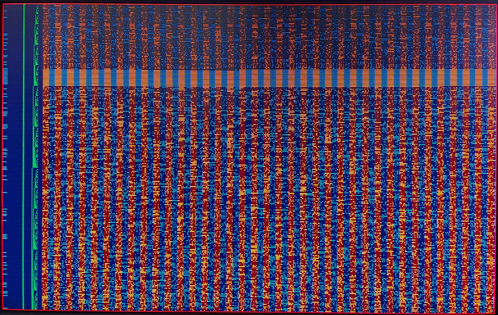
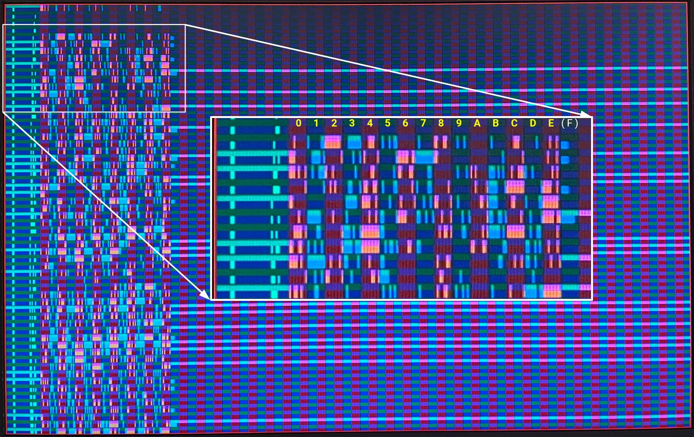

# 7 Oct 2023

| Previous journal: | Next journal: |
|-|-|
| [**0153**-2023-10-06.md](./0153-2023-10-06.md) | [**0155**-2023-10-09.md](./0155-2023-10-09.md) |

# More SPI stuff

# Accomplishments

*   Reworked the vga_sim_spi FSM a bit.
*   Made the SPI master control the SPI flash ROM slave at full speed, i.e. it clocks SCLK at the same speed as my design's CLK, but inverted. It seems to work fine (see [findings](#findings) below).
*   Used CLK **`negedge`** to store data from SPI flash ROM in local memory (shift register for now)

# Notes

*   I was reading that it *seems* SPI slave devices have an internal clock running (perhaps a ring osc) at a multiple (maybe 4x or 6x?) faster than their expected maximum data rate, to allow other logic to run rather than just being limited to SCLK.
*   I need to mentally work out possible glitches that could occur with gating SCLK (or even NOT gating it) when it is simply driven by !CLK.
*   If there is no other solution, I might need to have a forced delay ([`(* keep *)`](https://docs.xilinx.com/r/en-US/ug901-vivado-synthesis/KEEP-Example-Verilog)? Also [`synthesis keep`](https://www.intel.com/content/www/us/en/programmable/quartushelp/17.0/hdl/vlog/vlog_file_dir_keep.htm) like [this](https://www.fpgadeveloper.com/2011/06/how-to-keep-a-signal-name-after-mapping.html/) too, and check [this](https://www.reddit.com/r/yosys/comments/e456jg/any_way_to_do_an_equivalent_of_synthesis_syn_keep/)), use a faster system clock (e.g. 50MHz, to attain 25MHz SCLK), or use an internal ring osc to make a high-speed master FSM.
*   Is it safe to make use of both `posedge` and `negedge`?
*   Could we peg SCLK safely for one whole extra clock either side of /CS transitions, to ensure that glitches don't happen UPON /CS transition, but rather before or after? I'm sort of thinking of making SCLK a latch...? i.e. make its initial transition due to a `<=` assignment, but subsequent due to combo logic passed through transparently...?
*   See if we can deliberately glitch SCLK relative to /CS, and see what happens.
*   **NOTE:** The leading /CS assert and coincident/subsequent SCLK edge might end up all being fine, but just be aware that when /CS is released, we don't want an erroneous extra SCLK edge to be sensed that could put a 'Continuous Mode' out of order. I think if SCLK goes high, gets *pegged* high, and then /CS is released, we'll be OK... just so long as a SCLK falling edge is NOT detected.
*   This is a really good read about Yosys (and generally Verilog) cells, operators, etc: https://yosyshq.readthedocs.io/projects/yosys/en/latest/CHAPTER_CellLib.html#chapter-celllib
*   Certain warnings we really don't care about in Quartus (such as 292013: LogicLock feature needing a subscription). Right-click and select 'Suppress'.

# Findings

*   DON'T FORGET: When reacting to something on counter==X, the reaction will occur at the same time as counter==X+1.
*   I [modified](https://github.com/algofoogle/sandpit/blob/b51016a22886b21da146bf592d370728b625dd1b/fpga/vga_spi_rom/src/rtl/vga_spi_rom.v) the design to:
    *   Drive SCLK constantly, from the inverse of the system CLK. This allows us to latch MOSI data on the rising edge of CLK, and then know that it will be stable for the SPI slave on SCLK's rising edge (i.e. CLK's FALLING edge).
    *   Start each line address at the next 64 bytes, so we can see at least 64 bytes per line.
    *   Make each 'line' 2px tall, with even lines being black to make it easier to see individual bytes.

    Here's how it looks, and it seems to prove that SCLK running at 25MHz in this way is working OK:

    
*   I noticed that explicitly setting spi_mosi on all 32 input states actually used LESS logic than only specifying it for when a bit change occurs. This possibly makes sense because it might help simplify internally synthesised comparators. I used this to add [`MASK_REDUNDANT`](https://github.com/algofoogle/sandpit/commit/14fdce1e48a2be9904bed149d81b57cb7fce994f#diff-eae130479ad0c908edc74b5c702a0ad19cb4ec6b6b8f620f34204035fedd42ddR9) which, if defined, cuts out all the extra states, but leaving it NOT defined (i.e. commented out) leaves in all the extra states, and allows for better Quartus optimisation. This is further helped by the `default` line in the `case`, too. When `MASK_REDUNDANT` **IS** defined, we use 89 LEs. Without it, we use only 74 LEs. NOTE: Assigning `x` in the `default` is allowed, but remains at 74 LEs. I've asked about yosys `x` optimisation in the TT Discord.
*   I [updated][simple-memory-vs-direct] to test both loading the ROM data into local memory and displaying it directly from MISO. I had use `@(negedge clk)` for this because we can only sample MISO *between* positive edges of `clk`. It seems to work OK:

    

    Note the following:
    *   Each line 'pair' is on an address 16-byte boundary (000000h, 000010h, 000020h, etc), but I'm only reading/displaying 15 bytes. This is because I'm treating it as though there isn't enough time in HBLANK to read all 16: 16 bytes * 8 bits + 32 bits for cmd/addr = 160, which exactly how many clocks we have to work with in HBLANK, but that doesn't leave time for releasing/asserting /CS again. In reality, though, if I needed the extra time I would just start blanking early... in raybox-zero I might deliberately shave 640w to 512w and leave room for a HUD.
    *   Green/magenta horizontal stripes come first, showing the stored data (captured during HBLANK into an internal 120-bit shift register). They're followed by blue/red horizontal stripes, which show the data as it comes live off the SPI memory via MISO. The fact that they are the same shows consistency in how we're clocking/sampling the data.
    *   Note that where a stored line has a continuous high stripe (i.e. starting at column `(F)`), that's because it's the last bit in column `E` not being clocked out.
    *   However, there is some lingering charge (I guess) for certain direct-to-screen bits in column `(F)` which shows as a short fading bar. This appears to be what happens when /CS is released and MISO goes Hi-Z. The length of this (and its behaviour/sensitivity to interference) seems to be determined by combinations of leading bits, and whatever data would come next...? I noticed when I changed [state 152](https://github.com/algofoogle/sandpit/blob/bc58d7b952222bba0101bd033c4c49a656c415c7/fpga/vga_spi_rom/src/rtl/vga_spi_rom.v#L182) to 151 (i.e. releasing /CS early) that it could also lead to metastability (I think) in the last bit of `data_buffer`, where there was variability in what was being sensed and stored for that last bit.

# Next steps

*   cocotb and spiflash sim: both in iverilog (test benches) and verilator (visual sim).
*   Include signal options to:
    *   Change the /CS release state number. Make it configurable at run-time? Might need us to vary the depth of `data_buffer` too.
    *   Change `hpos_in_hblank` offset (not just 640).
    *   Toggle `vpos[2:0]==0` blanking (i.e. black lines separating comparison pairs) -- this seems to have an effect on metastability.
    *   Toggle hard blanking of signal outputs outside of `0..E` range.
    *   Via other state options above, support reading full `0..F` range.
*   Convert vga_spi_rom into a TT05 design. Use [this version][simple-memory-vs-direct]? It will allow for testing stability, output signals (inc. oscilloscope watching SCLK edge transitions spaced at 20nS), comparing with FPGA design, and what happens with metastable stuff. NOTE: State 152 can be set to 151 instead to make the metastable bit sampling in `data_buffer` more obvious.
*   Consider using a memory array instead of shift register for storing incoming SPI data. See if it leads to extra complexity, performance issues, synth trouble in a TT05 1x1 tile...?
*   Support RGB222 (or even RGB111) for TT05.
*   Rework the FSM (esp. stored-to-display, which should NOT be using `negedge` even though the storage stage needs it).
*   Try Dual or even Quad SPI. Will it be safe (and fast enough) to switch direction on ports when going from SPI to QPI, esp. with our direct-SCLK and negedge stuff?
*   Design a *better* FSM to simplify how we setup, write CMD, write ADDR, and then read data.
*   Check with the Discord crew whether this design is flawed, esp. if it gets made into standard cells.
*   How hard would it be to implement this in discrete logic?
*   Write image/test-pattern data to the ROM.
*   Formal verification could be a good way to prove that a risky command cannot be written to the SPI flash ROM.
*   Can we sort of half-double-buffer by loading texture data for the NEXT line when we cross the half-way point of the CURRENT line? We KNOW that any pixels after this point must be from the 'upper' part of the line.
*   Try a basic implementation in raybox-zero, even if just for single-bit column data for now. See if it works, and see what it does to synth area. Super simple might even just be to load a background image, and work up from there.

# TT05 ideas

*   VGA 'probe'
*   VGA 'sync' follower
*   SPI test device, even just to display SPI ROM contents on screen
*   VGA different frequencies
*   Ring osc

# EllenWood chip

*   Reasonable goal that is otherwise unsuitable for TT05:
    *   Larger area for more memory on-chip, initially for textures.
    *   SPI read from external memory for background, textures, sprites, map.
    *   RAM32 macros, DFFRAM, OpenRAM, etc.
    *   Analog in (or out) -- purpose/dir could even be selectable via SPI. As an output, it could be:
        *   VGA DAC, even if just for 1 channel or for greyscale.
        *   NTSC or PAL composite output, inc. colour burst and embedded sync.
        *   ...?
    *   Some custom cells
    *   Some custom macros/GDS art inc. Lily
*   Do raybox-zero or full raybox for EllenWood chip?
*   Think about whether raybox-zero can use the Caravel SoC CPU in the EllenWood chip submission via WB or LA.
*   Given SPI interface might not work, consider a way to disable it and fall back to normal bitwise logic for texture generation, or even an embedded texture ROM.
*   Work out what the MINIMUM number of pins is that we can work with. It's possible that Ellen and Pawel need 19 pins already, so not much left for me (or a mux)?

[simple-memory-vs-direct]: https://github.com/algofoogle/sandpit/blob/bc58d7b952222bba0101bd033c4c49a656c415c7/fpga/vga_spi_rom/src/rtl/vga_spi_rom.v
