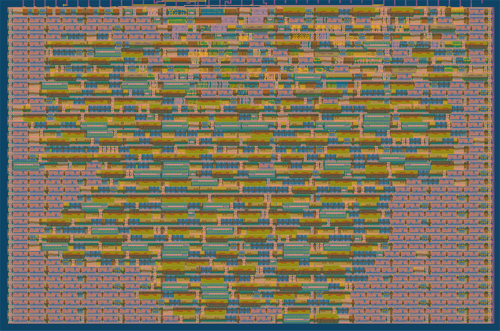

# 9 Oct 2023

| Previous journal: | Next journal: |
|-|-|
| [**0154**-2023-10-07.md](./0154-2023-10-07.md) | *Next journal TBA* |

# Continuing SPI test design

# Accomplishments

*   I've spent today making [tt05-vga-spi-rom] out of the base `vga_spi_rom` design I was working on [yesterday (0154)](./0154-2023-10-07.md).
*   The design hardened successfully on the first try, taking only about 5 minutes in the GHA! With a 120-bit buffer, it hits 42% util and looks like this:
    
*   Added `de0nano/de0nano_top.v` which intentionally wraps `tt05_top.v` to prove that there are no wiring mistakes. NOTE: `de0nano_top` has minimal wiring, but DOES generate `clock_25` out of its own `CLOCK_50` input. Tested it on the DE0-Nano: Works fine!
*   [Tag 0.1](https://github.com/algofoogle/tt05-vga-spi-rom/releases/tag/0.1) was [submitted as a TT05 design](https://app.tinytapeout.com/projects/192).

# Steps to set up the tt05-vga-spi-rom repo

1.  Created [tt05-vga-spi-rom] from [tt05-submission-template].
2.  Cloned repo locally.
3.  Worked out `info.yaml`, sort of making a spec. Keeping dedicated outputs the same as raybox-zero will mean a reusable VGA/RGB board is possible, but I want to try RGB333 too so I included the lowest bit of each channel in the bidir pins as an option.
4.  Edited `config.tcl` to specify 40ns clock period.
5.  Enabled GitHub Actions permission to write to Pages.
6.  Add main code (`helpers.v`, `vga_spi_rom.v`, `vga_sync.v`).
7.  Wire up `vga_spi_rom` inside `tt_um_algofoogle_vga_spi_rom` (TT05 tile interface) in `tt05_top.v`
8.  Check that all IOs are accounted for: `ui_in[7:0]`, `uo_out[7:0]`, `uio_out[7:0]`, and `uio_oe[7:0]`.
9.  Check that all `vga_spi_rom` signals are connected.
10. Make sure RESET condition is handled, and polarity is correct.
11. Make sure H/VSYNC and /CS polarity are correct.
12. Add a little bit of stuff to the README.
13. Committed/pushed, proving that GDS successfully hardens with GHA.
14. Added de0nano interface, thus testing `tt_um_algofoogle_vga_spi_rom` on DE0-Nano FPGA board.
15. Updated/committed de0nano and README, and tagged: `git tag -a 0.1 -m "Basic design works; v0.1 submission to TT05"`
16. Submit!

[tt05-vga-spi-rom]: https://github.com/algofoogle/tt05-vga-spi-rom
[tt05-submission-template]: https://github.com/TinyTapeout/tt05-submission-template


# Notes

*   GDS GHA spewed [441 linter warnings](https://github.com/algofoogle/tt05-vga-spi-rom/actions/runs/6452619891/job/17514914004#step:3:899) which mostly seem to be this (from `runs/wokwi/logs/synthesis/linter.log`):
    ```
    %Warning-TIMESCALEMOD: /work/runs/wokwi/tmp/synthesis/blackbox/sky130_fd_sc_hd__blackbox.v:5:8: Timescale missing on this module as other modules have it (IEEE 1800-2017 3.14.2.3)
        5 | module sky130_fd_sc_hd__a2111o_1(X, A1, A2, B1, C1, D1);
        |        ^~~~~~~~~~~~~~~~~~~~~~~~~
                        /work/src/tt05_top.v:27:8: ... Location of module with timescale
    27 | module tt_um_algofoogle_vga_spi_rom (
        |        ^~~~~~~~~~~~~~~~~~~~~~~~~~~~
                        ... For warning description see https://verilator.org/warn/TIMESCALEMOD?v=5.009
                        ... Use "/* verilator lint_off TIMESCALEMOD */" and lint_on around source to disable this message.
    ```
    Not sure if there's anything we can/should do about this, other than maybe getting rid of my own `` `timescale `` specs. The only other warnings are a small number of expected `UNUSEDSIGNAL`s.
*   BEWARE! When copying a Quartus project, we could end up with a conflicting `.sof` (bitstream) path spec, which leads to writing the wrong file to the FPGA! For example, `de0nano/output_files/vga_spi_rom.cdf` includes a reference to the old path for my SOF file. To work around this I deleted the `db`, `incremental_db`, and `output_files` subdirectories, along with any `.bak` files and `vga_spi_rom.qws` -- all stuff that is normally gitignored.
*   GHA `gds` logs seem different from what I've seen in the past. Is this a newer OpenLane 1.x version?
*   For a DAC, instead of using 74ALVC245 to buffer each output, would it be better to use an OpAmp to amplify the combined *analog* signal of each? Maybe not, because that way we need extra parts: 5 OpAmps to cover each of R, G, B, HSYNC, and VSYNC. Still, how much is a quad OpAmp? Looks like about AU$1.50ea for 30MHz.


# Next steps

## For tt05-vga-spi-rom

*   Go up to full 128-bits (16 bytes) storage. Even try more and see if still fits in 1x1.
*   Try OpenLane 2.x
*   Implement cocotb/verilator and add in Claire Wolf's spiflash so we can prove it works in sim.
*   Try some stuff from [0154 Next Steps](./0154-2023-10-07.md#next-steps).
*   Option for a faster or slower clock, esp. to target 800x600, say [36.0MHz](http://tinyvga.com/vga-timing/800x600@56Hz), [40.0MHz](http://tinyvga.com/vga-timing/800x600@60Hz), or [50.0MHz](http://tinyvga.com/vga-timing/800x600@72Hz). Slower clock might be just &div;2.
*   Should we [worry about SDC files](https://github.com/algofoogle/tt05-vga-spi-rom/actions/runs/6452619891/job/17514914004#step:3:895)?
    ```
    Warning: : PNR_SDC_FILE is not set. It is recommended to write a custom SDC file for the design. Defaulting to BASE_SDC_FILE
    Warning: : SIGNOFF_SDC_FILE is not set. It is recommended to write a custom SDC file for the design. Defaulting to BASE_SDC_FILE
    ```
*   Include a 50MHz option that is selectable between full 50MHz SCLK, or 25MHz SCLK (with a better FSM)? At 50MHz, should we pick a VGA resolution that uses it, e.g. [800x600 72Hz](http://tinyvga.com/vga-timing/800x600@72Hz) or a rejigged version of some other resolution that would normally need a much faster clock, but we can &div;2 or even &div;3 it to sync at that rate but display a lower resolution?
*   SMELL: RESET signal should drive SPI /CS high and keep it high until the next valid sequence starts.
*   Test out extra RGB333 range. Show colour bars/palette in otherwise unused screen area?
*   In fact, should RESET make all bidir pins go HiZ (become inputs)?
*   If SCLK output is too close to /CS transitions, consider adding an external delay line to it of some kind? We could build one using simple discrete logic, a dedicated chip like 74LS31, or maybe this could even be selectable inside the chip using a chain of inverters? Something we can perhaps test using oscilloscope.
*   3+4 lines vs. 1+2 lines modes: Actually maybe 3+4 is best to test repetition, but 1+2 is better to represent images. Actually if we're doing that, why not just do it continuously and full resolution?
*   Attempt re-display of data as mapped to [tiny hex characters](https://docs.google.com/spreadsheets/d/10W6RaZFFKiEBgWBWMpl-wNXEygXAUvypYUgx8fy_Z80/edit#gid=811511442) -- do colour pairs for bytes.
*   Ensure that RGB111, RGB222, RGB333 all give results that can be visually interpreted.
*   For interest, besides just more inputs to switch things, try periodically incrementing the address high bits. Have a way to control the speed, and it could be an animation! Even have the option to let the *data* in the SPI ROM specify the delay, or have an actual data stream elsewhere in the ROM that specifies which 'frames' to display, in what order, with what timing.
*   OL1 or OL2?
*   If we have any spare IOs, try using them to make a *proper* delay line. Some stuff that might help, in [this conversation](https://discord.com/channels/1009193568256135208/1113767289217622127/1114580085115203604) (both above and below the linked message) between Uri and Sylvain, on [ring oscillators](https://github.com/TinyTapeout/tt03p5-ringosc-cnt), simulation, `keep`s, etc.
    *   NOTE: From looking at [this](https://github.com/TinyTapeout/tt03p5-ringosc-cnt/blob/ede8763d15f6999d26ac00598c674b982df5b2ce/src/prim_generic/tt_prim_inv.v#L4) it appears Uri has estimated a single sky130 inverter delay to be 70ps, so to make (say) a 5ns delay we'd need about 72 (even number!) in a chain. Note that 5ns would be too fast for me to measure on my scope. I'd want a minimum of a 10ns delay, maybe ideally a 10 and a 5 (allowing for combos making any of 0, 5, 10, and 15ns). In total, this would be 216 inverters. Can we instead create a 'slow' path (i.e. large capacitance) or use an actual delay cell? Maybe we can hard-wire a large fanout and blackbox it.
    *   NOTE: sky130 has its own delay cells we could use, e.g. [sky130_fd_sc_hd__dlygate4sd1](https://github.com/google/skywater-pdk-libs-sky130_fd_sc_hd/blob/main/cells/dlygate4sd1/definition.json) (vs. [sky130_fd_sc_hd__dlygate4sd3](https://github.com/google/skywater-pdk-libs-sky130_fd_sc_hd/blob/main/cells/dlygate4sd3/definition.json)) and [sky130_fd_sc_hd__dlymetal6s2s](https://github.com/google/skywater-pdk-libs-sky130_fd_sc_hd/blob/main/cells/dlymetal6s2s/definition.json).
    *   Compare [ericsmi/tt02-verilog-ring-osc-demo].
    *   NOTE: There may be enough delay in the IOs themselves, anyway. We can try to measure this. I've described this in the `info.yaml` for `TestA` and `TestB`. I expect at least some delay, as the sum of: Caravel input pin => TT05 Mux => My gate => TT05 Mux => Caravel output pin; ...and then double it if we chain them together.
*   Make some of the spare `ui_in` inputs either into an extra SPI host control interface, or just a simple way to select (mux) different debug outputs from the `uio_out` pins that would otherwise be dedicated to `R/G/B[0]` and `TestA/B`.

[ericsmi/tt02-verilog-ring-osc-demo]: https://github.com/ericsmi/tt02-verilog-ring-osc-demo


## For raybox-zero

*   Add spiflash to raybox-zero TB (verilator) and maybe actually create a formal tb.v wrapper for sim/verilator.
*   Use our 160 HBLANK clocks to read (say) 2x64 bits of wall texture data into the upper 2 bits of 1 RGB channel, and vary the other channels based on wall ID/side...? Alternatively, there's an advantage to just reading single-bit data, and that is we can actually see it and compare with what we know is in the ROM.
*   For raybox-zero, instead of waiting until HBLANK to start the whole SPI read-into-memory process, so long as wall tracing is finished we can actually start it 32 clocks early (or however many are needed including dummy clocks), because it will only overwrite the wall texture buffer when SPI data bits start clocking out. This gives us at least 159 HBLANK clocks to work with. If we say it's 160, then 160 is enough to get:
    *   SPI: 40 nibbles; QPI: 160 nibbles.
    *   SPI: 26 RGBs; QPI: 106 RGBs.
    *   SPI: 20 bytes; QPI: 80 bytes.
    *   If we want to get lots of different data, we could do this:
        *   Set up QPI Fast I/O Continuous Read mode before HBLANK starts, then upon starting HBLANK...
        *   Read 64 texels (64x6, or 384 bits): 96 clocks.
        *   Release /CS, then assert again: 2 clocks.
        *   Send Fast I/O address and dummy: 12 clocks.
        *   This leaves 50 clocks for reading other data. That's up to 200 bits, which could be 32 RGBs (i.e. a single 32-pixel-tall sprite at full RGB222 depth). Instead, it could be 6x 32h 1-bit sprites, or 5x and we use 30 of the remaining 40 bits for colour selection. Similarly, if we went with just 2 sprites: Pixel data each is 32x2 (4-color) or 64 bits. Palette data each is 4x6 or 24 bits: 2*(64+24) = 176. 24 bits left over, however we might need that for selecting the 2nd sprite address in QPI Fast I/O mode.
*   For chips that support 'word mode' (command E7h) the dummy wait reduces to 2 clocks instead of 4.
*   In raybox-zero, if we had an option for the host controller to specify remapping of certain addresses (esp. for wall textures), then we could use that for some tricky effects such as forced perspective wall art rendering.


# Notes

*   Does TT05 support SDC files, and could I use one to set timing constraints on my internal `clkb`? Otherwise, can we tell OpenLane(2?) about this 2nd (internal) clock and that we want it to do extra CTS? Maybe only need to worry about that if we get reports of setup/hold violations.
*   Ellen's' chip IO pins:
    *   Bare minimum:
        *   Clock, reset: 2 (though maybe shared)
        *   Min VGA: 3 (HSYNC, VSYNC, Green)
        *   SPI in: 3
        *   SPI out (flash ROM master): 4
        *   Total: 12 pins. Maybe already too many!
    *   Desirable:
        *   Analog: 1
        *   Shared clock/reset: 0
        *   Min VGA: 5 (HSYNC, VSYNC, RGB111)
        *   SPI in: 3
        *   SPI out (flash ROM master): 4
        *   Total: 13.
    *   OR:
        *   Analog: 3
        *   Shared clock/reset: 0
        *   VGA: 2 (HSYNC, VSYNC)
        *   SPI in: 3
        *   SPI out (flash ROM master): 4
        *   Total: 12.
    *   Ideal:
        *   ?
    *   NOTE: If we want QPSI for SPI out, we need 2 more!
    *   NOTE: For a single SPI interface:
        *   We could get away with requiring that the host controller actually write our position data (vectors) to the ROM during VBLANK, and we read it from there. Use interrupts to indicate when it's safe for the host controller to master the memory (instead of us).
        *   Can we get away with any special interface we define with fewer pins? e.g. only 2 pins for incoming SPI (CLK and MOSI) and just use a special bit sequence for state reset.
        *   Maybe something else can write into our design's memory directly, at all times, even for textures? A host controller that runs fast enough could get an interrupt from our design, then as an SPI master it could read out our state, then immediately keep pushing in texture data, etc. It can take extra lines to do this if it wants to.
