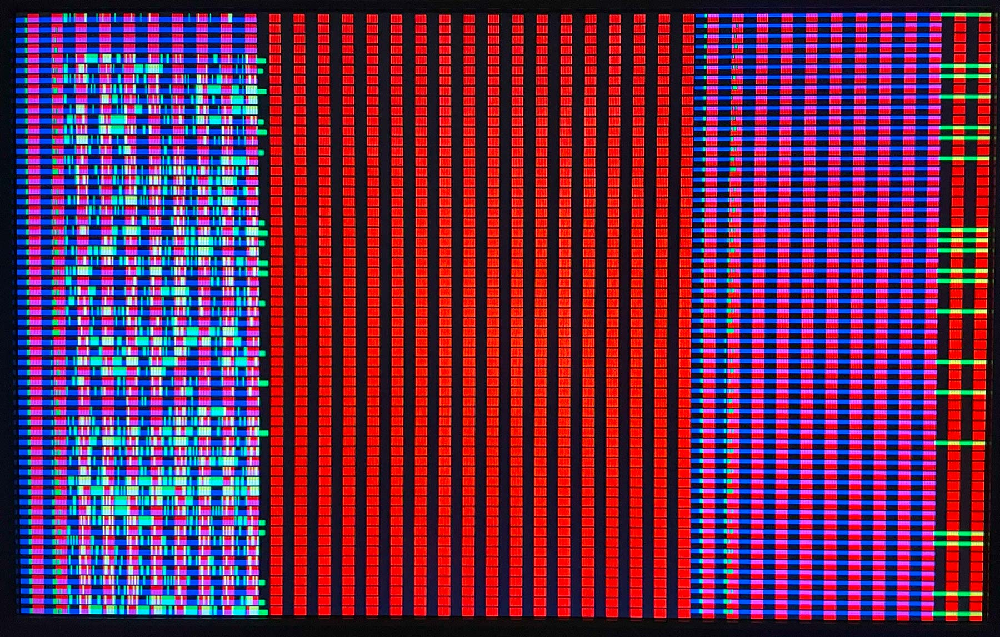
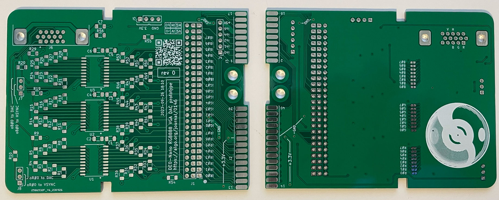
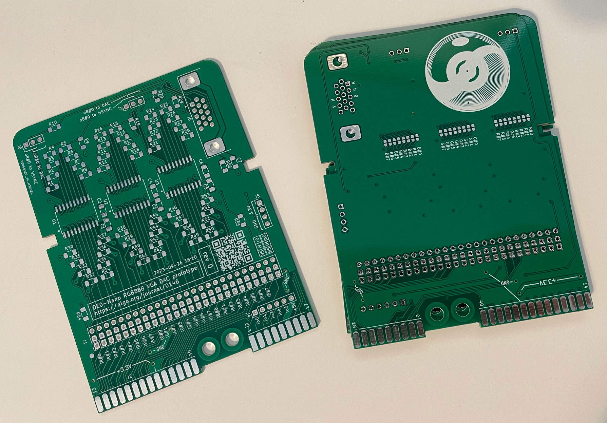

# 11 Oct 2023

| Previous journal: | Next journal: |
|-|-|
| [**0156**-2023-10-10.md](./0156-2023-10-10.md) | *Next journal TBA* |

# tt05-vga-spi-rom and cocotb stuff

# Accomplishments

*   I spent a lot of the morning tidying up where test files are. Now there's `src/test` for everything except the `Makefile` (because TT05's `test` GHA template still expects to run `make` in there for tests).
*   In the afternoon I tried to rewrite the code to be better-structured, simpler, easier to read, etc. There were some issues with this and it took up too much time. Changes are in the `cleanup` branch. Latest commit is [here](https://github.com/algofoogle/tt05-vga-spi-rom/commit/af0e55d52a1fee50719f7365844b2536dbfe3c11), where it works and currently looks like this:
    

    It currently only uses RGB111 colour, because I wanted to prove that would work OK, before having versions that work up to RGB333.

    NOTE: Blue channel now shows /CS, and I shifted the stored-mode range to be fully visible (for the time being).

# Notes

*   Can't do the following, because the incoming state is contradictory on different phases (or so it appears to the synth) even though they are separated from each other by hpos/state:
    ```verilog
    // In stored mode, buffer-to-screen display cycle on POSEDGE of clk:
    always @(posedge clk) begin
        if (stored_mode) begin
            // Shift buffer bits at the right time. This will make them appear on screen.
            if (hpos > PREAMBLE_LEN && hpos <= STREAM_LEN) begin
                data_buffer <= {data_buffer[BUFFER_DEPTH-2:0], 1'b0};
            end
        end
    end
    // In stored mode, shift MISO into buffer on NEGEDGE of clk:
    always @(negedge clk) begin
        if (stored_mode) begin
            // Load MISO bits into buffer at the right time:
            if (state > PREAMBLE_LEN && state <= STREAM_LEN) begin
                data_buffer <= {data_buffer[BUFFER_DEPTH-2:0], spi_miso};
            end
        end
    end
    //SMELL: Should above pair of 'always' blocks just be combined into @(clk) ?
    ```
*   **I think it would make more sense to just let all states and screen output be delayed by 1,** then we don't have to worry about ugly "what comes next" logic. Just comment the code enough to show that on negedges, hpos has already advanced. **CHECK:** Will this be more or LESS compatible with setting registers shift state changes?
*   If things get a bit tricky with state tracking, especially during 799=>0 wrap-around, we could instead just use a separate counter register to count states. Then we can set it to 0 at 799 or whatever our 'start' register is programmed to.
*   Could SPI SCLK follow CLK directly (positive, instead of inverted)? Then, we just prep data to clock in on negedge of CLK? Hmm... Might just be the same problem anyway.
*   Would it help to register our outputs, then we don't have to worry about case/clock/state mismatches?


# Goals

*   Fix X signals in tt05-vga-spi-rom: Probably just need reset for all other regs?
*   Review yesterday's ([0156](./0156-2023-10-10.md)).
*   Proving that certain signals remain known/stable during test running, e.g. `uio_oe`: cocotb coroutine to run complex test sequencing, with an `await` on any edge in the main thread?


# cocotb tests

*   Tidied things up by moving all test files into `src/test/`, including `test.py`, which cocotb (actually Python) is instructed to find via [`PYTHONPATH`](https://github.com/algofoogle/tt05-vga-spi-rom/blob/5ba4134521c13ea8ac9d2a38b946651ae9f7ab79/src/Makefile#L21-L23). [The tests workin GHA](https://github.com/algofoogle/tt05-vga-spi-rom/actions/runs/6477184376).


# RegNext

https://discord.com/channels/1009193568256135208/1016726411400200292/1161155587573305374


# VCD to image

*   [Eldritch conversation kicked off this idea](https://discord.com/channels/1009193568256135208/1023600305407008868/1142514886304342157).
*   I want to make it happen by default in `make` (for `test` GHA), with an ENV option to disable it.
*   [GTKWave Automation (to save a PDF)](https://ughe.github.io/2018/11/13/gtkwave-automation) using Tcl scripts.
    *   NOTE: Given script doesn't work as-is on Windows because of missing `ps2pdf` util. We could install this (Ghostscript?) or just use `PS` output instead (which Adobe Illustrator can open).
    *   I also changed paper size to: `Legal (14" x 8.5")`
    *   See also: [GTKWave User Guide - Appendix E: Tcl Command Syntax](https://gtkwave.sourceforge.net/gtkwave.pdf#page=117&zoom=100,76,206)
    *   There's also 'File' => 'Grab to File' which just saves a screenshot of the current window as a PNG.
    *   See [here](https://github.com/algofoogle/tt05-vga-spi-rom/commit/158a5a0d7550ee5ad040af42a8ad8d0f67f6e489) for my experiments with this. I then moved these files around, so when you want to use it, do so like this:
        ```bash
        gtkwave -S utils/vcd2png.tcl tb.vcd utils/vcd2png.gtkw utils/vcd2png.ini
        ```
        Note:
        *   Tcl script directs GTKWave to save the view to both PS and PNG.
        *   .gtkw file describes how to display the waveform.
        *   .ini file specifies other visual rendering parameters.
*   Try also, VCD conversion to wavedrom:
    *   https://github.com/Toroid-io/vcd2wavedrom
    *   https://github.com/nanamake/vcd2json


# VGA-DAC PCBs

My [VGA-DAC] PCBs (see journal [0146]) have arrived from JLCPCB 14 days after submission, and they look great:




The silkscreen quality (actually, all quality) seems excellent. The footprint of the VGA connector's 15 pins doesn't precisely match the two connectors I bought from DigiKey (see [0146]) -- in KiCad they seem to be equally spaced on X and Y (but middle row just offset by half a pin), but the actual connectors seem to space the rows more than the individual pins. I will still able to get one of the connectors to fit by slightly bending its pins inwards towards the middle row. Interestingly, this error (or something similar) also shows up in the KiCad 3D render.


# Notes

*   You can push to GitHub and suppress GitHub Actions by [including a marker in your commit message](https://docs.github.com/en/actions/managing-workflow-runs/skipping-workflow-runs).
*   Clock doubler: https://electronics.stackexchange.com/a/446659

[VGA-DAC]: https://github.com/algofoogle/sandpit/tree/master/fpga/VGA-DAC
[0146]: ./0146-2023-09-26.md
