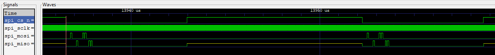

# 13 Oct 2023

| Previous journal: | Next journal: |
|-|-|
| [**0157**-2023-10-11.md](./0157-2023-10-11.md) | [**0159**-2023-10-14.md](./0159-2023-10-14.md) |

# A bunch of tt05vsr (tt05-vga-spi-rom) tests

# Today's tests

These should each be a separate branch, and we want to test them both on FPGA and `gds` GHA.

## `cleanup`

My existing code, the 'control'. Tried it with both `MASK_REDUNDANT` [on](https://github.com/algofoogle/tt05-vga-spi-rom/actions/runs/6501992014) (43.93%) and [off](https://github.com/algofoogle/tt05-vga-spi-rom/actions/runs/6501989435) (42.96%). Display is the same for both:

## `test001-case400`

[`test001-case400`](https://github.com/algofoogle/tt05-vga-spi-rom/actions/runs/6504015079): 42.79% util: Remove prediction of hpos/vpos and stored_mode_next; instead just do hpos offset with direct in 400..560 and stored in 640..800 (or 600..760). This should have the benefit of having vpos (and hence stored_mode) consistent through the whole line.

Actually I changed it to start direct mode (and hence main pixel painting for both modes) at pixel 8, and to make the odd/even bytes line up in stored mode I made it start at pixel 408.

## `test002-case0`

[`test002-case0`](https://github.com/algofoogle/tt05-vga-spi-rom/actions/runs/6504141022): 42.56% util: As above, but just start with natural case 0 and make everything else off-by-1.

There appears to be an error with this design, however:

The stored mode has missing final bits, plus with the absence of the leading green bar it suggests not enough shifts have happened.

I've [fixed this](https://github.com/algofoogle/tt05-vga-spi-rom/actions/runs/6504583131) and it now gets util 42.68%. Screenshot:

### `test002A`

Same as test002-case0 but using a slightly different comparator approach based on `hpos1` instead of `hpos`, which has the same effect but is a little easier to understand. [Util: 42.48%](https://github.com/algofoogle/tt05-vga-spi-rom/actions/runs/6504657240)

## `test003-regall`

Build on test002, but also register all screen outputs, to see if everything then aligns perfectly. What will happen to negedge MISO vs. negedge buffer shift/register? [Util: 43.8%](https://github.com/algofoogle/tt05-vga-spi-rom/actions/runs/6504797797). No surprise about util increase because at least 3 extra regs are needed.

Predictably, the image is not any different, other than the 'fuzzy' bit at the end of the painting region being more stable and less gradiated when interfered with.

This doesn't really need its own separate test. If we want to replicate this code change in a future version, [it's very small and simple](https://github.com/algofoogle/tt05-vga-spi-rom/commit/865b2fa128b1cddc2d2b245ac68798667dd82b05).

# Next steps

*   Make test003-regall's register a selectable output option in final design, so we can see the effect of registering the negedge-based output. Will it be unstable sometimes? Will it be MORE stable and properly clock-aligned?
*   Re-run all these tests with cocotb and sim, and see how they turn out.
*   For raybox-zero, should we just use a 50MHz clock and be done with it? Possibly too many risks with negedge registering of MISO, e.g. making that buffer/memory then readable by posedge code during visible wall-rendering.
*   Work out why spiflash.v doesn't work properly for me in cocotb. It just seems to echo whatever comes in via MOSI:
    
    NOTE: MISO should be Hi-Z until a READ command is sent but I don't think spiflash is written this way. We can put spiflash into verbose mode, or make it use more `$display`s, or put in more signals representing current state, or even just inspect its internal signals via the existing VCD.
*   Complete the remaining tests:
    *   `test004-combo`: Combine vga_sync into main module and change its registers to combo logic: no H/VSYNC lag, but this isn't really our problem anyway...? Base this on test002A? Maybe even replace the FSM with combo logic.
    *   `test005-ram`: Replace data_buffer with actual RAM. Does it make data retrieval easier without needing negedge-to-display? Use bit index in vector, or actual addressed memory array?
    *   `test006-statereg`: Add extra 'state' counter register that starts at hmax... but will this suffer the same vpos offset issue? Well maybe but we can probably make that not matter with a little trickery.
*   Add in control options, namely: host can change parameters. See whether this works better with any given test above (esp: is it a better fit for extra 'state' counter register?)

# Goals for today were...

*   Half-finished:
    *   Stick to the plan! Do the tests above
*   Still to do:
    *   Add ui_in pins to blank out various things, e.g. show only stored, only direct, hide other stuff...?
    *   Then, try working out how to use the DE0-Nano PLL to get specific timing from base 50MHz clock.
    *   If we can do that, can we get 35.49 or 35.5MHz per [1440x900 below](#getting-clearer-image-on-1440x900-display)?
    *   If so, have an option for the design that allows selecting this mode, or even consider a full-HD ([1920x1080](#what-about-1920x1080-timing)) monitor.
    *   Any case where we divide pixel clock by an even number means we might actually be able to see SCLK on-screen.
    *   These are a good way also to push SCLK faster to test the SPI chip's limits.

# Getting clearer image on 1440x900 display

Given [timing for 1440x900](http://tinyvga.com/vga-timing/1440x900@60Hz), if we divide 106.47MHz by 3, we get 35.49MHz.
*   Let's assume we can get exactly a 35.5MHz clock, either by PLL or external crystal. We still want very close to a 50% duty cycle, though! What about the Caravel clock calculator?
*   We also need to divide 'whole line' (1904) by 3, and round it. We want 634&frac23; 'wide' (x3) pixels. We can get 635.
*   Thus, at 35.5MHz, we'd get: 35,500,000&div;635&div;932 = 59.98Hz.
*   Maybe the monitor will still sync at this rate? It's a 0.053% error (~525ppm). If so, we should hopefully then get much clearer pixel delineation, and maybe even see smaller glitching.
*   CHECK: What sync polarity? 1920x1080 uses POSITIVE?

# What about 1920x1080 timing?

See: https://projectf.io/posts/video-timings-vga-720p-1080p/#hd-1920x1080-60-hz
*   Pixel clock: 148.5MHz -- Divide by: 3 => 49.5MHz (640w); 4 => 37.125MHz (480w); 5 => 29.7MHz (384w); 6 => 24.75MHz (320w)
*   Line total: 2200 pixels: &div;3 => 733&frac13; (round to 733?); &div;4 => 550; &div;5 => 440; forget &div;6
*   Frame total: 1125 lines
*   Yep: 2200x1125x60Hz = 148.5MHz
*   BEWARE: Positive sync polarity?? Is that right?
*   NOTE: With a 49.5MHz clock, 733 line length, 1125 lines, this would be ~60.03Hz
*   Actual 49.5MHz crystals are relatively expensive (>$6). Cheap alternative is 49.152MHz but this gets us only ~59.61Hz
