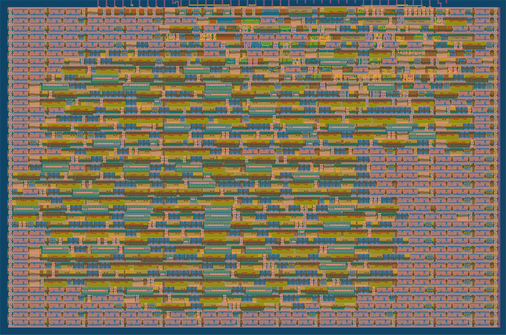
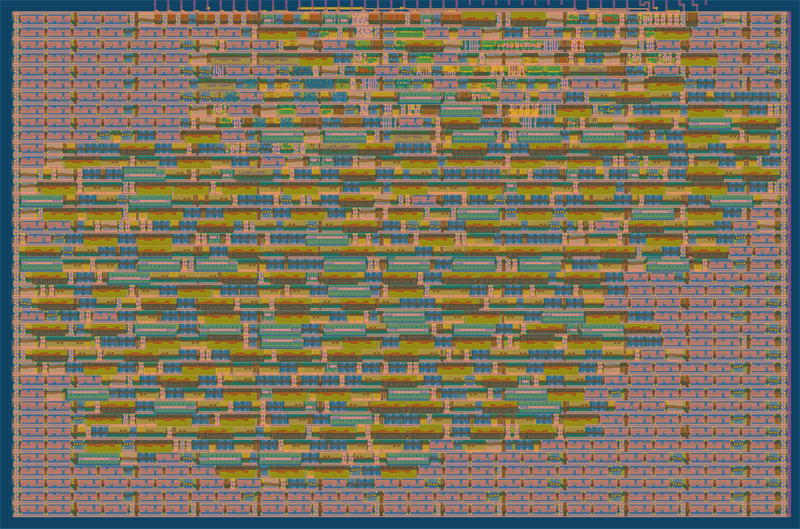
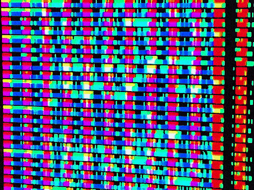
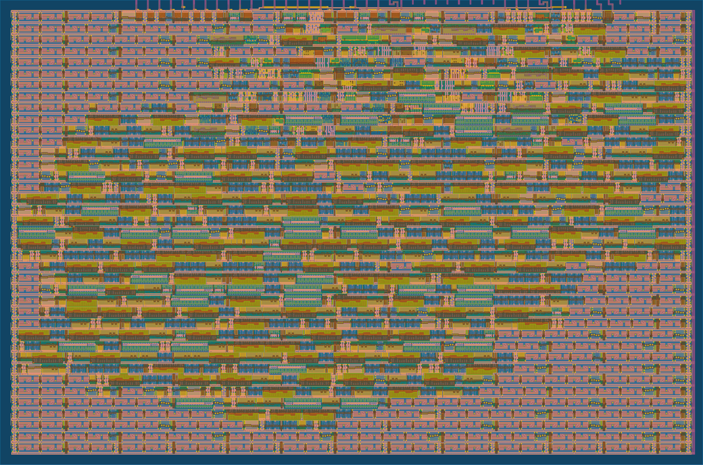
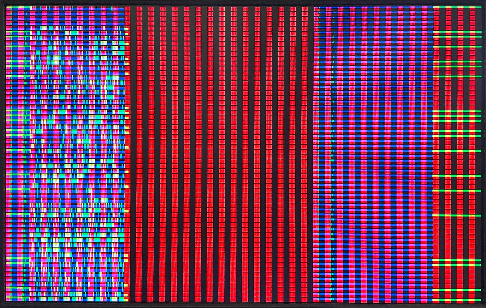
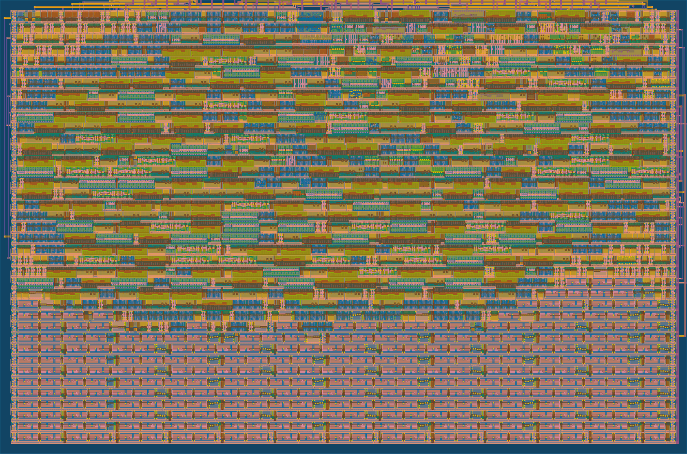
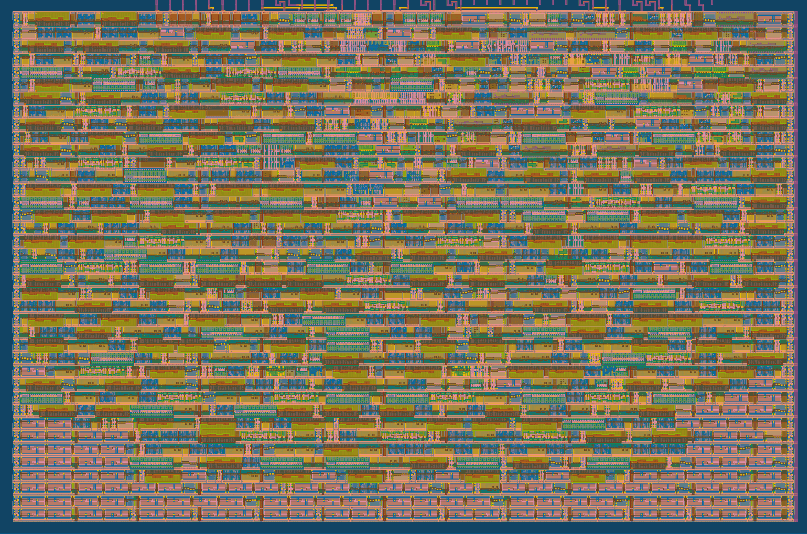
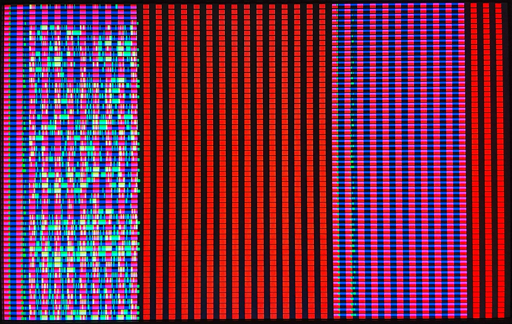
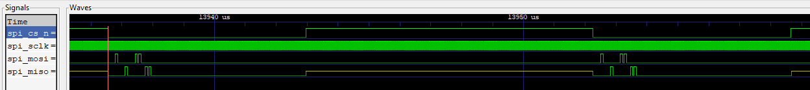

# 14 Oct 2023

| Previous journal: | Next journal: |
|-|-|
| [**0158**-2023-10-13.md](./0158-2023-10-13.md) | *Next journal TBA* |


# Continuing tt05vsr (tt05-vga-spi-rom) tests

# Accomplishments

*   Did [test004](#test004-combo) with combo logic replacing FSM.
*   Did [test005](#test005-ram) building on test004, to make *retrieval* from data_buffer like RAM.
*   Did PR on test005, making `main` branch move from [registered FSM version](https://github.com/algofoogle/tt05-vga-spi-rom/blob/f47cea62570c8e45157e286745ad2686833de786/src/vga_spi_rom.v) (per test002A) to [136-bit combo/RAM model](https://github.com/algofoogle/tt05-vga-spi-rom/blob/b1bc1a93fee594268208493d05a36da2671216b5/src/vga_spi_rom.v) (per test005).
*   Figured out [why spiflash sim is not working](#spiflash-issues) in cocotb (I think). Try a fix another day.
*   Updated my MPW8 VM (on the Legion 7 laptop) to support `tt05env-bash` with newer OpenLane version.


## `test004-combo`

Change FSM to combo logic, i.e. don't use registers to control SPI outputs, but rather direct combo logic based on hpos (or rather, `state`, derived from `hpos`).

4 versions:
*   [Detailed with 'x'](https://github.com/algofoogle/tt05-vga-spi-rom/actions/runs/6515265299):
    *   41.99% util; 972 total cells.
    *   
*   [Simple with '0'](https://github.com/algofoogle/tt05-vga-spi-rom/actions/runs/6515336218):
    *   41.58% util; 972 total cells.
    *   
    *   This seems to output the same MOSI data as the one above, so probably no different -- just slightly changed layout?
*   [Just 32 MOSI states](https://github.com/algofoogle/tt05-vga-spi-rom/actions/runs/6515621381):
    *   41.24% util; 965 total cells.
    *   
    *   This one only worries about the MOSI states that matter (first 32), and doesn't care about the rest. In fact, it just repeats those same 32, but this means it litters the display. Interestingly, though, it's unstable too, i.e. some lines have bits that jitter:
        
    *   Observations on jitter:
        *   Could be due to cross-talk
        *   Could be fixed with decoupling, shorter wires, etc? Less effect seen if MISO weakly pulled high (on HOLD# pin) vs. VCC or VSS.
        *   Almost NO effect if MISO pulled to SCLK or MOSI??
*   [Reverted to 'simple with 0' and tidied up](https://github.com/algofoogle/tt05-vga-spi-rom/actions/runs/6515807137):
    *   41.57% util; 979 (!) total cells.
    *   
    *   Logic change was to make stored_mode region start at hpos==416 instead of 408, so the byte boundaries are the same.
    *   NOTE: I also tried to change this line:
        ```diff
        - wire store_data_region = ( hpos >= STORED_MODE_HEAD+PREAMBLE_LEN &&  hpos < STORED_MODE_TAIL);
        + wire store_data_region = (state >=                  PREAMBLE_LEN && state < STREAM_LEN      );
        ```
        ...which reduces total cells from 979 to 973, but makes util go slightly higher (up to 41.91%).


Final output from test004-combo branch:




## `test005-ram`

This version is not using a 'memory array', but rather using the data_buffer shift reg in a way that is *technically* RAM (i.e. it can be treated as random access): We're using a bit index to access each bit from the buffer, as we need it, instead of shifting it out. This type of design might be more useful to raybox-zero anyway, where the next bit we need might not be sequential.

The advantage also of this design is that we can still sample/shift into the buffer during `negedge clk` (i.e. `posedge spi_sclk`), and then read directly from that buffer in sync with `clk` (rather than having to use `negedge clk` again to shift data out).

The downside is likely to be that more logic is likely to be required to actually convert an 'address' into the bit index we want... I'm guessing a big mux chain?

Here are the notable versions of this design:
*   [128-bit buffer, simple power-of-2 bit lookup](https://github.com/algofoogle/tt05-vga-spi-rom/actions/runs/6516270882): 48.51% util on 60% target density. 1060 cells, ~8mins to harden. Power-of-2 maths are easier for BUFFER_DEPTH.
*   [Initial change to flexible BUFFER_DEPTH (non-power-2)](https://github.com/algofoogle/tt05-vga-spi-rom/actions/runs/6517451404). 48.49% util on 90% target density. 1072 cells, ~11mins to harden. Flexible BUFFER_DEPTH (non-power-2) means we use a different subtraction approach to get the bit index. Still 128 bits in this version. Interesting result is that 90% target density seems to have crammed everything up the top:
    
*   256 bits with 90% target density failed reasonably quickly during detailed routing.
*   [192-bit buffer, flexible BUFFER_DEPTH](https://github.com/algofoogle/tt05-vga-spi-rom/actions/runs/6517595349): Has been running for over 2 hours in GHA. Might not succeed? I'll report back later. I'm also running it now on my laptop, but OpenLane is not using my configured 14 `ROUTING_CORES`...? Seems to only be using 2 at a time.
*   [136-bit buffer](https://github.com/algofoogle/tt05-vga-spi-rom/actions/runs/6517951404): 51.91% util on 60% target density. 1152 cells, i.e. increase in 8 bits (which includes extra bit for data_buffer index) results in 80 more cells, and ~3.5 percentage points increase in util. Seems like a lot!

136-bit version GDS:



How it looks on-screen (showing off *17* bytes per line, i.e. last byte column is repeated in the next row's first byte):




## `test006-statereg`

**CANCELLED TEST:** Add extra 'state' counter register that starts at hmax... but will this suffer the same vpos offset issue? Well maybe but we can probably make that not matter with a little trickery.


# Next steps

*   Consider the risk now that SPI outputs, given they're not registered, could glitch?
    *   Don't care about MOSI, because it will be stable before being sampled.
    *   SCLK is unlikely to glitch (?) because it is just a single-gate (?) inversion of clk.
    *   **/CS could be an issue though?** It changes based on a chain of things: hpos => state => comparator.
*   Using a true RAM on both store and paint is probably not a good idea...? I expect it will be a bit complex given address sharing, and not even necessary/ideal given we're going to read SPI sequentially into a buffer anyway.
*   I based test005 on test004 (combo logic). Same concept would probably work also based on test002A (FSM)...?
*   Try hardening locally? I think there's a new OL1 version in use for TT05.
*   Add in `ABh` SPI wake-up command to sort out [spiflash issue below](#spiflash-issues).
*   NOTE: It's possible this design won't work in Verilator (and hence no VGA C++ sim) because I seem to recall that it can't do more than 64-bit vectors. If that's the case, however, maybe we can have a tweak that splits it into 64-bit chunks, or even just limit it to 64-bit conditionally, for testing purposes?
*   Start a project ideas catalogue in Journal, along the lines of how 'tips' are done, or just one long list.
    *   solo_squash in 7400 logic -- probably a nice one to draw as a block diagram, too. Interesting problems to solve like counter carry...?

## Different on/off options to consider for final design

*   Collapse state to only consider first 32 bits, and hence repeat the MOSI pattern. Good for testing jitter.
*   Masking out certain parts of the display.
*   Switch between registered VGA output and direct output.
*   Registers to adjust state stuff, inc. offset, when to turn /CS on/off...? Would work best with test004 model.
*   Should be possible to combine several different models into the same design, since the buffer is the main area. However, different modes (e.g. vector bit index vs. shifter) might reduce optimisation ability.


# spiflash issues

Despite my design working on an FPGA with a real SPI flash ROM chip, I was getting unexpected cocotb test results when using `spiflash.v`:



My expectation, from datasheets, was that MISO should be HiZ until after the READ (03h) command and address are both sent.
*   Also, we shouldn't be seeing MISO repeat MOSI (in this case with a 1-byte delay).
*   From looking deeper into spiflash's state in the VCD, I found that `powered_up` was always 0, and this doesn't seem right.
*   With `spiflash` the only way to switch it on is by sending the wakeup command (`ABh`, aka `RES`, aka 'Release from Deep Power Down / Device Id'), because the code specifies `reg powered_up = 0` as the initial state. Datasheets (and using a real device) suggest this is wrong.
*   Anyway, maybe that's intentional to make sending `ABh` first a normal safety protocol.
*   We can do that; probably best to do so during the first line, plenty of cycles before that first stored-mode read starts.
