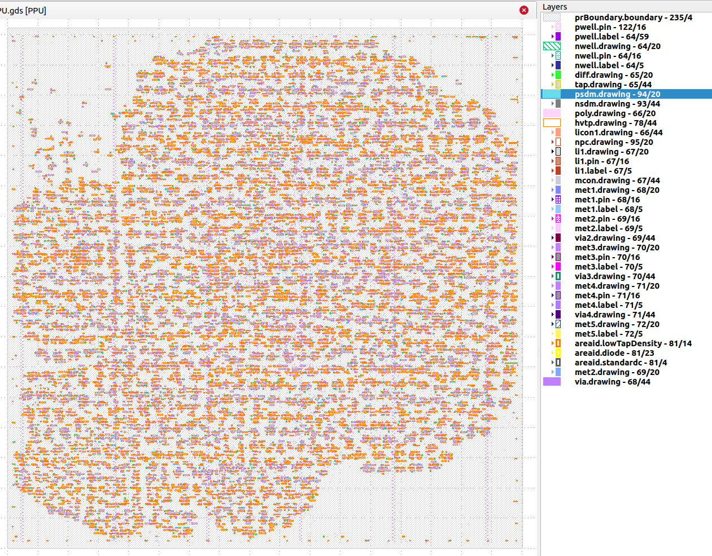
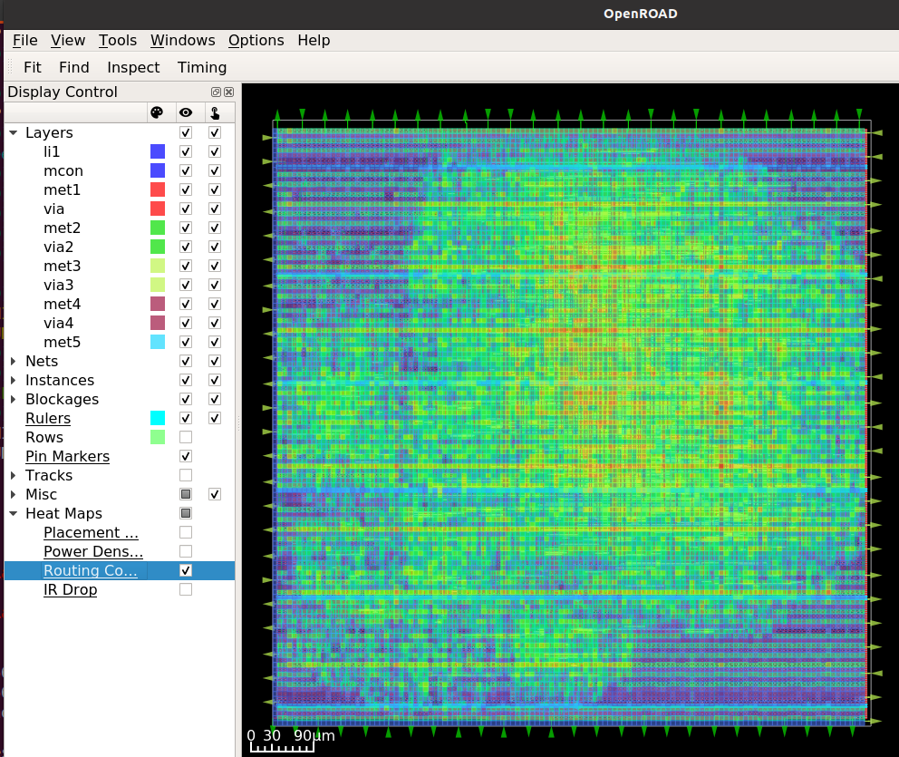

# 16 Oct 2023

| Previous journal: | Next journal: |
|-|-|
| [**0159**-2023-10-14.md](./0159-2023-10-14.md) | *Next journal TBA* |

# Work on raybox-zero update for chipIgnite

# Goals

*   Try 1920x1080 (div-6) and even 2560x1440 (div-8) resolution tt05vsr.
*   Get raybox-zero as-is hardening in OpenLane as a macro.


# Next steps

*   Write a top module as a kind of template for our expected IOs, and fill in the rbzero blanks as we go (e.g. we'll start with RGB888 but only use RGB222 initially). This needs to consider tristate controls (i.e. `oeb`) if we're doing the SPI master. In fact, I might need to supply this for all my IOs. Also consider an `ena` signal and maybe power gate?
*   Work out what's distinct about the Project 5.x wrapper stuff and placement of things inside CUP.
*   Check out:
    *   https://github.com/algofoogle/solo_squash esp. `caravel_stuff` and `wrapped_stuff`
    *   https://github.com/algofoogle/solo-squash-caravel
    *   https://github.com/algofoogle/wrapped_solo_squash
*   Read https://github.com/algofoogle/solo_squash/tree/main/caravel_stuff
*   Do simulation with firmware.
*   Try Gate-Level simulation: Both [Tholin's guide](https://tinytapeout.com/hdl/testing/#gate-level-testing) and Z2A 4.2 Extra Credit.


# 1920x1080 in tt05vsr

*   Specs for 1920x1080p60: https://projectf.io/posts/video-timings-vga-720p-1080p/#hd-1920x1080-60-hz
*   See branch: res1920x1080 - with div-6 we can get to 2202 H pixels instead of 2200.
*   How to set up SDC file for PLL?
*   Using the values I calculated, I was *not* able to get my FHD Acer monitor to sync, neither using pos nor neg sync polarity.
*   Another way to get the frequency we want might be to use hfreq and find something which is a closer fit to TIME instead of pixels?
*   I also tried [1920x1080p30](https://projectf.io/posts/video-timings-vga-720p-1080p/#hd-1920x1080-30-hz) but still no go.
*   ABANDONING FOR NOW.

# Spec for Ellen Wood design

## Base spec

*   Use raybox-zero design
*   Make a separate branch, or lots of feature branches for individual updates?
*   Keep 25MHz clock.
*   Keep 640x480.
*   Option for DEPTH shading using extra RGB bits.
*   Figure out QPI.
*   Pins:
    *   External digital:
        1.  CLK??
        2.  HSYNC
        3.  VSYNC
        4.  SPI memory /CS
        5.  SPI memory SCLK
        6.  SPI memory io0 (MOSI)
        7.  SPI memory io1 (MISO)
        8.  SPI memory io2
        9.  SPI memory io3
        10. Debug? Muxable
    *   External analog:
        1.  Red DAC
        2.  Green DAC
        3.  Blue DAC
    *   (Total external pins: 13)
    *   LA digital:
        1.  RESET -- Use same as Ellen/Pawel?
        2.  SPI slave /CS
        3.  SPI slave SCLK
        4.  SPI slave MOSI
        5.  MODE0
        6.  MODE1
        7.  MODE2
        8.  DEMO0
        9.  DEMO1
        10. SPI GENERAL slave /CS
        11. SPI GENERAL slave SCLK
        12. SPI GENERAL slave MOSI
        13. Debug0
        14. Debug1
        15. Debug2
        16. Debug3
    *   Other possible IOs:
        *   Interrupts: Could just be configurable/selectable to happen on 'Debug' pin.
*   Memory for wall texture: DFFRAM or OpenRAM for internal memory, or just registers?
*   Don't bother with anything 'fancy' for now:
    *   No 'custom standard cells'
    *   No special layouts
    *   No extra transistors or analog magic -- just DAC.
*   Digital ports:
    ```verilog

    input   wire            clk,        // External or internal/shared?
    input   wire            reset,      // LA[0]?

    // RAW VGA outputs:
    output  wire            hsync_n,    // IO1
    output  wire            vsync_n,    // IO2
    output  wire    [23:0]  rgb,        // INTERNAL: rgb is BGR888, which go to DACs.
    // Only upper 2 bits of each channel used normally, but full range (if supported) can do depth shading.

    // SPI master for external texture memory:
    output  wire            tex_csb,    // IO3
    output  wire            tex_sclk,   // IO4
    inout   wire            tex_io0,    // IO5 (MOSI)
    inout   wire            tex_io1,    // IO6 (MISO)
    inout   wire            tex_io2,    // IO7
    inout   wire            tex_io3,    // IO8

    //TODO: Add in the rest, mostly LA stuff:
    // - SPI slave interfaces (vectors+params)
    // - Mode select
    // - Debug pins
    // - External (multi-purpose) IO/debug pin.

    ```

## Stretch goals

*   Combine SPI slave interfaces
*   Map: Stored in chip (writable via SPI slave interface), or stored off-chip and read by the design.
*   Sprites
*   Configurable resolution, based on different input clocks up to 50MHz:
    *   [800x600@60Hz](https://tinyvga.com/vga-timing/800x600@60Hz) needs 40.0MHz.
    *   [1024x768@43Hz (interlaced)](https://tinyvga.com/vga-timing/1024x768@43Hz) can be done with 44.9MHz clock.
    *   [1024x768@60Hz](https://tinyvga.com/vga-timing/1024x768@60Hz) needs 65.0 MHz, but this could work using internal DLL, and without ESD output protection we could probably do the 65MHz pixel clock output.


# Stuff to figure out for Ellen Wood chip

*   Get back into making a macro that can be included in a multi-project Caravel.
*   In Caravel, how do we switch IO pins in/out? `oeb` or something.
*   Update to latest OpenLane 1.x -- just use TT05 'local hardening' approach?
*   Faster internal clocking?
*   Design analog part
*   Bridging to analog part
*   Making sure the repo doesn't get messy with Caravel stuff
*   Could use `$OPENLANE_ROOT/designs/wrapped_rgb_mixer` as a guide for making a macro?
*   Need to specify a maximum routing layer??
*   Find out more about this:
    ```tcl
    # don't put clock buffers on the outputs, need tristates to be the final cells
    set ::env(PL_RESIZER_BUFFER_OUTPUT_PORTS) 0
    ```
    ...and this:
    ```tcl
    set ::env(SYNTH_DEFINES) "MPRJ_IO_PADS=38"
    ```
*   PDN, e.g. `FP_PDN_MACRO_HOOKS` (see [here](https://github.com/algofoogle/solo_squash#caravel-asic-target))

# EW TODO

*   Actual TOP (wrapper) for rbzero
*   config.tcl
*   oeb wiring
*   Firmware
*   Simulation in CUP/UPW.

# Getting back into Caravel

*   Z2A MPW8 VM is what I have and it already has:
    *   [caravel_user_project] ("CUP") at `mpw-8c` (bae93e078005210307b7530e53d4a0c060ed5c54).
    *   [OpenLane] ("OL1") at `2022.11.19` (cb59d1f84deb5cedbb5b0a3e3f3b4129a967c988).
*   I made backup copies of them in `~/asic_tools`.
*   Later we'll go for OpenLane tag `2023.09.11`, and maybe CUP `mpw-9e` or whatever.

## Basic harden of existing example design

*   Example design I've chosen: PPU.
*   ```bash
    cd $OPENLANE_ROOT
    make mount
    # OpenLane Container (cb59d1f):/openlane$ 
    ```
*   `time ./flow.tcl -design PPU -verbose 1`
    *   NOTE:
        ```
        [STEP 3]
        ...
        [INFO]: Core area width: 839.5
        [INFO]: Core area height: 837.76
        ```
    *   NOTE:
        ```
        [STEP 14]
        [INFO]: Running Global Routing (log: designs/PPU/runs/RUN_2023.10.16_10.00.48/logs/routing/14-global.log)...
        [INFO]: Executing openroad with Tcl script 'scripts/openroad/groute.tcl'...
        [INFO]: Starting OpenROAD Antenna Repair Iterations...
        [INFO]: Starting antenna repair iteration 1 with 25 violations...
        [INFO]: Executing openroad with Tcl script 'scripts/openroad/groute.tcl'...
        [INFO]: [Iteration 1] Failed to reduce antenna violations (25 -> 25), stopping iterations...
        ```
    *   Takes 10~11 minutes with 4 vCPUs and 16GB RAM.
    *   ```
        [WARNING]: There are max fanout violations in the design at the typical corner. Please refer to 'designs/PPU/runs/RUN_2023.10.16_10.00.48/reports/signoff/25-rcx_sta.slew.rpt'.
        [INFO]: There are no hold violations in the design at the typical corner.
        [INFO]: There are no setup violations in the design at the typical corner.
        [SUCCESS]: Flow complete.
        ```
*   Summary (has to be run outside the docker container):
    ```
    $ summary.py --design PPU --full-summary
                            design : /openlane/designs/PPU
                       design_name :                  PPU
                            config : RUN_2023.10.16_10.00.48
                       flow_status :       flow completed
                     total_runtime :          0h10m18s0ms
                    routed_runtime :            0h5m1s0ms
             (Cell/mm^2)/Core_Util :     86259.4215314952
                      DIEAREA_mm^2 :       0.733195271625
                      CellPer_mm^2 :    17251.88430629904
                       OpenDP_Util :                20.49
              Peak_Memory_Usage_MB :              2122.33
                        cell_count :                12649
            tritonRoute_violations :                    0
                  Short_violations :                    0
                 MetSpc_violations :                    0
                OffGrid_violations :                    0
                MinHole_violations :                    0
                  Other_violations :                    0
                  Magic_violations :                    0
                antenna_violations :                   -1
                  lvs_total_errors :                    0
                  cvc_total_errors :                   -1
                klayout_violations :                   -1
    ...
                     cells_pre_abc :                 7674
                               AND :                   52
                               DFF :                    8
                              NAND :                   53
                               NOR :                   75
                                OR :                  466
                               XOR :                  113
                              XNOR :                   21
                               MUX :                 3014
                            inputs :                 2918
                           outputs :                 2927
                             level :                   21
                           EndCaps :                  616
                          TapCells :                10075
                            Diodes :                    0
              Total_Physical_Cells :                10691
                     CoreArea_um^2 :            703299.52

    $ summary.py --design PPU --yosys-report
    ...
    Number of cells:              12649
    ...
    Chip area for module '\PPU': 141081.558400
    ```
*   View GDS: `summary.py --design PPU --gds`
    
*   `exit` OpenLane docker.
*   Edit `Makefile` and add this line after existing `DOCKER_OPTIONS` line:
    ```
    DOCKER_OPTIONS += --privileged
    ```
*   `make mount`
*   Check `runs/` for the latest tag we created.
*   `./flow.tcl -design PPU -tag RUN_2023.10.16_10.00.48 -gui`
    

## Harden raybox-zero

1.  Create `ew` branch: `git checkout -b ew`
2.  Create `config.tcl` (this is based on wrapped_rgb_mixer):
    ```tcl
    # User config
    #set script_dir [file dirname [file normalize [info script]]]

    #SMELL: Change this later to a top wrapper:
    set ::env(DESIGN_NAME) rbzero

    # save some time
    set ::env(RUN_KLAYOUT_XOR) 0
    set ::env(RUN_KLAYOUT_DRC) 0

    # don't put clock buffers on the outputs, need tristates to be the final cells
    set ::env(PL_RESIZER_BUFFER_OUTPUT_PORTS) 0

    # Change if needed
    set ::env(VERILOG_FILES) "\
        $::env(DESIGN_DIR)/src/rtl/debug_overlay.v
        $::env(DESIGN_DIR)/src/rtl/fixed_point_params.v
        $::env(DESIGN_DIR)/src/rtl/helpers.v
        $::env(DESIGN_DIR)/src/rtl/lzc.v
        $::env(DESIGN_DIR)/src/rtl/map_overlay.v
        $::env(DESIGN_DIR)/src/rtl/map_rom.v
        $::env(DESIGN_DIR)/src/rtl/pov.v
        $::env(DESIGN_DIR)/src/rtl/rbzero.v
        $::env(DESIGN_DIR)/src/rtl/reciprocal.v
        $::env(DESIGN_DIR)/src/rtl/row_render.v
        $::env(DESIGN_DIR)/src/rtl/spi_registers.v
        $::env(DESIGN_DIR)/src/rtl/vga_mux.v
        $::env(DESIGN_DIR)/src/rtl/vga_sync.v
        $::env(DESIGN_DIR)/src/rtl/wall_tracer.v
        "

    set ::env(FP_SIZING) absolute
    set ::env(DIE_AREA) "0 0 700 700"
    set ::env(PL_TARGET_DENSITY) 0.6

    set ::env(SYNTH_DEFINES) "MPRJ_IO_PADS=38"

    set ::env(CLOCK_PERIOD) "40"
    set ::env(CLOCK_PORT) "clk"

    set ::env(DESIGN_IS_CORE) 0
    set ::env(RT_MAX_LAYER) {met4}

    set ::env(VDD_NETS) [list {vccd1}]
    set ::env(GND_NETS) [list {vssd1}]

    #set ::env(FP_PIN_ORDER_CFG) $script_dir/pin_order.cfg

    set ::env(FP_IO_VTHICKNESS_MULT) 4
    set ::env(FP_IO_HTHICKNESS_MULT) 4
    ```
3.  Commit and push `ew` branch.
4.  In MPW8 VM...
    ```bash
    cd $OPENLANE_ROOT
    cd designs
    git clone -b ew git@github.com:algofoogle/raybox-zero
    ```
5.  ```bash
    cd $OPENLANE_ROOT
    make mount
    # ...then in docker...
    ./flow.tcl -design raybox-zero
    ```
    Took 6~7 minutes.
6.  ```
    summary.py --design raybox-zero --full-summary
                            design : /openlane/designs/raybox-zero
                       design_name :               rbzero
                            config : RUN_2023.10.16_10.46.13
                       flow_status :       flow completed
                     total_runtime :           0h6m39s0ms
                    routed_runtime :           0h4m24s0ms
             (Cell/mm^2)/Core_Util :   28440.816326530614
                      DIEAREA_mm^2 :                 0.49
                      CellPer_mm^2 :   14220.408163265307
                       OpenDP_Util :                15.42
              Peak_Memory_Usage_MB :              1357.65
                        cell_count :                 6968
    ...
    ```
    This tells us `OpenDP_Util : 15.42`, i.e. only 15.42% utilisation.
7.  NOTE: `summary.py --gds` expects the `--design` name (dir name) to match the final output GDS filename, but that name instead comes from the `DESIGN_NAME`.


[caravel_user_project]: https://github.com/efabless/caravel_user_project
[OpenLane]: https://github.com/The-OpenROAD-Project/OpenLane

# Notes

*   When using `openlane/designs`, make sure subdir name matches 
*   sky130 DAC design using Xschem: https://www.youtube.com/watch?v=tqazqSHUm5I
*   In Caravel, if we were to output a digital PWM signal above 50MHz, would it start to automatically smooth? Maybe an experiment we can try.
