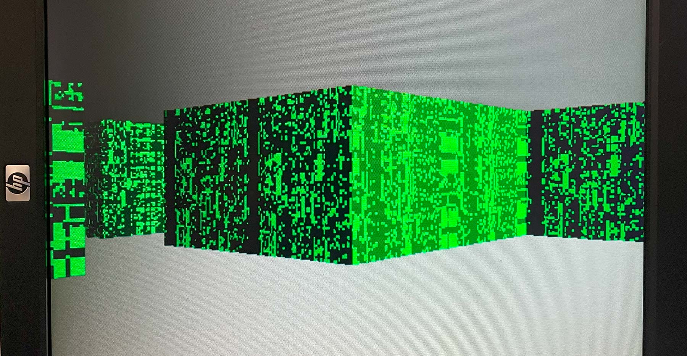
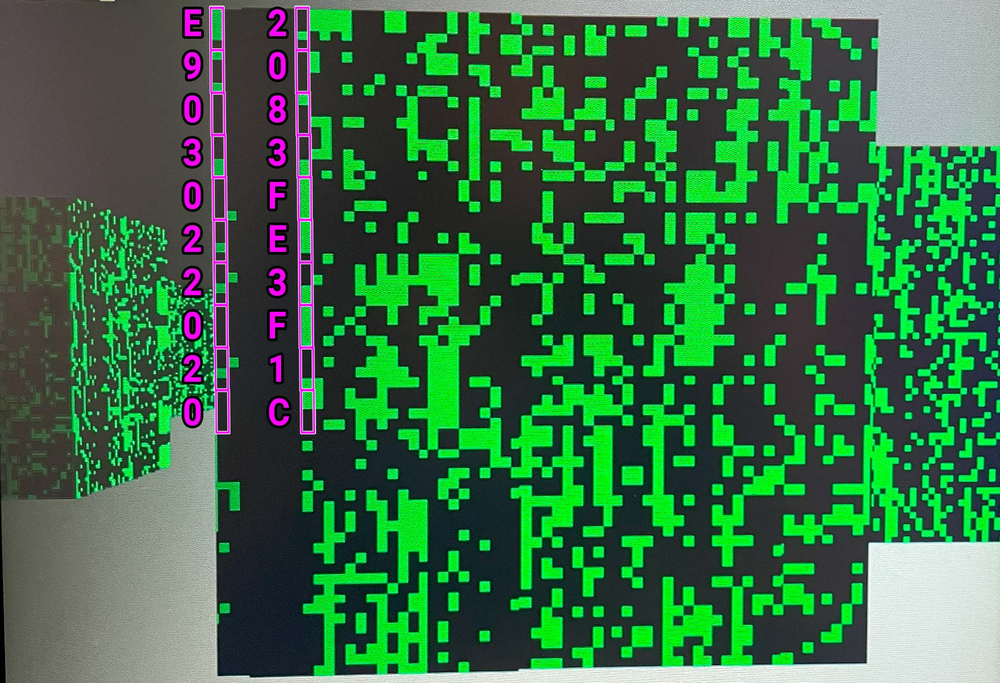
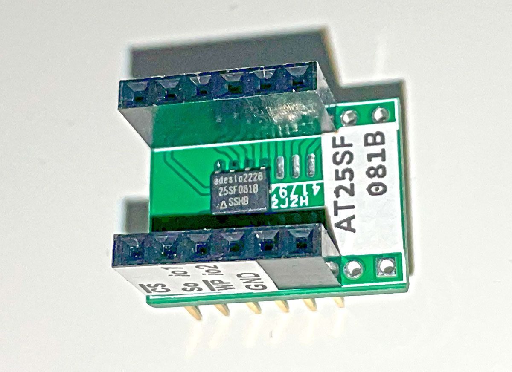
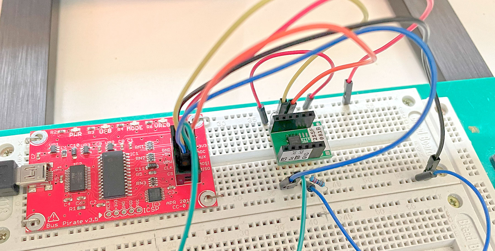
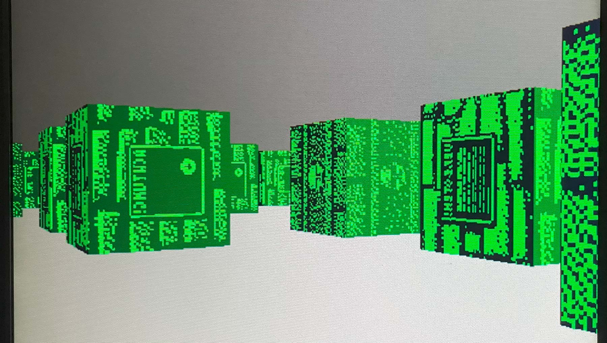
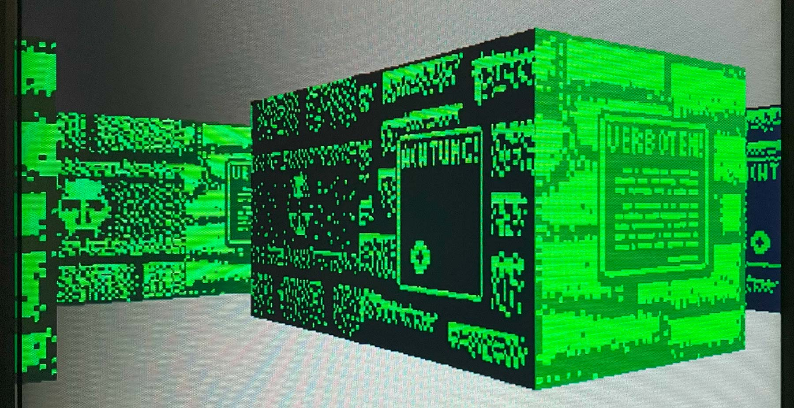

# 20 Oct 2023

| Previous journal: | Next journal: |
|-|-|
| [**0161**-2023-10-17.md](./0161-2023-10-17.md) | *Next journal TBA* |

# raybox-zero textures from external ROM

Yesterday was a day off, day prior was finishing my presentation of raybox-zero to the Z2A weekly meeting.

# Accomplishments

*   [raybox-zero doing basic SPI](#raybox-zero-doing-basic-spi) -- I actually got this working a couple of days ago but didn't document it at the time.
*   Soldered a brand new [AT25SF081B-SSHB-T](https://www.digikey.com.au/en/products/detail/renesas-electronics-operations-services-limited/AT25SF081B-SSHB-T/12180765) (8Mbit SPI/Quad SPI Flash ROM) on a breakout board so I can try writing to it with `flashrom` and then use it for image data and other tests in raybox-zero. NOTE: This chip is narrower (3.9mm plastic body width) than the one I used last time in [0149](./0149-2023-09-30.md) (5.3mm width, I think).
*   Created test textures (see [`raybox-zero/assets`](https://github.com/algofoogle/raybox-zero/tree/ew/assets)), wrote them to SPI flash ROM, and got them working on screen with raybox-zero running on FPGA.
*   [I wrote a util (texy.py)](https://github.com/algofoogle/raybox-zero/blob/ew/utils/texy.py) that can take a wall textures PNG and convert it to our required raybox-zero packing with RGB222 colour.

# raybox-zero doing basic SPI

It works:

*   Wire up a chip to the [correct DE0-Nano GPIOs](https://github.com/algofoogle/raybox-zero/blob/c5cc453a553b7dd25b4c12cea8c0cc233605a211/de0nano/raybox-zero_de0nano.v#L217-L222)
*   `cd raybox-zero && git checkout ew` -- commit [c5cc453](https://github.com/algofoogle/raybox-zero/commit/c5cc453a553b7dd25b4c12cea8c0cc233605a211) is where it started working.
*   Open the Quartus project.
*   Build, and program to FPGA.
*   Reset the FPGA, and voila!



Here are slices of familiar data from the start of the ROM:



Data from the ROM itself:

```
> hexdump -C test_rom.bin | head -10
00000000  e9 03 02 20 20 04 10 40  00 00 10 40 40 07 00 00  |...  ..@...@@...|
00000010  00 00 00 00 00 00 00 00  00 00 00 00 00 00 00 00  |................|
*
00000040  20 83 fe 3f 1c 4b 00 40  cc 24 00 40 1c 04 12 c1  | ..?.K.@.$.@....|
00000050  e0 3d 01 09 41 01 fb ff  c0 00 00 02 01 00 22 a0  |.=..A.........".|
00000060  e9 27 90 04 0c 02 c6 06  00 22 a0 ea 27 90 0a 32  |.'......."..'..2|
00000070  01 01 28 31 66 43 02 86  02 00 21 f1 ff 01 f2 ff  |..(1fC....!.....|
00000080  c0 00 00 7c f2 08 41 12  c1 20 0d f0 30 83 fe 3f  |...|..A.. ..0..?|
00000090  08 fc 10 40 12 c1 f0 c9  11 09 01 cd 02 21 fb ff  |...@.........!..|
000000a0  3d 0c 01 e9 ff c0 00 00  2d 0c 05 fa ff 26 02 1a  |=.......-....&..|
```

# Writing to SPI flash ROM with `flashrom`

Here's the chip on my breakout board:



Connected with Bus Pirate v3.5:



Running MPW8 Linux VM...

```
$ flashrom -L | fgrep -i AT25SF
Atmel         AT25SF041              PREW            512  SPI       
Atmel         AT25SF081              PREW           1024  SPI       
Atmel         AT25SF161              PREW           2048  SPI       
Atmel         AT25SF321              PR             4096  SPI
```

Chip is supported natively.

Start watching kernel log (`dmesg -T --follow`) then plug in the Bus Pirate. So long as VirtualBox USB passthru is enabled for the Bus Pirate's FTDI Vendor/Dev ID, we should see this:
```
[Fri Oct 20 13:46:47 2023] usb 1-1: new full-speed USB device number 2 using ohci-pci
[Fri Oct 20 13:46:47 2023] usb 1-1: New USB device found, idVendor=0403, idProduct=6001, bcdDevice= 6.00
[Fri Oct 20 13:46:47 2023] usb 1-1: New USB device strings: Mfr=1, Product=2, SerialNumber=3
[Fri Oct 20 13:46:47 2023] usb 1-1: Product: FT232R USB UART
[Fri Oct 20 13:46:47 2023] usb 1-1: Manufacturer: FTDI
[Fri Oct 20 13:46:47 2023] usb 1-1: SerialNumber: A5005DKE
[Fri Oct 20 13:46:47 2023] usbcore: registered new interface driver usbserial_generic
[Fri Oct 20 13:46:47 2023] usbserial: USB Serial support registered for generic
[Fri Oct 20 13:46:47 2023] usbcore: registered new interface driver ftdi_sio
[Fri Oct 20 13:46:47 2023] usbserial: USB Serial support registered for FTDI USB Serial Device
[Fri Oct 20 13:46:47 2023] ftdi_sio 1-1:1.0: FTDI USB Serial Device converter detected
[Fri Oct 20 13:46:47 2023] usb 1-1: Detected FT232RL
[Fri Oct 20 13:46:47 2023] usb 1-1: FTDI USB Serial Device converter now attached to ttyUSB0
```

Install minicom, picocom, and screen: `sudo apt install minicom screen picocom`

Make sure user is part of `dialout` group: `sudo adduser zerotoasic dialout` -- NOTE: Typically you should do a full VM restart after this, unless you want to be lazy and just reload groups: `newgrp dialout` -- BEWARE: This seems to reset recent bash command history.

At this point I switched to my `ASIC-Ubuntu-2204` VM which has this stuff already set up.

Direct TTY access to Bus Pirate, to test reading SPI flash ROM device ID. `picocom -b 115200 /dev/ttyUSB0` seems fine. **We can later use CTRL+A then CTRL+X to terminate.**

1.  Hit enter, expect `HiZ>` prompt.
2.  `m5` for SPI mode.
3.  ENTER after each of: 4 1 2 1 2 2
4.  `W` (capital) to turn on power
5.  Read MFR/DEV ID: `{0x90 0 0 0]`:
    ```
    SPI>{0x90 0 0 0]
    /CS ENABLED
    WRITE: 0x9F READ: 0x00 
    WRITE: 0x00 READ: 0x1F 
    WRITE: 0x00 READ: 0x85 
    WRITE: 0x00 READ: 0x01 
    /CS DISABLED
    SPI>
    ```
    *   MFR: 0x1F
    *   DEV: 0x8501
    *   This is consistent with what the datasheet says we should get for AT25SF081B.
6.  Exit picocom: CTRL+A then CTRL+X

Let's try a test read of the ROM:

```bash
cd ~/HOST_Documents
SPICHIP=AT25SF081
SPIPORT=buspirate_spi:dev=/dev/ttyUSB0,spispeed=2M,serialspeed=250000
time flashrom -c $SPICHIP -p $SPIPORT -r AT25SF081B-blank.bin
# It took 60 seconds.
hexdump -C AT25SF081B-blank.bin
```

Contents are as expected for a blank device:
```
$ hexdump -C AT25SF081B-blank.bin
00000000  ff ff ff ff ff ff ff ff  ff ff ff ff ff ff ff ff  |................|
*
00100000
```

I created a [test image](https://github.com/algofoogle/raybox-zero/blob/ew/assets/wolfwall1bit.psd) as [a PBM file (`wolfwall1bit.pbm`)](https://github.com/algofoogle/raybox-zero/blob/ac4385d5c7a4bf92f09e4a158f06ee3c4a700468/assets/wolfwall1bit.pbm) -- Photoshop creates a binary PBM (which is good) with a text header of variable length (which we want to get rid of). First 3 text lines of the file make up the header:


NOTE: I discovered that Photoshop (or maybe the PBM 1-bit format) thinks a 1 bit is black, and a 0 bit is white, so I had to negate the image.

We know this file should be 64*512 pixels, but &div;8 (for 8 pixels per byte), so 4096 total. Actual file size is 4106, so 4096-4106 is 10 bytes we need to get rid of. We can do that with:

```bash
dd if=wolfwall1bit.pbm of=wolfwall1bit.bin bs=1 skip=10
```

For reference, the first wall's texture image is the first 512 bytes of [the final 4096-byte binary file (`wolfwall1bit.bin`)](https://github.com/algofoogle/raybox-zero/blob/ew/assets/wolfwall1bit.bin):

```
> hexdump -C .\wolfwall1bit.bin | head -32
00000000  00 00 00 00 00 00 00 00  11 ff ff ff e0 00 01 25  |...............%|
00000010  65 ff ff ff e7 ff fe 10  f5 ff ff ff e7 ff ff ff  |e...............|
00000020  f1 ff ff ff e7 ff ff ff  e5 ff ff ff e7 ff ff ff  |................|
00000030  f1 ff ff ff e7 ff ff ff  d5 ff ff 7f e7 ff ff ff  |................|
00000040  c1 08 02 00 87 ef eb ef  04 20 00 02 2b fd ff ff  |......... ..+...|
00000050  a0 00 00 00 03 ff bf 2a  05 25 bf ff f3 55 50 80  |.......*.%...UP.|
00000060  01 7f ff ff fb 40 08 00  04 3f 00 00 00 00 00 00  |.....@...?......|
00000070  02 fe 7f ff ff ff 80 08  82 7e 80 00 00 00 45 44  |.........~....ED|
00000080  fc 3e ab 66 2e d5 4f ff  ff 3e aa 55 54 9d 4f ff  |.>.f..O..>.UT.O.|
00000090  fc be ab 66 54 dd 4f ff  fc 9e aa 55 54 94 47 ff  |...fT.O....UT.G.|
000000a0  fc 82 93 56 24 d5 4f ff  fa 40 80 00 00 00 4f ff  |...V$.O..@....O.|
000000b0  ed 10 80 00 00 00 4d fb  f8 aa 80 00 00 00 4f bf  |......M.......O.|
000000c0  f0 8a 83 af b7 ec 4f df  e1 7e 80 00 00 00 4d e7  |......O..~....M.|
000000d0  20 fe 8f dd be fc 40 10  87 fe 80 00 00 00 40 00  | .....@.......@.|
000000e0  17 fe 8e fe eb dc 40 00  5f fe 80 00 00 00 49 fc  |......@._.....I.|
000000f0  ff fe 80 00 00 00 43 fc  7f ee 83 bf d6 ec 41 fc  |......C.......A.|
00000100  ff fa 80 00 00 00 43 fd  7f fe 8d f7 bf dc 41 fc  |......C.......A.|
00000110  1f fe 80 00 00 00 43 f8  c8 80 8f 7f eb dc 41 fc  |......C.......A.|
00000120  20 00 80 00 00 00 41 f8  88 4a 8e df 5b f4 41 04  | .....A..J..[.A.|
00000130  ff fe 80 00 00 00 40 00  7f fe 8f 5e ef bc 40 00  |......@....^..@.|
00000140  ff fe 80 00 00 00 4f fd  7f fe 80 00 00 00 4f fc  |......O.......O.|
00000150  ff f6 80 00 0f fc 4f f8  7f fe 80 00 00 00 4f fc  |......O.......O.|
00000160  ff fe 7f ff ff ff 8f f4  7f fe 00 00 00 00 0f f8  |................|
00000170  7e df 00 00 00 00 1f f8  53 ff ec 1f f7 ff fd 78  |~.......S......x|
00000180  04 4b 20 1f ff ff f7 d8  40 00 04 1f f7 f7 ff f8  |.K .....@.......|
00000190  90 00 00 1a 9f fd ff f4  7f 90 00 00 05 5e b6 b8  |.............^..|
000001a0  7f fd 00 10 01 42 11 08  7f ff ff da 40 00 00 00  |.....B......@...|
000001b0  7f ff ff ff 90 00 00 02  7f ef ff ff 8f ff ff fe  |................|
000001c0  7f ff ff ff 87 ff ff fd  7e ff ef fe 17 ff ff f4  |........~.......|
000001d0  f1 a9 1a 2a 87 ff ff fc  60 00 01 00 0f ff ff fc  |...*....`.......|
000001e0  00 00 00 00 00 af ff f9  00 00 00 00 04 00 24 24  |..............$$|
000001f0  a9 20 00 00 02 80 00 01  00 02 00 00 00 02 00 00  |. ..............|
```

Before writing the data to SPI flash ROM, the `flashrom` utility (at least version 1.2 which I have) is hardcoded to reject files that are not a match for the actual flash size.

Here's one way to pad the file out to 1MB (i.e. add 1044480 bytes) with 0xFF (i.e. erased flash byte value) as the filler:

```bash
dd if=<(cat wolfwall1bit.bin; tr '\0' '\377' < /dev/zero) bs=1 count=1048576 of=wolfwall1bit-1MB.bin
```

So now we can compare:

```
$ hexdump -C wolfwall1bit.bin | tail -2
00000ff0  6a 8a b2 6a 5e 4c 0a 96  22 80 00 20 42 01 00 10  |j..j^L..".. B...|
00001000

$ hexdump -C wolfwall1bit-1MB.bin | tail -4
00000ff0  6a 8a b2 6a 5e 4c 0a 96  22 80 00 20 42 01 00 10  |j..j^L..".. B...|
00001000  ff ff ff ff ff ff ff ff  ff ff ff ff ff ff ff ff  |................|
*
00100000

$ wc -c wolfwall1bit-1MB.bin 
1048576 wolfwall1bit-1MB.bin
```

Write the file to the SPI flash ROM:

```bash
cd raybox-zero
git checkout ew
cd assets
SPICHIP=AT25SF081
SPIPORT=buspirate_spi:dev=/dev/ttyUSB0,spispeed=2M,serialspeed=250000
time flashrom -c $SPICHIP -p $SPIPORT -w wolfwall1bit-1MB.bin
```

NOTE: I had pulled /WP low with a 2k2 resistor, expecting this would prevent writing, but it doesn't. From what I understand, the default start-up state of SPI flash ROMs is typically set to ignore /WP... either that, or flashrom is *setting* that mode and forcing the device to ignore /WP and enable writing anyway.

The write succeeded in 121 seconds (but note that all but 1 second of that time *might've* just been the initial read, and subsequent re-read to verify, because flashrom actually compares the data to be written with the data that's already there and only erases/writes the parts which are different):

```
$ time flashrom -c $SPICHIP -p $SPIPORT -w wolfwall1bit-1MB.bin
flashrom v1.2 on Linux 6.2.0-33-generic (x86_64)
flashrom is free software, get the source code at https://flashrom.org

Using clock_gettime for delay loops (clk_id: 1, resolution: 1ns).
Found Atmel flash chip "AT25SF081" (1024 kB, SPI) on buspirate_spi.
Reading old flash chip contents... done.
Erasing and writing flash chip... Erase/write done.
Verifying flash... VERIFIED.
```

Read the chip again: `time flashrom -c $SPICHIP -p $SPIPORT -r test.bin`

Compare (I'm paranoid):
```
$ md5sum wolfwall1bit-1MB.bin test.bin
6f66225a0e0f7795d1ac204e013dc103  wolfwall1bit-1MB.bin
6f66225a0e0f7795d1ac204e013dc103  test.bin
```

OK, looks good.

# First test of SPI ROM textures in raybox-zero

I unplugged the Bus Pirate, then I plugged the chip in to raybox-zero:



Fixes required:
*   Rotate textures 90&deg; clockwise (should be done in ROM)
*   Mirror textures (can be done in Verilog by reversing buffer shift order)
*   Flip light/dark sides (can be done in Verilog): make side 0 bright, side 1 dark.

I rotated each 64x64 segment of the wall textures image in Photoshop by 90&deg; clockwise, and then regenerated the various binary files, and wrote them to the SPI flash ROM again.

I changed the SPI buffer to shift in from the left instead of the right, to mirror the texture.

I also flipped the light/dark sides extra green bit.

Result looks good:




# Texture converter util

I've created a [util](https://github.com/algofoogle/raybox-zero/blob/ew/utils/texy.py) that can be used to convert textures into the RGB222 format (and pixel packing order) used by raybox-zero. Here's my approach:
*   Written in Python so it's portable.
*   Expected source:
    *   Can process this, for example: https://www.textures-resource.com/pc_computer/wolf3d/texture/1375/
    *   Source is a PNG that is a grid of 64x64 walls, with that *grid* of 64x64 tiles auto-detected as any number of rows and columns.
    *   Running in LTR order, top to bottom, every 'pair' of walls is expected to comprise light first (even, starting at 0) then dark (odd).
*   Output will be full 1MB binary to be written to SPI.
*   *For now* it will be in BGRX2222 format (i.e. last 2 bits per byte are dummy) because this is simpler to test with raybox-zero as it currently stands.
*   It will automatically reduce RGB888 (24-bit colour) to BGR222. It actually maps intensities to the nearest of:
    | Input Dec | Input Hex | Input Bin | Output | Lower limit |
    |-:|-:|-:|-:|-:|
    | 255 | FF | 11111111 | 11 | (255+170)/2 = 213 |
    | 170 | AA | 10101010 | 10 | (170+85)/2 = 128 |
    |  85 | 55 | 01010101 | 01 | (85/2) = 43 |
    |   0 | 00 | 00000000 | 00 | 0 |
*   Option for adjusting contrast ('multiplier') and brightness ('bias').
*   Option for writing 1-bit (threshold) or BGRX2222.


# Implementing QSPI

*   For now I'll do BGRX2222 packing, so that every texel is 1 byte. This will keep it simpler initially with QSPI nibbles.
*   In QSPI mode, some pins suddenly become outputs, so we have to be careful about contention. I could use resistors just for safety; 330R would limit current to 10mA max. The main pin to worry about is MOSI: If the FPGA tries to drive it when it's in QSPI mode, we'll have a problem.
*   These are the pins we're interested in:
    | Pin | Normal | QSPI |
    |-|-|-|
    | 1 | /CS   | /CS |
    | 2 | MISO  | io1 |
    | 3 | /WP   | io2 |
    | 4 | GND   | GND |
    | 5 | MOSI  | io0 |
    | 6 | SCLK  | SCLK |
    | 7 | /HOLD | io3 |
    | 8 | VCC   | VCC |
*   When Status Register 2's QE (Quad Enable) bit is high, QSPI comms is enabled. Does this mean inputs are quad, too? Ahh QE is just for Quad I/O (not Quad Read)?
    >   The Quad Enable bit (QE) of the Status Register must be set to enable for the Quad-I/O Read Array instruction.
*   There's a distinction between "Quad Output Read (1-1-4)" and "Quad I/O Read (1-4-4)". I think the former means the command and address are both single-speed, while the latter means the command is single-speed and the address and data are then both quad-speed:
    >   The **AT25QF128A** supports Quad 1/0 (1-4-4) transfers, which enhance throughput over the standard SPI mode.
    >   This mode transfers the command on the Sl pin, but the address and data are transferred on the Sl, SO, /WP, and
    >   /HOLD pins. This means that only a quarter of the number of clocks are required to transfer the address and data.
    >   With the Quad 1/0 Read Array command, the Sl, /WP, /HOLD, and SO pins become inputs during the address
    >   transfer, and switch to outputs during the data transfer.
    NOTE: I don't have the AT25QF128A chip, so I can probably ignore this Quad I/O Read mode, and just focus on Quad Output Read.
*   It looks like we want command 6Bh (Quad Output Fast Read). Its sequence is:
    1.  Send command 6Bh at normal speed.
    2.  Send address A23..0 at normal speed.
    3.  Send 1 more dummy byte at normal speed. NOTE: This is when we could switch MOSI to HiZ.
    4.  On the falling edge of the LSB of that dummy byte, expect all 4 IOs to be asserted as outputs by the chip, and stay that way until /CS is released.
*   Thus: We need 40 preamble clocks. That should be fine. We will then do 128 clocks to read the BGRX2222 data.
*   Can our chip also do "Word Read Quad I/O" (E7h)? Does it need to?
*   NOTE: "The /WP pin is internally pulled-high and can be left floating if not used."


# Goals for today

*   Generate some coloured texture data and put it on the SPI flash ROM.
*   Implement QSPI mode to read the data into our buffers.
    NOTE: With a naive BBGGRRXX packing (RGB222 plus 2 dummy bits in each SPI byte) we can lazily get our full colour textures in via a simple QSPI reader in 128 read cycles, but note that we still actually need to set up QSPI mode, the READ command, and the address!
*   Add a 'reg' that allows us to specify an address mapping for each wall texture: Host controller can animate/change any given wall texture that way. Could even be used to do scrolling messages.
