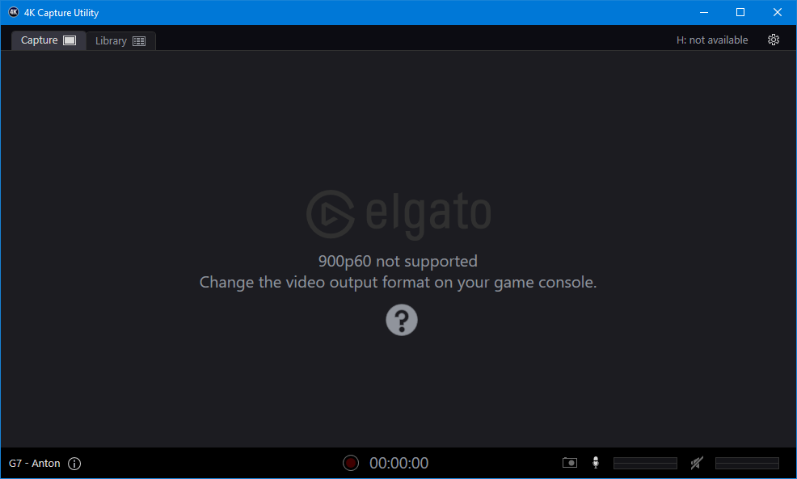

# 22 Oct 2023

| Previous journal: | Next journal: |
|-|-|
| [**0162**-2023-10-20.md](./0162-2023-10-20.md) | *Next journal TBA* |

# Working on QSPI

*   Created `qspi` branch on `tt05-vga-spi-rom` to try tackling QSPI.
    *   I included a `vga_mode` option for selecting between 640x480@60Hz and 1440x900@60Hz timing. Ideal clock for this (at least for my testing) is ~26.6175MHz, because in Mode 1 this gets very clear 1440x900@60, and in Mode 0 it still works OK as 640x480@63.
    *   I ended up using 26.6175MHz (actually 26.620370MHz is nearest the PLL can get) in the repo.
    *   Merged vga_mode stuff from the qspi branch into main and tagged it [0.2](https://github.com/algofoogle/tt05-vga-spi-rom/releases/tag/0.2) -- new update to [my TT05 submission #192](https://app.tinytapeout.com/projects/192).

# Goals

*   Test whether SPI MOSI/MISO still work with 1k&ohm; resistors in series. I'd like to include these for safety, at least in the early stages.
*   Get QSPI reads working in tt05-vga-spi-rom
*   Add QSPI reads to raybox-zero

# Attempts at QSPI

## Plan of attack

*   Test tt05vsr as-is with 1k&ohm; resistor inline with MOSI (and optionally MISO; good if we want to try full Quad I/O later). Get rid of existing /WP and /HOLD resistors (they have internal pullups).
*   Verify QE non-volatile behaviour:
    *   Use Bus Pirate to manually read AT25SF081B.
    *   BP read SR1 (command 05)
    *   BP read SR2 (command 35)
    *   BP set QE: WEN (06), WSR2 (31) + 02 (QE bit asserted).
    *   BP read SR1 again; check for changes, esp. for WIP.
    *   BP read SR2 again; prove QE is set.
    *   Power-cycle the chip.
    *   Read SR1&2 again: Is QE permanently set?
*   Hopefully this process should be compatible with both W25Q128JV (and other smaller chips?) and AT25SF081B:
    1.  Pre-program the chip to set QE bit. Then, in the design...
    2.  (Optional): Send AB (release power-down)
    3.  Assert /CS and send 6B
    4.  Send 24 address bits
    5.  Switch our design to quad inputs, and send 8 clocks
    6.  Read quad data: `io[3:0]` gets `D[7:4]` first, then `D[3:0]` next.
    7.  Release /CS
    8.  1 clock later, switch back to single-SPI mode

## QSPI notes

Working in tt05-vga-spi-rom (tt05vsr), let's start with a naive approach to switch to QSPI read command 6Bh half-way down the screen, without any setup...

**We must make sure we tristate MOSI!**

**Test whether SPI MOSI/MISO still work with 1k&ohm; resistors in series. I'd like to include these for safety, at least in the early stages.**

I'll use my "known good" [AT25SF081B](https://www.digikey.com.au/en/products/detail/renesas-electronics-operations-services-limited/AT25SF081B-SSHB-T/12180765) that I got from DigiKey because its [datasheet](https://www.renesas.com/us/en/document/dst/at25sf081b-datasheet) and behaviour should be proven.

[Tholin's QSPI method](https://github.com/89Mods/tt3p5-as1802/blob/b0acd85b033435858e55c4165421192174aa5f31/src/as1802.v#L211) (using command EBh) targets Winbond W25Qxxx chips (in particular, W25Q128JVxIM).

The [W25Q128JVxIM datasheet](https://www.winbond.com/resource-files/w25q128jv_dtr%20revc%2003272018%20plus.pdf) states:
>   Quad SPI instructions require the ***non-volatile*** Quad Enable bit (QE) in Status Register-2 to be set. When QE=1, the /WP pin becomes IO2 and /HOLD pin becomes IO3.

"**Non-volatile**", hey? Hmm.

How is [QPI](https://www.winbond.com/resource-files/w25q128jv_dtr%20revc%2003272018%20plus.pdf#page=12) different from Quad SPI and Quad I/O?? [This](https://stackoverflow.com/questions/49186830/what-is-the-difference-between-spi-and-qpi-in-embedded) suggests that Quad SPI is 1-1-4, Quad I/O is 1-4-4, and QPI is 4-4-4 (and QPI has its own dedicated mode via command 38h that is issued *as well as* having to enable QE beforehand). **OH, here we go,** in [section 6.1.4](https://www.winbond.com/resource-files/w25q128jv_dtr%20revc%2003272018%20plus.pdf#page=13&zoom=100,92,296).

Anyway, Tholin's method seems to do this:
1.  Send FF: stop continuous, if active?? When doing so, it also drives io2+3 high (which would disable /WP and /HOLD if in effect, but could also be risky if the SPI chip is already driving them).
2.  Send AB: relase from power-down, if in effect
3.  Send 06: WEN (Write Enable)
4.  Send 01: Write Status Register, followed by 02 (simply WEL; no effect because it's R/O), then by 02 again (QE<=1 in this case).
5.  Send EB: Quad I/O Fast Read. Then chip goes into quad input; send it address 000000h followed by A5h mode (actually it just seems like bits `--10----` are the only ones that matter, and they specify continuous mode). After another 

# SPI memory behaviours

I think I've learned the following:
*   Quad SPI means 1-1-4 (command and address are both single-width transfers, then data read from memory is quad-width).
*   Quad I/O means 1-4-4 (address becomes quad-width transfer, also).
*   QPI means command becomes quad-width too?
*   Not all devices support all modes. First two (Quad SPI and Quad I/O) are common for any advertised "quad" (or "Q") devices, though?
*   Some devices provide separate WSR (Write Status Register) commands, e.g. Send 01 to write to SR1, send 31 to write to SR2.
*   Some devices allow WSR to be written as either 8 bits (SR1 only) or 16 bits (SR1+SR2) just via the standard 01 command.
*   For at least the Winbond W25Q128JV, the 01 command can be used to write 8 or 16 SR bits (SR1&amp;2; see section 8.2.5), while it also provides WSR2 (command 31) and even WSR3 (command 11).
*   In any case, as a safety measure, datasheets say "/CS must be driven high after clocking in the 8th SR bit, or the whole write becomes invalid" and sometimes they add "or 16th SR bit" in cases where the device supports this in a single long write via command 01. **Hmm,** does this invalidation include SCLK falling, or just an extra SCLK rising edge? [Datasheet diagrams](https://www.winbond.com/resource-files/w25q128jv_dtr%20revc%2003272018%20plus.pdf#page=34) imply that falling SCLK is OK. Given our /CS driver would go high on our system clock rising edge, this represents the SCLK *falling* edge, so that should be OK with no possible contention period...?
*   WSR is described usually as being a delayed process that must be polled (via WIP "Write In Progress" status bit). The Winbond datasheet even calls it a "non-volatile" write. Really?
*   I'm starting to think that the QE bit must (should?) be *programmed in* rather than simply set at runtime.
*   Some devices provide command 50 ("Write volatile Status Register") that allow for immediate and temporary (as opposed to "non-volatile") setting of the Status Register. Command 50 must be issued before WSR. The AT25SF081B datasheet implies that this only works for command 01, but maybe it does for command 31 (SR2) also? If not, we'd be stuck!
*   The WEL bit ("Write Enable Latch") in SR1 is set by command 06, and cleared after successful completion of a write command, including WSR.
*   W25Q128JV needs ***four*** dummy bytes for command 6B?? Oh, actually, not really... it looks like it needs 8 clocks for the command, 24 for address, then 8 dummy, then data starts. Preamble: 40 clocks. By comparison, command EB needs 8 for command (assuming not in continuous mode), 6 for the address, 2 for mode, and 4 for dummy, then data starts. Preamble: 20 clocks.

# Next steps

*   Make it so the VGA timing parameters in `vga_sync.v` are just registers that only update at the end of a frame.
*   Consider replacing `spiflash` with the Winbond model that Tholin used.
*   Compare SPI flash ROM datasheets re Quad Enable (QE bit)
    *   [Winbond's "Verilog Model for W25Q128JVxIM Serial Flash Memory"](https://github.com/89Mods/tt3p5-as1802/blob/main/src/spiflash/W25Q128JVxIM.v) shows that [command 6Bh](https://github.com/89Mods/tt3p5-as1802/blob/b0acd85b033435858e55c4165421192174aa5f31/src/spiflash/W25Q128JVxIM.v#L152) will [require the Status Register QE bit to be set](https://github.com/89Mods/tt3p5-as1802/blob/b0acd85b033435858e55c4165421192174aa5f31/src/spiflash/W25Q128JVxIM.v#L999-L1003)

# Notes

*   From a 50MHz clock source, DE0-Nano PLL can hit 25.170068MHz... not exactly 25.1750MHz.
*   25.170MHz clock source (as above):
    *   Mode 0: 640x480@60, i.e. 25,170,000/800/525 ~= 59.93Hz
    *   Mode 1: 1152x870@57 syncs on my HP L1908wm monitor
*   26.620370MHz (nearest the PLL can get to 26.61750MHz):
    *   Mode 0: 640x480@63 works fine
    *   Mode 1: 1440x900@60 works fine. Very clear.
*   26.5MHz:
    *   Mode 0: 640x480@63 works fine
    *   Mode 1: 1440x900@60
*   26.3MHz:
    *   Mode 0: 640x480@63 works fine
    *   Mode 1: 1440x900@59
*   26.0MHz:
    *   Mode 0: 640x480@63 works fine
    *   Mode 1: 1152x870@59
*   25.0MHz:
    *   Mode 0: 640x480@59??
    *   Mode 1: 1152x870@56
*   24.750MHz: NOTE: This frequency matches 800x600@75-div-2
    *   Mode 0: 640x480@59 works fine as above.
    *   Mode 1: 1152x870@56
*   24.0MHz:
    *   Mode 0: 640x480@57, **direct MISO is delayed by 1 pixel**.
    *   Mode 1: 1152x870@54, direct MISO is *sort of* delayed as expected.
*   23.0MHz:
    *   Mode 0: 640x480@55 works fine
    *   Mode 1: 1152x870@52
*   20.0MHz:
    *   Mode 0: ?? - Displays an image (wide aspect) but doesn't like it. Complains that input signal is out of range and won't show what it is.
    *   Mode 1: No sync
*   27.0MHz:
    *   Mode 0: 640x480@64 works fine
    *   Mode 1: 1440x900@61
*   28.0MHz:
    *   Mode 0: 640x480@67 shows some MISO delays
    *   Mode 1: 1152x870@63
*   30.0MHz:
    *   Mode 0: 640x480@71 shows some MISO delays
    *   Mode 1: 1152x**900**@67
*   DE0-Nano 4 DIP switches:
    >   The DE0-Nano board contains a 4 dip switches. A DIP switch provides, to the FPGA, a high logic level when it is in the DOWN position, and a low logic level when in the UPPER position.
    *   Per [DE0-Nano schematic](https://wiki.bu.ost.ch/infoportal/_media/fpga/boards/de0_nano/de0-nano-schematic.pdf#page=9), when the switches are open (or "OFF"), they are pulled high. Otherwise, when "ON" they are grounded.
    *   I'm using this to select `vga_mode` on switch 0. When in the "upper" position it will select vga_mode 0 (low input), else in "DOWN" poition it will select vga_mode 1.
*   Elgato Cam Link 4K doesn't support 1440x900 resolution:

    

    Supported resolutions are listed: [here](https://help.elgato.com/hc/en-us/articles/360027963272-Cam-Link-4K-Technical-Specifications)
*   Blue cheapo USB-C HDMI capture dongle can capture it, but 1440x900 isn't one of its native output resolutions, so it scales instead to whatever output mode you select (e.g. 1920x1080) and overall there's a lot of blur and chroma subsampling.
