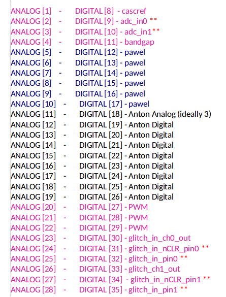
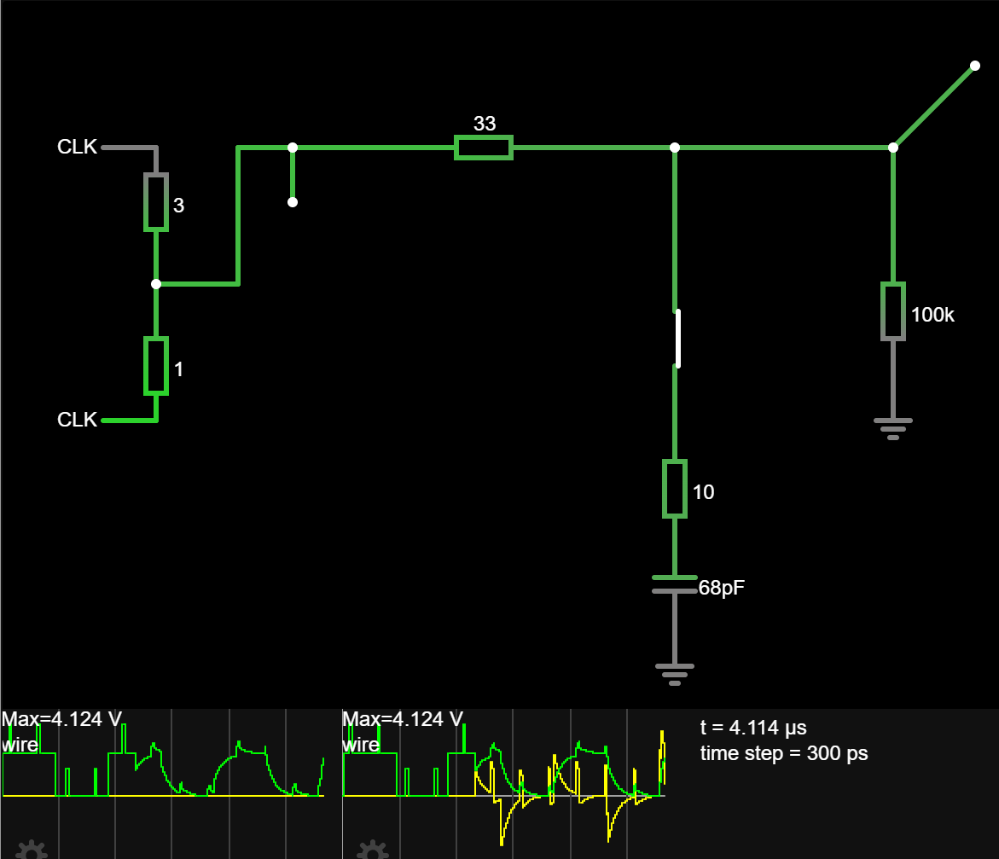
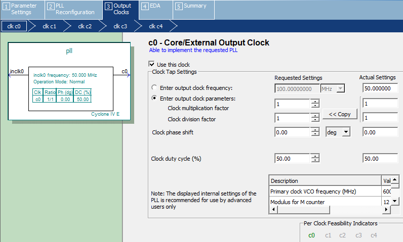

# 24 Oct 2023

| Previous journal: | Next journal: |
|-|-|
| [**0164**-2023-10-23.md](./0164-2023-10-23.md) | [**0166**-2023-10-26.md](./0166-2023-10-26.md) |

# raybox-zero OpenLane hardening

# Accomplishments

*   Updated texy.py: `--select` works in order specified now.
*   Built some new wall textures.
*   Implemented Quartus PLL in raybox-zero de0nano.
*   Tested 640x480 VGA with different pixel clocks. My monitor can sync with a pixel clock from 20.250MHz (~48fps) up to 32.500MHz (~77fps)


# Hardening raybox-zero@ew

*   VM on laptop has 16GB RAM and 12 CPUs.
*   Commit I'll use is [876a69a](https://github.com/algofoogle/raybox-zero/commit/876a69ab468541a8a9b1ab3a8af49cdec7defc90)
*   This version includes full QSPI texture ROM reader with RGB222 colour working.
*   Last time I did the harden was in [0160](https://github.com/algofoogle/journal/blob/c4c3111a35f03c27bca2c6d18344dfd3fc8400cd/0160-2023-10-16.md#harden-raybox-zero)

## Steps to harden raybox-zero

1.  Use the MPW8 VM (since my other ASIC-Ubuntu-2204 VM is not yet verified). Currently it has 16GB RAM and 4 CPUs.
2.  `cd $OPENLANE_ROOT/designs/raybox-zero` (repo is alredy cloned in there, with `config.tcl` in that dir).
3.  Make sure we're in the `ew` branch, and `git pull`
4.  Check `config.tcl`
    *   I added this to use the 4 CPUs assigned to my VM:
        ```tcl
        set ::env(ROUTING_CORES) 4
        set ::env(KLAYOUT_XOR_THREADS) 4
        ```
    *   Should we be using `set ::env(FP_PIN_ORDER_CFG) $script_dir/pin_order.cfg` ...?
    *   Only other thing I'm not sure about is:
        ```tcl
        # don't put clock buffers on the outputs, need tristates to be the final cells
        set ::env(PL_RESIZER_BUFFER_OUTPUT_PORTS) 0
        ```
5.  ```bash
    cd ../..
    make mount
    # ...then in docker...
    time ./flow.tcl -design raybox-zero
    ```
    Time it takes: 9-10 minutes (12-13 with 2 cores instead of 4).
6.  ```
    [WARNING]: There are max fanout violations in the design at the typical corner. Please refer to 'designs/raybox-zero/runs/RUN_2023.10.24_06.24.38/reports/signoff/25-rcx_sta.slew.rpt'.
    [INFO]: There are no hold violations in the design at the typical corner.
    [INFO]: There are no setup violations in the design at the typical corner.
    [SUCCESS]: Flow complete.
    ```

    Max fanout warnings reported in `reports/signoff/25-rcx_sta.slew.rpt`:
    ```
    Pin                                   Limit Fanout  Slack
    ---------------------------------------------------------
    clkbuf_leaf_0_tex_sclk/X                 10     19     -9 (VIOLATED)
    clkbuf_leaf_13_tex_sclk/X                10     18     -8 (VIOLATED)
    clkbuf_leaf_1_tex_sclk/X                 10     16     -6 (VIOLATED)
    clkbuf_leaf_2_tex_sclk/X                 10     16     -6 (VIOLATED)
    clkbuf_leaf_32_tex_sclk/X                10     16     -6 (VIOLATED)
    clkbuf_leaf_22_tex_sclk/X                10     15     -5 (VIOLATED)
    clkbuf_leaf_33_tex_sclk/X                10     14     -4 (VIOLATED)
    clkbuf_leaf_74_tex_sclk/X                10     14     -4 (VIOLATED)
    clkbuf_3_4__f_tex_sclk/X                 10     13     -3 (VIOLATED)
    clkbuf_leaf_16_tex_sclk/X                10     13     -3 (VIOLATED)
    clkbuf_leaf_40_tex_sclk/X                10     13     -3 (VIOLATED)
    clkbuf_leaf_49_tex_sclk/X                10     13     -3 (VIOLATED)
    clkbuf_leaf_69_tex_sclk/X                10     13     -3 (VIOLATED)
    clkbuf_leaf_72_tex_sclk/X                10     13     -3 (VIOLATED)
    clkbuf_3_6__f_tex_sclk/X                 10     12     -2 (VIOLATED)
    clkbuf_leaf_15_tex_sclk/X                10     12     -2 (VIOLATED)
    clkbuf_leaf_61_tex_sclk/X                10     12     -2 (VIOLATED)
    clkbuf_leaf_68_tex_sclk/X                10     12     -2 (VIOLATED)
    _08966_/X                                10     11        (VIOLATED)
    _09077_/X                                10     11        (VIOLATED)
    _09165_/X                                10     11        (VIOLATED)
    _09186_/X                                10     11        (VIOLATED)
    _09783_/X                                10     11        (VIOLATED)
    _12060_/X                                10     11        (VIOLATED)
    clkbuf_3_5__f_tex_sclk/X                 10     11        (VIOLATED)
    clkbuf_leaf_23_tex_sclk/X                10     11        (VIOLATED)
    clkbuf_leaf_37_tex_sclk/X                10     11        (VIOLATED)
    clkbuf_leaf_66_tex_sclk/X                10     11        (VIOLATED)
    input4/X                                 10     11        (VIOLATED)
    ```
    Assumed to be OK for now, based on past advice.
7.  Worst antenna violator in `logs/signoff/34-antenna.log` is 677/400.
8.  Just be wary about:
    ```
    [STEP 14]
    [INFO]: Running Global Routing (log: designs/raybox-zero/runs/RUN_2023.10.24_06.24.38/logs/routing/14-global.log)...
    [INFO]: Starting OpenROAD Antenna Repair Iterations...
    [INFO]: Starting antenna repair iteration 1 with 2 violations...
    [INFO]: [Iteration 1] Failed to reduce antenna violations (2 -> 2), stopping iterations...
    ```
9.  ```
    $ summary.py --design raybox-zero --full-summary
                            design : /openlane/designs/raybox-zero
                       design_name :    top_ew_algofoogle
                            config : RUN_2023.10.24_06.24.38
                       flow_status :       flow completed
                     total_runtime :          0h12m14s0ms
                    routed_runtime :            0h9m4s0ms
             (Cell/mm^2)/Core_Util :    37114.28571428572
                      DIEAREA_mm^2 :                 0.49
                      CellPer_mm^2 :    18557.14285714286
                       OpenDP_Util :                19.94
              Peak_Memory_Usage_MB :              1482.54
                        cell_count :                 9093
    ...
    ```
    This tells us `OpenDP_Util : 19.94`, i.e. only ~20% utilisation. Heaps of room!
10. The TT GHA (via tt_tool.py) gives a good summary of cell counts by type, e.g. it lists Flip Flops. This looks complicated, though, so I instead just opened the GDS in KLayout, looked for the pattern in the names of cells I was interested in, and then grepped for those names. For example:
    ```
    $ fgrep sky130_fd_sc_hd__dfxtp runs/RUN_2023.10.24_06.24.38/results/final/verilog/gl/top_ew_algofoogle.v | wc -l
    994
    ```
    That count of DFFs ([dfxtp](https://skywater-pdk.readthedocs.io/en/main/contents/libraries/sky130_fd_sc_hd/cells/dfxtp/README.html)) seems higher than I expected, but OK. 384 of them are the texture buffer.

    This info can also be obtained by searching backwards in the file `runs/*/logs/synthesis/1-synthesis.log` for `Printing statistics` (it appears right at the end).

    In that same file, this part is also interesting, in that one of the DFF numbers (`$_DFFE_NP_`, i.e. [**D** **F**lip **F**lop, **N**egative clock edge triggered, with **P**ositive clock-enable](https://yosyshq.readthedocs.io/projects/yosys/en/latest/CHAPTER_CellLib.html#tab-celllib-gates-dffe)) is 384, which is the number of addressable bits in the texture buffers:

    ```
    24. Printing statistics.

    === top_ew_algofoogle ===

       Number of wires:              11463
       Number of wire bits:          12670
       Number of public wires:         107
       Number of public wire bits:    1195
       Number of memories:               0
       Number of memory bits:            0
       Number of processes:              0
       Number of cells:              12426
         $_ANDNOT_                    3013
         $_AND_                        243
         $_DFFE_NP_                    384
         $_DFFE_PP_                    320
         $_DFF_P_                       31
         $_MUX_                       1092
         $_NAND_                       210
         $_NOR_                       1265
         $_NOT_                        656
         $_ORNOT_                      656
         $_OR_                        1448
         $_SDFFCE_PN0P_                  8
         $_SDFFCE_PP0P_                  1
         $_SDFFE_PN0N_                  10
         $_SDFFE_PN0P_                 154
         $_SDFFE_PN1P_                  32
         $_SDFFE_PP0N_                  16
         $_SDFF_PN0_                    27
         $_SDFF_PP0_                    11
         $_XNOR_                       857
         $_XOR_                       1992
    ```
11. `./flow.tcl -design raybox-zero -tag RUN_2023.10.24_09.44.55 -gui`

Other findings:

*   Q12.12 only increases area from ~20% to ~24%. At this rate, we could drop to 450x450um and easily fit within 60% util. Therefore, should we try a map RAM?


## Steps to harden better

*   Implement `debug_sel` stuff, inc. for dealing with low pin counts.
*   Consider getting rid of clock gate -- it might break CTS or at least STA.
*   Look at the method Matt advises for wrapped projects. This should include how to name signals, how to implement the safety tristates, oebs, LA pins, and maybe also the clock...?
*   Talk to Matt!
*   Call the reset lines `reset_xnor_a` and `reset_xnor_b`? In other words, "If these are the same, reset is asserted; if these differ, there is no reset".
*   Implement more test signals (LA).


# Next steps

*   Get rid of the full 24-bit RGB. We won't use it anyway? Still nice to keep in SOME extra bits if we want to try DACs.
*   Prepare a spec for Ellen:
    *   Which pins of mine are ins, outs, or bidir
    *   Include spec for clock, LA, and how the reset lock works
    *   List the ones I most want hooked up
    *   List the ones I would *like* hooked up if we can mux
*   Implement top-level debug stuff.
*   Stuff to ask Matt:
    *   What's wrong with `mprj_io[37:36]`?
    *   Check this option:
        ```tcl
        # don't put clock buffers on the outputs, need tristates to be the final cells
        set ::env(PL_RESIZER_BUFFER_OUTPUT_PORTS) 0
        ```
    *   Find out: Which version of OpenLane should I be using?
    *   How to tell everyone which pins of my macro I want wired up to pads?
    *   What names to use for pins?
*   Try testing `top_ew_algofoogle` inside `de0nano` wrapper instead of `tt05_top.v` -- or have an option to test both. We could have a separate TOP for each, and switch the top module selection inside the Quartus project.

# EW pin allocation

According to Ellen's chart:



It should be OK for me to get 8 digital IOs and 1 analog. Interpreting this chart, using *zero-based* numbering for the Caravel IOs:
*   IO[37:36] are reserved for SoC QSPI flash io[3:2]
*   IO[35:27] are Ellen's digital pins.
*   IO[26:19] are 8 digital for Anton.
*   IO[18] is 1 analog for Anton (could change to digital if I can't get my DAC design done) -- for me, this would be Caravel's `analog_io[11]`, I think.
*   IO[17:12] are 6 analog for Pawel.
*   IO[11:8] are 4 analog for Ellen.
*   IO[7:0] are reserved for SoC/Housekeeping.
*   Pins with asterisks could potentially be shared/muxed:
    *   2 analog.
    *   4 digital.

NOTE: I suspect I could swap some of my digital pins for analog, if I wanted.

Here's what I can do with these pads:
*   Pads I MUST have in order to generate a display:
    *   HSYNC
    *   VSYNC
    *   1 'colour' channel (could be black/white)
*   Pads I MUST have in order to access minimal texture SPI:
    *   /CS (tex_csb)
    *   SCLK (tex_sclk)
    *   io0 (tex_out0/tex_in[0]) -- technically can use just this one, in QSPI mode, but reading just 1 bit out of each nibble only.
*   **Remaining: 3**, unless we can mux.
*   **If just using the 9 total I'm already allocated:**
    *   I'm actually only using 3 of the 4 QSPI bits, so at most 2 more are needed.
    *   Common to all options:
        *   CLK is an internal Caravel clock signal option.
        *   tex_oeb is an internal signal.
        *   The rest are signals that can be driven internally by LA:
            *   reset_xnor_a/b
            *   ena -- **abandon it maybe?**
            *   vec_csb/sclk/mosi
            *   reg_csb/sclk/mosi
            *   debug_sel
            *   debug_overlay
            *   trace_debug??
            *   mode
            *   Other 'probes' in the design, **e.g. make sure ALL outputs are available at LA pins so we can slow the design down and inspect each one.**
    *   Option A, easiest:
        *   Keep core design as-is
        *   Add on tex SPI io[2:1] (2 more pads)
        *   Add on 1 extra selectable output
        *   Overall pad mapping:
            | Pad | Dir | Function              |
            |----:|:---:|-----------------------|
            |   1 | I/O | tex_io[0] **(bidir)** |
            |   2 |  In | tex_io[1]             |
            |   3 |  In | tex_io[2]             |
            |   4 | Out | tex_csb               |
            |   5 | Out | tex_sclk              |
            |   6 | Out | hsync_n               |
            |   7 | Out | vsync_n               |
            |   8 | Out | gpout[0]              |
            |   9 | Out | gpout[1]              |
        *   **Use LA internally to select** which outputs we get via `gpout[1:0]`. Either could be one of:
            *   R, G, or B, bit 1 or 0.
            *   clk
            *   clk/2
            *   clk/4
            *   Vec or Reg SPI signals
            *   hpos bit 0..9
            *   vpos bit 0..9
            *   tex_oeb0
            *   o_hblank
            *   o_vblank
    *   Option B, harder:
        *   Have 3 selectable outputs, working as above. Enough to get RGB111 colour.
        *   Add tex SPI io[1], and modify tex SPI read logic to use io[1:0] but pack colour data differently so we can load RGB222 bits in pairs instead of quads. This would require that we do 64*6/2 reads total (plus at least 1 extra state for SPI reset, but that could probably happen on the wrap-around): 192 clocks. 192 is 32 over 160 limit, but we can blank out the left-hand 32 and right-hand 32 pixels from the main display, reducing it from 640 to 576 (and keeping it centred).
        *   Overall pad mapping:
            | Pad | Dir | Function              |
            |----:|:---:|-----------------------|
            |   1 | I/O | tex_io[0] **(bidir)** |
            |   2 |  In | tex_io[1]             |
            |   3 | Out | tex_csb               |
            |   4 | Out | tex_sclk              |
            |   5 | Out | hsync_n               |
            |   6 | Out | vsync_n               |
            |   7 | Out | gpout[0]              |
            |   8 | Out | gpout[1]              |
            |   9 | Out | gpout[2]              |
    *   Option C, hardest:
        *   Have tex_io[1:0] reading bits for just 2 of 3 colour channels.
        *   Have just 1 gpout.
        *   Have 2 analog (DAC) outs -- fixed function.
        *   Overall pad mapping:
            | Pad | Dir    | Function              |
            |----:|:------:|-----------------------|
            |   1 |   I/O  | tex_io[0] **(bidir)** |
            |   2 |    In  | tex_io[1]             |
            |   3 |   Out  | tex_csb               |
            |   4 |   Out  | tex_sclk              |
            |   5 |   Out  | hsync_n               |
            |   6 |   Out  | vsync_n               |
            |   7 |   Out  | gpout[0]              |
            |   8 | Analog | analog_out[0]         |
            |   9 | Analog | analog_out[1]         |
*   **From my reading of Ellen's notes, there are potentially 4 more digital *inputs* which could be muxed/shared.** If that's the case, I would aim to do this:
    | Pad | Dir    | Function                   |
    |----:|:------:|----------------------------|
    |   1 | Analog | analog_out                 |
    |   2 |   Out  | hsync_n                    |
    |   3 |   Out  | vsync_n                    |
    |   4 |   Out  | gpout[0]                   |
    |   5 |   Out  | gpout[1]                   |
    |   6 |   Out  | gpout[2]                   |
    |   7 |   Out  | tex_csb                    |
    |   8 |   Out  | tex_sclk                   |
    |   9 |   I/O  | tex_io[0] **(bidir)**      |
    |  10 |    In  | tex_io[1] (MUXED/shared)   |
    |  11 |    In  | tex_io[2] (MUXED/shared) |
*   **If it turns out it's possible to mux 2 OUTPUTS too, I would do this**:
    | Pad | Dir    | Function                   |
    |----:|:------:|----------------------------|
    |   1 | Analog | analog_out                 |
    |   2 |   Out  | hsync_n                    |
    |   3 |   Out  | vsync_n                    |
    |   4 |   Out  | gpout[0]                   |
    |   5 |   Out  | gpout[1]                   |
    |   6 |   Out  | gpout[2]                   |
    |   7 |   Out  | tex_csb                    |
    |   8 |   Out  | tex_sclk                   |
    |   9 |   I/O  | tex_io[0] **(bidir)**      |
    |  10 |    In  | tex_io[1] (MUXED/shared)   |
    |  11 |    In  | tex_io[2] (MUXED/shared)   |
    |  12 |   Out  | gpout[3] (MUXED/shared)    |
    |  13 |   Out  | gpout[4] (MUXED/shared)    |
*   NOTE: I might decide to change `analog_out` to just another gpout. I will plan for a total of 6 in any case.

## Possible sources for gpout pins

*   1: Source '0' should be a different 'default' for each gpout, in case of broken LA.
*   1: fixed high/ALT
*   3: clk, clk/2, clk/4
*   24: RGB
*   6: Vec/Reg SPI signals (3 each)
*   2: o_hblank, o_vblank
*   1: tex_oeb
*   3: tex_in[2:0] loopback
*   3: mode[2:0]
*   10: hpos bits
*   10: vpos bits
*   TOTAL: 64

This needs a 6-bit selector (mux) per gpout.

## Logic Analyser bus

*   2: reset_lock_a/b
*   36: 6x 6-bit mux selectors (for each of 6 possible gpouts).
*   6: 2x 3-bit SPI interface inputs.
*   1: debug_vec_overlay
*   1: debug_map_overlay
*   1: debug_trace_overlay
*   TOTAL: 47 LA inputs.

# Spec for Anton's design (`top_ew_algofoogle`)

This is to send to Ellen and Matt.

Find it here: [Spec for Anton's design (`top_ew_algofoogle`)](https://github.com/algofoogle/raybox-zero/blob/ew/doc/EWSPEC.md)


# Mapping my top module's ports to pads

*   Use another wrapper, that then names the pins/nets according to actual `mprj_io` names, inc. `oeb`s (if any)?


# SPI glitching yesterday

I suspect the glitching problems I was having with one of my SPI flash ROM memories yesterday (BG25Q80) might've been due to SCLK not having a clean signal. Certainly when I touched it with my finger or added a dangling wire it seemed to improve, and one of the symptoms I'm seeing is that occasionally an output nibble appears to be skipped; this could be due to the chip detecting an extra SCLK falling edge.

I don't think the other signals are experiencing glitching (but maybe instead causing it or contributing to it), which perhaps explains why certain data streams exhibit the problem, and consistently, and others don't.

The solution might be to put an RC lowpass filter on SCLK, to limit it to the frequency range we expect. For example, this design should suppress some rough transients, and hopefully won't affect the actual ~27MHz SCLK sense too much:



TODO: Add photos of tt05vsr `qspi` using each of the two flash ROMs.


# Quartus PLL

## Using Quartus to implement an Altera Cyclone IV PLL

I forgot to document [this from 0159](https://github.com/algofoogle/journal/blob/2ef66ad43e62b69ae2ccb4dc9252279873a9a513/0159-2023-10-14.md?plain=1#L17).

I used this guide: [Tutorial: Instantiating and Using a PLL on the DE10‐LITE](https://www.ece.ucdavis.edu/~bbaas/180/tutorials/using.a.PLL.pdf).

Steps in Quartus:

1.  Tools => IP Catalog
2.  RHS popup: Library => Basic Functions => Clocks; PLLs and Resets => PLL => double-click "ALTPLL".
3.  Specify `de0nano` folder as the place to save the files, and append `pll.v` as the filename on the end.
4.  MegaWizard Plug-In Manager should pop up after a few seconds.
5.  Set inclk0 input frequency to 50MHz, matching the DE0-Nano hardware.
6.  **Next**: Untick `areset` and `locked`
7.  **Next** multiple times until getting to section 3, subsection "clk c0":
    
8.  Select first option, "Enter output clock frequency:" and select the desired target speed. In my case, I'll try 24.0MHz. With VGA timing, if this syncs, it should be at ~57Hz.
9.  **Finish**: Tick `pll_inst.v`, turn off `pll_bb.v`
10. **Finish**: After a short while, it should prompt you with 'Quartus Prime IP Files' asking to add the IP to the proejct. Click **Yes**.
11. Created files that we want to commit to the repo:
    ```
    pll_inst.v      JUST TEMPLATE Verilog to copy into our TOP module.
    pll.ppf         Simple XML 'pinplan' file??
    pll.qip         Quartus project IP reference/inclusion file?
    pll.v           Actual fine-grained PLL parameters
    ```
12. Copy contents of `pll_inst.v` into `raybox-zero_de0nano.v`:
    ```verilog
    // Quartus-generated PLL module, generating 24MHz clock from system 50MHz source.
    // For more info see:
    // https://github.com/algofoogle/journal/blob/master/0165-2023-10-24.md#quartus-pll
    pll	pll_inst (
      .inclk0 (CLOCK_50),
      .c0     (pixel_clock)
    );
    ```

NOTE: When using the PLL, I would then comment out my 'generated' (`clock_25`) entry in the SDC file.

NOTE: To edit the PLL parameters, you CAN go via the Project Navigator to 'IP Components' and then double-click ont he ALTPLL, but I found that this would only work once and then end up greyed out. To get around that, I would instead go to the project 'Hierarchy', expand my design until I got to the `pll_inst`, right-click that and select 'MegaWizard...'

# How slow can I run the VGA pixel clock?

These are tests done with my HP L1908wm monitor, using VGA timing that would normally be 640x480@60Hz (actually 59.94Hz) with a 25.175MHz clock:

*   12.5875 MHz: No signal
*   20.0000 MHz: Shows sync'd image with warning (would be 47.62Hz)
*   20.2500 MHz: Good @48.21Hz
*   20.5800 MHz: Good @49Hz (exactly)
*   21.0000 MHz: Good @50Hz (exactly)
*   22.0000 MHz: Good @52Hz
*   23.0000 MHz: Good @55Hz
*   24.0000 MHz: Good @57Hz
*   25.1750 MHz: Good @60Hz (59.94Hz exatly)
*   31.5000 MHz: Good @75Hz
*   32.5000 MHz: Good @77Hz (77.38Hz)
*   33.0000 MHz: Shows sync'd image with warning (would be 78.57Hz)
*   33.6000 MHz: Shows sync'd image with warning (would be 80Hz)
*   35.7000 MHz: Shows sync'd image with warning (would be 85Hz) - Good to see the SPI memory keeps up though.


# Wall edge glitch

In raybox-zero I've noticed that the texture on the very edge of wall block corners seems to be the one from the all *behind* it, sort of, sometimes.

I think the problem might be that the wall ID (plus also texu) might be leaking thru from the previous line. This could indicate either an FSM error, or an error when registering the wall/texture data, i.e. the distance appears to be correct, but the texture is delayed by 1 line. 

This manifests as a wall texture from behind being blown up on a left corner:

TODO: Photo

...or being shrunk down on a right corner:

TODO: Photo

It's also possible that it's the *distance* that's delayed?? In fact this seems more likely because on left corners it's a mid-slice of the wall behind, and on right corners it's an edge slice of the wall in front.


# Extra raybox-zero features to add before final submission

*   NOTE: If we have 3 `gpout`s (general purpose, selectable outputs), we could actually use this to get 3-bit colour on one channel (or greyscale) by packing the SPI ROM appropriately, e.g. our 3-bit greyscale could be made up of `{red[1:0],blue[1]}`.
*   Implement raybox-client.py (and de0nano wiring) support for 'SPI register access'.
*   SPI reg: Texture address addend. One for each wall-ID-side-combo? Add 64 means we can pan thru a larger texture area if we want. Add 4096 means we shift to the next texture (might be the other side). Add 8192 means we shift to the next wall ID.
*   SPI reg: Texture U/V slide
*   SPI reg: Option to enable a number of bits of the map cell address (X and/or Y) to be used to build the upper bits of the texture address, i.e. this could allow different textures for different regions (or individual cells) of the map.
    *   Current address range is:
        *   Wall ID: 2
        *   Side: 1
        *   Tex U: 6
        *   Tex V: 6
        *   Total: 15 bits (32kB RAM)
    *   At most we'd be looking at this many address bits:
        *   Map X: 6
        *   Map Y: 6
        *   Wall ID: 2
        *   Side: 1
        *   Tex U: 6
        *   Tex V: 6
    *   Total: 27 bits -- oh that's too many!
*   SPI reg: Map divider, i.e. X and Y values that put in a false 'crosshair' wall stripe to create a smaller map region.
*   Try Q12.12? Might affect timing.
*   More colour depth.


# EW submission prep

*   [No analog support on Caravel IOs 6:0 and 37:36](https://github.com/efabless/caravel/blob/cc1cd7f7769291bbe8536b1ab0d6799ddfb4ca71/verilog/rtl/__user_project_wrapper.v#L68-L72)
*   Noise/clock/reset safety:
    *   Make sure everything CAN be held in reset! This could be a simple XOR on 2 LAs: `reset_n = reset1 ^ reset2` where 1 and 2 are LA pins. Thus, if LAs start up with all 0, reset_n is asserted. If LAs start up with all 1, again reset_n is asserted. If LAs are set to be *different* from each other, reset is released and the design can run.
    *   Clock gate and reset lock could be driven by an XOR on 2 or more LA pins, to increase certainty that we won't get an accidental activation of my design? e.g. `LA[1:0]` must be 01 or 10 to activate, or just check for `LA[3:0]==1001` or something.
    *   Find out about the clock source. For instance, there's `mprj_clock` (core?) and `mprj_clock2` (PLL secondary)? Ellen/John suggested using [`user_clock2`](https://github.com/efabless/caravel/blob/main/verilog/rtl/__user_project_wrapper.v#L75) for safety. Is this "secondary clock"? I assume this is because the PLL can be disabled (and hence there is no secondary clock output?) while the incoming clock can be muxed to bypass the PLL and go directly into Caravel (and form the primary clock?)
*   Could use ["UPW"](https://github.com/efabless/caravel/blob/main/verilog/rtl/__user_project_wrapper.v) to decide how to name my top level pins.


# Plan of attack

*   try running OL harden on laptop
*   add photos and notes about SPI board
*   finish implementing macro pins logic, inc. oebs
*   work out how to name the macro pins so they match up with caravel, etc: do caravel version as well as matt's wrapped MPW convention
*   work out how many actual pins we have to work with on EW chipIgnite, and whether we should go for 3-bit grey instead of RGB111, and thus we could get away with just 2 of the 4 QSPI read pins (since we can read less data) -- in that case, try DSPI instead of QSPI?
*   what are caravel IOs 36 and 37 for?

# Notes

*   Q12.12 definitely looks better!
*   On my desktop PC I reduced my MPW8 VM to 8GB RAM because I'll do my main gutsy GDS hardens on my laptop (16~20GB).
