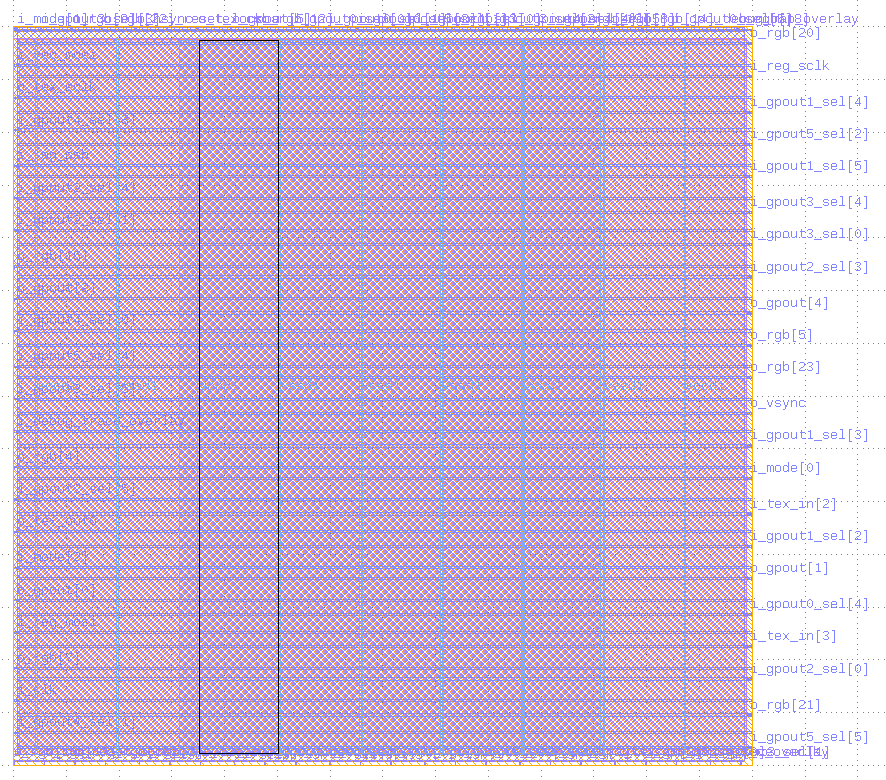
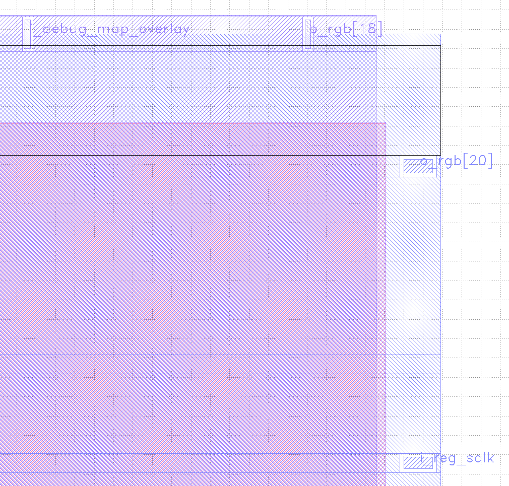
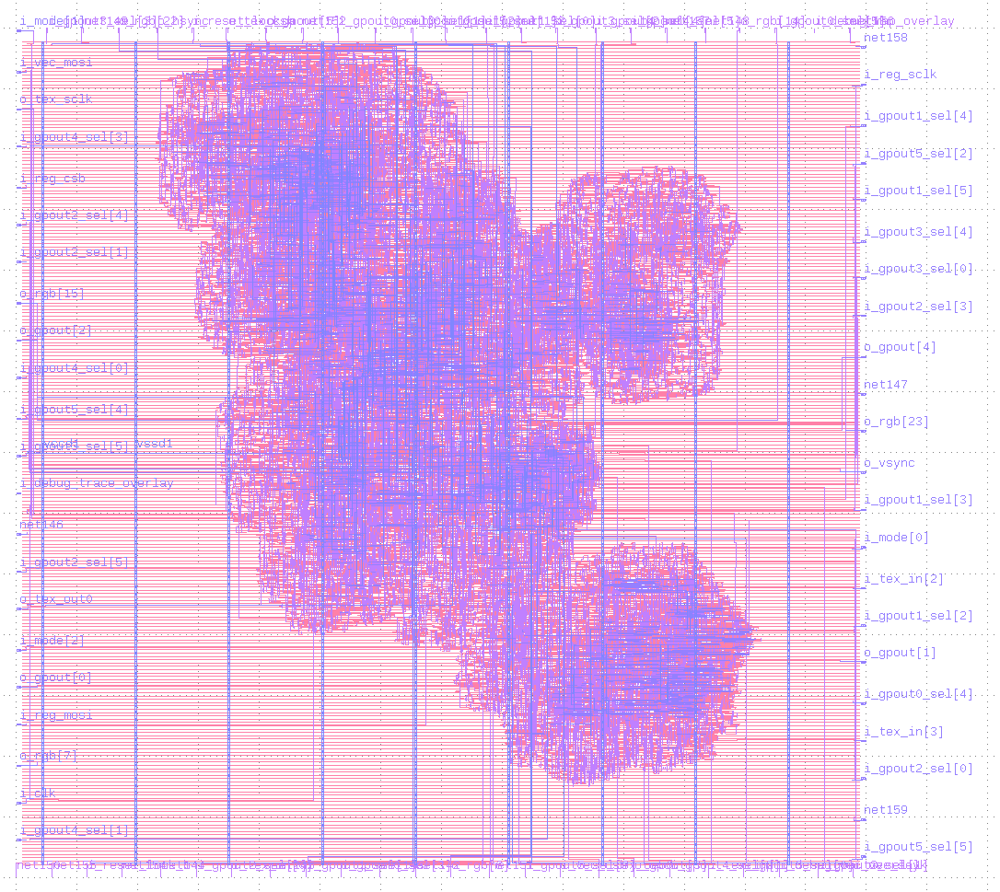
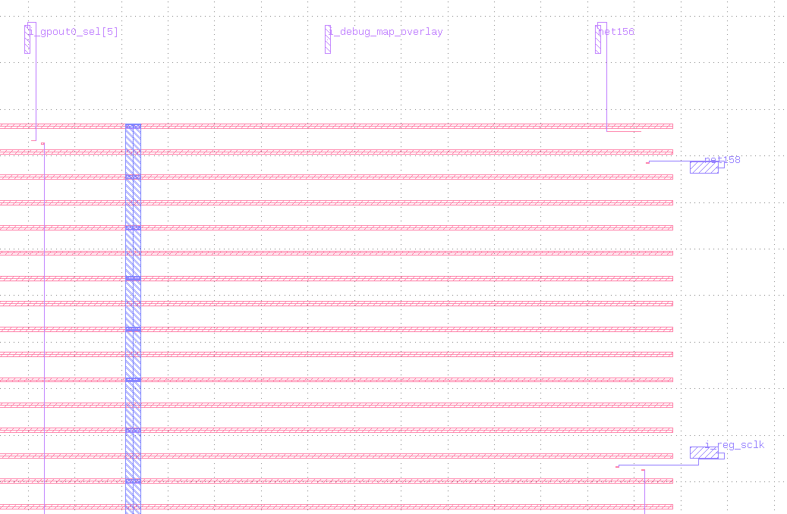
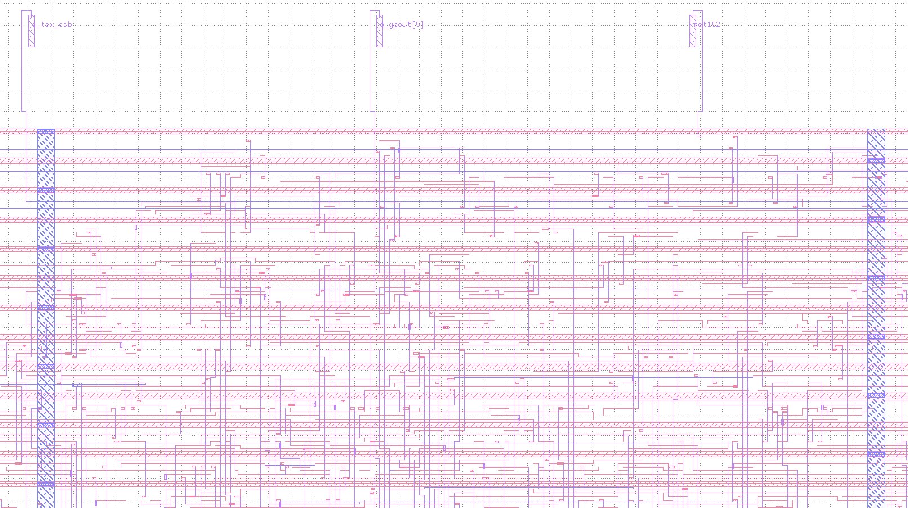

# 28 Oct 2023

| Previous journal: | Next journal: |
|-|-|
| [**0167**-2023-10-27.md](./0167-2023-10-27.md) | *Next journal TBA* |

# Again more prep for chipIgnite

*   Instantiate my design (top_ew_algofoogle) using SNIPPET1_NoShare
*   Implement basic cocotb test: Wire up Texture SPI ROM (and fix QE bit); Firmware to set up GPIOs/LA and issue/release reset.
*   Remove other tests
*   Harden GDS macro and user project area
*   Commit the repo with new remote
*   Work out if [use of IRQs (`user_irq`)](https://github.com/efabless/caravel_user_project/blob/872a4fc82fbd96448232186858c0ed4bffc991b4/verilog/rtl/user_project_wrapper.v#L77-L78) is safe -- are they masked by default? We don't want them firing all over the place and interrupting our firmware, or anyone else's.
*   Option for un/registered RGB outputs
*   Prep SNIPPET2 and SNIPPET3
*   Update EWSPEC as needed
*   Put in other general raybox-zero features
*   Try newer OpenLane 1.x and updated CUP

# Other test outputs suggested for gpout muxes or alts

*   VGA hmax/vmax
*   VGA visible

# Notes

*   LEF files can be viewed in KLayout. They basically just seem to show main area, obstructions (keepouts) per layer, pins per layer, and labels:

    

    ...and a close-up:

    
*   DEFs show quite a bit more detail, but still not the whole thing. Not sure what they're for...

    

    ...and close-up:

    

    Notice that unconnected nets haven't retained their name, and have gone generic, in the top-right corner...?

    Close-up on a more detailed area:

    
*   Normally I think a DEF would show all the cells, doing so by referencing them from the 'tech' file. These warnings were spat out by KLayout in the console:
    ```
    ...
    Warning: Macro not found in LEF file: sky130_fd_sc_hd__buf_2 (line=60211, cell=, file=top_ew_algofoogle.def)
    Warning: Macro not found in LEF file: sky130_fd_sc_hd__dlymetal6s2s_1 (line=60212, cell=, file=top_ew_algofoogle.def)
    Warning: Macro not found in LEF file: sky130_fd_sc_hd__buf_2 (line=60213, cell=, file=top_ew_algofoogle.def)
    Warning: Macro not found in LEF file: sky130_fd_sc_hd__clkbuf_4 (line=60214, cell=, file=top_ew_algofoogle.def)
    Warning: Macro not found in LEF file: sky130_fd_sc_hd__buf_2 (line=60215, cell=, file=top_ew_algofoogle.def)
    Warning: Macro not found in LEF file: sky130_fd_sc_hd__dlymetal6s2s_1 (line=60216, cell=, file=top_ew_algofoogle.def)
    Warning: Macro not found in LEF file: sky130_fd_sc_hd__clkbuf_2 (line=60217, cell=, file=top_ew_algofoogle.def)
    Warning: Macro not found in LEF file: sky130_fd_sc_hd__clkbuf_2 (line=60218, cell=, file=top_ew_algofoogle.def)
    Warning: Macro not found in LEF file: sky130_fd_sc_hd__dlymetal6s2s_1 (line=60219, cell=, file=top_ew_algofoogle.def)
    Warning: Macro not found in LEF file: sky130_fd_sc_hd__buf_2 (line=60220, cell=, file=top_ew_algofoogle.def)
    ...
    ```
*   Thus, I think a GDS is the raw polygons of each layer, a DEF is the design as a hierarchical arrangement and connection of cells, and the LEF is a high-level structure used for placement and top-level routing.
*   [Caravel Management SoC - Litex](https://caravel-mgmt-soc-litex.readthedocs.io/en/latest/)
