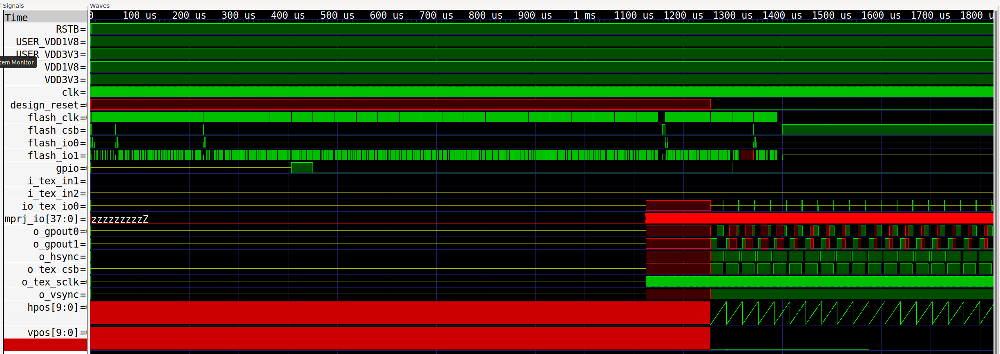
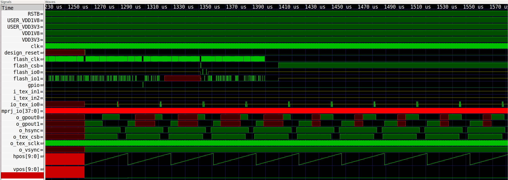
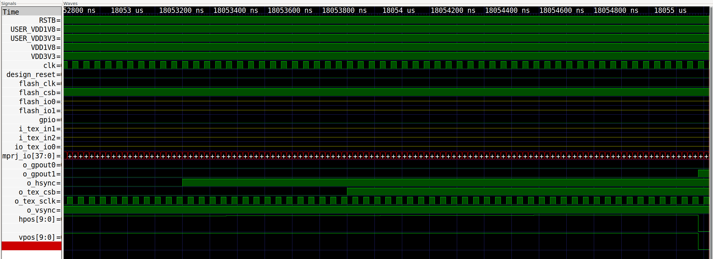
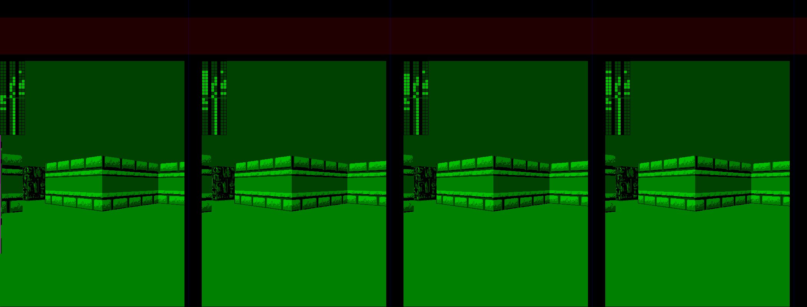
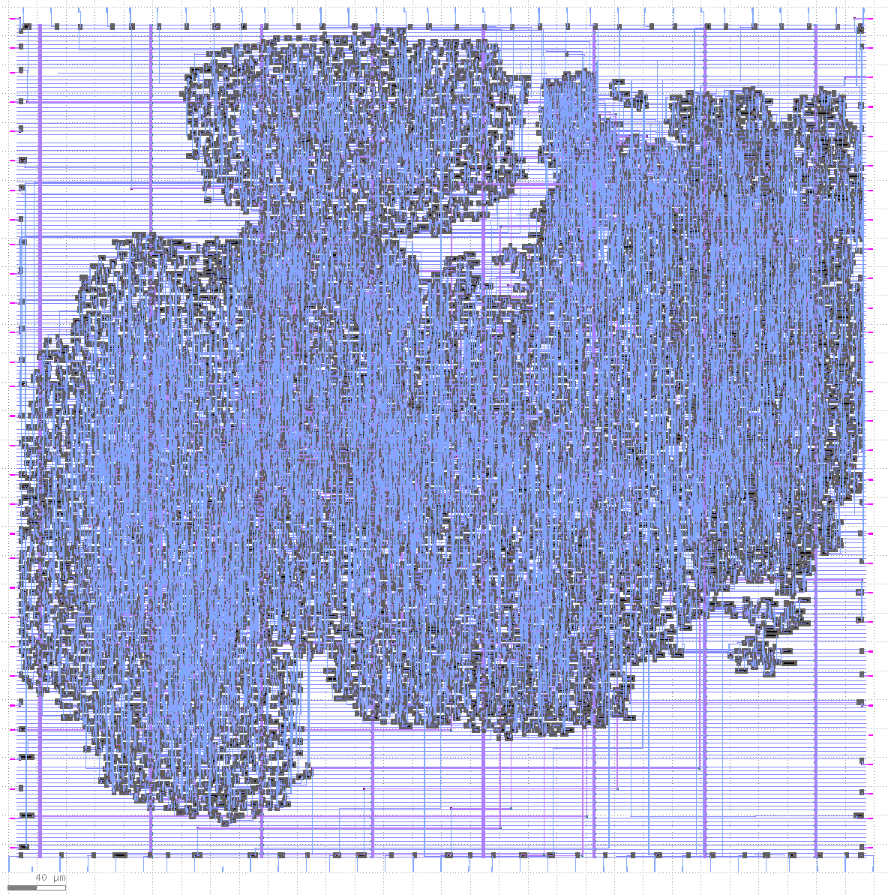
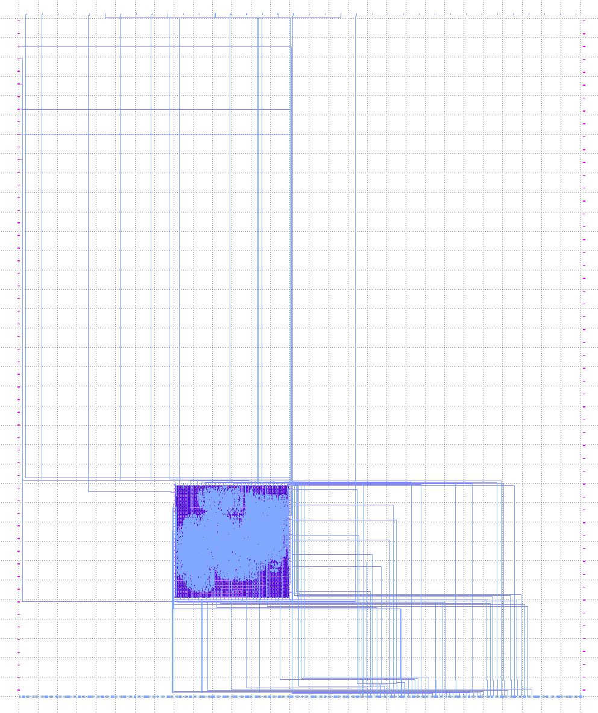

# 28 Oct 2023

| Previous journal: | Next journal: |
|-|-|
| [**0167**-2023-10-27.md](./0167-2023-10-27.md) | *Next journal TBA* |

# Again more prep for chipIgnite

## Done

*   Instantiated my design (top_ew_algofoogle) using SNIPPET1_NoShare.
*   Modified design to buffer texture data from `io[2:0]` instead of `io[3:1]` because io3 might not be available in our assigned IO pads.
*   Because of texture buffer change, I modified texy.py to write out its ROM image in XBGRXBGR format instead of BGRXBGRX.
*   Wrote updated texture ROM to test with updated design on FPGA
*   Got it working with initial frame rendering test: Had to fix some issues, but seems fine now, and it can generate an output full-frame VGA preview from cocotb too.
*   Removed other tests.
*   Got GL tests running... maybe?? Commit [0bd6d05](https://github.com/algofoogle/raybox-zero-caravel/commit/468ee0972edfacc5a788d0d79f5e08ae976ff512) has the goods, and I can run `make coco_test_gl` but if I define the `UNIT_DELAY` to be `#10`, it still works. That doesn't seem right.

## Plan

NOTE: Remember that my own [`copy_caravel_stuff.sh`](https://github.com/algofoogle/solo_squash/blob/main/caravel_stuff/copy_caravel_stuff.sh) might help us. Should we do the same [`caravel_stuff/`](https://github.com/algofoogle/solo_squash/blob/main/caravel_stuff/) structure for raybox-zero? Likewise there's the repo that I actually made using this method (I think): [solo-squash-caravel](https://github.com/algofoogle/solo-squash-caravel)

Borrow *just a little* from my [solo-squash cocotb tests](https://github.com/algofoogle/solo_squash/blob/main/caravel_stuff/test_solo_squash_caravel.py) and also robojan's cocotb tests for his TT04 'Breakout' clone.

Z2A MPW9 update refers to OpenLane improved checks inc. for OEB and CVC: "precheck now checks for oeb issues, includes cvc, required lvs configuration"

*   Implement basic cocotb test: Wire up Texture SPI ROM (and fix QE bit); Firmware to set up GPIOs/LA and issue/release reset.
*   Harden GDS macro and user project area
*   Commit the repo with new remote
*   Work out if [use of IRQs (`user_irq`)](https://github.com/efabless/caravel_user_project/blob/872a4fc82fbd96448232186858c0ed4bffc991b4/verilog/rtl/user_project_wrapper.v#L77-L78) is safe -- are they masked by default? We don't want them firing all over the place and interrupting our firmware, or anyone else's.
*   Option for un/registered RGB outputs
*   Prep SNIPPET2 and SNIPPET3
*   Update EWSPEC as needed
*   Put in other general raybox-zero features
*   Try newer OpenLane 1.x and updated CUP

## Other test outputs suggested for gpout muxes or alts

*   VGA hmax/vmax
*   VGA visible

# Process

Let's go!

## Prep clean CUP and call it raybox-zero-caravel

### Get clean CUP if necessary

*   First up, I'm using caravel_user_project in MPW8 VM. It's a clean copy as distributed with the VM.
*   This is being done on my laptop.
*   Extract my backup copy *if necessary*:
    *   Delete or archive old `caravel_user_project`
    *   ```bash
        cd ~/asic_tools
        tar xjf CUP-mpw-8c-Z2A-original-2022-12-29.tar.bz2
        mv CUP-mpw-8c-Z2A-original-2022-12-29 caravel_user_project
        ```
*   Symlink for CUP: `ln -s ~/asic_tools/caravel_user_project ~/CUP`
*   `git log` shows:
    ```
    commit bae93e078005210307b7530e53d4a0c060ed5c54 (HEAD, tag: mpw-8c)
    Author: Jeff DiCorpo <42048757+jeffdi@users.noreply.github.com>
    Date:   Fri Nov 25 11:53:53 2022 -0800

        tag = mpw-8c
    ```
*   `git status` shows the only changes are added directories:
    ```
    caravel/
    deps/
    mgmt_core_wrapper/
    venv/
    ```

### Start the new raybox-zero-caravel CUP repo

This will use the mpw-8c clean CUP repo as the basis for our new raybox-zero-caravel repo, specifically on the **`ew` branch** as the default.

1.  Create new GitHub repo called [raybox-zero-caravel](https://github.com/algofoogle/raybox-zero-caravel)
2.  Go into working CUP and prepare its remote hook-up to the new repo, but **making an `ew` branch *as the default***:
    ```bash
    cd ~/CUP
    git checkout -b ew
    git remote add anton git@github.com:algofoogle/raybox-zero-caravel.git
    git push -u anton ew
    ```
3.  Refresh the repo in GitHub and it should show that `ew` is now the default branch.
4.  `git branch -a` should include remotes/**anton**/ew
5.  `git branch -vv` should show that our `ew` branch is using the `anton/ew` remote:
    ```
    $ git branch -vv
    * ew   bae93e0 [anton/ew] tag = mpw-8c
      main 4fabf74 [origin/main] Merge pull request #223 from efabless/timing-scripts-report-summary-updates
    ```

## Instantiate my design (top_ew_algofoogle) - SNIPPET1_NoShare version

1.  Make raybox-zero a [submodule](https://github.com/algofoogle/raybox-zero-caravel/commit/19ebe30f443ae5118a33a24d74968d120b5e3a35#diff-fe7afb5c9c916e521401d3fcfb4277d5071798c3baf83baf11d6071742823584) in `verilog/rtl`:
    ```bash
    cd ~/CUP
    git submodule add -b ew git@github.com:algofoogle/raybox-zero verilog/rtl/raybox-zero
    ```
2.  [Replace](https://github.com/algofoogle/raybox-zero-caravel/commit/19ebe30f443ae5118a33a24d74968d120b5e3a35#diff-ae099be4441f3203d570d7b5fd5bb989320ca03332623948d91f33a7dec57a53)
    `verilog/includes/includes.rtl.caravel_user_project` with the following:
    ```
    # Caravel user project includes
    -v $(USER_PROJECT_VERILOG)/rtl/user_project_wrapper.v
    -v $(USER_PROJECT_VERILOG)/rtl/raybox-zero/src/rtl/top_ew_algofoogle.v
    -v $(USER_PROJECT_VERILOG)/rtl/raybox-zero/src/rtl/debug_overlay.v
    -v $(USER_PROJECT_VERILOG)/rtl/raybox-zero/src/rtl/fixed_point_params.v
    -v $(USER_PROJECT_VERILOG)/rtl/raybox-zero/src/rtl/helpers.v
    -v $(USER_PROJECT_VERILOG)/rtl/raybox-zero/src/rtl/lzc.v
    -v $(USER_PROJECT_VERILOG)/rtl/raybox-zero/src/rtl/map_overlay.v
    -v $(USER_PROJECT_VERILOG)/rtl/raybox-zero/src/rtl/map_rom.v
    -v $(USER_PROJECT_VERILOG)/rtl/raybox-zero/src/rtl/pov.v
    -v $(USER_PROJECT_VERILOG)/rtl/raybox-zero/src/rtl/rbzero.v
    -v $(USER_PROJECT_VERILOG)/rtl/raybox-zero/src/rtl/reciprocal.v
    -v $(USER_PROJECT_VERILOG)/rtl/raybox-zero/src/rtl/row_render.v
    -v $(USER_PROJECT_VERILOG)/rtl/raybox-zero/src/rtl/spi_registers.v
    -v $(USER_PROJECT_VERILOG)/rtl/raybox-zero/src/rtl/vga_mux.v
    -v $(USER_PROJECT_VERILOG)/rtl/raybox-zero/src/rtl/vga_sync.v
    -v $(USER_PROJECT_VERILOG)/rtl/raybox-zero/src/rtl/wall_tracer.v
    ```
3.  Edit `verilog/rtl/user_project_wrapper.v` to [replace](https://github.com/algofoogle/raybox-zero-caravel/commit/19ebe30f443ae5118a33a24d74968d120b5e3a35#diff-83ac0ef05662841c8ec520d2b084e2d44e493e7d323ba22cb43b27d24d820397) the `user_proj_example` instance with [SNIPPET1_NoShare](https://github.com/algofoogle/raybox-zero/blob/ew/src/rtl/ew_caravel_snippets/SNIPPET1_NoShare.v).
4.  Remove old stuff we don't need from the example project:
    ```bash
    git rm verilog/rtl/user_proj_example.v
    git rm -r verilog/dv/io_ports
    git rm -r verilog/dv/la_test1
    git rm -r verilog/dv/la_test2
    git rm -r verilog/dv/mprj_stimulus
    git rm -r verilog/dv/wb_port
    ```
5.  Edit README a bit.
6.  [Commit](https://github.com/algofoogle/raybox-zero-caravel/commit/19ebe30f443ae5118a33a24d74968d120b5e3a35) these changes:
    ```bash
    git commit -am "Starting to instantiate raybox-zero project via submodule"
    git push
    ```

## Implement basic cocotb tests

1.  ```bash
    cd ~/CUP/verilog/dv
    mkdir rbz_basic
    ```
2.  Create all files to be based on the 'rbz_basic' (test) name, so that default `make ...` actions will find them, i.e. note that `coco_test` depends on `rbz_basic.hex`. Make sure this is also the `rbz_basic.vcd` file we'll write in the TB.
3.  Note that I had to make some changes to the standard `Makefile` as used by the CUP examples, because I rely on the following;
    *   A SystemVerilog feature for doing conversion/casting of constants (to help with real-to-fixed-point number conversion).
    *   Additional `W25Q128JVxIM` module used only in testing, to simulate the external texture SPI flash ROM.
    *   `` `include `` references to include files, which we need to tell iverilog to find in the same path as our main RTL source files.
4.  Add in `texture_rom/` subdir and files.
5.  Run the test to generate `rbz_basic.vcd`: `make coco_test` -- It runs a bit over 1.5M clocks so it takes a while (about 16 minutes on my laptop).
6.  View the resulting VCD with GTKWave, using a 'Save File' for formatting: `gtkwave rbz_basic.vcd rbz_basic.gtkw` -- NOTE: I've already made that .gtkw and put it into the repo.

View showing texture SPI flash ROM **not** configured to support QSPI (`QE`) mode:



Note how there are red 'holes' in the outputs, which I think match the region of each line which *would* be textured wall. I think this is working as expected.

Close-up of the start of the frame:



Hmm, interesting:
*   First line appears to be all floor/ceiling. Maybe to be expected if no size calculated yet (0?)
*   First texture SPI read includes an unknown (`x`) address bit. Probably makes sense: We HAVE observed that there appears to be a 1-line lag in updating the texture address.
*   Surprisingly, next 4 lines look like they are showing a tall wall region. Is this a very-edge fragment of a near wall? I don't see this in `make csr`. I wonder if subsequent frames show they same thing.

If we zoom right in to the very end, we can see where the next frame starts (that 1 extra clock inserted in the test):



I modified `texture_rom/sreg.hex` to set the 9th zero (from the left) to 1. This represents the QE bit, so this is the same effect as having QE pre-programmed to be on (as is the case with the chips I'm using, and as is the assumption of the raybox-zero SPI implementation). This made the unknown states disappear in the gpouts.

Through testing I uncovered that I didn't have any blue texture data coming in, because io3 is unused but the design was using io[3:1] as the source for its buffers. As a result I changed it to io[2:0] and made sure the blue data was in io0 instead of io3 (so I had to update the texture ROM, and for that I had to update texy.py).

I added a feature to the `rbz_basic:test_all` test to write the gpout data it receives to a PPM file, so we can actually visualise what the simulation is spitting out:



In this case, I set it up to render 4 frames, rather than just the usual 1 that the test does. NOTE: The image is rotated above.

NOTE: It's not obvious from looking at the images above, but the first frame (LHS) is shifted a lot more than the others. I think this is something to do with the start-up state of the FSM. From what I can tell, the vectors are behaving normally between frames.

**NOTE: Remember to [commit everything](https://github.com/algofoogle/raybox-zero-caravel/commit/69ef5d025afafa5ff8f265620aff3c63e6f1f93b) if it works OK!**


## Harden the top_ew_algofoogle design for Caravel

1.  ```bash
    cd ~/CUP/openlane
    mkdir top_ew_algofoogle
    ```
2.  Convert raybox-zero's [config.tcl](https://github.com/algofoogle/raybox-zero/blob/ew/config.tcl) to the `config.json` format (Makefile expects this!) and put it in CUP's `openlane/top_ew_algofoogle/` -- Make sure there is no `config.tcl` file in there too, or OpenLane will get [confused](#openlane-gets-confused-if-you-use-configjson-and-configtcl).
3.  Ensure these lines are present, especially:
    ```json
    "CLOCK_PORT": "i_clk",
    "CLOCK_NET": "top_ew_algofoogle.i_clk",
    "DESIGN_IS_CORE": 0,
    "RT_MAX_LAYER": "met4",
    "VDD_NETS": ["vccd1"],
    "GND_NETS": ["vssd1"],
    ```
4.  Make sure `../../verilog/rtl/defines.v` is added to the top of the list (which I think might be needed for `MPRJ_IO_PADS`, etc).
5.  NOTE: These are parts that **I removed** from config.json at various points to get a good hardening result:
    ```json
    "FP_CORE_UTIL": 45,
    "RUN_KLAYOUT_XOR": 0,
    "RUN_KLAYOUT_DRC": 0,
    "FP_IO_VTHICKNESS_MULT": 4,
    "FP_IO_HTHICKNESS_MULT": 4,
    "FP_PIN_ORDER_CFG": "dir::pin_order.cfg",
    "SYNTH_MAX_FANOUT": 6,
    "DIODE_INSERTION_STRATEGY": 4,
    ```
6.  Do the harden:
    ```bash
    cd ~/CUP
    make top_ew_algofoogle
    ```
7.  If this succeeds, final output should be in:
    *   `~/CUP/gds/`
    *   `~/CUP/lef/`
    *   `~/CUP/def/`
8.  Whether it succeeds or fails, check stats with:
    ```
    summary.py --caravel --design top_ew_algofoogle --full-summary
    ```

    See [below](#full-summary-of-my-successful-top_ew_algofoogle-harden-in-cupopenlane) for a full summary from my good run with a clock period of 40ns.

    I got a failure (setup violations) on the first try, but noticed in the summary it was using a `CLOCK_PERIOD` of 10 instead of 40.
    *   I'm glad to say that it reported it could get down to a period of 31.09ns (~32.16MHz).
    *   Anyway, it appears the `10` figure is coming from the `"pdk::sky130*"` overrides so I deleted that and ran it again... only this time I set a clock period of 33ns (~30MHz) to try and push it a bit harder (since it looks like it might work anyway).
    *   33ns failed too, suggested is 33.68. I tried 35ns (28.57MHz), but I was having trouble with excessive fanout and antenna violations.

### General checks

*   [Attempt 3](https://github.com/algofoogle/raybox-zero-caravel/blob/0edee161ccd223b80fa6ca867deaece835b1bc8c/openlane/top_ew_algofoogle/config.json):
    *   In `logs/signoff/35-antenna.log`: 15 antenna violators. Worst is **1648.33/400. This might be too bad.**
*   [Attempt 4](https://github.com/algofoogle/raybox-zero-caravel/blob/2d5db35e418b6cab69e679a751c3299ba2daee1a/openlane/top_ew_algofoogle/config.json):
    *   In `logs/signoff/35-antenna.log`: Only 4 antenna violators, but one is terrible! **2149.67/400. This might be too bad.**
    *   In `reports/signoff/26-rcx_sta.slew.rpt`: Fanout blew up again with 636 violators and very many of them 20+ and one 44.
*   [Attempt 5](https://github.com/algofoogle/raybox-zero-caravel/blob/4dc02b5fb4f4baf2011b59a57b21baaaeafc6111/openlane/top_ew_algofoogle/config.json) **seems good enough**:
    *   Reduced area to 600x600um
    *   Increased target density from 0.4 to 0.5
    *   Removed `"DIODE_INSERTION_STRATEGY": 4`
    *   Worst antenna violation out of 10 is 659/400, which is [within tolerances](https://github.com/The-OpenROAD-Project/OpenLane/issues/1231#issuecomment-1198488685)
    *   There are 31 fanout warnings, the worst is 16/10.

Result from `summary.py --caravel --design top_ew_algofoogle --gds` looks like this:




### Hardening issues

NOTE: On my first attempt, with 700x700 area and 0.55 target density, I got this error which surprised me (given it didn't fail when hardened as an OpenLane `designs` entry earlier with 0.6 density):

```
[STEP 16]
[INFO]: Running Global Routing (log: ../home/zerotoasic/asic_tools/caravel_user_project/openlane/top_ew_algofoogle/runs/23_10_29_21_30/logs/routing/16-global.log)...
[ERROR]: during executing openroad script /openlane/scripts/openroad/groute.tcl
[ERROR]: Log: ../home/zerotoasic/asic_tools/caravel_user_project/openlane/top_ew_algofoogle/runs/23_10_29_21_30/logs/routing/16-global.log
[ERROR]: Last 10 lines:

[INFO GRT-0101] Running extra iterations to remove overflow.
[INFO GRT-0197] Via related to pin nodes: 65969
[INFO GRT-0198] Via related Steiner nodes: 945
[INFO GRT-0199] Via filling finished.
[INFO GRT-0111] Final number of vias: 84137
[INFO GRT-0112] Final usage 3D: 370792
[ERROR GRT-0118] Routing congestion too high. Check the congestion heatmap in the GUI.
Error: groute.tcl, 36 GRT-0118
child process exited abnormally
```

I reduced the target density to 0.4 and it hardened OK, but with [this config.json](https://github.com/algofoogle/raybox-zero-caravel/blob/ew/openlane/top_ew_algofoogle/config.json) I get **HUGE** clock buffer fanout warnings (46 vs. nominal 10).

To try and mitigate this I removed these lines:
```json
"SYNTH_MAX_FANOUT": 6,
"DIODE_INSERTION_STRATEGY": 4,
```
...and dropped the clock back to 40ns period (standard 25MHz), and changed `PL_TARGET_DENSITY` to 0.45.

OK, that's a bit better. The fanout has gone from more than 700 violators (worst ~46) ot just 28 and the worst is 18.


## Place the new top_ew_algofoogle macro inside 

1.  Edit `~/CUP/openlane/user_project_wrapper/config.json`
    1.  In `FP_PDN_MACRO_HOOKS` change `mprj` to `top_ew_algofoogle`
    2.  Update `CLOCK_NET` to `top_ew_algofoogle.i_clk` and note that `CLOCK_PORT` is set to `user_clock2` and this seems to match my intended use too.
    3.  Set `EXTRA_LEFS` and `EXTRA_GDS_FILES` both per `top_ew_algofoogle`
    4.  Update `VERILOG_FILES_BLACKBOX` at the end to refer to `top_ew_algofoogle.v` -- I think it must just use the ports from this?
2.  Edit `~/CUP/openlane/user_project_wrapper/macro.cfg`.
    *   Change `mprj` to `top_ew_algofoogle`.
    *   [Caravel area](https://caravel-user-project.readthedocs.io/en/latest/#user-project-wrapper-requirements) is documented as 2920um by 3520um.
    *   I would prefer placement near the high-end LAs and my assigned pads, so can we do that?
    *   According to [this pad frame diagram (if that's what it is)](https://caravel-harness.readthedocs.io/en/latest/supplementary-figures.html#die-voltage-clamp-arrangement), it looks like my pads are all in the top-left. With LA all down the bottom, this isn't ideal, but OK. Let's try 800 in from the left, 1800 up from the bottom.
3.  Resulting changes are in commit [4dc02b5](https://github.com/algofoogle/raybox-zero-caravel/commit/147f94fbbecaffc28634cd5640790caf9ccda5bb).
4.  ```bash
    cd ~/CUP
    time make user_project_wrapper
    ```
5.  Run `summary.py --caravel --design user_project_wrapper --summary`
6.  Verify that the `user_project_wrapper` GDS, DEF, and LEF files have been updated in the respective `gds/`, `def/`, and `def/` subdirectories in the top of `~/CUP`. There should also be gate-level files updated in `verilog/gl/`.
7.  `make compress` to compress the various GDS and other supporting files, so they will be nice to the GitHub repo.

### Issues with macro in UPW

```
[WARNING]: There are max slew violations in the design at the typical corner. Please refer to '../home/zerotoasic/asic_tools/caravel_user_project/openlane/user_project_wrapper/runs/23_10_29_23_18/reports/signoff/21-rcx_sta.slew.rpt'.
[WARNING]: There are max capacitance violations in the design at the typical corner. Please refer to '../home/zerotoasic/asic_tools/caravel_user_project/openlane/user_project_wrapper/runs/23_10_29_23_18/reports/signoff/21-rcx_sta.slew.rpt'.
[INFO]: There are no hold violations in the design at the typical corner.
[INFO]: There are no setup violations in the design at the typical corner.
[SUCCESS]: Flow complete.
[INFO]: Note that the following warnings have been generated:
[WARNING]: There are max slew violations in the design at the typical corner. Please refer to '../home/zerotoasic/asic_tools/caravel_user_project/openlane/user_project_wrapper/runs/23_10_29_23_18/reports/signoff/21-rcx_sta.slew.rpt'.
[WARNING]: There are max capacitance violations in the design at the typical corner. Please refer to '../home/zerotoasic/asic_tools/caravel_user_project/openlane/user_project_wrapper/runs/23_10_29_23_18/reports/signoff/21-rcx_sta.slew.rpt'.
```

See: `reports/signoff/21-rcx_sta.slew.rpt`

With my original placement, all issues are on LA pins *except for user_clock2*. *That* could be bad...?

Here's a snippet (~30 violations each):

```
max slew

Pin               Limit    Slew   Slack
---------------------------------------
la_data_in[95]     1.50    2.85   -1.36 (VIOLATED)
la_data_in[99]     1.50    2.78   -1.28 (VIOLATED)
la_data_in[90]     1.50    2.71   -1.21 (VIOLATED)
la_data_in[87]     1.50    2.62   -1.12 (VIOLATED)
la_data_in[83]     1.50    2.40   -0.90 (VIOLATED)
la_data_in[93]     1.50    2.39   -0.90 (VIOLATED)
user_clock2        1.50    2.27   -0.78 (VIOLATED)

...(SNIP)...

max capacitance

Pin               Limit     Cap   Slack
---------------------------------------
la_data_in[95]     0.33    0.66   -0.33 (VIOLATED)
la_data_in[99]     0.33    0.65   -0.32 (VIOLATED)
la_data_in[90]     0.33    0.63   -0.29 (VIOLATED)
la_data_in[87]     0.33    0.60   -0.27 (VIOLATED)
la_data_in[83]     0.33    0.55   -0.22 (VIOLATED)
la_data_in[93]     0.33    0.54   -0.21 (VIOLATED)
user_clock2        0.33    0.53   -0.20 (VIOLATED)
```

Can we increase CLOCK_PERIOD in UPW's config.json? No, going from 10 to 20ns didn't seem to make a difference?

Can we rotate the macro? I tried changing `N` to `E` and it just failed harder:

```
[STEP 13]
[INFO]: Running Detailed Routing (log: ../home/zerotoasic/asic_tools/caravel_user_project/openlane/user_project_wrapper/runs/23_10_30_00_21/logs/routing/13-detailed.log)...
[ERROR]: There are violations in the design after detailed routing.
[ERROR]: Total Number of violations is 12
[INFO]: Saving current set of views in '../home/zerotoasic/asic_tools/caravel_user_project/openlane/user_project_wrapper/runs/23_10_30_00_21/results/final'...
```

Do we just need to reharden the macro to place its pins better?

I moved the macro way down (`top_ew_algofoogle 800 500 N`) and got fewer errors, but still worth noting (and also they're now showing up on IO pads):

```
max slew

Pin                                    Limit    Slew   Slack
------------------------------------------------------------
io_in[25]                               1.50    2.26   -0.76 (VIOLATED)
la_data_in[95]                          1.50    1.96   -0.47 (VIOLATED)
la_data_in[99]                          1.50    1.92   -0.42 (VIOLATED)
la_data_in[90]                          1.50    1.81   -0.31 (VIOLATED)
la_data_in[83]                          1.50    1.72   -0.22 (VIOLATED)
la_data_in[87]                          1.50    1.71   -0.21 (VIOLATED)
la_data_in[93]                          1.50    1.68   -0.18 (VIOLATED)
la_data_in[92]                          1.50    1.62   -0.12 (VIOLATED)
user_clock2                             1.50    1.62   -0.12 (VIOLATED)
io_in[26]                               1.50    1.61   -0.11 (VIOLATED)

max capacitance

Pin                                    Limit     Cap   Slack
------------------------------------------------------------
io_in[25]                               0.33    0.54   -0.21 (VIOLATED)
la_data_in[95]                          0.33    0.44   -0.11 (VIOLATED)
la_data_in[99]                          0.33    0.43   -0.10 (VIOLATED)
la_data_in[90]                          0.33    0.41   -0.08 (VIOLATED)
la_data_in[83]                          0.33    0.39   -0.06 (VIOLATED)
la_data_in[87]                          0.33    0.38   -0.05 (VIOLATED)
la_data_in[93]                          0.33    0.38   -0.05 (VIOLATED)
io_in[26]                               0.33    0.37   -0.04 (VIOLATED)
la_data_in[92]                          0.33    0.37   -0.04 (VIOLATED)
user_clock2                             0.33    0.36   -0.03 (VIOLATED)
```

Layout:



This placement got the number down even further: `top_ew_algofoogle 1200 400 N` -- now there are 7 of each, none on `user_clock2`, but there are violations now on IO pads 22, 25, and 26:

```
max slew

Pin                                    Limit    Slew   Slack
------------------------------------------------------------
io_in[25]                               1.50    2.54   -1.05 (VIOLATED)
la_data_in[110]                         1.50    2.48   -0.98 (VIOLATED)
la_data_in[99]                          1.50    1.83   -0.34 (VIOLATED)
io_in[26]                               1.50    1.76   -0.26 (VIOLATED)
la_data_in[112]                         1.50    1.75   -0.25 (VIOLATED)
io_in[22]                               1.50    1.69   -0.19 (VIOLATED)
la_data_in[95]                          1.50    1.65   -0.16 (VIOLATED)

max capacitance

Pin                                    Limit     Cap   Slack
------------------------------------------------------------
io_in[25]                               0.33    0.62   -0.28 (VIOLATED)
la_data_in[110]                         0.33    0.55   -0.22 (VIOLATED)
io_in[26]                               0.33    0.42   -0.09 (VIOLATED)
la_data_in[99]                          0.33    0.41   -0.08 (VIOLATED)
io_in[22]                               0.33    0.40   -0.07 (VIOLATED)
la_data_in[112]                         0.33    0.39   -0.06 (VIOLATED)
la_data_in[95]                          0.33    0.37   -0.04 (VIOLATED)
```

What if we try a long slab macro?

## Modify user_defines

*   Edit `~/CUP/verilog/rtl/user_defines.v`
*   For my assigned IO pads, here's the config:
    ```verilog
    `define USER_CONFIG_GPIO_18_INIT `GPIO_MODE_USER_STD_OUTPUT
    `define USER_CONFIG_GPIO_19_INIT `GPIO_MODE_USER_STD_OUTPUT
    `define USER_CONFIG_GPIO_20_INIT `GPIO_MODE_USER_STD_OUTPUT
    `define USER_CONFIG_GPIO_21_INIT `GPIO_MODE_USER_STD_OUTPUT
    `define USER_CONFIG_GPIO_22_INIT `GPIO_MODE_USER_STD_BIDIRECTIONAL
    `define USER_CONFIG_GPIO_23_INIT `GPIO_MODE_USER_STD_OUTPUT
    `define USER_CONFIG_GPIO_24_INIT `GPIO_MODE_USER_STD_OUTPUT
    `define USER_CONFIG_GPIO_25_INIT `GPIO_MODE_USER_STD_INPUT_NOPULL
    `define USER_CONFIG_GPIO_26_INIT `GPIO_MODE_USER_STD_INPUT_NOPULL
    ```

## Checker script

1.  ```bash
    cd ~/CUP
    make run-precheck
    ```
2.  Look inside `precheck_results/`

# Full summary of my successful top_ew_algofoogle harden in `~/CUP/openlane`

```
$ summary.py --caravel --design top_ew_algofoogle --full-summary
openlane/top_ew_algofoogle/runs/*
using latest run:
openlane/top_ew_algofoogle/runs/23_10_29_22_55
                        design : /home/zerotoasic/asic_tools/caravel_user_project/openlane/top_ew_algofoogle
                   design_name :    top_ew_algofoogle
                        config :       23_10_29_22_55
                   flow_status :       flow completed
                 total_runtime :           0h6m57s0ms
                routed_runtime :           0h3m25s0ms
         (Cell/mm^2)/Core_Util :              63450.0
                  DIEAREA_mm^2 :                 0.36
                  CellPer_mm^2 :              31725.0
                   OpenDP_Util :                 34.0
          Peak_Memory_Usage_MB :              1782.49
                    cell_count :                11421
        tritonRoute_violations :                    0
              Short_violations :                    0
             MetSpc_violations :                    0
            OffGrid_violations :                    0
            MinHole_violations :                    0
              Other_violations :                    0
              Magic_violations :                    0
            antenna_violations :                   -1
              lvs_total_errors :                    0
              cvc_total_errors :                   -1
            klayout_violations :                   -1
                   wire_length :               418553
                          vias :                85072
                           wns :                  0.0
                        pl_wns :                  0.0
                 optimized_wns :                  0.0
                 fastroute_wns :                  0.0
                      spef_wns :                  0.0
                           tns :                  0.0
                        pl_tns :                  0.0
                 optimized_tns :                  0.0
                 fastroute_tns :                  0.0
                      spef_tns :                  0.0
                          HPWL :          322524787.0
            routing_layer1_pct :                  0.0
            routing_layer2_pct :                31.31
            routing_layer3_pct :                37.69
            routing_layer4_pct :                 2.41
            routing_layer5_pct :                 7.14
            routing_layer6_pct :                   -1
                   wires_count :                16978
                     wire_bits :                19915
            public_wires_count :                  358
              public_wire_bits :                 3103
                memories_count :                    0
                   memory_bits :                    0
               processes_count :                    0
                 cells_pre_abc :                17775
                           AND :                  445
                           DFF :                   17
                          NAND :                  292
                           NOR :                 2097
                            OR :                 2660
                           XOR :                 2686
                          XNOR :                 1231
                           MUX :                 1363
                        inputs :                 1107
                       outputs :                 1457
                         level :                  114
                       EndCaps :                  424
                      TapCells :                 4815
                        Diodes :                    0
          Total_Physical_Cells :                 5239
                 CoreArea_um^2 :   339525.63200000004
     power_slowest_internal_uW :                   -1
    power_slowest_switching_uW :                   -1
      power_slowest_leakage_uW :                   -1
     power_typical_internal_uW :                   -1
    power_typical_switching_uW :                   -1
      power_typical_leakage_uW :                   -1
     power_fastest_internal_uW :                   -1
    power_fastest_switching_uW :                   -1
      power_fastest_leakage_uW :                   -1
              critical_path_ns :                   -1
        suggested_clock_period :                 40.0
     suggested_clock_frequency :                 25.0
                  CLOCK_PERIOD :                 40.0
                SYNTH_STRATEGY :               AREA 0
              SYNTH_MAX_FANOUT :                   10
                  FP_CORE_UTIL :                   50
               FP_ASPECT_RATIO :                    1
                 FP_PDN_VPITCH :                153.6
                 FP_PDN_HPITCH :               153.18
             PL_TARGET_DENSITY :                  0.5
                GRT_ADJUSTMENT :                  0.3
              STD_CELL_LIBRARY :      sky130_fd_sc_hd
      DIODE_INSERTION_STRATEGY :                    3
```


# OpenLane gets confused if you use config.json and config.tcl

Actually the problem is just that the Makefile *requires* config.json, but if a config.tcl is also present, then OpenLane will use that instead:

```
[INFO]: Using configuration in '../home/zerotoasic/asic_tools/caravel_user_project/openlane/top_ew_algofoogle/config.tcl'...
[INFO]: PDK Root: /home/zerotoasic/asic_tools/pdk
[INFO]: Process Design Kit: sky130A
[INFO]: Standard Cell Library: sky130_fd_sc_hd
[INFO]: Optimization Standard Cell Library: sky130_fd_sc_hd
[INFO]: Run Directory: /home/zerotoasic/asic_tools/caravel_user_project/openlane/top_ew_algofoogle/runs/23_10_29_21_07
[INFO]: Preparing LEF files for the nom corner...
[INFO]: Preparing LEF files for the min corner...
[INFO]: Preparing LEF files for the max corner...
[STEP 1]
[INFO]: Running Synthesis (log: ../home/zerotoasic/asic_tools/caravel_user_project/openlane/top_ew_algofoogle/runs/23_10_29_21_07/logs/synthesis/1-synthesis.log)...
no such variable
    (read trace on "::env(DESIGN_NAME)")
    invoked from within
"file exists $::env(synthesis_results)/$::env(DESIGN_NAME).v"
    (procedure "run_synthesis" line 9)
    invoked from within
"[lindex $step_exe 0] [lindex $step_exe 1] "
    (procedure "run_non_interactive_mode" line 52)
    invoked from within
"run_non_interactive_mode {*}$argv"
    invoked from within
"if { [info exists flags_map(-interactive)] || [info exists flags_map(-it)] } {
    if { [info exists arg_values(-file)] } {
        run_file [file nor..."
    (file "/openlane/flow.tcl" line 411)
make[1]: *** [Makefile:73: top_ew_algofoogle] Error 1
make[1]: Leaving directory '/home/zerotoasic/asic_tools/caravel_user_project/openlane'
make: *** [Makefile:107: top_ew_algofoogle] Error 2
```


# Writing texture ROM image to SPI flash ROM chip

1.  Plug Bus Pirate into laptop while MPW8 VM is running -- pass-thru should pick it up. Check with `sudo dmesg -T`
2.  Go to where the ROM image file is found.
3.  Adapt and run the following for your chip type and ROM image filename (.bin):
```bash
SPICHIP=AT25SF081
SPIPORT=buspirate_spi:dev=/dev/ttyUSB0,spispeed=2M,serialspeed=250000
time flashrom -c $SPICHIP -p $SPIPORT -w goodwolfwalls-2xbgr.bin
# It took about 02:43
```


# Next steps

*   If we continue to have trouble with fanout and antenna violators, maybe try dropping to Q11.11 to see if it reduces some complexity or at least shakes things up.
*   Test with `make csr`! It's not definitive but without it we're even more at the mercy of the difference between Quartus and Yosys!
*   Fix cocotb deprecation:
    ```
    /home/zerotoasic/asic_tools/caravel_user_project/verilog/dv/rbz_basic/test_rbz_basic.py:12: DeprecationWarning: cocotb.fork has been deprecated in favor of cocotb.start_soon and cocotb.start.
    In most cases you can simply substitute cocotb.fork with cocotb.start_soon.
    ```
*   [Coroutines are used in cocotb for running stuff in parallel](https://docs.cocotb.org/en/stable/writing_testbenches.html#concurrent-and-sequential-execution), e.g. monitoring for an event alongside another test.
*   Find out: In cocotb, when working with a bidirectional wire, do we need to assign `Z` in cocotb in order to be able to read it? i.e. will a preexisting 1 or 0 value in cocotb override what the design is trying to drive?
*   Feed o_reset back to a LA.
*   Implement a test to make sure essential constants (e.g. for reciprocal and pov) are being defined properly during synth -- well they seem to be working via my rbz_basic test.
*   Check the GHAs for raybox-zero-caravel: Disable, fix, or replace with our own
*   Adapt my TT05 design to support the VGA PMOD spec, and maybe the same for SPI ROM: https://tinytapeout.com/specs/pinouts/

# Analog

*   Probably need extra power nets? In UPW as well as config.tcl

# Notes

*   These are the textures I selected from `assets/allwolfwalls.png`:
    ```ps
    py texy.py ..\assets\allwolfwalls.png walls.bin `
        -m 1.4 -b 20 -f 2xbgr -p 1048576 `
        -s 78,79,66,67,46,47,50,51,0,1,2,3,52,53,14,15,16,17,8,9,12,13,32,33,38,39,22,23,44,45,86,87,88,89,98,99,100,101
    ```
*   LEF files can be viewed in KLayout. They basically just seem to show main area, obstructions (keepouts) per layer, pins per layer, and labels:

    

    ...and a close-up:

    
*   DEFs show quite a bit more detail, but still not the whole thing. Not sure what they're for...

    

    ...and close-up:

    

    Notice that unconnected nets haven't retained their name, and have gone generic, in the top-right corner...?

    Close-up on a more detailed area:

    
*   Normally I think a DEF would show all the cells, doing so by referencing them from the 'tech' file. These warnings were spat out by KLayout in the console:
    ```
    ...
    Warning: Macro not found in LEF file: sky130_fd_sc_hd__buf_2 (line=60211, cell=, file=top_ew_algofoogle.def)
    Warning: Macro not found in LEF file: sky130_fd_sc_hd__dlymetal6s2s_1 (line=60212, cell=, file=top_ew_algofoogle.def)
    Warning: Macro not found in LEF file: sky130_fd_sc_hd__buf_2 (line=60213, cell=, file=top_ew_algofoogle.def)
    Warning: Macro not found in LEF file: sky130_fd_sc_hd__clkbuf_4 (line=60214, cell=, file=top_ew_algofoogle.def)
    Warning: Macro not found in LEF file: sky130_fd_sc_hd__buf_2 (line=60215, cell=, file=top_ew_algofoogle.def)
    Warning: Macro not found in LEF file: sky130_fd_sc_hd__dlymetal6s2s_1 (line=60216, cell=, file=top_ew_algofoogle.def)
    Warning: Macro not found in LEF file: sky130_fd_sc_hd__clkbuf_2 (line=60217, cell=, file=top_ew_algofoogle.def)
    Warning: Macro not found in LEF file: sky130_fd_sc_hd__clkbuf_2 (line=60218, cell=, file=top_ew_algofoogle.def)
    Warning: Macro not found in LEF file: sky130_fd_sc_hd__dlymetal6s2s_1 (line=60219, cell=, file=top_ew_algofoogle.def)
    Warning: Macro not found in LEF file: sky130_fd_sc_hd__buf_2 (line=60220, cell=, file=top_ew_algofoogle.def)
    ...
    ```
*   Thus, I think a GDS is the raw polygons of each layer, a DEF is the design as a hierarchical arrangement and connection of cells, and the LEF is a high-level structure used for placement and top-level routing.
*   [Caravel Management SoC - Litex](https://caravel-mgmt-soc-litex.readthedocs.io/en/latest/)
*   Learn more about [Wishbone](https://course.zerotoasiccourse.com/mod/lesson/view.php?id=367&pageid=590)
*   Review udpated MPW9 Z2A course material
*   INTERESTING: In the user_proj_example (counter demo), I can see that [`clk` comes from a MUX](https://github.com/efabless/caravel_user_project/blob/bae93e078005210307b7530e53d4a0c060ed5c54/verilog/rtl/user_proj_example.v#L104) -- maybe this is why the clock NET is different? i.e. we know that the outside *port* that (I think) we really want analysed is called [wb_clk_i](https://github.com/efabless/caravel_user_project/blob/bae93e078005210307b7530e53d4a0c060ed5c54/verilog/rtl/user_proj_example.v#L47), but where it matters is when [it feeds into clocking stuff](https://github.com/efabless/caravel_user_project/blob/bae93e078005210307b7530e53d4a0c060ed5c54/verilog/rtl/user_proj_example.v#L110) in the main design. Hence we have these [differentiated in config.json](https://github.com/efabless/caravel_user_project/blob/bae93e078005210307b7530e53d4a0c060ed5c54/openlane/user_proj_example/config.json#L6-L7).
