# 30 Oct 2023

| Previous journal: | Next journal: |
|-|-|
| [**0168**-2023-10-28.md](./0168-2023-10-28.md) | *Next journal TBA* |

# Snippets for other modes of top_ew_algofoogle

# Done

*   Created [`SNIPPET2_ShareIns.v`](https://github.com/algofoogle/raybox-zero/blob/ew/src/rtl/ew_caravel_snippets/SNIPPET2_ShareIns.v)
*   Ran 13 harden tests on my macro (and UPW) until I settled on new parameters.

# Next steps

*   Review EWSPEC, then create and test:
    *   [SNIPPET2_ShareIns](https://github.com/algofoogle/raybox-zero/blob/ew/doc/EWSPEC.md#if-9-pads-available-plus-extra-sharedmuxed-inputs)
    *   [SNIPPET3_ShareMuxIO](https://github.com/algofoogle/raybox-zero/blob/ew/doc/EWSPEC.md#if-9-pads-available-plus-extra-sharedmuxed-inputs-and-outputs)
*   NOTE: Testing each will need a different test per each snippet, PLUS a different UPW per each.
*   Core design improvements: Put in other general raybox-zero features
*   Option for un/registered RGB outputs
*   Maybe drop to Q11.11?
*   Review EWSPEC
*   Try newer OpenLane 1.x and updated CUP -- Matt's MPW9 instructions
*   Re-shape and reorder pins for top_ew_algofoogle
*   Test texture ROM in SIM
*   Feed o_reset back to a LA.
*   Design a buffer macro in case it's needed


# SNIPPET2_ShareIns

[`SNIPPET2_ShareIns.v`](https://github.com/algofoogle/raybox-zero/blob/ew/src/rtl/ew_caravel_snippets/SNIPPET2_ShareIns.v)

1.  Backup existing CUP working project.
2.  Paste snippet into UPW.
3.  Update `user_define`s


# Before team meeting

*   Diagrams to show placement and congestion, and possible buffer/routing macro idea
*   Test all links in EWSPEC
*   Share updated EWSPEC


# Notes

*   What is CUP's [`verilog/rtl/uprj_netlists.v`](https://github.com/algofoogle/raybox-zero-caravel/blob/ew/verilog/rtl/uprj_netlists.v)?
*   I've started keeping past harden configs/runs in `at6` and above in `openlane/*/`
*   Aliases:
    ```bash
    alias maketeaupw='cd ~/CUP && make top_ew_algofoogle && make user_project_wrapper'
    alias tea-gds='cd ~/CUP && summary.py --caravel --design top_ew_algofoogle --gds'
    alias upw-gds='cd ~/CUP && summary.py --caravel --design user_project_wrapper --gds'
    ```

# at7

*   Put zeros, ones, and main I on W.
*   Put rgb on N.
*   Change width so LAs on S mostly line up.
*   Higher LA on E.
*   Placement is nearest LAs
*   LAs all line up pretty well
*   user_clock2 goes past a bunch of LAs. It might affect them

# at8

*   Move all outputs to the top of W, followed by inputs, followed by zeros, then ones.
*   Place macro up and a little to the left
*   Delete FP_IO_V/HTHICKNESS_MULT
*   Expect:
    *   TEA: Slight change in bottom-left logic, since outputs have moved.
    *   UPW: Better IO performance, worse LA, worse user_clock2
*   Check:
    *   `logs/signoff/34-antenna.log`
    *   `reports/signoff/25-rcx_sta.slew.rpt`
*   Result:
    *   TEA:
        *   GDS:
        *   Antenna step log: 1 iters, 2 remaining
        *   Antenna violations: count: 8 - worst: 633/400 **(good)**
        *   Fanout: count: 30 - worst: 28 (input36/X) - avg: -5
        *   Slews: 0
        *   Caps: 0
    *   UPW:
        *   GDS:
        *   Antenna step log: 0
        *   Antenna violations: count: 0 - worst: nil
        *   Fanout: 0
        *   Slews: 2 - io_in[25]=-0.37, la_data_in[114]=-0.20
        *   Caps: 3 - io_in[25]=-0.09, la_data_in[114]=-0.05, io_in[26]=-0.01
        *   user_clock2: OK

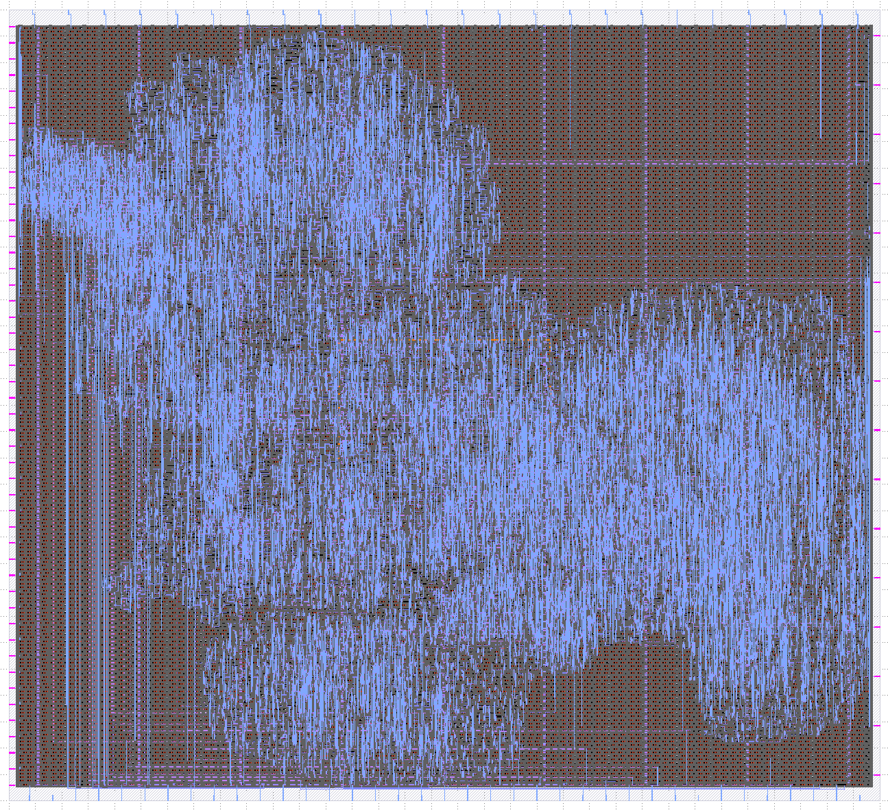

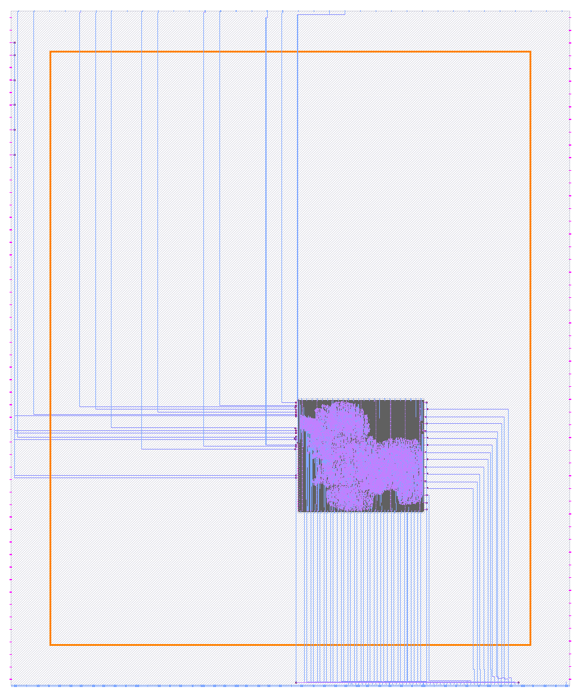

# at9

*   Portrait (vertical) orientation: 400x900
*   Plan for LHS placement
*   N: All IOs/zeros/ones
*   E: Most LAs
*   S: RGBs on left, low LAs on right
*   W: Nothing?
*   Check:
    *   `logs/signoff/34-antenna.log`
    *   `reports/signoff/25-rcx_sta.slew.rpt`
*   Result:
    *   TEA:
        *   GDS:
        *   Antenna step log: 1 iters, 8 remaining
        *   Antenna violations: count: 10 - worst: 1019/400 **(BAD!)**
        *   Fanout: count: 57 - worst: 25 (clkbuf) - avg: -8
        *   Slews: 0
        *   Caps: 0
    *   UPW:
        *   GDS:
        *   Antenna step log: nil
        *   Antenna violations: nil
        *   Fanout: 0
        *   Slews: 10 - most are LA -0.8, user_clock2=-0.17
        *   Caps: 10 - mostly same as slews, user_clock2=-0.05

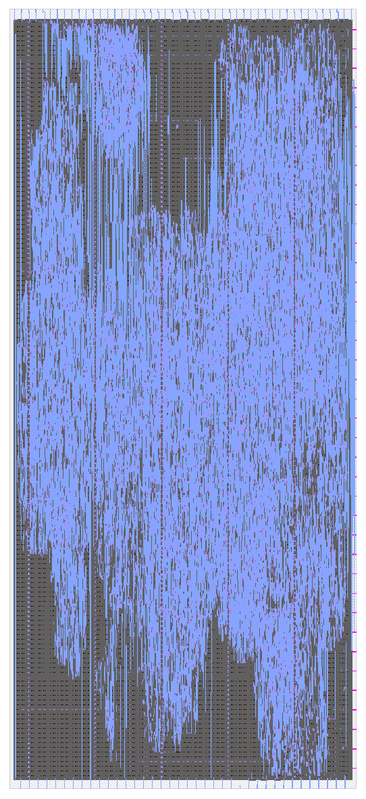

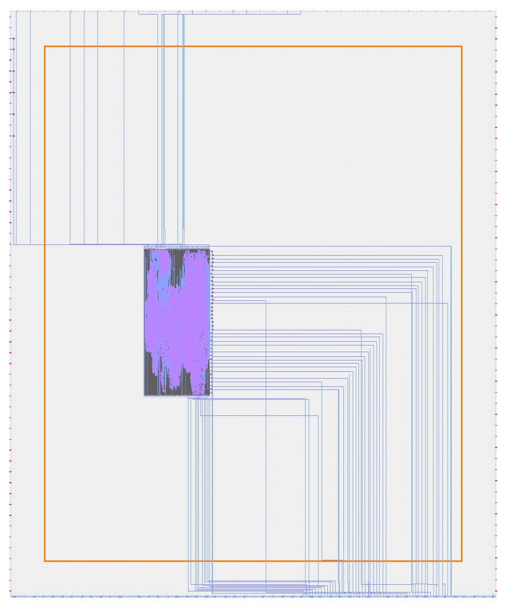

# at10

*   Let OpenLane choose its own size:
    ```json
    "FP_SIZING": "relative",
    "FP_CORE_UTIL": 45,
    "PL_TARGET_DENSITY": 0.55,
    ```
*   Keep pin placement as-is
*   Keep macro placement as-is
*   Check:
    *   `logs/signoff/34-antenna.log`
    *   `reports/signoff/25-rcx_sta.slew.rpt`
*   Result:
    *   TEA:
        *   Floorplanned 500x500um (exactly, on its own??)
        *   GDS:
        *   Antenna step log: 1 iters, 3 remaining
        *   Antenna violations: count: 8 - worst: 807/400 **(OK)**
        *   Fanout: count: 30 - worst: 20 (clkbuf) - avg: -5 **(OK)**
        *   Slews: 0
        *   Caps: 0
    *   UPW:
        *   GDS:
        *   Antenna step log: nil
        *   Antenna violations: nil
        *   Fanout: 0
        *   Slews: 3, io_in [25]=-1.22 [26]=-1.0 [22]=-0.11
        *   Caps: 3, io_in [25]=-0.3 [26]=-0.24 [22]=-0.05

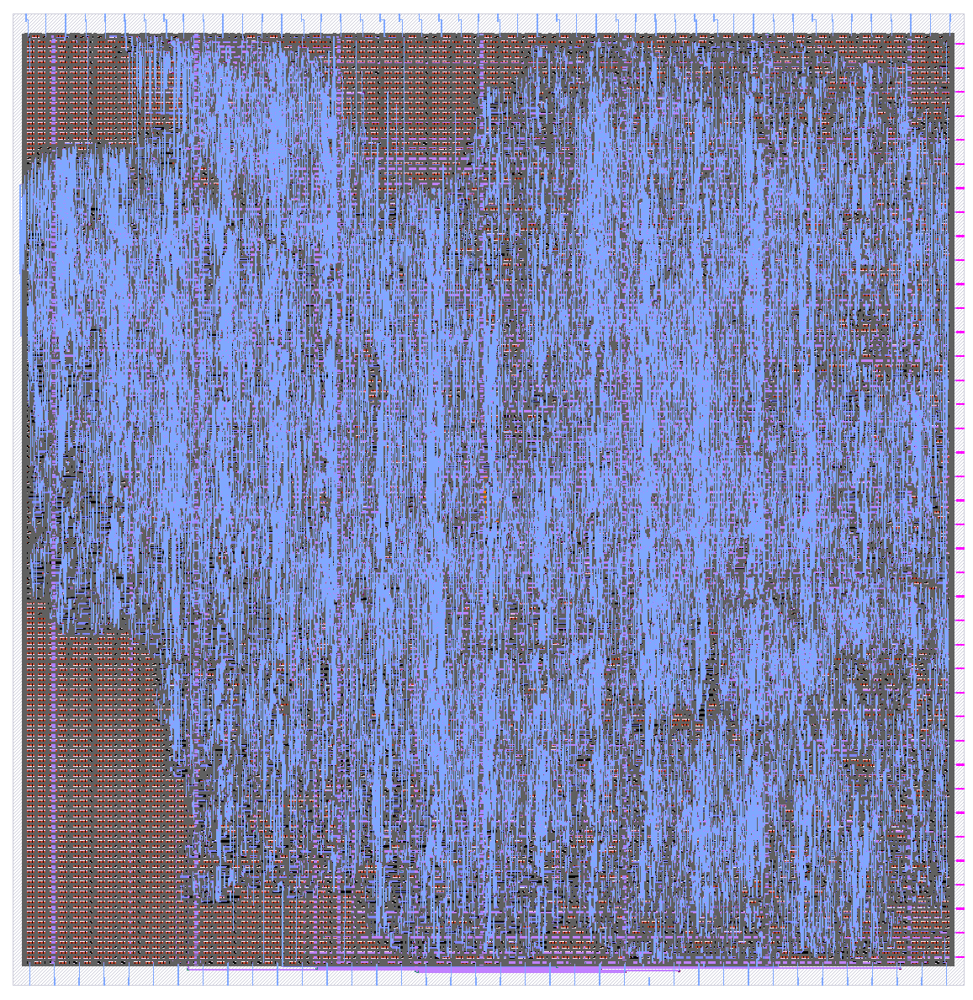

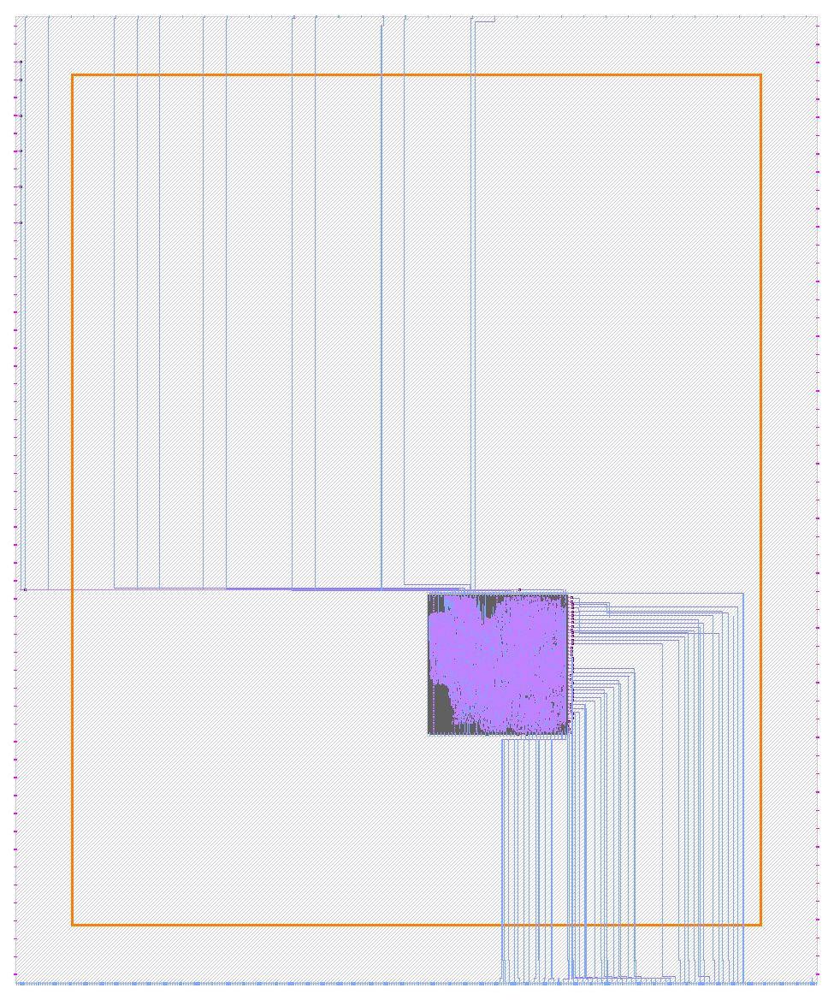

# at11

*   Squeeze at10 a little:
    *   FP_CORE_UTIL: 50
    *   PL_TARGET_DENSITY: 0.60
*   Move macro slightly left/up: (-200,+200)
*   **FAILED** with routing congestion:
    *   ```
        [STEP 12]
        [INFO]: Running Global Routing Resizer Timing Optimizations (log: ../home/zerotoasic/asic_tools/caravel_user_project/openlane-at11/top_ew_algofoogle/runs/23_10_30_16_42/logs/routing/12-resizer.log)...
        [ERROR]: during executing openroad script /openlane/scripts/openroad/resizer_routing_timing.tcl
        [ERROR]: Log: ../home/zerotoasic/asic_tools/caravel_user_project/openlane-at11/top_ew_algofoogle/runs/23_10_30_16_42/logs/routing/12-resizer.log
        [ERROR]: Last 10 lines:
        [INFO GRT-0101] Running extra iterations to remove overflow.
        [WARNING GRT-0227] Reached 20 congestion iterations with less than 15% of reduction between iterations.
        [INFO GRT-0197] Via related to pin nodes: 55540
        [INFO GRT-0198] Via related Steiner nodes: 172
        [INFO GRT-0199] Via filling finished.
        [INFO GRT-0111] Final number of vias: 66335
        [INFO GRT-0112] Final usage 3D: 269212
        [ERROR GRT-0118] Routing congestion too high. Check the congestion heatmap in the GUI.
        ```
    *   I tried these adjustments to help it out:
        ```json
        "GRT_OVERFLOW_ITERS": 60,
        "GRT_ANT_ITERS": 20,
        "GRT_MAX_DIODE_INS_ITERS": 10,
        "DRT_OPT_ITERS": 64,
        "ROUTING_OPT_ITERS": 64,
        "FP_CORE_UTIL": 48,
        "PL_TARGET_DENSITY": 0.56,
        ```
        NOTE: DRT_OPT_ITERS/ROUTING_OPT_ITERS must not exceed 64, or it fails [like this](https://github.com/The-OpenROAD-Project/OpenLane/issues/2029):
        ```
        [STEP 17]
        [INFO]: Running Detailed Routing (log: ../home/zerotoasic/asic_tools/caravel_user_project/openlane-at11/top_ew_algofoogle/runs/23_10_30_16_49/logs/routing/17-detailed.log)...
        [ERROR]: during executing openroad script /openlane/scripts/openroad/droute.tcl
        [ERROR]: Log: ../home/zerotoasic/asic_tools/caravel_user_project/openlane-at11/top_ew_algofoogle/runs/23_10_30_16_49/logs/routing/17-detailed.log
        [ERROR]: Last 10 lines:
        OpenROAD 7f00621cb612fd94e15b35790afe744c89d433a7 
        This program is licensed under the BSD-3 license. See the LICENSE file for details.
        Components of this program may be licensed under more restrictive licenses which must be honored.
        [INFO ORD-0030] Using 6 thread(s).
        Error: droute.tcl, 38 Wrong number of arguments :utl::warn tool id msg  argument 2
        ```
*   Check:
    *   `logs/signoff/34-antenna.log`
    *   `reports/signoff/25-rcx_sta.slew.rpt`
*   Result:
    *   TEA:
        *   GDS:
        *   Antenna step log: 0 iters
        *   Antenna violations: count: 8 - worst: 2423/400 **(BAD) -- but is this real or repaired??**
        *   Fanout: count: 38 - worst: 18 (clkbuf) - avg: -4 **(OK)**
        *   Slews: 0
        *   Caps: 0
    *   UPW:
        *   GDS:
        *   Antenna step log: nil
        *   Antenna violations: nil
        *   Fanout: 0
        *   Slews: 6 - io_in [25]=-0.93, [26]=-0.7, rest are LAs and <=-0.07
        *   Caps: 7 - io_in [25]=-0.23, [26]=-0.17, rest are LAs and <=-0.02

485x484um

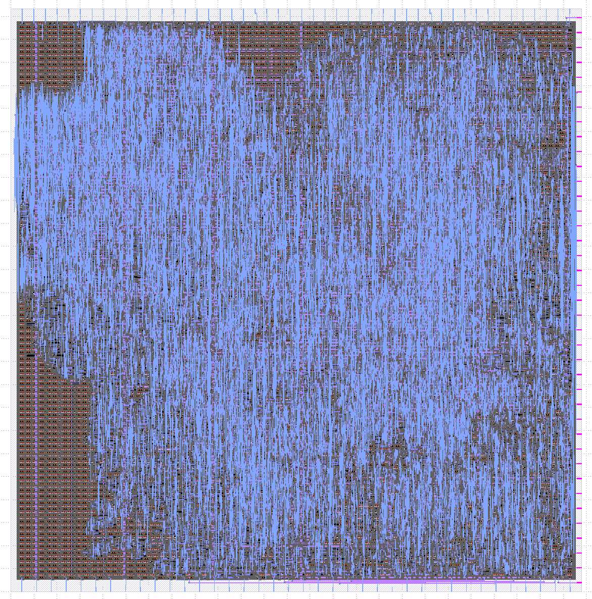

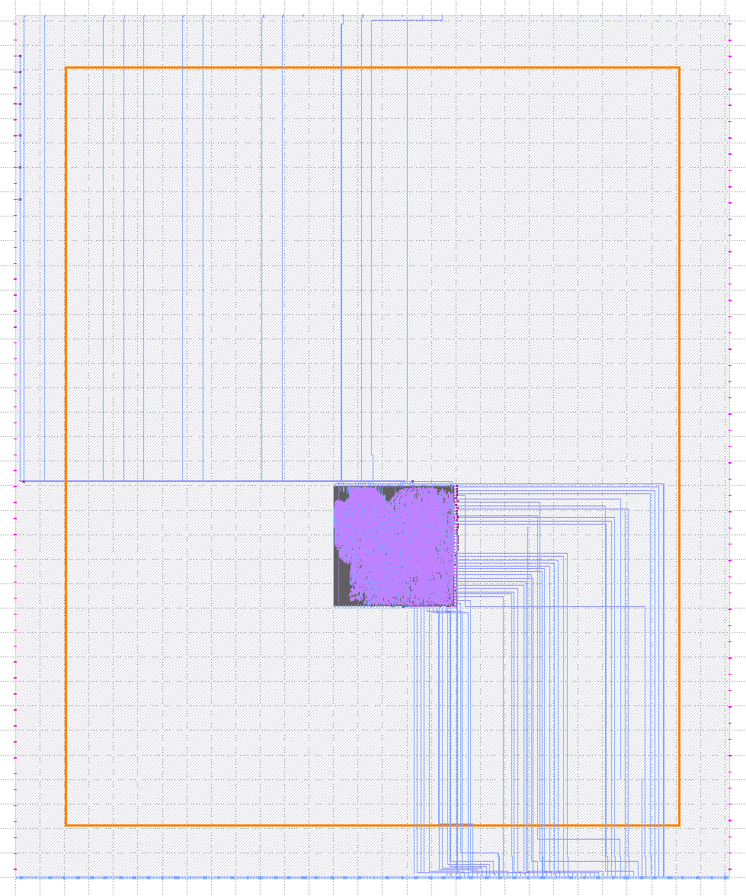


# at12

*   Remove routing iters and expand a bit:
    ```json
    "FP_SIZING": "relative",
    "FP_CORE_UTIL": 40,
    "PL_TARGET_DENSITY": 0.50,
    ```
*   Move placement a little more: (-200,+200):
    ```
    top_ew_algofoogle 1100 1300 N
    ```
*   Check:
    *   `logs/signoff/34-antenna.log`
    *   `reports/signoff/25-rcx_sta.slew.rpt`
*   Result:
    *   Floorplanned at 531x530um
    *   TEA:
        *   GDS:
        *   Antenna step log: 1 iters, 2 remaining
        *   Antenna violations: count: 9 - worst: 1495/400 **(?)**
        *   Fanout: count: 33 - worst: -8 (clkbuf, -6 on input) - avg: -4
        *   Slews: 0
        *   Caps: 0
    *   UPW:
        *   GDS:
        *   Antenna step log: nil
        *   Antenna violations: nil
        *   Fanout: 0
        *   Slews: 8 - io_in [25]=-0.55, [26]=-0.32
        *   Caps: 8 - io_in [25]=-0.13, [26]=-0.08
*   NOTE: UPW is getting better for IO slew/caps. LA is getting marginally worse, but probably doesn't matter...?

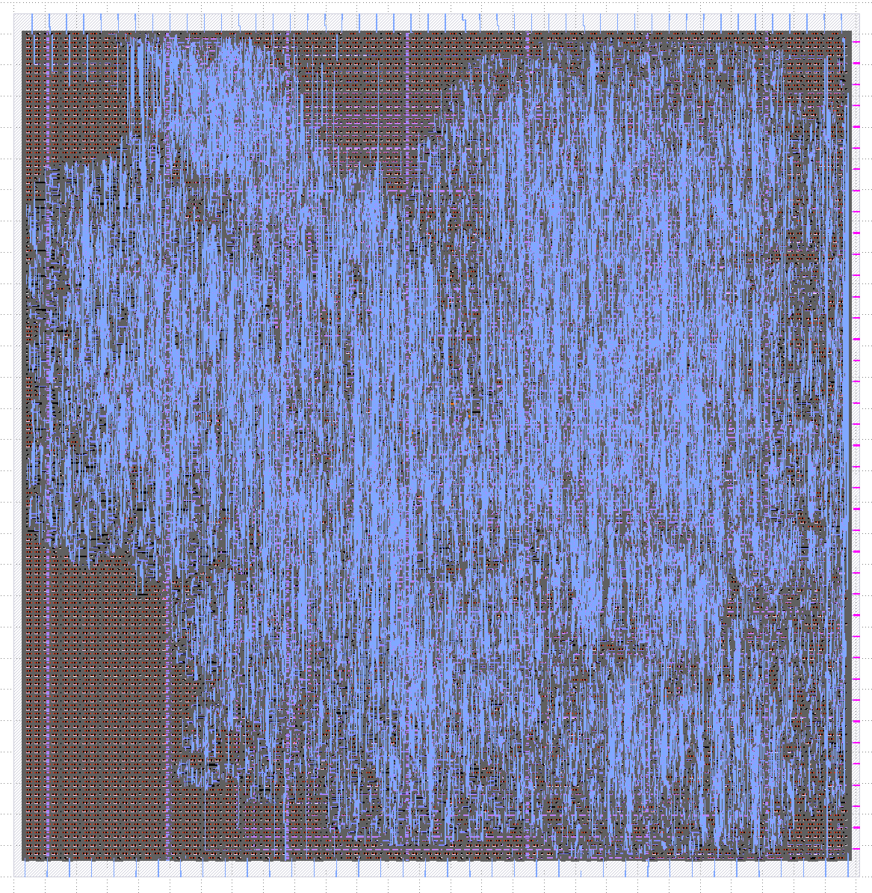

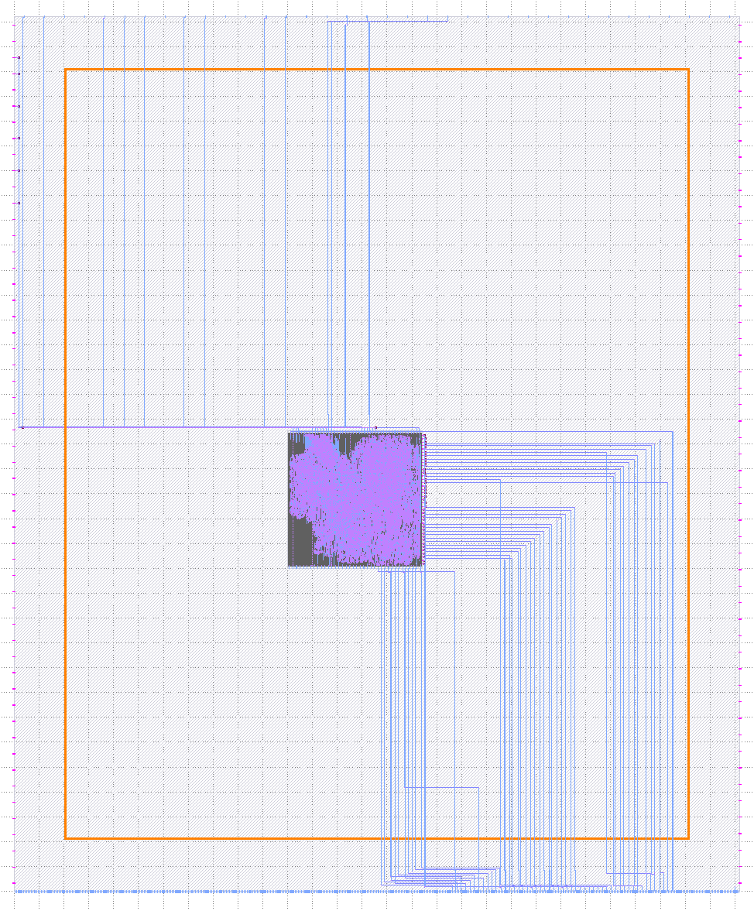


# at13

*   Go looser:
    ```json
    "FP_SIZING": "relative",
    "FP_CORE_UTIL": 35,
    // "PL_TARGET_DENSITY": 0.50, // Let OpenLane choose.
    ```
*   Move placement a little, just up now: (0,+200):
    ```
    top_ew_algofoogle 1100 1500 N
    ```
*   Check:
    *   `logs/signoff/34-antenna.log`
    *   `reports/signoff/25-rcx_sta.slew.rpt`
*   Result:
    *   Floorplanned: 568x566um
    *   TEA:
        *   GDS:
        *   Antenna step log: nil!
        *   Antenna violations: count: 9 - worst: 888/400 **(OK)**
        *   Fanout: count: 19 - worst: 21 (input43/X) - avg: -5
        *   Slews: 0
        *   Caps: 0
    *   UPW:
        *   GDS:
        *   Antenna step log: nil
        *   Antenna violations: count: nil
        *   Fanout: 0
        *   Slews: 9 - io_in[25]=-0.39, [26]=-0.15, user_clock2=-0.02
        *   Caps: 9 - io_in[25]=-0.09, [26]=-0.04, user_clock2=-0.01

**This is sort of looking the best so far.**

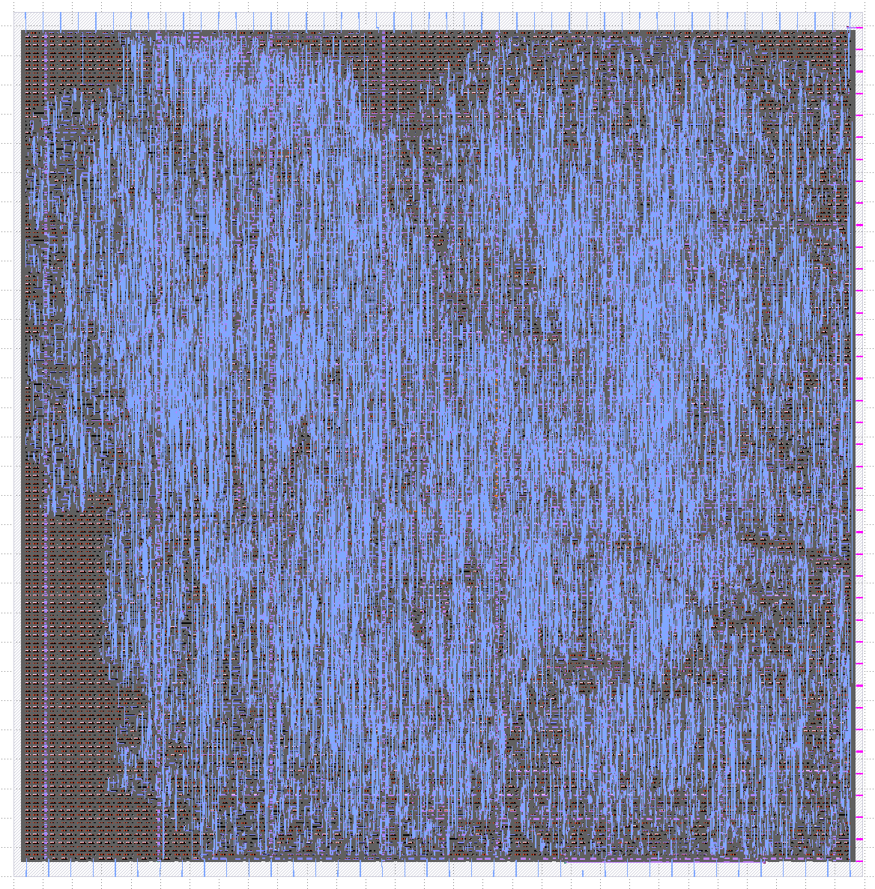

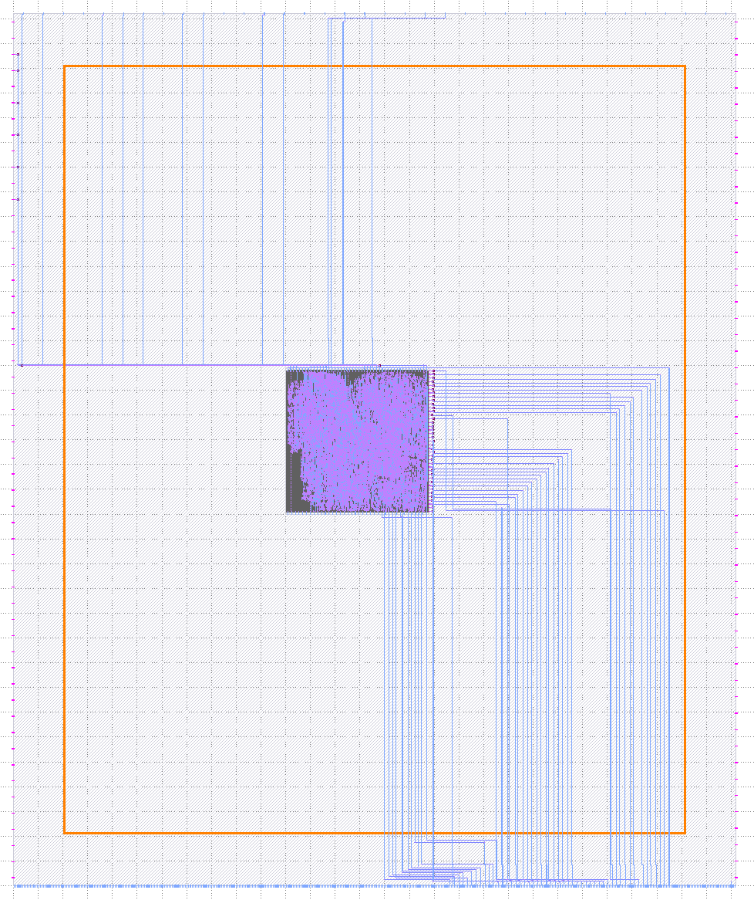


# at14

**NOT DONE YET**.

*   ???
*   Check:
    *   `logs/signoff/34-antenna.log`
    *   `reports/signoff/25-rcx_sta.slew.rpt`
*   Result:
    *   TEA:
        *   GDS:
        *   Antenna step log: X iters, X remaining
        *   Antenna violations: count: X - worst: X/400 **(?)**
        *   Fanout: count: X - worst: X (?) - avg: X
        *   Slews:
        *   Caps:
    *   UPW:
        *   GDS:
        *   Antenna step log:
        *   Antenna violations: count:  - worst:
        *   Fanout:
        *   Slews:
        *   Caps:

NOTE: A very tall macro would probably do it, placing LA/user_clock2 nearer the bottom-right, and IOs nearer the top-left.
