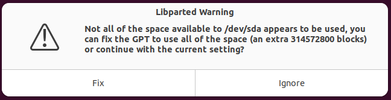

# 31 Oct 2023

| Previous journal: | Next journal: |
|-|-|
| [**0169**-2023-10-30.md](./0169-2023-10-30.md) | [**0171**-2023-11-03.md](./0171-2023-11-03.md) |

# top_ew_algofoogle next steps

# Next steps

*   Map out the days, inc. TT05
*   Go onto MPW9, clone Pawel's repo and try hardening and precheck
*   Harden my design with updated OL1.x and CUP -- use MPW9 VM maybe?
*   Update sim to use alternate clock and add on texture SPI ROM to TB
*   Maybe change `pin_order.cfg` and reharden to assume RHS placement with user_clock2, LAs, and IO[16:8]?
*   Try different hardening options with design exploration tool, e.g. reduced util (30%, 25%, 20%?)
*   Check: Does SCLK (inverted clock) get CTS?
*   Try analog DAC
*   Do more reading on clocks (as promised) esp. user_clock2
*   Test whether user_clock2 can be disabled or adjusted by firmware -- should be possible to sim?? Unless the DLL/PLL itself is not fully simulated.
*   For MPW9 VM, do a variation on [OL switching helpers](https://github.com/algofoogle/journal/blob/master/0133-2023-08-26.md#setup-for-openlane-switching-and-local-tiny-tapeout-hardening) changing step 6 to use `-b tt05` instead of `-b tt04`, and perhaps replacing the sourcett04 config with sourcett05 when we know what it is (though it might be the same).


# DAC implementation

*   Since the DAC will be a resistor chain from VCC to VSS (?), it would be nice if we have a way to disable it.
*   One method that comes to mind is to use a FET in series to VCC, and another FET in series to GND, and have them controlled by opposite logic coming from low bits of the colour channels (i.e. recycle RGB pins that are otherwise unused).

# Registered outputs

*   `anton_la_in[50]` (`la_data_in[114]`) should default to 0, and this enables registered video outputs.
*   I did it only on video signals, because they're probably more obvious on screen (and potentially more volatile).
*   I don't think it's necessary on the SPI controller for texture memory:
    *   It probably wouldn't work on SCLK (from inverted CLK).
    *   SCLK is unlikely to glitch because it comes directly from inversion of the system clock, without any other combo logic?
    *   Glitches on MOSI don't matter; it'll be stable by the time it's sampled.
    *   Hmm, what about /CS? That could glitch as we move thru the combo logic states.
    *   I don't want to risk putting regs on it for now (and introducing extra delays in a mux). If we have glitches, maybe we can solve them with filtering externally?

# Done

1.  Q11.11
2.  Bitwise texture select via mode[2]
3.  Map debug overlay
4.  Map dividers (X and Y)
5.  4x texture address addends
6.  Sim support for 2, 3, 4
7.  Mainlined ew-snippet2-test
8.  PicoDeo reg SPI support (/rbzreg)
9.  raybox-game /rbzreg support
10. Trace debug overlay
11. Un/Registered outputs option

# Texture addends

*   4x texture address addends
*   Texture address range is currently:
    *   4 walls
    *   2 sides
    *   64x64 pixels
    *   Each pixel is currently 1 byte
    *   Total: 32kB
    *   Address range is: 15 bits.
*   Currently done as a full 24-bit addend for each
*   We *could* do 4x24-bit (96 bits, but x2 for double-buffering), or don't worry about lower 6 bits (texv), and limit ourselves to 4MB RAM: i.e. addend range is [21:6] (16 bits) (64 bits, or 128 if double-buffered).

# Outstanding

*   4x texture slide for U/V:
    *   vshift sort of already done GLOBALLY but 'top edge' glitches lower
*   Loop back gpout5 to new anton_la[51]
    *   The intent was to make a way to select one of the signals (via gpout5) that the firmware could *monitor* (non-realtime, though).
    *   In particular, this could be used to sense when we're in vblank.
    *   An alternative, though, is to tie VSYNC (externally) to the SoC external IRQ, and just respond to that. Should be good enough?
*   Decide: user_clock2, or io_in[35]?
*   vshift 'top edge glitch drift' fix
*   Testing of SPI via LA/firmware
*   Map memory


## PR for ew-snippet2-test

*   SNIPPET2 will be the default now.
*   `ew` has been updated with new raybox-zero Verilog and hence new top_ew_algofoogle harden too (but also UPW harden)
*   We want `ew` merged into ew-snippet2-test, then merged back into `ew` and closed off (via PR)
*   Issue is that ew-snippet2-test has its own divergent changes in UPW GDS, but we don't want THAT anymore anyway.
*   Procedure:
    1.  Go to `ew-snippet2-test` in GitHub
    2.  Open PR
    3.  See that it reports merge conflicts must be resolved manually
    4.  ```bash
        cd ~/CUP
        git checkout ew && git pull
        git checkout ew-snippet2-test && git pull
        git merge ew  # Causes merge conflicts, but hopefully only on UPW files.
        ```
    5.  Delete stuff we will rebuild:
        ```bash
        rm def/user_project_wrapper.def
        rm gds/user_project_wrapper.gds.gz
        rm lef/user_project_wrapper.lef
        rm mag/user_project_wrapper.mag
        rm maglef/user_project_wrapper.mag
        rm signoff/user_project_wrapper/metrics.csv
        ```
    6.  Re-harden UPW:
        ```bash
        gunzip gds/top_ew_algofoogle.gds.gz  # Needed for next step.
        make user_project_wrapper  # Rebuild UPW GDS and other supporting files.
        make compress
        ```
    7.  Run coco_test_gl to make sure it's using the updated code (showing map, now with some colour):
        ```bash
        cd ~/CUP/verilog/dv/rbz_basic
        make coco_test_gl
        # View rbz_basic_frame0.ppm to see result
        ```
    8.  Add previously-conflicting files:
        ```bash
        git add def/user_project_wrapper.def
        git add gds/user_project_wrapper.gds.gz
        git add lef/user_project_wrapper.lef
        git add mag/user_project_wrapper.mag
        git add maglef/user_project_wrapper.mag
        git add signoff/user_project_wrapper/metrics.csv
        ```
    9.  Do a commit, push, then go back to complete PR.
    10. `git checkout ew && git pull`
    11. Delete old branch: `git branch -d ew-snippet2-test`

    
# Q11.11 and gen_tex on mode[2]

*   Test in sim:
    *   Works: Q11.11 seemingly fine. F11 toggles gen_tex (tho still no texture memory sim yet)
    *   coco_test works fine
    *   coco_test_gl shows that it *doesn't work if the macro/GL-netlist is not rebuilt* (to be expected) but does work after `make top_ew_algofoogle`
        *   NOTE: GDS harden results with this changed RTL, using at13 config still:
            *   Floorplanned area: 543x541um -- reduced probably by Q11.11 instead of Q12.12
            *   Check:
                *   `logs/signoff/34-antenna.log`
                *   `reports/signoff/25-rcx_sta.slew.rpt`
            *   Result:
                *   TEA:
                    *   Antenna step log: 1 iters, 1 remaining
                    *   Antenna violations: count: 9 - worst: 528/400 **(GOOD)**
                    *   Fanout: count: 32 - worst: 18 (clkbuf) - avg: -4
                    *   Slews: 0
                    *   Caps: 0
*   Test in GL:
    *   Check status of ew-snippet2-test
    *   Check diff of ew-snippet2-test..ew
    *   git co ew
    *   Pull latest raybox-zero
    *   Test without changing mode[2] -- should default to 0
    *   Update firmware to assert mode[2]=1
    *   If all OK, do `make top_ew_algofoogle` then try `coco_test_gl`
*   Make a firmware/cocotb test that switches mode[2] after first full frame (await vsync? would need it as LA input; feed gpout5 back into LA for testing?)


# MPW9 VM

1.  File => Import Appliance
2.  Use Advanced/Expert mode
    1.  Increase CPUs to 8
    2.  Disable audio
3.  Other settings after import:
    1.  Disable Drag'n'Drop
    2.  3D acceleration
    3.  Shared folder: HOST_Documents
4.  Increase disk (virtual hardware; host-side)
    1.  File => Tools => Virtual Media Manager
    2.  Select ztoa_mpw9-disk001.vdi
    3.  Increase to 200GB
5.  Boot VM and do Software Update. Reboot when required.
6.  Resize disk (guest side)
    1.  `sudo apt update`
    2.  `sudo apt install gparted`
    3.  `gparted`
    4.  Prompt about not all space being used:
        
    5.  Click 'Fix'
    6.  Don't resize yet. Instead, reboot
    7.  Now we can go into 'Disks' and use it to resize the partition (Partition 3 in this case).
    8.  Power off, then power on again.
    9.  Run `df -h` to verify ~150GB free.
7.  Do [other improvements per 0133](./0133-2023-08-26.md#extra-settings), but starting with step 3 (skip 1 and 2).
8.  `sudo apt install htop`
9.  First snapshot: 'Base system 0170' and link back to this section.
10. Add user to groups:
    ```bash
    sudo adduser zerotoasic dialout
    sudo adduser zerotoasic vboxsf   # probably already done
    ```
11. ```bash
    cd ~
    ln -s /media/sf_HOST_Documents/ HOST_Documents
    ls -al ~/HOST_Documents/
    ln -s ~/asic_tools/caravel_user_project/ ~/CUP
    cd ~/CUP
    git log -1   # Commit 1cbe00a from 2023-10-23
    cd $OPENLANE_ROOT
    git log -1   # Commit d054702 from 2023-07-19 (tag 2023.07.19)
    cd ~
    mkdir anton && cd anton
    git clone git@github.com:algofoogle/journal
    ```
12. Go to 'Settings' => Keyboard, then remove 'English (UK)'
13. Do `git config --global --edit`
14. Do [VSCode setup](https://github.com/algofoogle/journal/blob/master/0133-2023-08-26.md#vscode) -- just use `code ~/anton/journal` instead of what the steps say in step 2.
15. In (Gnome) Terminal go to hamburger menu => Preferences => General => Uncheck 'Enable the menu accelerator key (F10 by default)'
16. Shut down and set video RAM to 256MB. On Windows host:
    ```ps
    VBoxManage list vms  # Find the correct VM name and use it below
    VBoxManage modifyvm ztoa_mpw9 --vram 256   # Will give an error above this
    ```
    NOTE: To check this config, a simple way is: `VBoxManage showvminfo ztoa_mpw9 | head -20`
17. Snapshot: 'VSCode ready 0170'


# Check MPW9 performance

*   Comments on Ubuntu 22 slow as a VM re 3D acceleration *prior* to installing: https://askubuntu.com/questions/1426963/ubuntu-22-04-22-10-on-virtual-machine-is-extremely-slow-same-behaviour-on-vmw
*   Logs
*   Drag'n'Drop
*   Load average; Hanging aruond 1.3~2 without doing anything??
*   Reinstall Guest Additions
*   System Monitor (Activity)
*   Does VSCode itself just run slowly, or slow everything down? How much CPU load does it cause for 'normal' stuff? Does disabling extensions help?


# Anton's question about `la_oenb` and `la_data_out` safety

I asked this in the Discord; haven't had a reply yet:

>   With the SoC Logic Analyser pins, can my design *always* drive `la_data_out` lines (even if doing so disagrees with what `la_oenb` says)?
>   
>   In other words, if the SoC is driving an `la_data_in` line at the same time that my design is driving the equivalent `la_data_out`, will there be contention, or will the signal that I'm driving just be disconnected while `la_oenb[x]==0`?
>   
>   For example, I assume that the design of the LA pins on the SoC side will safely disconnect an `la_data_out` signal while it is asserting an `la_oenb==0`, in which case my design can simply be the following, and there will be no risk of contention/short, even if the SoC has the `la_oenb` misconfigured:
>   ```verilog
>   // --- my_la_example.v ---
>   // My design to be instantiated:
>   module my_la_example(output la_out);  assign la_out = SOMEVALUE;  endmodule
>
>   // --- Snippet inside user_project_wrapper ---
>   my_la_example my_la_example(.la_out(la_data_out[0]));
>   ```
>
>   However, if my assumption is wrong, then I think I would need to make my design defensive and *respect* `la_oenb` as follows:
>   ```verilog
>   // --- my_la_example.v ---
>   // My design to be instantiated:
>   module my_la_example(input la_oenb, output la_out);
>       assign la_out = (la_oenb==0) ? 1'bz : SOMEVALUE;
>   endmodule
>   
>   // --- Snippet inside user_project_wrapper ---
>   my_la_example my_la_example(.la_oenb(la_oenb[0]), .la_out(la_data_out[0]));
>   ```

# Disabling user_clock2

This seems to disable `user_clock2`, but I don't know why:

```c
reg_hkspi_pll_ena = 1;
reg_hkspi_pll_bypass = 0;
reg_hkspi_pll_source = 0b00001111; // This line in particular?
```

Alternative (lines 2 and 3 swapped) that doesn't seem to make `wb_clk_i` race, but *does* seem to glitch the clocks for a moment:

```c
reg_hkspi_pll_ena = 1;
reg_hkspi_pll_source = 0b00001111;
reg_hkspi_pll_bypass = 0;
```

Both seem to stop `user_clock2` completely, and keep `wb_clk_i` running, *albeit at a very slightly lower frequency*.
