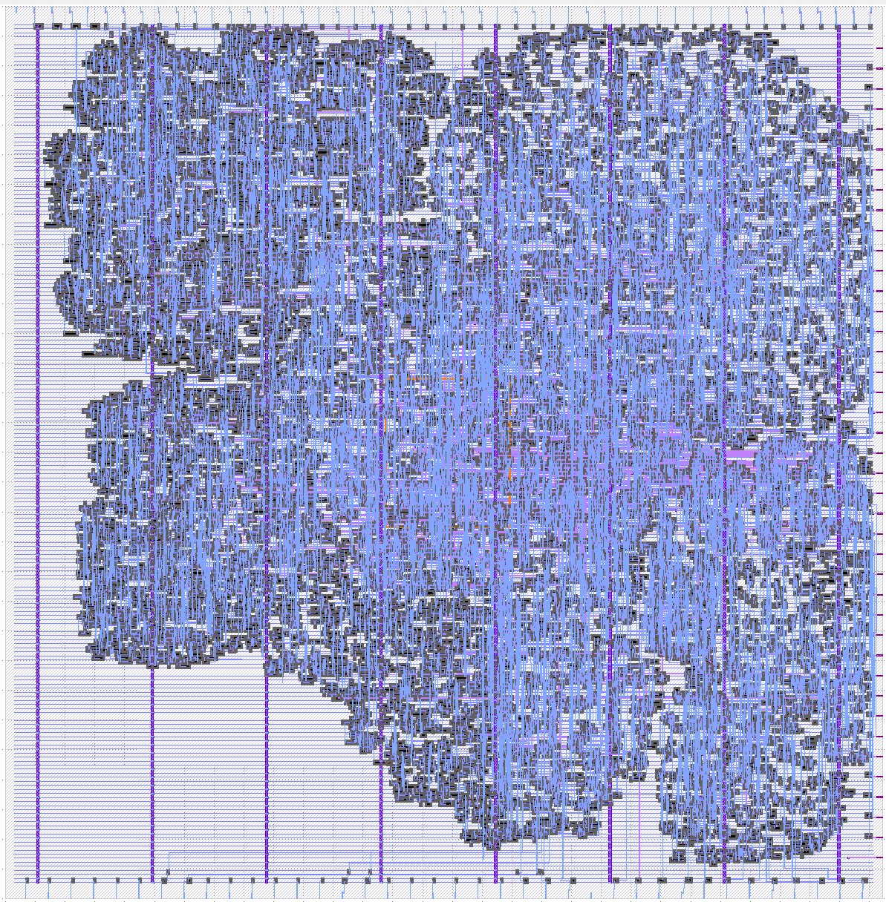

# 3 Nov 2023

| Previous journal: | Next journal: |
|-|-|
| [**0170**-2023-10-31.md](./0170-2023-10-31.md) | *Next journal TBA* |

# Getting down to the final steps for chipIgnite

# Anton's checks of Pawel's repo and hardening

I've gone thru [caravel-sky130-opamp-cascode@raybox_and_mixed](https://github.com/embelon/caravel-sky130-opamp-cascode/tree/raybox_and_mixed) as best I can.

I think my UPW snippet, user_defines, GDS/LEF/DEF, netlist, etc. are all correct in Pawel's repo, for the current version of my design.

I only have the following observations:

1.  ~~I've done a [PR to change user_defines for reserved SoC pads](https://github.com/embelon/caravel-sky130-opamp-cascode/pull/1). Waiting on approval from Ellen and Pawel.~~
    *   **OK:** Pawel merged it.
2.  Ellen should just check, re user_defines: Do you actually intend to [make your PWM pins bidirectional and *also under MGMT control instead of USER design* by default](https://github.com/embelon/caravel-sky130-opamp-cascode/blob/d1d74e1ac4fedd3f56e86329bf6809208481407f/verilog/rtl/user_defines.v#L80-L82)? This is probably fine (and easily changed by firmware as required), but thought I'd check.
    *   **OK; TBA: Ellen will check this later, but it's not critical;** firmware can easily change it if necessary, at boot.
3.  `analog_io[4]` is not connected, neither is its corresponding digital[11]. Likewise, there is no `io_oeb[11]`. Is this intentional? [It was flagged as `bandgap` by Ellen originally](./0165-2023-10-24.md#ew-pin-allocation).
    *   **OK; TBA:** Ellen confirmed that this is no longer needed and so is a free pin. Anton will try using this as his clock pin instead of the internal `user_clock2`. Anton might still route `user_clock2` out as a gpout, to do experiments with it.
4.  Ellen's `top_mixed` has a port for `wb_sel_i`, but from what I can tell there are no pins for this in the GDS. I'm guessing this is not actually used by Ellen's design? I discovered this because I looked in `runs/*/logs/floorplan/3-initial_fp.log` and saw this warning:
    ```
    [WARNING STA-0201] /home/.../caravel-sky130-opamp-cascode/openlane/user_project_wrapper/runs/23_11_02_11_42/results/synthesis/user_project_wrapper.v line 268, instance top_mixed port wbs_sel_i not found.
    ```
    This shows up also in `runs/*/logs/signoff/29-user_project_wrapper.lef.lvs.log`:
    ```
    Cell user_project_wrapper (0) disconnected node: wbs_sel_i[0]
    Cell user_project_wrapper (0) disconnected node: wbs_sel_i[1]
    Cell user_project_wrapper (0) disconnected node: wbs_sel_i[2]
    Cell user_project_wrapper (0) disconnected node: wbs_sel_i[3]
    ```
    *   **OK:** `wb_sel_i` is present in the code, but may not be required by Ellen anymore.
5.  ~~Looking at the final UPW (user_project_wrapper) GDS, there doesn't seem to really be anything in the analog region of Ellen's design, but maybe that's more private and going to be dropped in later?~~
    *   **OK:** To be expected, at the time of writing. WIP from Ellen.
6.  ~~config.json: I have no idea if this matters, but the main [user_project_wrapper config.json sets CLOCK_NET](https://github.com/embelon/caravel-sky130-opamp-cascode/blob/d1d74e1ac4fedd3f56e86329bf6809208481407f/openlane/user_project_wrapper/config.json#L10C19-L10C32) to `top_mixed.clk`, but that's not the name of the net...? I think it's `top_mixed.wb_clock_i`?~~
    *   **OK:** Pawel has [updated this](https://github.com/embelon/Silicon_Contact_3GBT/blob/dfcceb1e70b3a6f2a5fa34e9ac2d43633edb713a/openlane/user_project_wrapper/config.json#L9-L13). I didn't know you could specify multiple clock nets this way :smile:
7.  ~~config.json: [top_mixed PDN uses `vccd1 vssd1`](https://github.com/embelon/caravel-sky130-opamp-cascode/blob/d1d74e1ac4fedd3f56e86329bf6809208481407f/openlane/user_project_wrapper/config.json#L13) where [Pawel's opamp uses `VCC VSS`](https://github.com/embelon/caravel-sky130-opamp-cascode/blob/d1d74e1ac4fedd3f56e86329bf6809208481407f/openlane/user_project_wrapper/config.json#L15) - Is that correct?~~
    *   **OK:** Pawel confirmed this is OK.
8.  config.json: [VERILOG_FILES_BLACKBOX is using some files from `gl/` and others from `rtl/`](https://github.com/embelon/caravel-sky130-opamp-cascode/blob/d1d74e1ac4fedd3f56e86329bf6809208481407f/openlane/user_project_wrapper/config.json#L19-L24) - I assume this is OK? The copy of my `gl/top_ew_algofoogle.v` port list in Pawel's repo looks correct anyway.
    *   **OK; TBA:** This might get updated later when all GL netlists are available.
9.  config.json: Ellen's design is [not featured in EXTRA_LIBS and EXTRA_SPEFS](https://github.com/embelon/caravel-sky130-opamp-cascode/blob/d1d74e1ac4fedd3f56e86329bf6809208481407f/openlane/user_project_wrapper/config.json#L37-L45) - Is that OK?
    *   **OK; TBA:** Coming later when analog part is all finished.
10. UPW's [metrics.csv](https://raw.githubusercontent.com/embelon/caravel-sky130-opamp-cascode/raybox_and_mixed/signoff/user_project_wrapper/metrics.csv) reports antenna violations:
    ```
    pin_antenna_violations  73
    net_antenna_violations  72
    ```
    I think these are all listed in `runs/*/logs/signoff/31-arc.log` and `runs/*/reports/signoff/31-antenna_violators.rpt`
    *   **TODO: Check latest results using new repo.**
5.  ~~Tests in [verilog/dv/rbz_basic](https://github.com/embelon/caravel-sky130-opamp-cascode/tree/raybox_and_mixed/verilog/dv/rbz_basic) are old versions (i.e. without shared inputs), but I don't suppose this matters. If the latest versions are needed, they are [here](https://github.com/algofoogle/raybox-zero-caravel/tree/ew/verilog/dv/rbz_basic)~~
    *   **OK:** Pawel has updated them.


# Anton's rough notes of the things he checked (more just for his own record)

*   I tried so many different hardens with the MPW9 CUP, but couldn't eliminate hold violations. All seemed to be stemming from LA pins. Not sure if this will end up being an issue but I had to abandon the [`ew-mpw9` branch](https://github.com/algofoogle/raybox-zero-caravel/tree/ew-mpw9) for now. I reverted back to using the MPW8 methods.
*   [Firmware samples for Matt to test PLL behaviour](https://discord.com/channels/778248761054986292/863022759428751360/1169751449534738433):
    >   Here's one that I think will do the trick: https://github.com/algofoogle/raybox-zero-caravel/blob/ew/verilog/dv/blink_pll/blink_pll.c
    >   
    >   From reset, this should blink the GPIO 4 times quickly, then 4 times slowly, then change the PLL, and hopefully then just keep blinking forever slowly. I don't know what delay value to put in for `w = ...` on lines 19, 26, and 40 (depends on your input clock speed I guess) but for 25MHz these are probably good for seeing the result visually :slight_smile:
    >   
    >   If you wouldn't mind trying to run that, and reset a few times to make sure it is consistent, that will be very helpful! 
    >   
    >   Then there is one more variation, and that is to replace lines 34..37 with this, and again try a few resets to see if it gives consistent results:
    >   ```c
    >   reg_hkspi_pll_ena = 1;
    >   reg_hkspi_pll_source = 0b00001111;
    >   reg_hkspi_pll_bypass = 0;
    >   ```
    >   
    >   From simulation, that latter example is more likely to lock up the PLL, because it seems to glitch the core clock.
    **Matt has confirmed:** On his chip, both variants blink the GPIO as expected, and they do NOT lock up the SoC and show consistent behaviour after a few resets.
*   Checked out [my fork](https://github.com/algofoogle/caravel-sky130-opamp-cascode/tree/raybox_and_mixed) of [caravel-sky130-opamp-cascode@raybox_and_mixed](https://github.com/embelon/caravel-sky130-opamp-cascode/tree/raybox_and_mixed), switched to `raybox_and_mixed` branch, and checked the following:
    *   Essential files:
        ```
        $ md5sum gds/top_ew_algofoogle.gds lef/top_ew_algofoogle.lef def/top_ew_algofoogle.def verilog/gl/top_ew_algofoogle.nl.v verilog/gl/top_ew_algofoogle.v 
        fe073a8249e71319f22894dfc87e63f8  gds/top_ew_algofoogle.gds
        25c250c94a75450116426b603ee892d9  lef/top_ew_algofoogle.lef
        f5bc8e16b5becc9a7e22aae3a40a0f2d  def/top_ew_algofoogle.def
        7240d85e21422be6080e7d13576ea19d  verilog/gl/top_ew_algofoogle.nl.v
        9d402165073e8a563e661ae8bb205be3  verilog/gl/top_ew_algofoogle.v
        ```
        These match all the latest files in my own repo.
    *   SNIPPET2_ShareIns.v snippet [in user_project_wrapper](https://github.com/embelon/caravel-sky130-opamp-cascode/blob/d1d74e1ac4fedd3f56e86329bf6809208481407f/verilog/rtl/user_project_wrapper.v#L165-L255) seems to match [my latest version](https://github.com/algofoogle/raybox-zero/blob/11f14a8eea395e571ca5be0ddf9380b064d072ec/src/rtl/ew_caravel_snippets/SNIPPET2_ShareIns.v)
    *   [user_defines.v](https://github.com/embelon/caravel-sky130-opamp-cascode/blob/raybox_and_mixed/verilog/rtl/user_defines.v):
        *   Generally seems correct, other than my PR to change the SoC pins' defaults.
        *   **Just get Ellen to check** that [putting the PWM pins under MGMT control by default](https://github.com/embelon/caravel-sky130-opamp-cascode/blob/d1d74e1ac4fedd3f56e86329bf6809208481407f/verilog/rtl/user_defines.v#L80-L82) is intended.
    *   [includes.rtl.caravel_user_project](https://github.com/embelon/caravel-sky130-opamp-cascode/blob/raybox_and_mixed/verilog/includes/includes.rtl.caravel_user_project) does not include Anton's and Ellen's designs, but I think this is correct: This file is just to harden Pawel's own macro.
    *   user_project_wrapper.v:
        *   Check:
            *   Pin assignments: No gaps or overlaps?
            *   OEBs and I-vs-O directions seem sensible?
        *   Findings:
            *   Generally all appears fine to me, except...
            *   **analog_io[4] is not connected, and neither is its corresponding digital pin (io[11]).**
    *   Compare top_ew_algofoogle.v:
        *   Pawel's blackboxed version matches my own source version.
    *   I'm not sure what's meant to be in `uprj_netlists.v` -- I haven't used it before, and a year ago there was talk of it having become irrelevant (i.e. because the `includes` now replace it?)
    *   Tests in [verilog/dv/rbz_basic](https://github.com/embelon/caravel-sky130-opamp-cascode/tree/raybox_and_mixed/verilog/dv/rbz_basic) are old versions (i.e. without shared inputs), but I don't suppose this matters. If the latest versions are needed, they are [here](https://github.com/algofoogle/raybox-zero-caravel/tree/ew/verilog/dv/rbz_basic)
    *   Check [config.json for UPW](https://github.com/embelon/caravel-sky130-opamp-cascode/blob/raybox_and_mixed/openlane/user_project_wrapper/config.json)
    *   I have no idea if this matters, but the main [user_project_wrapper config.json sets CLOCK_NET to top_mixed.clk](https://github.com/embelon/caravel-sky130-opamp-cascode/blob/d1d74e1ac4fedd3f56e86329bf6809208481407f/openlane/user_project_wrapper/config.json#L10C19-L10C32), but that's not the name of the net...? I think it's `top_mixed.wb_clock_i`?
        *   [top_mixed PDN uses `vccd1 and vssd1`](https://github.com/embelon/caravel-sky130-opamp-cascode/blob/d1d74e1ac4fedd3f56e86329bf6809208481407f/openlane/user_project_wrapper/config.json#L13) where [Pawel's opamp uses VCC and VSS](https://github.com/embelon/caravel-sky130-opamp-cascode/blob/d1d74e1ac4fedd3f56e86329bf6809208481407f/openlane/user_project_wrapper/config.json#L15) - Is that correct?
        *   [VERILOG_FILES_BLACKBOX is using some files from `gl/` and others from `rtl/`](https://github.com/embelon/caravel-sky130-opamp-cascode/blob/d1d74e1ac4fedd3f56e86329bf6809208481407f/openlane/user_project_wrapper/config.json#L19-L24) - I assume this is OK? My `gl/top_ew_algofoogle.v` port list looks correct in the repo anyway.
        *   Ellen's design is [not featured in EXTRA_LIBS and EXTRA_SPEFS](https://github.com/embelon/caravel-sky130-opamp-cascode/blob/d1d74e1ac4fedd3f56e86329bf6809208481407f/openlane/user_project_wrapper/config.json#L37-L45) - Is that OK?
    *   Review harden reports (fanout/cap/slew, antennas and pre-check)
*   [metrics.csv](https://raw.githubusercontent.com/embelon/caravel-sky130-opamp-cascode/raybox_and_mixed/signoff/user_project_wrapper/metrics.csv) reports antenna violations:
    ```
    pin_antenna_violations  73
    net_antenna_violations  72
    ```

# In progress

*   [`ew-wbclk` branch](https://github.com/algofoogle/raybox-zero-caravel/tree/ew-wbclk) as has an option to feed `wb_clk_i` back out via gpout[1]:alt.
    *   [Harden was successful](https://github.com/algofoogle/raybox-zero-caravel/commit/f990f46bb19d5949e0304e0323ee7c8e5b52897b), of top_ew_algofoogle and UPW using this. Good to know: This has less-aggressive antenna violations (all under 2x). It also seems to have slightly better fanout figures (31 violations, worst is 17, average is -3).
    *   Seeking approval from Ellen/John to use it.
    *   In the spirit of "what could go wrong?" -- (a) The extra load from my mux could skew it? (b) The capacitance of the extra wire could also skew it, or at least throw off STA? (c) Could my design cause any noise on it?
    *   If we use it, provide an easy checklist for Pawel to patch it in.
*   Try updating raybox-zero-caravel to MPW9's commit number, then try harden again. Expect some merge conflicts...
    *   First part: starting `ew-mpw9` branch; updating from efabless to match MPW9 VM's CUP commit; fixing merge conflicts; starting harden (prior to committing the updates, given all the deleted old GDS/LEF/etc files)...
        ```bash
        cd ~/asic_tools
        rm caravel_user_project # symlink
        cd CUP-MPW9-Original
        git log -1
        # commit b8efc55a816c11c27d0c363014c5213573b325c2 (HEAD, origin/main, origin/HEAD, main)
        # Merge: 1cbe00a e59ff93
        # Author: Jeff DiCorpo <42048757+jeffdi@users.noreply.github.com>
        # Date:   Mon Oct 23 07:58:40 2023 -0700
        #     Merge pull request #309 from efabless/gl_sim_updates
        #     update includes and documentaion for GL sim
        cd ~/asic_tools
        git clone git@github.com:algofoogle/raybox-zero-caravel
        ln -s raybox-zero-caravel caravel_user_project
        # ln -s caravel_user_project ~/CUP  # --- already done
        cd ~/CUP
        git remote add efabless https://github.com/efabless/caravel_user_project
        git fetch efabless
        git remote
        git branch -a
        git checkout ew
        git checkout -b ew-mpw9
        git merge b8efc55
        # === NOW FIX MERGE CONFLICTS ===
        # This involved deleting output files (GDS, LEF, DEF, etc).
        # Try hardening our top_ew_algofoogle now
        make top_ew_algofoogle
        # FAILS AT LINTER, but error is unclear. Check log: /home/zerotoasic/asic_tools/raybox-zero-caravel/openlane/top_ew_algofoogle/runs/23_11_03_21_44/logs/synthesis/linter.log
        # OH, I forgot to check out submodules.
        git submodule init
        git submodule update
        # TRY AGAIN:
        make top_ew_algofoogle
        # 22 linter warnings, but no errors.
        # Off it goes...
        ```
    *   Harden results for top_ew_algofoogle:
        *   Log:
            ```log
            [WARNING]: There are max slew violations in the design at the typical corner. Please refer to '../home/zerotoasic/asic_tools/raybox-zero-caravel/openlane/top_ew_algofoogle/runs/23_11_03_21_50/reports/signoff/31-rcx_sta.checks.rpt'.
            [WARNING]: There are max fanout violations in the design at the typical corner. Please refer to '../home/zerotoasic/asic_tools/raybox-zero-caravel/openlane/top_ew_algofoogle/runs/23_11_03_21_50/reports/signoff/31-rcx_sta.checks.rpt'.
            [INFO]: There are no hold violations in the design at the typical corner.
            [INFO]: There are no setup violations in the design at the typical corner.
            [SUCCESS]: Flow complete.
            ```
        *   Linter warnings: See `logs/synthesis/linter.log`: All just warnings about unused stuff.
        *   `summary.py --caravel --design top_ew_algofoogle --full-summary`
            ```
                                    design : /home/zerotoasic/asic_tools/raybox-zero-caravel/openlane/top_ew_algofoogle
                               design_name :    top_ew_algofoogle
                                    config :       23_11_03_21_50
                               flow_status :       flow completed
                             total_runtime :           0h8m46s0ms
                            routed_runtime :            0h7m5s0ms
                     (Cell/mm^2)/Core_Util :   110291.86568428682
                              DIEAREA_mm^2 :         0.3529854929
                              CellPer_mm^2 :   38602.152989500384
                               OpenDP_Util :                 35.9
                                Final_Util :                   -1
                      Peak_Memory_Usage_MB :              1568.43
                          synth_cell_count :                11787
                    tritonRoute_violations :                    0
                          Short_violations :                    0
                         MetSpc_violations :                    0
                        OffGrid_violations :                    0
                        MinHole_violations :                    0
                          Other_violations :                    0
                          Magic_violations :                    0
                    pin_antenna_violations :                   16
                    net_antenna_violations :                   15
                          lvs_total_errors :                    0
                          cvc_total_errors :                   -1
                        klayout_violations :                   -1
                               wire_length :               408699
                                      vias :                90402
                                       wns :                  0.0
                                    pl_wns :                   -1
                             optimized_wns :                   -1
                             fastroute_wns :                   -1
                                  spef_wns :                  0.0
                                       tns :                  0.0
                                    pl_tns :                   -1
                             optimized_tns :                   -1
                             fastroute_tns :                   -1
                                  spef_tns :                  0.0
                                      HPWL :          293937760.0
                        routing_layer1_pct :                  0.0
                        routing_layer2_pct :                32.78
                        routing_layer3_pct :                37.25
                        routing_layer4_pct :                 5.21
                        routing_layer5_pct :                 5.97
                        routing_layer6_pct :                   -1
                               wires_count :                15955
                                 wire_bits :                19364
                        public_wires_count :                  438
                          public_wire_bits :                 3685
                            memories_count :                    0
                               memory_bits :                    0
                           processes_count :                    0
                             cells_pre_abc :                16906
                                       AND :                  450
                                       DFF :                    2
                                      NAND :                  277
                                       NOR :                 1910
                                        OR :                 2536
                                       XOR :                 2460
                                      XNOR :                 1000
                                       MUX :                 1391
                                    inputs :                 1335
                                   outputs :                 1682
                                     level :                  111
                                DecapCells :                16898
                              WelltapCells :                 4708
                                DiodeCells :                   42
                                 FillCells :                 6504
                              NonPhysCells :                13626
                                TotalCells :                41778
                             CoreArea_um^2 :   332894.27200000006
                 power_slowest_internal_uW :                   -1
                power_slowest_switching_uW :                   -1
                  power_slowest_leakage_uW :                   -1
                 power_typical_internal_uW :                0.128
                power_typical_switching_uW :                0.184
                  power_typical_leakage_uW :             8.24e-08
                 power_fastest_internal_uW :                   -1
                power_fastest_switching_uW :                   -1
                  power_fastest_leakage_uW :                   -1
                          critical_path_ns :                29.12
                    suggested_clock_period :                 40.0
                 suggested_clock_frequency :                 25.0
                              CLOCK_PERIOD :                 40.0
                           FP_ASPECT_RATIO :                    1
                              FP_CORE_UTIL :                   35
                             FP_PDN_HPITCH :               153.18
                             FP_PDN_VPITCH :                153.6
                            GRT_ADJUSTMENT :                  0.3
                       GRT_REPAIR_ANTENNAS :                    1
                     MAX_FANOUT_CONSTRAINT :                   10
                         PL_TARGET_DENSITY :                 0.45
             RUN_HEURISTIC_DIODE_INSERTION :                    0
                          STD_CELL_LIBRARY :      sky130_fd_sc_hd
                            SYNTH_STRATEGY :               AREA 0
            ```
            Interesting, note this:
            ```
                          critical_path_ns :                29.12
                    suggested_clock_period :                 40.0
                 suggested_clock_frequency :                 25.0
                              CLOCK_PERIOD :                 40.0
            ```
            ...is it telling me it can do better than 40ns? i.e. 29.12?
        *   Antennas: Not so great? See `reports/signoff/40-antenna_violators.rpt`:
            ```
            Partial/Required:  5.21, Required:    400.0, Partial:  2083.05, Net: rbzero.wall_tracer.visualWallDist\[8\], Pin: _12915_/B, Layer: met3
            Partial/Required:  2.75, Required:    400.0, Partial:   1101.0, Net: net53, Pin: _19977_/A0, Layer: met1
            Partial/Required:  2.40, Required:    400.0, Partial:   960.97, Net: net70, Pin: output70/A, Layer: met2
            Partial/Required:  2.37, Required:    400.0, Partial:   947.67, Net: net54, Pin: _19973_/A0, Layer: met1
            Partial/Required:  1.70, Required:    400.0, Partial:   680.88, Net: _06057_, Pin: _17602_/B1, Layer: met2
            Partial/Required:  1.41, Required:    400.0, Partial:   563.22, Net: _05673_, Pin: _12750_/A1, Layer: met1
            Partial/Required:  1.39, Required:    400.0, Partial:   557.27, Net: _07903_, Pin: _14947_/A1, Layer: met3
            Partial/Required:  1.39, Required:    400.0, Partial:   557.27, Net: _07903_, Pin: _14735_/A1, Layer: met3
            Partial/Required:  1.36, Required:    400.0, Partial:   542.33, Net: net57, Pin: output57/A, Layer: met1
            Partial/Required:  1.31, Required:    400.0, Partial:   523.22, Net: _08573_, Pin: _15479_/B1, Layer: met1
            Partial/Required:  1.24, Required:    400.0, Partial:   494.94, Net: rbzero.wall_tracer.visualWallDist\[-7\], Pin: _13165_/A, Layer: met2
            Partial/Required:  1.18, Required:    400.0, Partial:   471.37, Net: net56, Pin: output56/A, Layer: met1
            Partial/Required:  1.15, Required:    400.0, Partial:   458.67, Net: rbzero.spi_registers.spi_buffer\[8\], Pin: _19679_/A1, Layer: met1
            Partial/Required:  1.02, Required:    400.0, Partial:   409.33, Net: _07027_, Pin: _13858_/B_N, Layer: met1
            Partial/Required:  1.02, Required:    400.0, Partial:   407.75, Net: _08295_, Pin: _15226_/C, Layer: met3
            Partial/Required:  1.00, Required:    400.0, Partial:    401.0, Net: _02483_, Pin: _19618_/A1, Layer: met1
            ```
        *   Slew/cap/fanout:
            *   Slew is marginal?
                ```
                max slew
                Pin                                    Limit    Slew   Slack
                ------------------------------------------------------------
                clkbuf_0__05847_/A                      0.75    0.94   -0.19 (VIOLATED)
                _12668_/Y                               0.75    0.94   -0.19 (VIOLATED)
                ```
            *   Fanout is OK. Max is 19 (input50/X), average is -3.
        *   GDS: `summary.py --caravel --design top_ew_algofoogle --gds`
            
    *   2nd part: Put top_ew_algofoogle artefacts into UPW, then harden UPW:
        1.  Add these to `openlane/user_project_wrapper/config.json`:
            ```json
            "EXTRA_LIBS": "dir::../../lib/top_ew_algofoogle.lib",
            "EXTRA_SPEFS": [
                "top_ew_algofoogle", 
                "dir::../../spef/multicorner/top_ew_algofoogle.min.spef", 
                "dir::../../spef/multicorner/top_ew_algofoogle.nom.spef", 
                "dir::../../spef/multicorner/top_ew_algofoogle.max.spef"
            ],
            ```
            **ALSO** make sure this file DOES have `"dir::../../verilog/rtl/defines.v",` as part of VERILOG_FILES but **NOT** part of VERILOG_FILES_BLACKBOX. Make sure too that VERILOG_FILES_BLACKBOX uses only `gl/` files, i.e.:
            ```json
            "VERILOG_FILES_BLACKBOX": [
                "dir::../../verilog/gl/top_ew_algofoogle.v"
            ],
            ```
            Optionally also increase `ROUTING_CORES`.
        2.  ```bash
            make user_project_wrapper
            ```
    *   Harden results for UPW:
        *   Yuck:
            ```
            [WARNING]: There are max slew violations in the design at the typical corner. Please refer to '../home/zerotoasic/asic_tools/raybox-zero-caravel/openlane/user_project_wrapper/runs/23_11_03_22_39/reports/signoff/21-rcx_sta.checks.rpt'.
            [WARNING]: There are max fanout violations in the design at the typical corner. Please refer to '../home/zerotoasic/asic_tools/raybox-zero-caravel/openlane/user_project_wrapper/runs/23_11_03_22_39/reports/signoff/21-rcx_sta.checks.rpt'.
            [WARNING]: There are max capacitance violations in the design at the typical corner. Please refer to '../home/zerotoasic/asic_tools/raybox-zero-caravel/openlane/user_project_wrapper/runs/23_11_03_22_39/reports/signoff/21-rcx_sta.checks.rpt'.
            [ERROR]: There are hold violations in the design at the typical corner. Please refer to '../home/zerotoasic/asic_tools/raybox-zero-caravel/openlane/user_project_wrapper/runs/23_11_03_22_39/reports/signoff/21-rcx_sta.min.rpt'.
            [INFO]: Saving current set of views in '../home/zerotoasic/asic_tools/raybox-zero-caravel/openlane/user_project_wrapper/runs/23_11_03_22_39/results/final'...
            [INFO]: Generating final set of reports...
            [INFO]: Created manufacturability report at '../home/zerotoasic/asic_tools/raybox-zero-caravel/openlane/user_project_wrapper/runs/23_11_03_22_39/reports/manufacturability.rpt'.
            [INFO]: Created metrics report at '../home/zerotoasic/asic_tools/raybox-zero-caravel/openlane/user_project_wrapper/runs/23_11_03_22_39/reports/metrics.csv'.
            [INFO]: Saving runtime environment...
            [ERROR]: Flow failed.
            ```
            Flow failed due to hold violations.

            Can we fix it by:
            *   Re-hardening top_ew_algofoogle with faster clock constraint and slack margins.
                *   [Margins used by TT05](https://github.com/TinyTapeout/tt05-factory-test/blob/901461a50ef7aeda53262e030f4511c072ff5bf8/src/config.tcl#L21-L23) (these are an 'overfix' beyond getting from negative to 0):
                    ```tcl
                    # Hold slack margin - Increase them in case you are getting hold violations.
                    set ::env(PL_RESIZER_HOLD_SLACK_MARGIN) 0.1
                    set ::env(GLB_RESIZER_HOLD_SLACK_MARGIN) 0.05
                    ```
                    Doco:
                    *   `PL_RESIZER_HOLD_SLACK_MARGIN`:
                        >   Specifies a time margin for the slack when fixing hold violations. Normally the resizer will stop when it reaches zero slack. This option allows you to overfix. (Default: 0.1ns.)
                    *   I'm getting 895 hold violations ranging from -0.33 to -2.22 (avg appears to be about -1.2)
                    *   They all appear to be on LAs: 64, 66-68, 74-78, 84, 89, 91, 111, 112
                *   I will try doubling those margins to see how we go:
                    *   ```json
                        "CLOCK_PERIOD": 35.0,
                        "PL_RESIZER_HOLD_SLACK_MARGIN": 0.2,
                        "GLB_RESIZER_HOLD_SLACK_MARGIN": 0.1,
                        ```
                *   Antennas is *better* but still a couple of bad ones (4.03x and 2.61x).
                *   Slew is slightly worse (1.09/0.75)
                *   Fanout is slightly better (worst is 15)
                *   **But hey,** it did harden at 35ns!
                *   ```
                             critical_path_ns :                26.62
                       suggested_clock_period :                 35.0
                    suggested_clock_frequency :   28.571428571428573
                                 CLOCK_PERIOD :                 35.0
                    ```
                *   Relaxing CUP's config.json CLOCK_PERIOD from 25 to 40ns
                *   Try UPW harden: `make user_project_wrapper`
                *   Still getting hold violations on UPW...
                *   ```bash
                    RUN=23_11_03_23_16
                    RPT=openlane/user_project_wrapper/runs/$RUN/reports/signoff/21-rcx_sta.min.rpt

                    # Count total number of violations:
                    fgrep VIOLATED $RPT | wc -l  # Still 895. Weird.

                    # Show violations:
                    egrep 'Startpoint:|VIOLATED' $RPT | fgrep VIOLATED -B1

                    # Show just the figures:
                    fgrep VIOLATED $RPT

                    # Show sorted startpoints:
                    egrep 'Startpoint:|VIOLATED' $RPT | fgrep VIOLATED -B1 | fgrep Startpoint | sort
                    ```
                *   The figures are SLIGHTLY better.
                *   Doubled margins again. Left clock period as-is.
                *   Still no good:
                    ```
                    -2.22   slack (VIOLATED)
                    -2.21   slack (VIOLATED)
                    -2.18   slack (VIOLATED)
                    -2.17   slack (VIOLATED)
                    -2.14   slack (VIOLATED)
                    -2.13   slack (VIOLATED)
                    -1.85   slack (VIOLATED)
                    -1.85   slack (VIOLATED)
                    -1.85   slack (VIOLATED)
                    -1.85   slack (VIOLATED)
                    -1.85   slack (VIOLATED)
                    -1.84   slack (VIOLATED)
                    ```
                *   Let's set the margins to 2.0 and 1.0 now.
                *   That failed:
                    ```
                    [STEP 14]
                    [INFO]: Running Placement Resizer Timing Optimizations (log: ../home/zerotoasic/asic_tools/raybox-zero-caravel/openlane/top_ew_algofoogle/runs/23_11_03_23_44/logs/cts/14-resizer.log)...
                    [ERROR]: during executing openroad script /openlane/scripts/openroad/resizer_timing.tcl
                    [ERROR]: Log: ../home/zerotoasic/asic_tools/raybox-zero-caravel/openlane/top_ew_algofoogle/runs/23_11_03_23_44/logs/cts/14-resizer.log
                    [ERROR]: Last 10 lines:
                    [INFO]: Setting RC values...
                    [INFO RSZ-0045] Inserted 55 buffers, 1 to split loads.
                    [INFO RSZ-0041] Resized 197 instances.
                    [WARNING RSZ-0062] Unable to repair all setup violations.
                    [INFO RSZ-0046] Found 1273 endpoints with hold violations.
                    [WARNING RSZ-0064] Unable to repair all hold checks within margin.
                    [INFO RSZ-0032] Inserted 8736 hold buffers.
                    [ERROR RSZ-0060] Max buffer count reached.
                    Error: resizer_timing.tcl, 54 RSZ-0060
                    child process exited abnormally
                    ```
                *   ...so I halved the figures (1.0 and 0.5): Worst hold slack is 0.99
                *   With 1.25/0.75: Worst hold slack is 1.37

    *   3rd part: Run GL tests, inc. for various LA modes (e.g. un/reg outputs)

```
# git commit ...
git push -u origin ew-mpw9
make top_ew_algofoogle
```


```bash
# Show worst slacks per report:
find */reports/signoff/21-rcx_sta.min.rpt -exec bash -c 'fgrep -H VIOLATED {} | head -3' \;

# Show counts of violations per report:
find */reports/signoff/21-rcx_sta.min.rpt -exec bash -c 'fgrep -H VIOLATED {} | wc -l' \;
```

Hi @Pawel, I've got an updated version of my design. I hope you don't mind including it.
* As usual, all the hardened files are in my repo: https://github.com/algofoogle/raybox-zero-caravel
* Also, there's an updated snippet: https://github.com/algofoogle/raybox-zero/blob/ew/src/rtl/ew_caravel_snippets/SNIPPET2_ShareIns.v

Thanks!

@Ellen, a reminder that you might want to check the things I found during a review of your implementation: https://github.com/algofoogle/journal/blob/master/0171-2023-11-03.md#antons-checks-of-pawels-repo-and-hardening -- Pawel has already identified that some don't matter, but the main points you might want to check on that page for more detail are:
* 2 (PWM pins using MGMT GPIO config)
* 3 (analog_io[4] aka DIGITAL[11] not connected)
* 4 (wb_sel_i not in macro)


# TODO

*   Find out whether other SoC pins can also be used by me for gpout[4] and gpout[5] when *not otherwise* used for SoC functions (e.g. is it a simple matter of making them MGMT-controlled when they are to perform their SoC function, and then switch to USER mode for my output function?)
*   Swap Anton's and Pawel's pins to place them respectively closer to where their macros need to be?
*   Consider using spare Ellen input (35) as clock source instead of user_clock2, or maybe IO[11] is now available?
*   Try to document actual PLL registers. What do the 'sel' registers actually do?? Add in clocking diagrams, and copies of simulation behaviour
*   Help Ellen with weird bus index numbering issues?
*   Last-minute fixes to my TT05 design:
    *   Enable QSPI part -- optionally with buffering too?
    *   Check resolution options.
    *   Option to switch between un/reg outputs
    *   Manually-inserted delay cells
*   TT05 analog design:
    *   Harald Pretl's 'custom cells' method?
    *   Design an 8-step potentiometric DAC (multiple cells even) -- in fact, it could be a *piece* of one and they can be chained for more division resolution.
    *   Use it to test gate threshold.


# Caravel MPRJ and Management SoC pinout

| Digital port | Analog port | WLCSP pin | QFN pin | SoC Dir | SoC Name | SoC Function |
|-|-|-|-|-|-|-|
| mprj_io[0] | - | D7 | 31 | IO | JTAG | JTAG system access |
| mprj_io[1] | - | E9 | 32 | Out | SDO | Housekeeping SPI |
| mprj_io[2] | - | F9 | 33 | In | SDI | Housekeeping SPI |
| mprj_io[3] | - | E8 | 34 | In | CSB | Housekeeping SPI |
| mprj_io[4] | - | F8 | 35 | In | SCK | Housekeeping SPI |
| mprj_io[5] | - | E7 | 36 | In | ser_rx | SoC UART receive |
| mprj_io[6] | - | F7 | 37 | Out | ser_tx | SoC UART transmit |
| mprj_io[7] | analog_io[0] | E5 | 41 | In | irq | External interrupt |
| mprj_io[8] | analog_io[1] | F5 | 42 | Out | flash2_csb | User area QSPI (DDR maybe??) |
| mprj_io[9] | analog_io[2] | E4 | 43 | Out | flash2_sck | User area QSPI (DDR maybe??) |
| mprj_io[10] | analog_io[3] | F4 | 44 | IO | flash2_io[0] | User area QSPI (DDR maybe??) |
| mprj_io[11] | analog_io[4] | E3 | 45 | IO | flash2_io[1] | User area QSPI (DDR maybe??) |
| mprj_io[12] | analog_io[5] | F3 | 46 | IO | - |  |
| mprj_io[13] | analog_io[6] | D3 | 48 | IO | - |  |
| mprj_io[14] | analog_io[7] | E2 | 50 | IO | - |  |
| mprj_io[15] | analog_io[8] | F1 | 51 | IO | - |  |
| mprj_io[16] | analog_io[9] | E1 | 53 | IO | - |  |
| mprj_io[17] | analog_io[10] | D2 | 54 | IO | - |  |
| mprj_io[18] | analog_io[11] | D1 | 55 | IO | - |  |
| mprj_io[19] | analog_io[12] | C1 | 57 | IO | - |  |
| mprj_io[20] | analog_io[13] | C2 | 58 | IO | - |  |
| mprj_io[21] | analog_io[14] | B1 | 59 | IO | - |  |
| mprj_io[22] | analog_io[15] | B2 | 60 | IO | - |  |
| mprj_io[23] | analog_io[16] | A1 | 61 | IO | - |  |
| mprj_io[24] | analog_io[17] | C3 | 62 | IO | - |  |
| mprj_io[25] | analog_io[18] | A3 | 2 | IO | - |  |
| mprj_io[26] | analog_io[19] | B4 | 3 | IO | - |  |
| mprj_io[27] | analog_io[20] | A4 | 4 | IO | - |  |
| mprj_io[28] | analog_io[21] | B5 | 5 | IO | - |  |
| mprj_io[29] | analog_io[22] | A5 | 6 | IO | - |  |
| mprj_io[30] | analog_io[23] | B6 | 7 | IO | - |  |
| mprj_io[31] | analog_io[24] | A6 | 8 | IO | - |  |
| mprj_io[32] | analog_io[25] | A7 | 11 | Out | spi_sck |  |
| mprj_io[33] | analog_io[26] | C8 | 12 | Out | spi_csb |  |
| mprj_io[34] | analog_io[27] | B8 | 13 | In | spi_sdi |  |
| mprj_io[35] | analog_io[28] | A8 | 14 | Out | spi_sdo |  |
| mprj_io[36] | - | B9 | 15 | IO | flash_io[2] | Optional QSPI pins for firmware? |
| mprj_io[37] | - | A9 | 16 | IO | flash_io[3] | Optional QSPI pins for firmware? |


# Extra VM steps

```bash
sudo apt install renameutils # installs qmv for doing bulk renames via text editor
select-editor
ehco 'export EDITOR=/usr/bin/vim' >> ~/.bashrc
. ~/.bashrc
```
