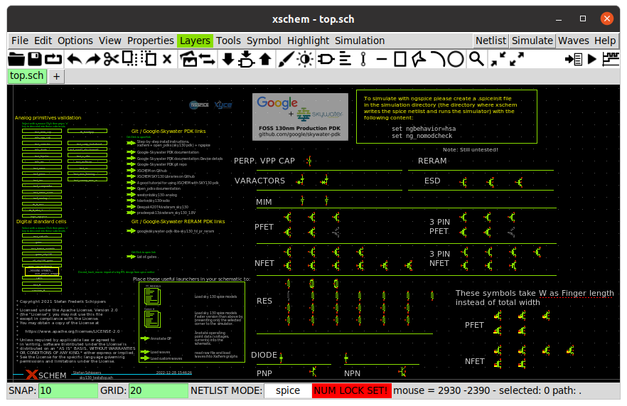

# 18 Nov 2023

| Previous journal: | Next journal: |
|-|-|
| [**0172**-2023-11-04.md](./0172-2023-11-04.md) | [**0174**-2023-11-19.md](./0174-2023-11-19.md) |

# Starting sky130A analog ASIC design: Setting up xschem

## Base xschem installation

Guide: https://xschem.sourceforge.io/stefan/xschem_man/install_xschem.html

1.  Starting with MPW8 VM. Xschem not already installed.
2.  Install prerequisites:
    ```bash
    sudo apt install \
        libx11-6 libx11-dev libxrender1 libxrender-dev libxcb1 libx11-xcb-dev \
        libcairo2 libcairo2-dev tcl8.6 tcl8.6-dev tk8.6 tk8.6-dev flex bison \
        libxpm4 libxpm-dev libjpeg-dev tcl-tclreadline vim-gtk3 xterm
    ```
3.  ```bash
    cd ~/asic_tools
    git clone https://github.com/StefanSchippers/xschem.git xschem-src
    cd xschem-src; ./configure
    ```
    Successfully ends with `Configuration complete, ready to compile.`
5.  Build and install:
    ```bash
    make
    sudo make install
    ```
    We should now have:
    ```
    $ which xschem
    /usr/local/bin/xschem
    ```

## Example sky130 project and config

Ref: https://youtu.be/KgBLByOkJxA?t=312

1.  ```bash
    ln -s $PDK_ROOT ~/PDK
    cd ~/anton
    mkdir sky130_example
    cd sky130_example
    cp ~/PDK/sky130A/libs.tech/xschem/xschemrc .
    ```
    NOTE: This `xschemrc` uses `$PDK_ROOT` and `$PDK` but that's fine.
2.  Run `xschem`, and...
    


# Tips

*   >   When xschem is running, type `puts $XSCHEM_LIBRARY_PATH` in the xschem tcl prompt to know the library search path.
    >   
    >   Type `puts $XSCHEM_SHAREDIR` to see the installation path.

*   >   If you need to override system settings, create a `~/.xschem/xschemrc`. The easiest way is to copy the system installed version from ${prefix}`/share/xschem/xschemrc` and then make the necessary changes
    >   
    >   ```bash
    >   mkdir ~/.xschem
    >   cp <install root>/share/xschem/xschemrc ~/.xschem/xschemrc
    >   ```
*   Re sky130A PDK `xschemrc`:
    >   ```tcl
    >   #### values may be overridden by user's ~/.xschem/xschemrc configuration file
    >   #### or by project-local ./xschemrc
    >   ```

# Next steps

*   WATCHED: ~~Stefan's Jan 2023 video "[Analog simulation with xschem and the skywater 130nm Process Development Kit (PDK)](https://www.youtube.com/watch?v=bYbkz8FXnsQ)"~~
*   WATCHED: ~~Efabless [Webinar - Analog schematic capture & simulation with Stefan Schippers](https://www.youtube.com/watch?v=q3ZcpSkVVuc) -- this might include the design from the video above?~~
*   Efabless [Analog layout using Magic and Klayout with Tim Edwards and Thomas Parry](https://www.youtube.com/watch?v=CSZm3q4rUBg) -- builds on the design above?
*   Efabless [Analog layout of an op-amp using the Magic VLSI tool](https://www.youtube.com/watch?v=XvBpqKwzrFY&t=4874s) -- might be the longer recording of the same 'Analog layout' video above?
*   Maybe: Efabless [Magic Tutorial 03 Creating a Cell Using Parametrized Devices](https://www.youtube.com/watch?v=OKWM1D0_fPI) -- NOTE: This might be an out-of-order continuation of:
    *   [Magic Tutorial #1 - Highlight of Magic Features](https://www.youtube.com/watch?v=ORw5OaY33A4)
    *   [Magic Tutorial #2 - Using cells, copy, move and wiring](https://www.youtube.com/watch?v=NUahmUtY814)
*   Efabless [GF180MCU Tutorial - Single Video](https://www.youtube.com/watch?v=USCmZuREMTE)
*   Go back over Z2A Part 1
